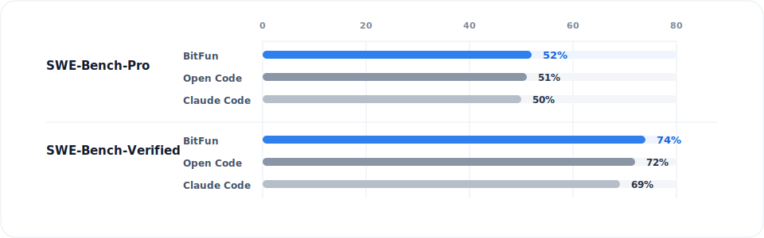
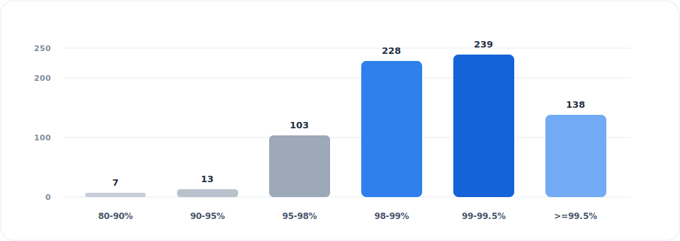
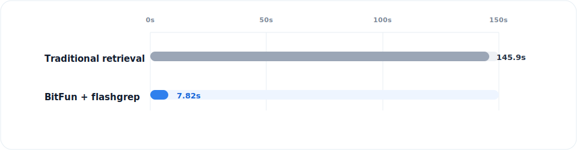

**English**  [中文](README.zh-CN.md)

<div align="center">


</div>
<div align="center">

[](https://github.com/GCWing/BitFun/releases)
[](https://openbitfun.com/)
[](https://github.com/GCWing/BitFun/blob/main/LICENSE)
[](https://github.com/GCWing/BitFun)

</div>

---

## Local AI Workbench Built Around the Code Agent

BitFun is a local AI workbench built around a Code Agent designed for long-horizon tasks, engineering execution, and token economy.

It can understand complex context, call tools, wait for results, correct deviations, and keep long-horizon tasks moving until they reach a deliverable state. Coding, research, office work, documents, desktop operations, and extensible workflows all happen in the same local desktop environment.

The core goal is direct: move AI from one-off task execution into a productivity system that can work over long periods.


---

## Agent Core Metrics

The data below evaluates BitFun's core Agent capabilities. All measurements use **Deepseek-V4-Pro** and focus on task completion, KV Cache reuse, and large-repository search efficiency.

BitFun leads Open Code and Claude Code on both **SWE-Bench-Pro** and **SWE-Bench-Verified**. SWE-Bench-Pro focuses on complex software engineering, while SWE-Bench-Verified focuses on human-verified GitHub issue fixes.



The current numbers are BitFun's initial evaluation results, with each case run once. We will keep optimizing and release full benchmark details later. Benchmark references: [SWE-Bench-Pro](https://labs.scale.com/leaderboard/swe_bench_pro_public) / [SWE-Bench-Verified](https://www.swebench.com/verified.html)

Whether Agent execution is economical depends on whether repeated context can be reused reliably. In the same SWE-Bench-Pro evaluation round, BitFun's average KV Cache hit rate was **98.67%**. Across 728 valid cache records, **83.1%** of trials reached a hit rate of at least 98%, and **51.8%** reached at least 99%. On the token side, Cached Input accounted for **98.71%**, while Uncached Input (scaled) accounted for **1.29%**.



Agents also need to retrieve context repeatedly. For large-repository retrieval, BitFun uses **flashgrep** to reduce search time by up to about **94.6%** in huge repositories such as Chromium, with an average speedup of about **36.1x**.



---

## One Desktop, Five Agent Workflows

| Workflow | What it solves |
| --- | --- |
| **Code** | A Code Agent for real repositories: Agentic, Plan, Debug, testing, review, Deep Review, and continuous iteration. |
| **Research** | Collect context, compare sources, summarize findings, and produce structured conclusions, reports, or follow-up actions. |
| **Cowork** | Handle PDF / DOCX / XLSX / PPTX, writing, rewriting, summarization, layout, and office collaboration. |
| **Operate** | Use Computer Use to operate browsers and desktop apps, completing flows such as clicking, typing, navigating, waiting, and confirming. |
| **Extend** | Connect MCP, install Skills, define Markdown Agents, generate Mini Apps, and continue reshaping BitFun itself. |


---

## Ready Out of the Box

### Download directly

Go to [Releases](https://github.com/GCWing/BitFun/releases) to download the latest desktop installer. After installation, configure your model and start using BitFun.

### Run from source

**Prerequisites:**

- [Node.js](https://nodejs.org/) (LTS recommended)
- [pnpm](https://pnpm.io/)
- [Rust toolchain](https://rustup.rs/)
- [Tauri prerequisites](https://v2.tauri.app/start/prerequisites/)

```bash
pnpm install
pnpm run desktop:dev
```

For more development details, see [CONTRIBUTING.md](./CONTRIBUTING.md).

---

## Customize Your BitFun

BitFun's extension paths progress continuously from light to deep customization:

| Tier | Path | Best for |
| --- | --- | --- |
| **L1** | Markdown Agent | Defining roles, flows, constraints, and tool bundles. |
| **L2** | MCP / Skills | Connecting external tools, professional capabilities, and workflows. |
| **L3** | Mini App | Generating dedicated interfaces, forms, panels, or visualizations for tasks. |
| **L4** | Source-level customization | Changing tools, adapters, UI, Runtime, or product shape. |

You can use BitFun's Code Agent to extend BitFun itself.

---

## Contributing

Stars, Issues, and PRs are welcome. We especially care about:

1. Code Agent, Deep Review, debugging, and long-task execution capabilities
2. Cowork, research, document, and desktop workflows
3. MCP, Skills, Mini App, LSP plugins, and new domain Agents
4. Runtime stability, performance, context efficiency, and verifiability

Please submit PRs directly to the `main` branch. For more details, see [CONTRIBUTING.md](./CONTRIBUTING.md).

---

## Disclaimer

1. This project is spare-time exploration and research into next-generation human-machine collaboration, not a commercial profit-making project.
2. This project is 97%+ built through Vibe Coding. Code feedback is welcome, and AI-assisted refactoring and optimization are encouraged.
3. This project depends on and references many open-source projects. Thanks to all open-source authors. **If your rights are affected, please contact us for remediation.**

---
