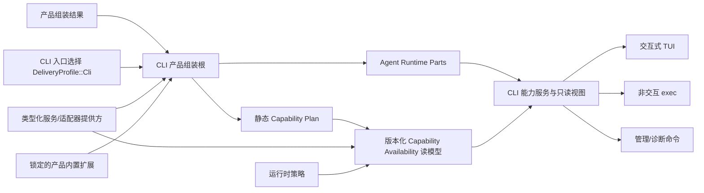

# BitFun CLI 产品线需求与架构设计

本文定义 BitFun CLI 产品线的需求边界、目标架构和阶段验收标准。稳定的仓库级接口边界以
[`product-architecture.md`](product-architecture.md) 为准；Agent Runtime、工具和工作流归属见
[`agent-runtime-services-design.md`](agent-runtime-services-design.md)；插件宿主与 OpenCode 适配边界见
[`plugin-runtime-host-design.md`](extensions/plugin-runtime-host-design.md)；跨 GUI/TUI 的产品定制、品牌资源、界面
布局选择和内置扩展见 [`product-customization-blueprint.md`](product-customization-blueprint.md)。本文只补充
CLI 产品入口、配置兼容、TUI 布局消费和 CLI Agent 体验，不重复定义这些文档中的通用契约或内部 ABI。
OpenCode 的完整扩展矩阵、配置资产、插件执行和 TUI Plugin 映射分别见
[`opencode-extension-compatibility.md`](extensions/opencode-extension-compatibility.md)、
[`opencode-config-assets-adapter-design.md`](extensions/opencode-config-assets-adapter-design.md)、
[`opencode-plugin-runtime-adapter-design.md`](extensions/opencode-plugin-runtime-adapter-design.md)、
[`opencode-tui-plugin-adapter-design.md`](extensions/opencode-tui-plugin-adapter-design.md) 和
[`opencode-external-integration-adapter-design.md`](extensions/opencode-external-integration-adapter-design.md)。

本文是目标设计，不记录单次 PR 进度。已有能力必须在迁移中保持兼容；尚未完成的能力不能因为
出现在本文中就被视为已交付。

本文使用 CLI-P0/CLI-P1/CLI-P2 表示 CLI 产品线阶段，不替代 OpenCode 兼容计划的 OC-R 阶段。映射关系为：

| CLI 阶段 | 可消费的插件里程碑 | 边界 |
|---|---|---|
| CLI-P0 / CLI-P1 | 当前基线 | 只提供 BitFun 原生目录的来源确认、启停和 OpenCode 静态工具名称预览；不注册为可执行工具。 |
| CLI-P2 配置与插件管理 | OC-R1 | 非执行字段可直接生效；发现全局/项目插件和可执行资产，展示来源、spec、锁文件和依赖元数据变化，但不启动进程或显示未经执行验证的工具/Hook。 |
| CLI-P2 可执行服务与插件 | OC-R2/OC-R3 | 各归属模块管理 Command/MCP/LSP/Formatter/Reference/Skill 启动，脚本服务管理 Plugin/Tool 进程；兼容门面支持真实工具、依赖和稳定 Hook。 |
| CLI-P2 终端插件 | OC-R4 | 适配 TUI 宿主操作；原始 Solid/OpenTUI 组件明确降级。 |

## 1. 目标与边界

### 1.1 产品目标

BitFun CLI 应成为可独立安装和发布的 Agent 产品，而不是 Desktop 的终端壳。目标包括：

1. 覆盖交互式 TUI、非交互自动化、会话生命周期、工具与权限、MCP、Skill、Subagent 和诊断等
   高频工程闭环。
2. CLI、Desktop、Server、ACP 和 SDK 共享 Agent Runtime 语义，不复制会话、工具、权限或上下文逻辑。
3. 通过适配器直接消费或显式导入 OpenCode、Codex 和 Claude Code 的常用配置资产；外部格式不成为 BitFun
   内部模型，但兼容来源可以作为合法运行输入。
4. 通过 BitFun 自有 Runtime 和 OpenCode Compatibility Facade 接入服务插件、工具、Hook 和 TUI Plugin；
   本地默认兼容优先，用户、产品或组织可以按需收紧权限。
5. 消费已校验的产品组装结果和 TUI 布局选择，生成不同品牌和能力范围的
   CLI 产物；通用产品定制不在 CLI 入口重复实现。
6. 以任务成功率、恢复能力、工具正确性、上下文效率和资源开销评估 Agent 能力，而不是只比较命令数量。

### 1.2 能力对齐口径

“与 Codex CLI、OpenCode CLI 或 Claude Code CLI 平齐”只指本地 CLI 常用工程场景，不自动包含
其云端、桌面端、浏览器扩展、组织后台或托管执行能力。对齐项分为三类：

| 类别 | 处理方式 |
|---|---|
| 通用工程能力 | 由 BitFun 原生实现并保持自己的运行时语义，例如会话、工具、权限、上下文和结构化执行。 |
| 可迁移资产 | 按类型处理：规则原地引用，MCP/模型作为配置候选，Skill 保留原目录或由用户显式导入。 |
| 生态专属能力 | 仅在有真实消费方、安全评审和兼容测试时适配；不复制对方完整运行时。 |

竞品官方文档仅用于维护能力基线，不构成 BitFun 内部接口规范：

- [Codex CLI](https://learn.chatgpt.com/docs/codex/cli) 与
  [Codex 非交互模式](https://learn.chatgpt.com/docs/non-interactive-mode)
- [OpenCode CLI](https://opencode.ai/docs/cli/) 与
  [OpenCode 配置](https://opencode.ai/docs/config/)
- [Claude Code CLI](https://code.claude.com/docs/en/cli-reference) 与
  [Claude Code 交互模式](https://code.claude.com/docs/en/interactive-mode)

### 1.3 非目标

当前设计明确不包含：

- 逐像素复制其他产品的 TUI，或复用其内部主题键、快捷键模型和界面状态。
- 向 OpenCode、Codex 或 Claude Code 配置文件做双向写回，或让外部原始类型成为 BitFun 内部数据模型；只读兼容
  结果可以随来源变化刷新。
- 同时建立 OpenCode、Codex 和 Claude Code 三套插件运行时；首个插件执行兼容对象只有 OpenCode。
- 在产品定义或 TUI 布局选择中加入任意命令、动态代码、renderer、源码文本替换或运行时 Hook。
- 为每个白标产品 Fork 一套 Rust/React/TUI 实现。
- 为追求接口完整而提前发布无消费方的代码接口；完整需求矩阵和阶段计划仍必须记录全部官方稳定能力。
- 一次性把 `bitfun-core` 的全部行为迁移到 Agent Runtime；所有职责迁移仍需行为等价证明。

## 2. 当前基础与主要缺口

当前主线已经具备以下基础：

- 交互式 TUI、Markdown/代码/Diff/工具卡片、权限交互基础、主题、模型/Agent/MCP/Skill/Subagent/Session 选择；
  当前入口默认策略仍需按 CLI-P0 迁移。
- `exec` 的 stdin、`text/json/stream-json`、会话恢复/分叉和 Patch 输出。
- Agent、模型、MCP、会话、用量、诊断、ACP 外部 Agent 和插件来源管理命令。
- BitFun 原生插件目录的发现、内容校验、来源确认，以及 OpenCode custom tool 静态名称预览。
- CLI 的 `doctor` 生产命令选择 `DeliveryProfile::Cli` 并投影 `ProductAssemblyPlan`；它展示静态 profile，
  明确说明未评估运行时 readiness，不构造 Runtime Parts 或注册占位 provider。
- 独立 CLI 测试与打包工作流；主 CI 的三平台 workspace check 同时覆盖 `bitfun-cli` 编译。

首个只读计划诊断切片不等于 CLI 已完成独立产品化。当前 CLI crate 仍直接依赖 `bitfun-core` 的
`product-full`，生产代码尚未消费 `ProductAssembler` 或 Runtime Parts；插件命令也仍以来源管理和静态预览为主。

目标态仍存在以下结构缺口：

| 缺口 | 影响 | 本设计的处理 |
|---|---|---|
| CLI 只有 `doctor` 消费 `DeliveryProfile::Cli` 的静态计划；所有执行路径仍直接依赖 `bitfun-core/product-full` 和部分具体管理器 | CLI 能力仍难以独立裁剪，执行入口继续承担全局状态职责 | 接入 owner-owned Runtime Services、调用级权限和权威事件路径后，按行为等价测试逐条迁移到 Runtime Parts；迁移期间保留兼容门面。 |
| TUI 编排、输入、命令、副作用和渲染仍有大文件聚集 | 交互回归难以隔离，终端状态与业务状态容易耦合 | 在现有模块上增量收敛为事件、状态归约、副作用和渲染四个边界，不重写全部 TUI。 |
| CLI 配置只覆盖入口本地选项，缺少统一层级、来源解释和兼容导入 | 用户无法安全迁移其他 CLI 资产，也难以解释最终配置来源 | 建立 BitFun Canonical Config、来源视图和一次性导入报告。 |
| OpenCode 来源发现与真实执行尚未形成完整闭环 | “来源可识别”容易被误解为“插件可执行” | 直接发现 OpenCode 来源，后台准备真实执行版本；状态明确区分预览、准备、可用和降级。 |
| Product Capability 已有，但品牌、资源、默认策略和发行配置没有统一产品定义 | 白标需要修改多处常量和工作流，能力隐藏不等于后端禁用 | 产品定义只在组装/构建边界选择身份、资源、能力包、默认策略和发行事实。 |
| CLI 已有独立 Linux 测试，三平台编译由通用 workspace check 覆盖，但结构化协议和常规打包 smoke 尚未进入同一快速门禁 | 协议或产物回归仍可能晚于常规 PR 发现 | 在对应协议和产品构建切片中补 focused contract 与 smoke；避免为同一依赖图重复建立三平台编译矩阵。 |

## 3. 分阶段产品需求

### 3.1 CLI-P0：产品基础收敛

CLI-P0 的目标是建立后续功能补齐所需的稳定边界，不改变现有用户主路径。

CLI-P0 不是一个统一重构 PR。首个切片只让生产入口选择 `DeliveryProfile::Cli`，读取静态 profile，
不把服务需求或扩展计划解释为运行时 availability，并为一条用户可见诊断路径补入口验证和独立 CLI 测试。旧门面仅在后续执行切片
行为等价成立后退出。

其余工作独立立项，不能与 profile 迁移互相充当完成条件：

| 切片 | 范围 | 退出条件 |
|---|---|---|
| 调用级审批 | TUI、`exec`、ACP 使用本次调用内的类型化 Approval Policy，不写回全局配置 | 交互/非交互默认值、显式批准和组织策略均有 focused test |
| 输出协议 | 盘点 `text/json/stream-json` 消费方，再设计版本、序号、terminal event、stdout/stderr 和退出分类 | 真实消费者兼容测试与迁移窗口明确 |
| 配置解释 | Canonical Config 层级、来源解释和兼容导入 dry-run | 不自动写入；冲突、未知字段和凭据引用可解释 |
| 产品定制 | 消费最小产品定义、组装结果和已注册 TUI layout/theme ID | 第二个真实 CLI 产品复用后再提升公共字段 |
| TUI 边界 | 增量提取终端恢复守卫、命令分发和副作用边界 | 不改版视觉设计，恢复/取消回归可单独验证 |

CLI-P0 不包含插件 JS/TS 执行、完整 checkpoint/rewind 或大规模 TUI 重写。

### 3.2 CLI-P1：常用 CLI 工程闭环

#### 交互式 TUI

CLI-P1 应提供：

- 新建、恢复、继续、分叉、压缩和中断会话；所有动作使用同一 Session/Turn Runtime 语义。
- `@` 文件/目录引用和受控 `!` shell 请求；shell 仍进入工具、权限、取消和审计路径。
- 对话 checkpoint 与工作区 checkpoint 的独立事实；rewind 必须明确选择只回退对话、只回退工作区或两者。
- 后台 Agent/工具/工作流的状态、取消和结果回收，不允许无结果的隐式 detached task。
- 外部编辑器、命令历史、详情/用量视图、图片附件和终端能力降级。
- 鼠标关闭、低色彩、窄终端、无剪贴板、非 TTY、屏幕阅读器和不可用通知能力下的纯文本回退。
- 基于真实长会话建立首屏反馈、按键到绘制、滚动和峰值内存基线，再设置回归预算；不先拍脑袋冻结阈值。

其中：

- compact 只重建模型上下文，不删除权威 transcript。
- rewind 只有在对应持久化和工作区提供方支持时才可用；不支持时返回类型化原因。
- `!` 不成为绕过 Tool Runtime 的第二条 shell 执行路径。
- detached 只有在存在明确生命周期归属和结果回收入口时才允许；否则 CLI 退出必须取消任务并返回结果。

#### 非交互自动化

CLI-P1 应保证：

- stdin、显式 prompt、固定/恢复/继续/分叉会话互斥关系可验证。
- `stream-json` 每行一个完整事件；`json` 只输出一个完整结果文档；日志和诊断默认进入 stderr。
- 事件包含 schema 版本、session/turn 身份、每 turn 单调 sequence、辅助时间、完成原因、用量和产物引用。
- 失败使用稳定退出码分类：输入/配置、认证、权限、运行时、取消、超时、工具/工作流、输出写入。
- 支持可选结果 JSON Schema 约束；Schema 失败不得伪装成成功结果。
- 大型工具结果和二进制附件只在事件中传递存储引用，不把 data URL 或大块内容写入事件流。
- 结构化模式下 Patch 只能进入版本化事件、结果文档、存储引用或显式文件，不能混入协议 stdout。

候选 v1 协议只先约束语义形态；字段名、数值退出码和默认切换必须在真实消费方盘点与兼容测试后冻结：

| 项目 | v1 约束 |
|---|---|
| `stream-json` | 每行一个 `{schema_version,type,session_id,turn_id,sequence,payload}` envelope；每 turn 恰有一个 terminal event。 |
| `json` | 只输出一个 `{schema_version,outcome,session,turn,usage,artifacts,error}` 结果文档。 |
| 退出码 | 至少区分成功、输入/配置、认证、权限、运行时、取消、超时、工具/工作流和输出写入；数值映射不得在无消费方证据时预先冻结。 |
| 多错误 | terminal outcome 只设置一次，以首个因果终止错误为准；结果无法写出时由输出写入错误覆盖。 |

实施迁移时可新增显式 `--output-schema v1`；未指定时保留旧行为一个已公告的兼容窗口并在 stderr 提示弃用。
兼容窗口、默认切换和旧协议退场由已盘点的真实消费方决定，不能无限期双轨。

#### 管理与诊断

CLI-P1 应统一以下命令的文本和结构化只读视图：

- Agent、模型、MCP、Skill、Subagent、Session、Plugin、用量和运行时健康状态。
- Provider/认证来源的可用性、失效原因和登录/退出入口；密钥值只进入受控凭据提供方，不进入普通配置。
- 配置来源、被覆盖项、策略拒绝、未支持能力和降级原因。
- 外部 ACP 智能体与 OpenCode-compatible 插件必须作为两个独立能力展示。
- CLI-P1 只允许显式应用已支持的非执行型配置候选；规则引用、Skill、MCP 启用和插件包仍按各自生命周期处理。

### 3.3 CLI-P2：扩展、定制与差异化 Agent 能力

CLI-P2 是 CLI-P0/CLI-P1 稳定后的规划集合，不是一个 PR 或统一退出阶段。以下路线分别立项、验收和发布：

| 路线 | 用户价值 | 不并入该路线 |
|---|---|---|
| 插件执行 | 用户可以在 CLI/TUI 会话中调用当前有效策略允许的插件工具，并看到来源、权限结果、执行结果和失败原因 | 安装分发、可写钩子、界面贡献和多生态运行时 |
| 本地插件安装 | 用户可以从明确选择的本地来源安装或卸载插件；失败不改变已有插件和激活状态 | 插件执行器、自动更新、在线仓库、组织策略和产品内置扩展生命周期 |
| TUI 扩展 | 用户可以使用宿主接受的插件命令、状态、通知和主题语义角色，并能识别冲突或终端能力降级 | GUI 路由、组件、主题键和可执行界面代码 |
| 产品定制 | 用户获得与产品身份一致的 CLI 品牌、能力和内置扩展，并能看到缺失或隔离导致的降级原因 | 通用产品包格式、签名和更新实现 |
| Agent 能力 | 用户可以恢复复杂任务、理解上下文来源并获得可复核的多智能体结果 | 通过插件或 TUI 专用分支替代共享运行时能力 |

OpenCode、Codex 和 Claude Code 的配置资产覆盖可以继续扩展，但不改变 CLI-P1 已冻结的资产分类、写入边界和各生态的执行能力状态。

CLI-P2 的 OpenCode 路线以尽可能兼容现有本地/软件包插件、Bun/JS 行为和稳定 Hook 为目标；无法等价的原始
TUI renderer、实验性接口和完整外部 Server 协议按总矩阵明确降级。CLI-P2 不发布 Codex/Claude 插件执行 ABI。

## 4. 目标架构

### 4.1 分层与归属

| 层/模块 | 负责 | 不负责 |
|---|---|---|
| `src/apps/cli` | Clap 入口、TUI 状态/渲染、终端事件、入口本地设置、命令展示与结构化输出 | 会话状态机、工具执行、权限裁决、插件 Host ABI、品牌能力真值 |
| `assembly/product-capabilities` | Delivery Profile、Product Capability 计划、静态 eligibility、服务需求和组装计划 | 品牌资源读取、动态可用性、用户配置、UI 状态、具体服务创建 |
| 产品构建期校验 | 校验产品定义、品牌资源、TUI 布局选择和内置扩展版本，输出产品组装结果 | 创建运行时服务、实现终端行为或保存用户配置 |
| Runtime Product Assembly | 读取产品组装结果中本次 CLI 需要的字段，选择能力/服务/扩展，构建 Runtime Parts | 读取原始品牌资源、实现 Agent/Tool/插件适配器/终端行为或运行构建脚本 |
| Runtime Configuration Service | 规范配置层级、来源解释、导入预览/应用、原子写入、回滚和来源记录 | 解析外部生态格式、决定权限或读取凭据值 |
| `agent-runtime` | Session/Turn/Task、调度、取消、上下文、事件、checkpoint fact、Subagent 和用量事实 | CLI 命令、TUI 状态、品牌、外部配置格式 |
| Tool/Harness/Runtime Services | 工具 ABI、工作流、类型化服务和平台端口 | 产品命令、入口默认策略、外部生态权威状态 |
| Plugin Runtime Host | 类型化调用、期限、取消、有界队列、逻辑 target 状态、响应校验和故障状态 | 持有 OS 进程树、直接写权限/审计/工具结果、解释 TUI 或品牌资源 |
| 脚本执行服务 | 物理进程健康、资源预算、进程树与句柄、类型化脚本请求和回收 | 决定工具权限、业务结果、TUI 或品牌资源 |
| 生态配置适配器 | 解析受支持外部格式并生成导入候选/诊断 | 直接写运行时配置、读取密钥、决定最终权限 |

Runtime Configuration Service 当前由 `bitfun-core/service/config` 负责。在经评审的 port/provider
迁移完成前，CLI 和生态适配器不得另建写入器；adapter 只做 discover/parse/normalize，配置服务才能
预览/应用、记录来源，并通过远程工作区 provider 写目标层。产品定义、品牌资源、界面布局选择
和内容摘要校验由构建期校验器按
[`product-customization-blueprint.md`](product-customization-blueprint.md) 负责；Runtime Product Assembly 只消费
已经解析和校验的入口字段，不另设含糊的 Product Bootstrap 服务。

### 4.2 产品定义、布局、运行时配置与可用状态必须分离

| 对象 | 生命周期 | 权威归属 | 示例 |
|---|---|---|---|
| 产品定义 | 构建/产品组装期，通常不可变 | 构建期校验器 | 品牌身份、能力上限、默认策略引用、内置扩展和发行事实 |
| TUI 布局选择 | 构建/产品组装期，通常不可变 | CLI/TUI 宿主与构建期校验器 | 已注册 layout、panel、command、status、keymap 和 theme ID |
| Delivery Profile | 组装期稳定枚举 | Product Capability | CLI、Desktop、ACP、SDK |
| Runtime Configuration | 用户/项目/会话期可变 | 配置服务 | 模型选择、MCP、主题、快捷键、入口行为 |
| Capability Availability | 启动和运行期派生 | 单一能力可用性读模型 | available、status-only、unsupported、policy-denied |

产品定义不能替代用户配置；TUI 布局选择只决定入口结构和可见内容；用户配置和运行时插件都不能启用
未被产品定义允许的能力。隐藏一个 TUI 入口也不能视为能力已禁用。

本文的产品定义描述 BitFun 发行产品；它与 SDLC Harness 用于描述目标仓库事实和质量策略的
[`Project Profile`](../sdlc-harness/architecture/project-profile-integration.md) 是两个独立概念，不能共享
schema、存储或优先级。

### 4.3 产品启动流



启动规则：

- 产品组装结果、TUI 布局引用、能力依赖或资源校验失败时构建/启动失败，不静默退回 full 产品。
- Runtime Product Assembly 在构建 Runtime Parts 前必须验证组装结果绑定的 TUI 布局摘要、
  `DeliveryProfile::Cli`、Surface ID、schema 和宿主版本；不匹配时失败，不能接受来源不明的替换内容。
- 可选服务不可用时进入 Capability Availability；必需服务缺失时组装失败。
- CLI 不直接创建新的全局 manager；现有兼容路径按等价测试逐步迁移。
- 静态 Plan 只记录 eligibility、依赖和服务要求；动态健康、策略和 quarantine 不固化进 Plan。
- TUI、Exec 和管理命令消费同一带版本的 Capability Availability 读模型，不能分别维护可用性判断。

### 4.4 TUI 内部边界

现有 TUI 采用增量拆分，不另建平行框架：

| 边界 | 职责 |
|---|---|
| Terminal Session | raw mode、alternate screen、鼠标/粘贴、panic/取消后的恢复 |
| Input/Event | 键盘、鼠标、resize、paste、runtime event 的标准化输入 |
| State/Reducer | 纯状态转移；不直接执行文件、网络、配置或 Agent 操作 |
| Effect/Controller | 把状态意图映射为能力服务请求，并把结果重新投递为事件 |
| View/Widget | 根据状态渲染；不读取具体 manager 或写配置 |
| Command Dispatcher | 统一 slash/palette/CLI 管理命令元数据与权限要求 |

`modes/chat.rs` 最终只保留生命周期编排；现有 `ui/chat/state.rs`、`input.rs`、`render.rs` 等模块继续作为
收敛基础。拆分以可测试边界为目的，不以文件数量为目标。

## 5. CLI/TUI 对产品定制结果的消费

产品定义、品牌资源、TUI 布局选择、产品组装结果和内置扩展的通用边界由
[`product-customization-blueprint.md`](product-customization-blueprint.md) 定义。本节只约束 CLI/TUI 消费。

CLI 入口只接收已校验的产品组装结果和当前 Delivery Profile 对应的 TUI 布局字段，不读取原始品牌资源，
也不运行构建脚本。首期 TUI 布局只允许引用宿主已注册的稳定 ID：

| 定制面 | CLI/TUI 消费 | 宿主保留决定权 |
|---|---|---|
| 品牌 | text/compact Logo、产品名、帮助/法律资源 | Unicode/纯文本回退、宽度裁剪和终端恢复 |
| Layout | layout preset、panel region、默认 mode | resize、窄终端折叠和焦点 |
| Commands | capability-backed command group、顺序和帮助分组 | dispatcher 映射、权限和冲突处理 |
| Status | 已注册 status/notice/只读视图 | 事件归一化、刷新和降级 |
| Keymap | 已注册 preset 与可覆盖范围 | 冲突、平台按键和用户允许覆盖 |
| Theme | TUI preset/语义主题 ID | ANSI/truecolor/monochrome 适配 |

TUI 布局选择不携带 renderer、终端句柄、shell helper、GUI key、任意脚本或运行时插件状态。Runtime
Configuration 只能覆盖产品定义明确允许的默认值；用户插件只能向允许的 TUI 扩展点提交贡献，不能改写
构建期布局、产品身份、产品能力上限或内置扩展版本。

产品内置扩展来自只读产品 source root，随产品升级。BitFun 原生包继续使用现有来源确认、激活、更新、禁用和
卸载路径；OpenCode 配置和标准目录来源则按 OpenCode 语义自动加载，不增加二次审核或激活，只有显式的用户、
产品或组织策略才能限制。三者可以复用 Host ABI、隔离和经 BitFun 能力接口的权限/审计，但不能共享信任或安装状态。

## 6. Canonical Config 与外部配置导入

### 6.1 BitFun 配置层级

普通设置按以下优先级解析：

```text
命令行/本次运行参数
  > 工作区本地设置
  > 项目设置
  > 用户设置
  > 产品定义声明为可覆盖的运行时默认值
```

项目设置是可共享的仓库事实；工作区本地设置是机器/工作区实例私有且不随仓库同步的覆盖。二者不能
只靠路径巧合区分，远程工作区必须由 provider 显式给出作用域和写入能力。

组织策略不是普通覆盖层。最终能力和权限是“用户请求与组织上限的交集”，低层配置不能放宽
组织策略、隔离要求、数据范围或扩展来源限制。

每个有效值必须可解释：值、来源层、来源文件/策略标识、是否被覆盖、是否被策略限制。配置解析失败时
只可在同一作用域和同一版有效策略下保留上一个有效结果并产生诊断；没有有效结果时失败。安全相关配置
不得回退到更宽松的旧结果或默认值。

### 6.2 导入流程

外部资产有“兼容来源”和“显式导入”两种消费方式。兼容来源不改写已有 OpenCode 文件；OC-R1 只有不启动
外部进程、不 import 第三方 module、不读取凭据且不主动联网的字段可直接影响运行时。Plugin/Tool、可执行
Skill/Command、MCP/LSP/Formatter、远程 Reference 在 OC-R2 完成归属模块保护前只发现和展示。它们无需先迁移；
显式导入用于用户希望把资产写入 BitFun 原生配置的场景。CLI-P0 截止到 Dry-run，CLI-P1 才允许
对受支持的非执行型配置执行 apply：

```text
发现 -> 解析 -> 归一化 -> 冲突分析 -> Dry-run 报告 | CLI-P1: 用户选择 -> 原子写入 BitFun 层 -> 复核/回滚
```

导入预览只使用四种用户可读结论：可直接使用、需要转换、会发生功能降级、输入无效。每项同时说明是原地
引用、写入 BitFun 配置、继续保持外部来源还是不支持；不得用“已映射”推导为已写入、已信任或已启用。

兼容来源不写入 BitFun 层，也不双向修改原文件。显式导入时，项目级来源默认写入 BitFun 项目层，用户级
来源默认写入用户层；用户可以在确认时选择更窄的目标层，但不能写入组织强制策略。导入记录保留来源产品、
来源范围、内容摘要和导入时间，并按字段保存目标层、导入前值及其版本/摘要和导入值。已导入字段以 BitFun 原生
配置为准，不再重复应用外部值；外部来源变化时提示重新导入并展示差异，不做双向写回。撤销只自动恢复当前值
仍等于导入值的字段；用户后续修改、来源变化或部分重新导入造成冲突时，逐字段选择“保留 BitFun / 重新导入
外部 / 手工处理”，不得整批覆盖。

| 来源 | 首期可导入 | 首期不导入 |
|---|---|---|
| OpenCode | 规则/instructions、Agent、Mode、Skill、References、Command、MCP、LSP、Formatter、模型、Theme、Keybind 和稳定配置进入兼容来源图；非执行资产可显式导入 | 凭据值双向复制、把 OpenCode 原始类型变成 BitFun 内部类型；Plugin/Tool 由独立 Runtime 直接加载，不通过配置导入执行 |
| Codex | `AGENTS.md` 原地引用；受支持的 MCP、稳定配置和 Skill 可选择原地引用或导入 | `auth.json` 等凭据、私有/未文档化字段、Codex App Server 状态 |
| Claude Code | `CLAUDE.md` 原地引用；受支持的 MCP、稳定设置和 Skill 可选择原地引用或导入 | OAuth/Token、插件执行、可写钩子、组织强制策略降级 |

规则文件优先复用项目已有文件，不复制出第二份内容。若不同生态规则冲突，导入报告必须展示目标文件、
优先级和冲突段，不能自动拼接。

现有对 `.claude/.codex/.opencode/.agents` Skill 根的直接发现需要补来源、作用域和可见性测试。OpenCode
兼容来源可以继续直接发现官方目录；Codex/Claude 是否增加新的 live source 另行决定。默认本地兼容策略允许
OpenCode Skill 的脚本和外部依赖，用户/组织可按需限制；显式导入仍不得复制凭据值。MCP 启用状态按 OpenCode
来源解释，策略限制和凭据缺失单独显示。

### 6.3 凭据边界

- 凭据发现、凭据使用和配置导入是三条独立路径。
- 默认只报告可用认证来源，不复制 token、OAuth refresh token 或 API key。
- 只有外部产品明确稳定支持的授权方式才能成为产品级 provider；读取私有文件格式只能作为可关闭的
  本地兼容能力，并提供失效诊断。
- 日志、结构化事件、导入报告和诊断不得包含原始凭据或完整敏感路径。

## 7. 扩展与 OpenCode-compatible 能力

### 7.1 三条能力必须分开

| 能力 | 入口 | 说明 |
|---|---|---|
| 外部 ACP 智能体 | `bitfun-cli acp ...` | 启动外部智能体进程并通过 ACP 协作。 |
| 配置兼容与导入 | 启动时兼容来源；`bitfun-cli config import ...` 显式迁移 | 前者直接读取 OpenCode 来源，后者写入 BitFun 原生配置；两者都不在解析线程执行插件。 |
| 运行时插件 | `bitfun-cli plugins ...` | 当前只提供 BitFun 专用包的来源、启用和静态工具名称预览；目标直接运行 OpenCode 插件。 |

三者不能共享“已安装/已启用”状态，也不能互相推导来源确认或运行权限。

### 7.2 插件阶段

| 阶段 | 目标交付 | 边界 |
|---|---|---|
| 发现 | 直接发现 OpenCode 用户/项目配置、插件目录、工具目录和软件包来源；同时保留 BitFun 原生包 | 不要求 OpenCode 作者复制到 `.bitfun/plugins` 或维护 BitFun 清单 |
| 准备 | 解析入口与依赖、记录当前执行版本、异步启动每插件 target 进程 | 不在 TUI 输入线程安装依赖或加载插件 |
| 启用 | 展示来源、target、真实贡献、策略差异和运行状态 | 用户默认流程可以一次完成，不要求对每个内部状态重复确认 |
| 执行 | 真实工具、稳定钩子、兼容 Client 和 TUI Plugin 经主机调用现有归属模块 | 插件不能直接写权限、工具结果、审计、会话或 Ratatui Frame |
| 管理 | 查看、停用、恢复、更新和卸载；缺失或损坏来源仍可清理残留状态 | 安装成功不等于运行健康，服务和 TUI target 分别管理 |

OpenCode 适配器必须读取真实外部来源并自动准备执行环境；显式导入只用于把非执行配置迁移为 BitFun 原生
配置，不能成为运行插件的前置条件。Codex/Claude 当前只进入配置资产兼容或导入，不进入插件执行阶段。

CLI 只有在后端已经从脚本进程取得真实定义和执行函数、注册到现有 Tool Runtime 且当前 worker 健康时，才显示
“工具可用”。静态名称、准备中、制品不受支持、策略限制或执行进程不可用时，分别显示预览或具体原因，不能把
来源已记录或 `plugins activate` 成功解释为工具可调用。

现有 `plugins activate` 仍只授权读取静态预览。首个执行能力交付前，命令回执和 `list/status` 必须直接说明
“仅静态预览，插件代码未执行”。目标状态使用已发现、准备中、可用、部分可用、重启中、已暂停和不可用，
并附带原因与恢复动作，不把主机内部状态名原样暴露给用户。

工具进入可调用集合后，排队、权限确认、运行、成功、失败和取消继续使用现有 Tool Runtime；终端插件状态使用
统一 TUI 状态/事件路径，不新增插件专用工具调用状态机。

### 7.3 CLI 扩展贡献

OpenCode TUI Plugin v1 的宿主操作按独立设计适配：Route/导航、Command/Slash Alias、Keymap/Layer/Binding/Mode、
Dialog/Toast/Prompt、全部 host slots、Theme、Attention/系统通知/声音、State、KV、Client、Events 和插件启停均有
目标映射，详见 [`opencode-tui-plugin-adapter-design.md`](extensions/opencode-tui-plugin-adapter-design.md)。

键位冲突、终端颜色映射、文本回退、焦点和命令排序由 CLI 宿主决定。插件不能持有终端句柄或直接写
Ratatui Frame。依赖 OpenCode 原始 `CliRenderer`、Solid/OpenTUI 组件的 Route、Slot 和 Dialog 首期明确返回
渲染器不兼容，其他命令、事件和状态继续工作；不得用少量声明式贡献冒充全部 TUI Plugin 兼容。

## 8. Agent 能力加强

CLI Agent 能力加强必须落在共享 Agent Runtime、Tool Runtime 或 Harness，而不是只在 TUI 增加分支。

### 8.1 会话、上下文与恢复

- Session、Dialog Turn、Model Round 和后台 Task 维持稳定身份与事件顺序。
- 长程目标公开预算、进度、阻塞原因、continuation 和完成事实，TUI 只负责展示和操作入口。
- compact 产生带来源和预算事实的新上下文，原 transcript 保持可审计。
- 对话 checkpoint 与工作区 checkpoint 分离；workspace 恢复依赖 Git/文件系统提供方并报告未跟踪文件风险。
- rewind 不承诺跨会话存储和文件系统原子提交。它先持久化 plan/基线和影响预览，再执行并验证 workspace
  provider，最后提交对话指针；取消和重入使用同一 operation id。
- 任一步失败先尝试补偿；无法补偿时返回 `partially-applied`，逐项报告 workspace、transcript、未跟踪文件
  和可恢复动作，不得报告成功或留下无解释状态。
- 指令、Skill、规则、用户上下文和工作区事实保留来源与优先级，便于解释上下文为何进入模型。
- Prompt cache、压缩和模型切换不能改变权限、工具清单或隐藏的安全上下文。

### 8.2 执行可靠性

- Turn、Tool、Subagent 和 Harness Step 都支持取消，并产生类型化 outcome。
- 工具调用使用唯一调用身份，以便识别取消、迟到响应和重复响应；重试必须区分可重试传输错误、模型错误、
  权限拒绝和确定性工具错误，不默认重复有副作用的调用。
- 后台任务必须有结果投递、显式 detached 状态或取消结果，不能仅依赖日志。
- 不以字符串或次数硬编码阻止 Agent loop；先从工具语义、上下文、模型交互和状态同步定位根因。
- 大型结果写入对象存储，并在后续轮次通过受控引用进入上下文。

### 8.3 多 Agent 与工作流

- Subagent 声明角色、输入、工具/能力边界、预算和期望输出；父 Agent 负责结果收敛。
- 并行任务必须有并发上限、取消传播和写冲突策略；需要写同一工作区时优先隔离工作树或串行化。
- 委派结果包含来源 Agent、完成状态、产物和未解决风险，不把子会话原始上下文全部注入父会话。
- Deep Review、Debug、Research 等复杂流程进入 Harness Provider，不在 CLI 写专用运行时循环。

### 8.4 模型与评测

- 模型路由保持 provider-neutral；产品只选择策略和默认值，不在内核按品牌分支。
- fallback 必须展示原因，并保留模型、用量、缓存和失败事实。
- Agent 改进使用固定任务集和重复运行评估：完成率、错误恢复率、工具失败率、人工确认次数、Token/缓存、
  执行时长和产物正确性。
- 权限绕过、未授权副作用、敏感信息泄露和不可解释的部分应用属于零容忍保护项，不用平均成功率抵消。
- 竞品对比必须记录版本、模型、权限、工作区、运行次数和失败分类；单次结果不能作为架构完成标准。
- 共享 Harness/Evaluation 模块维护版本化评测清单；每份清单固定任务/工作区摘要、模型/provider、
  工具与权限策略、成功判定、性能预算和对比基线。每个用例对候选与基线各重复至少 3 次，报告原始结果、
  中位数和失败分布；更高统计要求由评测清单声明，不在 CLI 写专用评测循环。

## 9. 安全、错误与可观测性

- TUI 无论正常退出、取消、panic 或初始化失败，都必须恢复终端状态。
- stdout 只承载用户请求的结果/协议；日志和诊断默认写 stderr 或日志文件。
- 文件、shell、网络、浏览器、桌面、远程和 MCP 等经 BitFun 能力接口发起的动作统一进入能力/副作用与权限路径。插件直接使用 Bun 文件、网络或进程接口的副作用不伪装成已逐项拦截；严格策略没有真实操作系统隔离时，应禁用相应插件并报告策略限制。
- 非交互模式遇到需要人工确认的动作时默认失败并返回类型化诊断；只有显式策略才能自动批准。
- 插件执行使用独立期限、有界队列、进程/worker 生命周期和崩溃恢复。默认本地兼容策略提供 OpenCode 插件
  正常运行所需的当前用户环境；诊断和日志始终脱敏，用户或组织可显式限制环境变量、网络、文件和进程能力。
- 配置导入、诊断、事件和崩溃报告统一脱敏；绝对路径只在本地明确需要时显示。
- Remote/Server 不支持的本地能力必须在启动前或调用时给出明确 unsupported，不静默落到本机执行。
- 用户可见文案走 CLI 自有本地化资源；日志保持英文且不使用 emoji。

### 9.1 主要挑战与控制策略

| 挑战 | 主要风险 | 控制策略 |
|---|---|---|
| 兼容门面迁移 | 职责重复、全局状态和行为漂移 | 小步迁移职责、旧路径等价测试、协议/权限显式版本化 |
| 终端差异与大会话 | Windows/PTY 差异、闪烁、输入丢失、内存增长 | 终端 guard、纯文本降级、真实会话性能基线和三平台 PTY 测试 |
| 外部生态持续变化 | 未知字段被误映射、live source 成为第二真相源 | 版本化 fixture、资产分类、一次性 plan/apply、unknown fail visible |
| 第三方执行 | 凭据泄露、直接脚本副作用、宿主崩溃 | 明确来源和执行用户、独立进程、期限、取消、有界队列、脱敏、崩溃恢复，以及用户可调权限策略 |
| CLI 产品配置 | 产品组装结果/TUI 布局不一致、品牌/数据串用 | 使用产品定制模块的内容摘要、独立命名空间、签名与回滚验证 |
| Agent 非确定性 | 单次评测误判、并发写冲突、部分恢复 | 重复评测、guardrail、并发/取消策略和 typed partial outcome |

## 10. 验证与完成标准

### 10.1 验证矩阵

| 范围 | 必须验证 |
|---|---|
| Capability/Profile | 产品组装结果/TUI 布局引用、依赖闭包、冲突、未知能力、缺失资源、产品能力上限和后端/入口一致性 |
| TUI | Reducer/命令单测、渲染 snapshot、PTY resize/paste/interrupt/restore、Approval Policy、纯文本/屏幕阅读器、性能预算 |
| Exec | v1 `json`/`stream-json` schema（后者为 JSONL）、单调序号/唯一 terminal event、stdout/stderr、退出码、旧协议迁移、取消、超时、resume/fork、大结果存储引用 |
| Config | 层级合并、来源解释、策略约束、资产处置、三类外部 fixture、MCP disabled、Skill 可执行资源、冲突、回滚和脱敏 |
| Plugin | OpenCode 直接来源、依赖与真实导出、工具/全部稳定 Hook/Client、server 与 tui 双 target、加载顺序、超时、崩溃、过载、恢复、策略差异和 unsupported fixture |
| Agent Runtime | session/turn/cancel、compact/checkpoint/rewind 的补偿/partial/re-entry、后台投递、Subagent、Hook 顺序和持久化恢复 |
| Evaluation | 版本化评测清单、候选/基线重复运行、原始结果、阈值、失败分布和安全保护项 |
| Product build | 当前产品组装结果/TUI 布局生成 CLI smoke artifact；通用 GUI/TUI、品牌、内置扩展和发行验证按产品定制文档执行 |
| 平台 | Windows、macOS、Linux 的 build/smoke；Windows 单独覆盖 ConPTY、Ctrl+C、路径和进程树清理 |

通用 `cargo check --workspace` 负责三平台 CLI 编译保护；独立 CLI CI 运行
`cargo test --locked -p bitfun-cli`。结构化协议测试和打包 smoke test 在对应切片落地后进入门禁。

### 10.2 阶段退出条件

CLI-P0 完成：

- CLI 使用显式组装计划和统一能力可用性，不新增入口侧产品逻辑。
- 结构化输出、Approval Policy、配置来源和产品组装结果/TUI 布局消费有可复核契约测试。
- 两个已解析产品输入能在不修改源码的情况下生成当前平台最小 CLI smoke artifact。
- CLI 独立 CI 成为必需检查。

CLI-P1 完成：

- 常用交互与非交互场景在三平台通过自动化测试。
- compact/checkpoint/rewind、后台任务和 `@`/`!` 不绕过 Runtime、Tool 和权限语义。
- 用户能够解释配置、能力、模型 fallback 和失败原因。

CLI-P2 各路线独立完成：

- 插件执行：真实 OpenCode 项目无需手工重打包即可完成来源发现、依赖准备、服务插件加载、一次真实工具调用和
  稳定 Hook 变换；不支持的单项能力不使整个插件或界面失效。
- 本地插件管理：安装、启用、停用、更新和卸载状态清楚分离；来源仍启用且健康旧进程仍合规时，代码或依赖更新
  失败不破坏旧进程；旧进程丢失后只有精确旧物化目录仍可校验时才重建，否则明确不可恢复。停用、删除、来源
  撤销、权限收紧或安全策略失效必须撤下旧贡献，来源缺失或损坏时仍可清理残留状态。
- TUI 扩展：除原始 OpenTUI/Solid 组件渲染外，TUI Plugin v1 宿主操作都有版本化适配和真实样例；渲染降级
  不导致空白页面、输入冻结或终端无法恢复。
- 产品定制：CLI 产物正确消费产品定制归属模块生成的身份、资源、能力、数据和更新信息。
- Agent 能力：每项改进由自己的重复评测证明，且没有通过放宽权限或扩大上下文掩盖问题。

## 11. 已收敛的架构决策

1. 使用 BitFun 统一能力内核，不嵌入或 Fork OpenCode Runtime 作为产品内核。
2. CLI 是产品入口，产品逻辑进入共享 Runtime/Capability/Harness，TUI 实现留在 `src/apps/cli`。
3. 产品定义、Delivery Profile、Runtime Configuration 和 Capability Availability 分离。
4. 外部源文件可以保持只读；非执行兼容结果可直接生效，可执行结果只有达到对应执行阶段后才激活；也可以显式
   导入 BitFun 原生配置，凭据和插件执行分别处理。
5. OpenCode 是首个插件执行兼容生态；Codex/Claude 首期只做配置资产导入。
6. CLI 只消费产品组装结果和 TUI 布局选择；产品构建脚本、GUI 布局、品牌和发行信息由产品定制模块管理。
7. 先补产品组装、协议、配置和测试基础，再扩展插件执行和复杂 TUI 功能。
8. Agent 能力以共享运行时语义和重复评测加强，不用 CLI 专属硬编码模拟高级能力。
