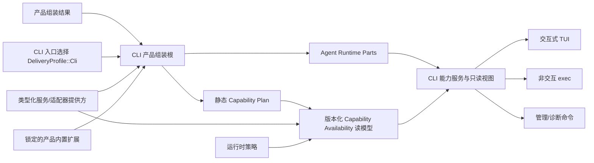

# BitFun CLI 产品线需求与架构设计

本文定义 BitFun CLI 产品线的需求边界、目标架构和阶段验收标准。外部来源的统一产品体验见
[`external-ai-work-sources-design.md`](extensions/external-ai-work-sources-design.md)；稳定的仓库级接口边界以
[`product-architecture.md`](product-architecture.md) 为准；Agent Runtime、工具和工作流归属见
[`agent-runtime-services-design.md`](agent-runtime-services-design.md)；插件宿主与 OpenCode 适配边界见
[`plugin-runtime-host-design.md`](extensions/plugin-runtime-host-design.md)；跨 GUI/TUI 的产品定制、品牌资源、界面
布局选择和内置扩展见 [`product-customization-blueprint.md`](product-customization-blueprint.md)；HarmonyOS PC 原生
CLI/TUI 的目标、问题和风险规约见 [`platform-portability-design.md`](platform-portability-design.md)；跨专题顺序见
[`../plans/product-architecture-evolution-plan.md`](../plans/product-architecture-evolution-plan.md)。本文只补充
CLI 产品入口、配置兼容、TUI 布局消费和 CLI Agent 体验，不重复定义这些文档中的通用契约或内部 ABI。
OpenCode 的完整扩展矩阵、配置资产、插件执行和 TUI Plugin 映射分别见
[`opencode-extension-compatibility.md`](extensions/opencode-extension-compatibility.md)、
[`opencode-config-assets-adapter-design.md`](extensions/opencode-config-assets-adapter-design.md)、
[`opencode-plugin-runtime-adapter-design.md`](extensions/opencode-plugin-runtime-adapter-design.md)、
[`opencode-tui-plugin-adapter-design.md`](extensions/opencode-tui-plugin-adapter-design.md) 和
[`opencode-external-integration-adapter-design.md`](extensions/opencode-external-integration-adapter-design.md)。

本文是目标设计，不记录单次 PR 进度。已有能力必须在迁移中保持兼容；尚未完成的能力不能因为
出现在本文中就被视为已交付。

本文使用 CLI-P0/CLI-P1/CLI-P2 表示 CLI 产品成熟度，不替代 OpenCode 兼容矩阵的 OC-R 分区或执行计划的 OC-E
切片。映射关系为：

| CLI 阶段 | 可消费的插件里程碑 | 边界 |
|---|---|---|
| CLI-P0 / CLI-P1 | 当前基线、OC-E0 | 只提供 BitFun 原生目录的来源确认和 OpenCode 静态工具名称预览；不注册为可执行工具。 |
| CLI-P1 / CLI-P2 | OC-E1 | 一个无外部依赖的 standalone custom tool 真实执行并进入现有 Tool Runtime，支持身份/路径字段和 `abort`；`metadata`/`ask`、官方 import 型样例、package plugin、Hook 与 TUI plugin 仍未承诺。 |
| CLI-P2 | OC-E2/OC-E3 | package plugin、Hook 和 TUI contribution 只按真实阻塞样例增加；原始 Solid/OpenTUI 组件明确降级。 |

## 1. 目标与边界

### 1.1 产品目标

BitFun CLI 应成为可独立安装和发布的 Agent 产品，而不是 Desktop 的终端壳。目标包括：

1. 覆盖交互式 TUI、非交互自动化、会话生命周期、工具与权限、MCP、Skill、Subagent 和诊断等
   高频工程闭环。
2. CLI、Desktop、Server、ACP 和 SDK 共享 Agent Runtime 语义，不复制会话、工具、权限或上下文逻辑。
3. 通过适配器直接消费或显式导入 OpenCode、Codex 和 Claude Code 的常用配置资产；外部格式不成为 BitFun
   内部模型，但兼容来源可以作为合法运行输入。
4. 通过 BitFun 自有 Runtime 和 OpenCode Compatibility Facade 接入服务插件、工具、Hook 和 TUI Plugin；
   来源完成首次激活后本地运行兼容优先，用户、产品或组织可以按需收紧权限。
5. 消费已校验的产品组装结果和 TUI 布局选择，生成不同品牌和能力范围的
   CLI 产物；通用产品定制不在 CLI 入口重复实现。
6. 以任务成功率、恢复能力、工具正确性、上下文效率和资源开销评估 Agent 能力，而不是只比较命令数量。
7. 把 HarmonyOS PC 作为一等 CLI/TUI 目标：用户在系统真实终端中安装并执行本地 `bitfun`；废弃兼容入口
   `bitfun-cli` 不作为新集成入口。HAP 内终端式
   界面、`hdc shell`、移动 Remote App 和其他设备代执行均不构成该目标。

### 1.2 能力对齐口径

“与 Codex CLI、OpenCode CLI 或 Claude Code CLI 平齐”只指本地 CLI 常用工程场景，不自动包含
其云端、桌面端、浏览器扩展、组织后台或托管执行能力。对齐项分为三类：

| 类别 | 处理方式 |
|---|---|
| 通用工程能力 | 由 BitFun 原生实现并保持自己的运行时语义，例如会话、工具、权限、上下文和结构化执行。 |
| 可迁移资产 | 按类型处理：规则和 Skill 优先作为持续兼容来源，MCP/模型作为待确认配置；显式导入只是可选快照。 |
| 生态专属能力 | 仅在有真实消费方、安全评审和兼容测试时适配；不复制对方完整运行时。 |

竞品官方文档仅用于维护能力基线，不构成 BitFun 内部接口规范：

- [Codex CLI](https://learn.chatgpt.com/docs/codex/cli) 与
  [Codex 非交互模式](https://learn.chatgpt.com/docs/non-interactive-mode)
- [OpenCode CLI](https://opencode.ai/docs/cli/) 与
  [OpenCode 配置](https://opencode.ai/docs/config/)
- [Claude Code CLI](https://code.claude.com/docs/en/cli-reference) 与
  [Claude Code 交互模式](https://code.claude.com/docs/en/interactive-mode)

### 1.3 非目标

当前设计明确不包含：

- 逐像素复制其他产品的 TUI，或复用其内部主题键、快捷键模型和界面状态。
- 向 OpenCode、Codex 或 Claude Code 配置文件做双向写回，或让外部原始类型成为 BitFun 内部数据模型；只读兼容
  结果可以随来源变化刷新。
- 同时建立 OpenCode、Codex 和 Claude Code 三套插件运行时；首个插件执行兼容对象只有 OpenCode。
- 在产品定义或 TUI 布局选择中加入任意命令、动态代码、renderer、源码文本替换或运行时 Hook。
- 为每个白标产品 Fork 一套 Rust/React/TUI 实现。
- 为追求接口完整而提前发布无消费方的代码接口；完整需求矩阵和阶段计划仍必须记录全部官方稳定能力。
- 一次性把 `bitfun-core` 的全部行为迁移到 Agent Runtime；所有职责迁移仍需行为等价证明。

## 2. 当前基础与主要缺口

当前主线已经具备以下基础：

- 交互式 TUI、Markdown/代码/Diff/工具卡片、主题、模型/Agent/MCP/Skill/Subagent/Session 选择；权限请求默认询问，
  提供 `Allow once / Allow always / Reject`，其中 `Allow always` 只对当前运行上下文中的同名工具有效。
- `exec` 支持 stdin、会话恢复/分叉、Patch 输出和 `text/json/stream-json`。非交互执行默认拒绝权限请求，
  显式 `--auto` 才在本次调用内自动批准；兼容参数 `--confirm` 隐藏并映射到安全默认值。`Ctrl+C` 会请求取消
  当前 turn；失败完成事件、事件流失步和 Patch 写入失败均返回错误结果。
- Agent、模型、MCP、会话、用量、诊断、ACP 外部 Agent 和插件来源管理命令。
- BitFun 原生插件目录的发现、内容校验、来源确认，以及 OpenCode custom tool 静态名称预览。
- CLI 本地 Agent 入口以类型化 `RuntimeServices` 调用 `ProductAssembler`，选择 `DeliveryProfile::Cli`，
  并把 `ProductRuntimeParts`、Agent Runtime SDK、本地工作区快照 owner port、事件源和调用级审批策略保存在一个 `CliRuntimeContext` 中。
- TUI、`exec`、会话、用量和交互模式下的 Peer Host 复用同一上下文。SDK 已承接会话创建（包括
  `exec --session-id` 和缺失后端会话通过独立固定 ID 方法按原 ID 重建）/列举/删除/恢复、类型化转录、本地分支、
  用量生成、轮次提交/取消和精确结算；普通创建
  DTO 只增加可选工作区 ID 与模型 ID 事实，固定 ID 冲突返回 `InvalidRequest`。会话模型更新、工具确认/拒绝和用户问题回答也通过
  SDK 的窄端口回到 Core owner，TUI 与 ACP 的活动会话模式更新也复用同一窄端口；模型/模式目录和提供方配置仍由产品入口解释。
  TUI 模式切换以异步待提交状态调用 Core，期间终端输入、resize 和重绘保持响应，新的对话提交不会消费用户输入；
  只有 Core 校验并持久化成功后才更新本地显示，失败时保留原模式并给出可重试提示，同值选择不产生持久化写入。
  等待期间可以切换或新建会话；只有原会话的发送继续等待。首次退出请求在持久化成功后自动退出，失败时留在界面提示重试；再次退出允许立即离开，
  并明确提示下次恢复以 Core 的持久化模式为准。恢复主会话时，已从当前目录移除的持久化模式由 Core 迁移到可执行回退模式；
  TUI 对比恢复前后的会话摘要并显示模式变化，如果同时携带启动输入，只预填而不自动执行，须由用户确认后发送。TUI 用量卡片通过固定语义的
  完成态本地命令轮次端口持久化。Peer Host 的本地工作区准备、会话文件清单、类型化快照统计和工作区文件回滚通过
  独立的本地 owner port 回到现有 Core 快照实现；该端口不进入 Agent Runtime SDK，不接受远程身份，也不承载历史截断、维护锁或完整 checkpoint/rewind。
  账号同步、富历史及 Peer Host/ACP 的其余维护缺口继续由一个 Core 兼容门面转发给原 owner。
- Agentic Event Queue 仍是唯一事件 owner；TUI、`exec` 与 Peer Host 使用独立广播订阅，不互相消费事件。
- 有界旧队列只承担兼容存储；达到容量时不得抑制广播。CLI 保持一个后台 drain，订阅方一旦报告 lag/closed，
  必须取消活动 turn 并显式失败，不能在状态不完整时继续报告成功。
- 会话 ID 在进入存储路径前统一校验；运行时索引同时绑定 ID 与规范化存储路径，并以待提交 claim 计数保护
  并发恢复。同一进程不能把另一个工作区中已加载的同 ID 会话当作当前会话，单个失败恢复也不能释放其他
  同路径恢复仍在使用的绑定；主会话提交不做前置完整 restore，只有 Runtime owner 返回结构化 `NotFound` 时才恢复或
  按原 ID 重建并重试一次，其他资源缺失与后端错误原样失败。删除路径不能通过
  相对路径、绝对路径或分隔符越出 sessions 根目录。
- TUI 终端句柄由恢复守卫持有；初始化中途失败、正常返回、错误返回或 panic 展开都会尽力退出 alternate screen、
  关闭输入捕获、关闭 raw mode 并显示光标。真实 PTY/ConPTY 启动页进程冒烟测试已验证 resize 后仍可交互、
  多行输入、空闲 Ctrl+C 和可观察的终端清理序列；Chat 活动 turn 的 resize 静默期已有状态单测，窄屏流式
  reflow 已有 TestBackend 回归，Linux PTY 与 Windows ConPTY 活动 turn 的 resize/取消已有本地确定性流式模型夹具进程测试；
  `exec stream-json` 的 Ctrl+C 也由真实 PTY/ConPTY 进程验证断流、非零退出和单一取消终态。OS 级初始化失败与
  异常退出仍需独立验收。
- Startup 与 Chat 共用 CLI 私有输入读取器；一次读取同时受 256 个事件和 50ms 限制，跨批次仅延续快速文本尾部，
  短批次普通按键保持原有路由。被识别为粘贴的文本按批次写入输入缓冲，每批只刷新一次命令菜单；粘贴内容中的
  Tab 明确转换为四个空格。
- 初始化按入口分级：交互模式启动 Peer Host 与 MCP，`exec` 只启动 MCP；本地 session 管理和 usage 查询不启动
  Peer Host/MCP。该分级不改变 Agentic/Terminal owner，也不等同于管理命令已有独立轻量 Runtime。
- Peer Host 保持既有 HostInvoke / DeviceEvent wire schema 与 Relay 路由，但执行已接入上述调用级上下文：
  对话提交、精确取消、会话创建/基础恢复/重命名/归档、thread-goal 查询和模型更新走 SDK；本地快照文件清单、统计和文件回滚走窄 owner port；
  富历史及其余维护缺口走单一 Core 兼容门面。Peer Host 在进入本地端口前对远程身份与远程路径返回明确不支持错误，并继续拥有回滚前取消、维护锁、历史截断、部分失败提示和事件投影。Peer Host 只跟踪由 Peer 提交的根 turn、
  其子 turn 与待确认工具；可确认工具始终由控制器确认，即使宿主全局策略跳过确认，Agent 也会暂停等待控制器。
  该 Peer 专属确认要求会沿精确后台结果 follow-up 保留。后台结果按 Core 内部元数据中的精确父 turn 与来源子 turn
  继承 ownership；仅在父 turn 仍运行时注入，否则排在
  无关 turn 之后并保留 Peer ownership。来源 turn 完成而结果仍等待会话串行化时，仅保留有界、一次性内部 tombstone；
  会话清理或事件流中断会移除它。最后一个控制器离线
  或分离、事件订阅 lag/closed 时取消这些 turn；事件失步同时投递既有失败 terminal event，终态在实际发送尝试前
  不提前清理，队列关闭时改走同一直接投递路径。事件以入队时的控制器快照为上界，每个目标发送前再确认仍连接；
  单目标投递租约将分离或离线移除与本地 Relay 入队尝试串行化。显式断开无法确认取消时，本地界面仍安全退出并
  显示警告。不承诺本次变更范围外的 ACK、重放或重连恢复。
- `doctor` 与 `health` 构造并校验真实 Runtime Parts，区分 assembly-ready、Core compatibility owner 和不可用扩展。
  它们证明必需能力已注册，不把 Core 的 Network/Git/MCP compatibility marker 描述为外部服务实时可用。
- 独立 CLI 测试与打包工作流；主 CI 的 Windows/macOS/Linux workspace check 同时覆盖 Cargo package
  `bitfun-cli` 编译，原生发布归档包含主入口 `bitfun` 和废弃兼容入口 `bitfun-cli`，上传前校验 SHA-256 摘要，
  并从解压后的目录验证两个入口及废弃告警。

上述切换不等于运行时 owner 已迁移，也不表示 CLI-P0 全部完成。CLI crate 仍以 `bitfun-core/product-full`
承载协调器、调度器、持久化、工具管线和部分 SDK v1 缺口，但 Peer Host 不再自行构造这些 owner；ACP 的 stdio、
连接和协议投影仍由 `interfaces/acp` 持有，后端已切换至 `DeliveryProfile::Acp` 与组装后的 SDK runtime；插件命令
仍以来源管理和静态预览为主。兼容门面只转发，不重新计算或写入同一事实。

目标态仍存在以下结构缺口：

| 缺口 | 影响 | 本设计的处理 |
|---|---|---|
| CLI 主会话客户端已仅消费 Runtime SDK；本地工作区快照的准备、文件清单、统计和文件回滚已有 Desktop/Peer Host 共用的窄 owner port，但快照记录/持久化/事件、账号同步、富历史及 Peer Host/ACP 的其余维护仍由现有 Core owner 提供 | 窄端口只消除重复宿主转发，不代表完整快照系统、远程快照或 SDK 能力已迁移；过早删除其余兼容路径会改变行为 | 保持快照实现和工具拦截在 Core，远程与历史维护留在宿主；仅在新的真实调用方、独立语义和行为等价测试齐备后继续迁移。 |
| TUI 编排、输入、命令、副作用和渲染仍有大文件聚集 | 交互回归难以隔离，终端状态与业务状态容易耦合 | 在现有模块上增量收敛为事件、状态归约、副作用和渲染四个边界，不重写全部 TUI。 |
| CLI 配置只覆盖入口本地选项，缺少统一层级、来源解释和兼容导入 | 用户无法安全复用其他 CLI 资产，也难以解释最终配置来源 | 建立 BitFun Canonical Config、持续来源视图和可选的显式导入报告。 |
| OpenCode 来源发现与真实执行尚未形成完整闭环 | “来源可识别”容易被误解为“插件可执行” | 第一条闭环只完成一个无外部依赖的契约样例；取得真实 `execute` 并注册到 Tool Runtime 后才显示可用。 |
| 当前 CLI 使用 `product-full`，OHOS target 图包含多组未验证的平台依赖 | 不能据依赖可解析、`hdc shell` 或移动 Remote App 推导 PC 本地 CLI/TUI 可用 | 问题与风险统一记录在平台规约；具体工作另立专题，HAP 不作为替代。 |
| Product Capability 已有，但品牌、资源、默认策略和发行配置没有统一产品定义 | 白标需要修改多处常量和工作流，能力隐藏不等于后端禁用 | 产品定义只在组装/构建边界选择身份、资源、能力包、默认策略和发行事实。 |
| CLI 已有独立 Linux 测试，参数互斥、结果/envelope 序列化、前置失败和组装有 focused contract；本地确定性模型夹具覆盖 HTTP 403 授权拒绝、流中断后的重试失败和 Patch 写入失败，真实 PTY/ConPTY 进程覆盖启动页、Chat resize/取消恢复及 `exec` Ctrl+C 的断流和单一取消终态；发布归档上传前完成 SHA-256 与解压执行验证 | 真实供应商审批交互和 OS 级终端初始化故障注入仍可能晚于 PR 发现 | 只按剩余真实故障补进程契约；避免为同一依赖图重复建立三平台编译矩阵。 |

## 3. 分阶段产品需求

### 3.1 CLI-P0：产品基础收敛

CLI-P0 的目标是建立后续功能补齐所需的稳定边界，不改变现有用户主路径。

CLI-P0 不是一个统一重构 PR。静态 profile、真实 Runtime Services、Runtime Parts、调用级审批、共享事件源和
本地 Agent 纵向入口已接入；旧门面仅在后续 owner 迁移的行为等价成立后退出。配置解释、产品定制消费和 TUI
进一步拆分仍需独立交付。CLI 托管的 ACP 服务端已独立切换到 ACP profile 与组装后的 SDK runtime；启动页
PTY/ConPTY 生命周期、Chat 活动 turn 的 resize/取消和发布归档冒烟测试已存在；resize 静默期与窄屏流式 reflow
分别有确定性状态单测和 TestBackend 回归。真实 `stream-json` 进程已保护 Patch 写入失败、本地模型 HTTP 403 授权拒绝、
流中断后的重试失败和 `exec` Ctrl+C 单一取消终态；真实供应商审批交互与 OS 级终端初始化故障注入仍需另行完成。

其余工作独立立项，不能与 profile 迁移互相充当完成条件：

| 切片 | 范围 | 退出条件 |
|---|---|---|
| 调用级审批 | TUI、`exec` 与 ACP 已使用各自调用级策略且不写全局配置 | Runtime-context `Allow always`、审批规划、`exec` 安全默认值和显式 `--auto` 有 focused test；真实模型/PTY 审批流与 ACP 仍需另行验收 |
| 输出协议 | 保持通用 `text/json/stream-json` 心智，复用现有 Agentic envelope，不新建 CLI schema | 已覆盖结果/envelope 序列化、参数与前置 JSON 失败、失败完成、同会话跨 turn 隔离、stream-json/Patch stdout 冲突及 Patch 写入失败；写入失败返回非零并只发送结构化错误，不提前发送成功终态；真实 PTY/ConPTY 信号、本地模型 HTTP 403 授权拒绝和流中断后的重试失败已有进程契约，真实供应商审批交互另行验收 |
| 配置解释 | Canonical Config 层级、全局/项目持续来源、加载状态和兼容导入 dry-run | 不自动写入；冲突、未知字段、待确认能力和凭据引用可解释 |
| 产品定制 | 消费最小产品定义、组装结果和已注册 TUI layout/theme ID | 第二个真实 CLI 产品复用后再提升公共字段 |
| TUI 边界 | 增量提取终端恢复守卫、命令分发和副作用边界 | 不改版视觉设计；Linux PTY 与 Windows ConPTY 活动 turn 的 resize/取消、恢复可编辑状态和正常退出清理可单独验证，macOS 活动 turn 与 OS 级初始化失败注入另行补齐 |

CLI-P0 不包含插件 JS/TS 执行、完整 checkpoint/rewind 或大规模 TUI 重写。
CLI-P0/P1/P2 在 Windows、macOS、Linux 完成不表示 HarmonyOS PC 已支持；HarmonyOS PC 的具体适配由未来独立专题
设计和验证，不能通过关闭必需编码能力直接宣称“本地编码就绪”。

### 3.2 CLI-P1：常用 CLI 工程闭环

#### 交互式 TUI

CLI-P1 应提供：

- 新建、恢复、继续、分叉、压缩和中断会话；所有动作使用同一 Session/Turn Runtime 语义。
- `@` 文件/目录引用和受控 `!` shell 请求；shell 仍进入工具、权限、取消和审计路径。
- 对话 checkpoint 与工作区 checkpoint 的独立事实；rewind 必须明确选择只回退对话、只回退工作区或两者。
- 后台 Agent/工具/工作流的状态、取消和结果回收，不允许无结果的隐式 detached task。
- 外部编辑器、命令历史、详情/用量视图、图片附件和终端能力降级。
- 鼠标关闭、低色彩、窄终端、无剪贴板、非 TTY、屏幕阅读器和不可用通知能力下的纯文本回退。
- 基于真实长会话建立首屏反馈、按键到绘制、滚动和峰值内存基线，再设置回归预算；不先拍脑袋冻结阈值。

其中：

- compact 只重建模型上下文，不删除权威 transcript。
- rewind 只有在对应持久化和工作区提供方支持时才可用；不支持时返回类型化原因。
- `!` 不成为绕过 Tool Runtime 的第二条 shell 执行路径。
- detached 只有在存在明确生命周期归属和结果回收入口时才允许；否则 CLI 退出必须取消任务并返回结果。

#### 非交互自动化

CLI-P1 应保证：

- stdin、显式 prompt、固定/恢复/继续/分叉会话互斥关系可验证。
- `stream-json` 每行一个完整事件；`json` 只输出一个完整结果文档；日志和诊断默认进入 stderr。
- 失败使用稳定退出码分类：输入/配置、认证、权限、运行时、取消、超时、工具/工作流、输出写入。
- 大型工具结果和二进制附件只在事件中传递存储引用，不把 data URL 或大块内容写入事件流。
- 结构化模式下 Patch 只能进入最终结果、已有事件、存储引用或显式文件，不能混入 `stream-json` stdout。

当前协议直接采用同类产品的通用输出心智，不建立 BitFun 专属的平行事件分类：

| 模式 | 当前约束 |
|---|---|
| `text` | 最终助手文本写 stdout；进度、思考、工具状态、日志和诊断写 stderr。显式 `--output-patch -` 是用户选择的额外 stdout 内容。 |
| `json` | stdout 只写一个结果对象，包含 `type=result`、`subtype`、`is_error`、`result`，以及已建立时的 `session_id`/`turn_id`、本 turn 累计 `usage` 和可用的 `patch`。 |
| `stream-json` | 每行直接序列化一个现有 `AgenticEventEnvelope`；不增加 `schema_version`、`sequence` 或第二套 CLI 事件 taxonomy。所有 terminal envelope 都只在精确结算和 Patch 交付完成后发布一次；结算失败优先于 Patch 失败，Patch 失败优先于 turn 终态，前两者统一改为 `SystemError` 并以非零状态退出。一次执行最多发布一个 terminal envelope 和一条 `BITFUN_EXIT` 分类。 |
| 事件范围 | 只输出本次 session/turn 的事件，以及与其明确关联的 subagent link/tool 事件；同 session 的其他并发 turn 不得混入。 |
| Patch | `json` 可把 `--output-patch -` 放入最终对象；`stream-json` 要求显式文件路径。Patch 是写出显式 Patch 文件前捕获的仓库 `HEAD` 相对工作区快照，包含 staged、unstaged、untracked 及命令启动前已有改动，不包含输出 artifact 本身，也不表达改动归因。 |
| 权限 | 非交互默认拒绝并返回权限失败；`--auto` 只改变当前提交策略，不修改持久化配置。 |
| 人工输入 | 非交互 `exec` 不暴露 `AskUserQuestion`；调用方必须在初始输入中提供完整上下文。该事实沿 Task、SessionMessage 及其自动回复链传播，避免子 Agent 或后续 turn 等待不存在的 stdin 处理器。 |
| 终止 | terminal event 决定结果；`success=false` 不能映射为成功。`Ctrl+C` 请求取消，终态观察与精确结算共享同一有界等待；若取消与完成/失败竞争，以实际观察到的 terminal event 为准，若结算失败则只发布替代的 `SystemError`。窗口内未观察到 terminal envelope 时发布结构化错误，不能无终态退出。当前进程仍以通用错误码 `1` 退出；只有实际取消终态使用 stderr 的 `BITFUN_EXIT: cancelled:` 稳定分类。当前公开契约不新增 Agent turn 总时限参数；调用方可使用进程级期限，只有出现真实消费方时才单独设计 deadline。 |

CLI 不提供 `--output-schema v1`。Codex/Claude 同类参数表达的是调用方提供的 JSON Schema，用于约束最终模型
响应，不是协议版本选择；如未来支持，应复用该语义并独立设计，不能借此重定义事件 envelope。

#### 管理与诊断

CLI-P1 应统一以下命令的文本和结构化只读视图：

- Agent、模型、MCP、Skill、Subagent、Session、Plugin、用量和运行时健康状态。
- Provider/认证来源的可用性、失效原因和登录/退出入口；密钥值只进入受控凭据提供方，不进入普通配置。
- 配置来源、被覆盖项、策略拒绝、未支持能力和降级原因。
- 外部 ACP 智能体与 OpenCode-compatible 插件必须作为两个独立能力展示。
- CLI-P1 只允许显式应用已支持的非执行型配置候选；规则引用、Skill、MCP 启用和插件包仍按各自生命周期处理。

### 3.3 CLI-P2：扩展、定制与差异化 Agent 能力

CLI-P2 是 CLI-P0/CLI-P1 稳定后的规划集合，不是一个 PR 或统一退出阶段。以下路线分别立项、验收和发布：

| 路线 | 用户价值 | 不并入该路线 |
|---|---|---|
| 插件执行 | 用户可以在 CLI/TUI 会话中调用当前有效策略允许的插件工具，并看到来源、权限结果、执行结果和失败原因 | 安装分发、可写钩子、界面贡献和多生态运行时 |
| 本地插件安装 | 用户可以从明确选择的本地来源安装或卸载插件；失败不改变已有插件和激活状态 | 插件执行器、自动更新、在线仓库、组织策略和产品内置扩展生命周期 |
| TUI 扩展 | 用户可以使用宿主接受的插件命令、状态、通知和主题语义角色，并能识别冲突或终端能力降级 | GUI 路由、组件、主题键和可执行界面代码 |
| 产品定制 | 用户获得与产品身份一致的 CLI 品牌、能力和内置扩展，并能看到缺失或隔离导致的降级原因 | 通用产品包格式、签名和更新实现 |
| Agent 能力 | 用户可以恢复复杂任务、理解上下文来源并获得可复核的多智能体结果 | 通过插件或 TUI 专用分支替代共享运行时能力 |

OpenCode、Codex 和 Claude Code 的配置资产覆盖可以继续扩展，但不改变 CLI-P1 已冻结的资产分类、写入边界和各生态的执行能力状态。

CLI-P2 的 OpenCode 路线以尽可能兼容现有本地/软件包插件、Bun/JS 行为和稳定 Hook 为目标；无法等价的原始
TUI renderer、实验性接口和完整外部 Server 协议按总矩阵明确降级。CLI-P2 不发布 Codex/Claude 插件执行 ABI。

## 4. 目标架构

### 4.1 分层与归属

| 层/模块 | 负责 | 不负责 |
|---|---|---|
| `src/apps/cli` | Clap 入口、TUI 状态/渲染、终端事件、入口本地设置、命令展示与结构化输出 | 会话状态机、工具执行、权限裁决、插件 Host ABI、品牌能力真值 |
| `assembly/product-capabilities` | Delivery Profile、Product Capability 计划、静态 eligibility、服务需求和组装计划 | 品牌资源读取、动态可用性、用户配置、UI 状态、具体服务创建 |
| 产品构建期校验 | 校验产品定义、品牌资源、TUI 布局选择和内置扩展版本，输出产品组装结果 | 创建运行时服务、实现终端行为或保存用户配置 |
| Runtime Product Assembly | 读取产品组装结果中本次 CLI 需要的字段，选择能力/服务/扩展，构建 Runtime Parts | 读取原始品牌资源、实现 Agent/Tool/插件适配器/终端行为或运行构建脚本 |
| Runtime Configuration Service | 规范配置层级、来源解释、导入预览/应用、原子写入、回滚和来源记录 | 解析外部生态格式、决定权限或读取凭据值 |
| 外部来源目录与激活策略 | 聚合用户/项目来源、资产清单、加载偏好和可读状态；结合各 owner 给出自动应用、需确认或限制结果 | 解释生态格式、写配置、管理 worker、保存凭据或代替调用时权限判断 |
| `agent-runtime` | Session/Turn/Task、调度、取消、上下文、事件、checkpoint fact、Subagent 和用量事实 | CLI 命令、TUI 状态、品牌、外部配置格式 |
| Tool/Harness/Runtime Services | 工具 ABI、工作流、类型化服务和平台端口 | 产品命令、入口默认策略、外部生态权威状态 |
| Plugin Runtime Host | 类型化调用、期限、取消、有界队列、逻辑 target 状态、响应校验和故障状态 | 持有 OS 进程树、直接写权限/审计/工具结果、解释 TUI 或品牌资源 |
| 脚本执行服务 | 物理进程健康、资源预算、进程树与句柄、类型化脚本请求和回收 | 决定工具权限、业务结果、TUI 或品牌资源 |
| 生态配置适配器 | 解析受支持外部格式并生成导入候选/诊断 | 直接写运行时配置、读取密钥、决定最终权限 |

CLI/TUI 的会话创建、列出、删除、恢复和历史转录读取通过 Runtime SDK 的类型化端口完成；TUI 只把
`SessionTranscript` 投影为本地渲染状态，不再消费 Core `Message`。Peer Host 的对话提交、精确取消、基础会话控制、thread-goal 查询、会话模型更新和
工具确认/拒绝通过 SDK 回到 Core owner；本地会话分支通过显式本地范围的 SDK 端口完成，携带远程身份的请求返回类型化
`NotAvailable`，本轮不扩展远程分支。TUI 用量卡片通过固定语义的完成态本地命令轮次端口持久化，不暴露通用 transcript writer。
本地工作区快照准备、会话文件清单、类型化统计和工作区文件回滚通过 `runtime-ports` 中不属于 Runtime SDK 的窄 owner port 完成，
由 Desktop 和 Peer Host 分别投影现有协议；Desktop 保留既有远程空结果，Peer Host 返回明确不支持错误，远程请求都不进入本地实现。快照记录、持久化、事件、历史截断与维护编排仍在原 owner。
账户同步、富历史及其他未覆盖操作继续使用经过审查的 Core compatibility 方法，直到各自具备明确 owner、稳定 DTO、远程语义和行为等价测试。
这是一条垂直链路迁移，不是删除整个兼容门面或新建 CLI 专用服务层。

Runtime Configuration Service 当前由 `bitfun-core/service/config` 负责。在经评审的 port/provider
迁移完成前，CLI 和生态适配器不得另建写入器；adapter 只做 discover/parse/normalize，配置服务才能
预览/应用、记录来源，并通过远程工作区 provider 写目标层。产品定义、品牌资源、界面布局选择
和内容摘要校验由构建期校验器按
[`product-customization-blueprint.md`](product-customization-blueprint.md) 负责；Runtime Product Assembly 只消费
已经解析和校验的入口字段，不另设含糊的 Product Bootstrap 服务。

### 4.2 产品定义、布局、运行时配置与可用状态必须分离

| 对象 | 生命周期 | 权威归属 | 示例 |
|---|---|---|---|
| 产品定义 | 构建/产品组装期，通常不可变 | 构建期校验器 | 品牌身份、能力上限、默认策略引用、内置扩展和发行事实 |
| TUI 布局选择 | 构建/产品组装期，通常不可变 | CLI/TUI 宿主与构建期校验器 | 已注册 layout、panel、command、status、keymap 和 theme ID |
| Delivery Profile | 组装期稳定枚举 | Product Capability | CLI、Desktop、ACP、SDK |
| Runtime Configuration | 用户/项目/会话期可变 | 配置服务 | 模型选择、MCP、主题、快捷键、入口行为 |
| Capability Availability | 启动和运行期派生 | 单一能力可用性读模型 | available、status-only、unsupported、policy-denied |

产品定义不能替代用户配置；TUI 布局选择只决定入口结构和可见内容；用户配置和运行时插件都不能启用
未被产品定义允许的能力。隐藏一个 TUI 入口也不能视为能力已禁用。

本文的产品定义描述 BitFun 发行产品；它与 SDLC Harness 用于描述目标仓库事实和质量策略的
[`Project Profile`](../sdlc-harness/architecture/project-profile-integration.md) 是两个独立概念，不能共享
schema、存储或优先级。

### 4.3 产品启动流



启动规则：

- 产品组装结果、TUI 布局引用、能力依赖或资源校验失败时构建/启动失败，不静默退回 full 产品。
- Runtime Product Assembly 在构建 Runtime Parts 前必须验证组装结果绑定的 TUI 布局摘要、
  `DeliveryProfile::Cli`、Surface ID、schema 和宿主版本；不匹配时失败，不能接受来源不明的替换内容。
- 可选服务不可用时进入 Capability Availability；必需服务缺失时组装失败。
- CLI 不直接创建新的全局 manager；现有兼容路径按等价测试逐步迁移。
- 静态 Plan 只记录 eligibility、依赖和服务要求；动态健康、策略和 quarantine 不固化进 Plan。
- TUI、Exec 和管理命令消费同一带版本的 Capability Availability 读模型，不能分别维护可用性判断。

### 4.4 TUI 内部边界

现有 TUI 采用增量拆分，不另建平行框架：

| 边界 | 职责 |
|---|---|
| Terminal Session | raw mode、alternate screen、鼠标/粘贴、panic/取消后的恢复 |
| Input/Event | 键盘、鼠标、resize、paste、runtime event 的标准化输入 |
| State/Reducer | 纯状态转移；不直接执行文件、网络、配置或 Agent 操作 |
| Effect/Controller | 把状态意图映射为能力服务请求，并把结果重新投递为事件 |
| View/Widget | 根据状态渲染；不读取具体 manager 或写配置 |
| Action Registry | 统一 action id、slash/palette/help、上下文、可用性、处理器和默认键位；不持有业务状态 |
| Keymap Resolver | 根据当前模式和焦点把用户显式配置或默认键位解析为 action id；不直接执行业务副作用 |

`modes/chat.rs` 当前主要保留 `ChatMode` 外壳、共享上下文和私有子文件组织；生命周期、输入/命令、选择器、MCP、
会话与能力副作用按职责保留在同一 Rust 模块的 `modes/chat/` 子文件中。现有 `ui/chat/state.rs`、`input.rs`、
`render.rs` 等模块继续作为收敛基础。该拆分不形成公共 TUI 框架，也不改变交互规格；后续仍以可测试边界为目的，
不以文件数量为目标。

### 4.5 Action 与快捷键

Slash 自动完成、命令面板、帮助、快捷键展示和执行分发必须读取同一 action 条目。Clap 子命令、flags、stdout 和
exit code 保持独立强类型协议，但可以调用相同 controller。Registry 只描述宿主动作，不复制 Session、Tool 或
Plugin Runtime 状态。

默认键位以当前真实 dispatch 为兼容基线；serde 补出的默认值不等于用户选择。只迁移配置文件中显式保存的旧值。
冲突必须稳定并显示来源；退出、终端恢复和活动 turn 中断始终保留宿主 fallback。最低测试覆盖无配置、显式旧配置、
冲突配置和真实输入 dispatch。

### 4.6 HarmonyOS PC 原生终端产品

HarmonyOS PC 复用现有 `DeliveryProfile::Cli`、action、TUI 和 Runtime 语义；平台 target 不成为新的 Delivery
Profile。目标产物是普通用户在系统真实终端中直接执行的本地 `bitfun`，不是 HAP、ArkUI/ArkWeb 终端模拟器、
`hdc shell` 工具或现有 HarmonyOS 手机 Remote App。

问题清单、风险和旧设计闭环统一见[平台规约](platform-portability-design.md)。具体鸿蒙化工作、OpenCode 平台资格、
HarmonyOS PC GUI 与移动端均另立专题。

## 5. CLI/TUI 对产品定制结果的消费

产品定义、品牌资源、TUI 布局选择、产品组装结果和内置扩展的通用边界由
[`product-customization-blueprint.md`](product-customization-blueprint.md) 定义。本节只约束 CLI/TUI 消费。

CLI 入口只接收已校验的产品组装结果和当前 Delivery Profile 对应的 TUI 布局字段，不读取原始品牌资源，
也不运行构建脚本。首期 TUI 布局只允许引用宿主已注册的稳定 ID：

| 定制面 | CLI/TUI 消费 | 宿主保留决定权 |
|---|---|---|
| 品牌 | text/compact Logo、产品名、帮助/法律资源 | Unicode/纯文本回退、宽度裁剪和终端恢复 |
| Layout | layout preset、panel region、默认 mode | resize、窄终端折叠和焦点 |
| Commands | capability-backed command group、顺序和帮助分组 | dispatcher 映射、权限和冲突处理 |
| Status | 已注册 status/notice/只读视图 | 事件归一化、刷新和降级 |
| Keymap | 已注册 preset 与可覆盖范围 | 冲突、平台按键和用户允许覆盖 |
| Theme | TUI preset/语义主题 ID | ANSI/truecolor/monochrome 适配 |

TUI 布局选择不携带 renderer、终端句柄、shell helper、GUI key、任意脚本或运行时插件状态。Runtime
Configuration 只能覆盖产品定义明确允许的默认值；用户插件只能向允许的 TUI 扩展点提交贡献，不能改写
构建期布局、产品身份、产品能力上限或内置扩展版本。

产品内置扩展来自只读产品 source root，随产品升级。BitFun 原生包继续使用现有来源确认、激活、更新、禁用和
卸载路径；OpenCode 配置和标准目录来源自动发现，低风险内容按用户偏好自动应用或先询问，可执行来源首次启用或
能力扩大时非阻塞确认。确认后的运行语义兼容优先，用户、产品或组织策略仍可限制。三者可以复用 Host ABI、隔离
和经 BitFun 能力接口的权限/审计，但不能共享来源根、安装状态或用一种泛化信任记录互相授权。

## 6. Canonical Config、持续兼容来源与显式导入

### 6.1 BitFun 配置层级

普通设置按以下优先级解析：

```text
命令行/本次运行参数
  > 工作区本地设置
  > 项目设置
  > 用户设置
  > 产品定义声明为可覆盖的运行时默认值
```

项目设置是可共享的仓库事实；工作区本地设置是机器/工作区实例私有且不随仓库同步的覆盖。二者不能
只靠路径巧合区分，远程工作区必须由 provider 显式给出作用域和写入能力。

组织策略不是普通覆盖层。最终能力和权限是“用户请求与组织上限的交集”，低层配置不能放宽
组织策略、隔离要求、数据范围或扩展来源限制。

每个有效值必须可解释：值、来源层、来源文件/策略标识、是否被覆盖、是否被策略限制。配置解析失败时
只可在同一作用域和同一版有效策略下保留上一个有效结果并产生诊断；没有有效结果时失败。安全相关配置
不得回退到更宽松的旧结果或默认值。

### 6.2 来源发现与导入流程

外部资产有“兼容来源”和“显式导入”两种消费方式。兼容来源不改写已有 OpenCode 文件；OC-R1 只有不启动
外部进程、不 import 第三方 module、不读取凭据且不主动联网的 L1 字段可以按用户偏好自动应用或先询问。
Plugin/Tool、可执行 Skill/Command、MCP/LSP/Formatter、远程 Reference 等 L2/L3 内容在 OC-R2 完成归属模块保护
前只发现和展示；完成后仍须在首次启用或能力扩大时确认。它们无需先迁移；
显式导入用于用户希望把资产写入 BitFun 原生配置的场景。CLI-P0 截止到 Dry-run，CLI-P1 才允许
对受支持的非执行型配置执行 apply：

```text
持续兼容：后台发现 -> 解析 -> 风险分级 -> L1 自动应用/先询问 | L2/L3 待确认 -> 原子切换
显式导入：选择来源 -> 归一化 -> 冲突分析 -> Dry-run | CLI-P1: 用户选择 -> 原子写入 BitFun 层 -> 复核/回滚
```

交互式 CLI/TUI 以一条非阻塞摘要说明来源产品、全局/项目作用域、资产数量、自动应用项和待确认项；详细内容进入
统一来源与插件状态入口，具体命令名在有真实调用方时再冻结。非交互命令只有在当前操作实际依赖待确认资产时才
返回类型化 `action-required`；无关待办只进入结构化状态或 `stderr` 摘要，不等待不可见输入，也不自动批准。
当前只能静态预览的 custom tool 名称只显示“已发现，未执行”。

导入预览只使用四种用户可读结论：可直接使用、需要转换、会发生功能降级、输入无效。每项同时说明是原地
引用、写入 BitFun 配置、继续保持外部来源还是不支持；不得用“已映射”推导为已写入、已信任或已启用。

兼容来源不写入 BitFun 层，也不双向修改原文件。显式导入时，项目级来源默认写入 BitFun 项目层，用户级
来源默认写入用户层；用户可以在确认时选择更窄的目标层，但不能写入组织强制策略。导入记录保留来源产品、
来源范围、内容摘要和导入时间，并按字段保存目标层、导入前值及其版本/摘要和导入值。已导入字段以 BitFun 原生
配置为准，不再重复应用外部值；外部来源变化时提示重新导入并展示差异，不做双向写回。撤销只自动恢复当前值
仍等于导入值的字段；用户后续修改、来源变化或部分重新导入造成冲突时，逐字段选择“保留 BitFun / 重新导入
外部 / 手工处理”，不得整批覆盖。

| 来源 | 首期可导入 | 首期不导入 |
|---|---|---|
| OpenCode | 规则/instructions、Agent、Mode、Skill、References、Command、MCP、LSP、Formatter、模型、Theme、Keybind 和稳定配置进入兼容来源图；非执行资产可显式导入 | 凭据值双向复制、把 OpenCode 原始类型变成 BitFun 内部类型；Plugin/Tool 经来源确认后由独立 Runtime 加载，不通过配置导入执行 |
| Codex | `AGENTS.md` 原地引用；受支持的 MCP、稳定配置和 Skill 可选择原地引用或导入 | `auth.json` 等凭据、私有/未文档化字段、Codex App Server 状态 |
| Claude Code | `CLAUDE.md` 原地引用；受支持的 MCP、稳定设置和 Skill 可选择原地引用或导入 | OAuth/Token、插件执行、可写钩子、组织强制策略降级 |

规则文件优先复用项目已有文件，不复制出第二份内容。若不同生态规则冲突，导入报告必须展示目标文件、
优先级和冲突段，不能自动拼接。

现有对 `.claude/.codex/.opencode/.agents` Skill 根的直接发现已经保留来源身份和全局/项目作用域，并在 GUI/TUI
展示来源和默认覆盖状态，模式配置再展示实际采用项；固定根顺序保持为 Skill Registry 的独立回归契约。变化监听与可见性测试仍需
后续补齐。OpenCode 兼容来源继续直接发现官方目录；Codex/Claude 是否增加新的持续来源另行决定。
Skill 说明和索引可按 L1 处理，脚本、URL 和外部依赖按 L2 确认；显式导入仍不得复制凭据值。MCP 启用状态按
OpenCode 来源解释，首次连接、策略限制和凭据缺失分别显示。

### 6.3 凭据边界

- 凭据发现、凭据使用和配置导入是三条独立路径。
- 默认只报告可用认证来源，不复制 token、OAuth refresh token 或 API key。
- 只有外部产品明确稳定支持的授权方式才能成为产品级 provider；读取私有文件格式只能作为可关闭的
  本地兼容能力，并提供失效诊断。
- 日志、结构化事件、导入报告和诊断不得包含原始凭据或完整敏感路径。

## 7. 扩展与 OpenCode-compatible 能力

### 7.1 三条能力必须分开

| 能力 | 入口 | 说明 |
|---|---|---|
| 外部 ACP 智能体 | `bitfun acp ...` | 启动外部智能体进程并通过 ACP 协作。 |
| 配置兼容与导入 | 启动时持续兼容来源；`bitfun config import ...` 显式迁移 | 前者后台发现并按风险应用/确认 OpenCode 来源，后者写入 BitFun 原生配置；两者都不在解析线程执行插件。 |
| 运行时插件 | `bitfun plugins ...` | 当前只提供 BitFun 专用包的来源、启用和静态工具名称预览；目标直接运行 OpenCode 插件。 |

三者不能共享“已安装/已启用”状态，也不能互相推导来源确认或运行权限。

### 7.2 插件阶段

| 阶段 | 目标交付 | 边界 |
|---|---|---|
| 发现 | 直接发现 OpenCode 用户/项目配置、插件目录、工具目录和软件包来源，形成作用域与能力摘要；同时保留 BitFun 原生包 | 不要求 OpenCode 作者复制到 `.bitfun/plugins` 或维护 BitFun 清单；不把静态预览称为可用 |
| 确认 | 可执行来源首次按来源/target/执行域确认；能力扩大重新确认 | 非阻塞待办，不阻止项目或无关会话；同一摘要下不逐层重复询问 |
| 准备 | 只为已准入候选解析依赖、记录当前执行版本、异步启动每插件 target 进程 | 不在 TUI 输入线程安装依赖或加载插件，确认前不 import module |
| 启用 | 展示来源、target、真实贡献、策略差异和运行状态 | 用户一次确认可以完成后续内部阶段，但不绕过 import 前策略重算 |
| 执行 | 真实工具、稳定钩子、兼容 Client 和 TUI Plugin 经主机调用现有归属模块 | 插件不能直接写权限、工具结果、审计、会话或 Ratatui Frame |
| 管理 | 查看、停用、恢复、更新和卸载；区分更新失败、暂时过期、明确删除和重新出现 | 安装成功不等于运行健康，服务和 TUI target 分别管理 |

OpenCode 适配器必须读取真实外部来源；来源确认后才自动准备执行环境。显式导入只用于把非执行配置迁移为
BitFun 原生配置，不能成为运行插件的前置条件。Codex/Claude 当前只进入配置资产兼容或导入，不进入插件执行阶段。

CLI 只有在后端已经从脚本进程取得真实定义和执行函数、注册到现有 Tool Runtime 且当前 worker 健康时，才显示
“工具可用”。静态名称、准备中、制品不受支持、策略限制或执行进程不可用时，分别显示预览或具体原因，不能把
来源已记录或 `plugins activate` 成功解释为工具可调用。

现有 `plugins activate` 仍只授权读取静态预览。首个执行能力交付前，命令回执和 `list/status` 必须直接说明
“仅静态预览，插件代码未执行”。目标一级状态统一使用[外部 AI 工作内容设计](extensions/external-ai-work-sources-design.md#7-状态与提示规则)
定义的集合，并附带原因与恢复动作；准备完成、重启中、已暂停等 Host 阶段只作为详情，不形成另一套 CLI 状态。

工具进入可调用集合后，排队、权限确认、运行、成功、失败和取消继续使用现有 Tool Runtime；终端插件状态使用
统一 TUI 状态/事件路径，不新增插件专用工具调用状态机。

### 7.3 CLI 扩展贡献

OpenCode TUI Plugin v1 的宿主操作按独立设计适配：Route/导航、Command/Slash Alias、Keymap/Layer/Binding/Mode、
Dialog/Toast/Prompt、全部 host slots、Theme、Attention/系统通知/声音、State、KV、Client、Events 和插件启停均有
目标映射，详见 [`opencode-tui-plugin-adapter-design.md`](extensions/opencode-tui-plugin-adapter-design.md)。

键位冲突、终端颜色映射、文本回退、焦点和命令排序由 CLI 宿主决定。插件不能持有终端句柄或直接写
Ratatui Frame。依赖 OpenCode 原始 `CliRenderer`、Solid/OpenTUI 组件的 Route、Slot 和 Dialog 首期明确返回
渲染器不兼容，其他命令、事件和状态继续工作；不得用少量声明式贡献冒充全部 TUI Plugin 兼容。

## 8. Agent 能力加强

CLI Agent 能力加强必须落在共享 Agent Runtime、Tool Runtime 或 Harness，而不是只在 TUI 增加分支。

### 8.1 会话、上下文与恢复

- Session、Dialog Turn、Model Round 和后台 Task 维持稳定身份与事件顺序。
- 长程目标公开预算、进度、阻塞原因、continuation 和完成事实，TUI 只负责展示和操作入口。
- compact 产生带来源和预算事实的新上下文，原 transcript 保持可审计。
- 对话 checkpoint 与工作区 checkpoint 分离；workspace 恢复依赖 Git/文件系统提供方并报告未跟踪文件风险。
- rewind 不承诺跨会话存储和文件系统原子提交。它先持久化 plan/基线和影响预览，再执行并验证 workspace
  provider，最后提交对话指针；取消和重入使用同一 operation id。
- 任一步失败先尝试补偿；无法补偿时返回 `partially-applied`，逐项报告 workspace、transcript、未跟踪文件
  和可恢复动作，不得报告成功或留下无解释状态。
- 指令、Skill、规则、用户上下文和工作区事实保留来源与优先级，便于解释上下文为何进入模型。
- Prompt cache、压缩和模型切换不能改变权限、工具清单或隐藏的安全上下文。

### 8.2 执行可靠性

- Turn、Tool、Subagent 和 Harness Step 都支持取消，并产生类型化 outcome。
- 工具调用使用唯一调用身份，以便识别取消、迟到响应和重复响应；重试必须区分可重试传输错误、模型错误、
  权限拒绝和确定性工具错误，不默认重复有副作用的调用。
- 后台任务必须有结果投递、显式 detached 状态或取消结果，不能仅依赖日志。
- 不以字符串或次数硬编码阻止 Agent loop；先从工具语义、上下文、模型交互和状态同步定位根因。
- 大型结果写入对象存储，并在后续轮次通过受控引用进入上下文。

### 8.3 多 Agent 与工作流

- Subagent 声明角色、输入、工具/能力边界、预算和期望输出；父 Agent 负责结果收敛。
- 并行任务必须有并发上限、取消传播和写冲突策略；需要写同一工作区时优先隔离工作树或串行化。
- 委派结果包含来源 Agent、完成状态、产物和未解决风险，不把子会话原始上下文全部注入父会话。
- Deep Review、Debug、Research 等复杂流程进入 Harness Provider，不在 CLI 写专用运行时循环。

### 8.4 模型与评测

- 模型路由保持 provider-neutral；产品只选择策略和默认值，不在内核按品牌分支。
- fallback 必须展示原因，并保留模型、用量、缓存和失败事实。
- Agent 改进使用固定任务集和重复运行评估：完成率、错误恢复率、工具失败率、人工确认次数、Token/缓存、
  执行时长和产物正确性。
- 权限绕过、未授权副作用、敏感信息泄露和不可解释的部分应用属于零容忍保护项，不用平均成功率抵消。
- 竞品对比必须记录版本、模型、权限、工作区、运行次数和失败分类；单次结果不能作为架构完成标准。
- 共享 Harness/Evaluation 模块维护版本化评测清单；每份清单固定任务/工作区摘要、模型/provider、
  工具与权限策略、成功判定、性能预算和对比基线。每个用例对候选与基线各重复至少 3 次，报告原始结果、
  中位数和失败分布；更高统计要求由评测清单声明，不在 CLI 写专用评测循环。

## 9. 安全、错误与可观测性

- TUI 无论正常退出、取消、panic 或初始化失败，都必须恢复终端状态。
- stdout 只承载用户请求的结果/协议；日志和诊断默认写 stderr 或日志文件。
- 文件、shell、网络、浏览器、桌面、远程和 MCP 等经 BitFun 能力接口发起的动作统一进入能力/副作用与权限路径。插件直接使用 Bun 文件、网络或进程接口的副作用不伪装成已逐项拦截；严格策略没有真实操作系统隔离时，应禁用相应插件并报告策略限制。
- 非交互模式遇到需要人工确认的动作时默认失败并返回类型化诊断；只有显式策略才能自动批准。
- 插件执行使用独立期限、有界队列、进程/worker 生命周期和崩溃恢复。来源完成首次确认后，默认本地兼容策略
  提供 OpenCode 插件正常运行所需的当前用户环境；诊断和日志始终脱敏，用户或组织可显式限制环境变量、网络、
  文件和进程能力。
- 配置导入、诊断、事件和崩溃报告统一脱敏；绝对路径只在本地明确需要时显示。
- Remote/Server 不支持的本地能力必须在启动前或调用时给出明确 unsupported，不静默落到本机执行。
- 用户可见文案走 CLI 自有本地化资源；日志保持英文且不使用 emoji。

### 9.1 主要挑战与控制策略

| 挑战 | 主要风险 | 控制策略 |
|---|---|---|
| 兼容门面迁移 | 职责重复、全局状态和行为漂移 | 小步迁移职责、旧路径等价测试、协议/权限显式版本化 |
| 终端差异与大会话 | Windows/PTY 差异、闪烁、输入丢失、内存增长 | 终端 guard、纯文本降级、真实会话性能基线和三平台 PTY 测试 |
| 外部生态持续变化 | 未知字段被误映射、live source 成为第二真相源 | 版本化 fixture、资产分类、一次性 plan/apply、unknown fail visible |
| 第三方执行 | 凭据泄露、直接脚本副作用、宿主崩溃 | 明确来源和执行用户、独立进程、期限、取消、有界队列、脱敏、崩溃恢复，以及用户可调权限策略 |
| CLI 产品配置 | 产品组装结果/TUI 布局不一致、品牌/数据串用 | 使用产品定制模块的内容摘要、独立命名空间、签名与回滚验证 |
| Agent 非确定性 | 单次评测误判、并发写冲突、部分恢复 | 重复评测、guardrail、并发/取消策略和 typed partial outcome |

## 10. 验证与完成标准

### 10.1 验证矩阵

| 范围 | 必须验证 |
|---|---|
| Capability/Profile | 产品组装结果/TUI 布局引用、依赖闭包、冲突、未知能力、缺失资源、产品能力上限和后端/入口一致性 |
| TUI | Reducer/命令单测、渲染 snapshot、PTY resize/paste/interrupt/restore、Approval Policy、纯文本/屏幕阅读器、性能预算 |
| Exec | 单结果 `json`、现有 `AgenticEventEnvelope` JSONL、stdout/stderr、权限默认值、取消、超时、resume/fork、Patch 与大结果存储引用 |
| Config | 层级合并、来源解释、策略约束、资产处置、三类外部 fixture、MCP disabled、Skill 可执行资源、冲突、回滚和脱敏 |
| Plugin | OpenCode 直接来源、依赖与真实导出、工具/全部稳定 Hook/Client、server 与 tui 双 target、加载顺序、超时、崩溃、过载、恢复、策略差异和 unsupported fixture |
| Agent Runtime | session/turn/cancel、compact/checkpoint/rewind 的补偿/partial/re-entry、后台投递、Subagent、Hook 顺序和持久化恢复 |
| Evaluation | 版本化评测清单、候选/基线重复运行、原始结果、阈值、失败分布和安全保护项 |
| Product build | 当前产品组装结果/TUI 布局生成 CLI smoke artifact；通用 GUI/TUI、品牌、内置扩展和发行验证按产品定制文档执行 |
| 平台 | Windows、macOS、Linux 的 build/smoke；Windows 单独覆盖 ConPTY、Ctrl+C、路径和进程树清理；HarmonyOS PC 仅遵循平台规约，具体验证由未来专题定义 |
| Action/Keymap | registry 唯一性、Slash/Palette/Help/dispatch 一致、配置键位真实输入、冲突来源和终端恢复 fallback |

通用 `cargo check --workspace` 负责三平台 CLI 编译保护；独立 CLI CI 运行
`cargo test --locked -p bitfun-cli -p bitfun-acp -p bitfun-agent-runtime`。Linux 启动页 PTY 生命周期冒烟随独立 CLI
测试运行，Windows 启动页 ConPTY 生命周期冒烟复用通用 Windows job；Windows x64、macOS 和 Linux 的原生发布归档
在上传前完成 SHA-256、双入口和解压执行验证。真实供应商模型进程级交互、macOS 活动 PTY 与 OS 级终端故障进程矩阵仍按对应切片补入门禁；Linux PTY
与 Windows ConPTY 的 Chat 活动 turn resize/取消及 `exec` Ctrl+C 已由本地确定性流式模型夹具覆盖，不能用它替代上述验收。

### 10.2 阶段退出条件

CLI-P0 完成：

- CLI 使用真实 Runtime Parts 和统一能力可用性，不新增入口侧产品逻辑。
- Slash、Palette、Help、Keymap 和 dispatch 从同一 action registry 派生，已支持的快捷键有真实输入测试。
- 结构化输出、Approval Policy、配置来源和产品组装结果/TUI 布局消费均有可复核契约测试。
- 两个已解析产品输入能在不修改源码的情况下生成当前平台最小 CLI smoke artifact。
- CLI 独立 CI 成为必需检查。

CLI-P1 完成：

- 常用交互与非交互场景在三平台通过自动化测试。
- compact/checkpoint/rewind、后台任务和 `@`/`!` 不绕过 Runtime、Tool 和权限语义。
- 用户能够解释配置、能力、模型 fallback 和失败原因。

CLI-P2 各路线独立完成：

- 插件执行：真实 OpenCode 项目无需手工重打包即可完成来源发现、依赖准备、服务插件加载、一次真实工具调用和
  稳定 Hook 变换；不支持的单项能力不使整个插件或界面失效。
- 本地插件管理：安装、启用、停用、更新和卸载状态清楚分离；来源仍启用且健康旧进程仍合规时，代码或依赖更新
  失败不破坏旧进程；旧进程丢失后只有精确旧物化目录仍可校验时才重建，否则明确不可恢复。停用、删除、来源
  撤销、权限收紧或安全策略失效必须撤下旧贡献，来源缺失或损坏时仍可清理残留状态。
- TUI 扩展：除原始 OpenTUI/Solid 组件渲染外，TUI Plugin v1 宿主操作都有版本化适配和真实样例；渲染降级
  不导致空白页面、输入冻结或终端无法恢复。
- 产品定制：CLI 产物正确消费产品定制归属模块生成的身份、资源、能力、数据和更新信息。
- Agent 能力：每项改进由自己的重复评测证明，且没有通过放宽权限或扩大上下文掩盖问题。

## 11. 已收敛的架构决策

1. 使用 BitFun 统一能力内核，不嵌入或 Fork OpenCode Runtime 作为产品内核。
2. CLI 是产品入口，产品逻辑进入共享 Runtime/Capability/Harness，TUI 实现留在 `src/apps/cli`。
3. 产品定义、Delivery Profile、Runtime Configuration 和 Capability Availability 分离。
4. 外部源文件可以保持只读；非执行兼容结果可直接生效，可执行结果只有达到对应执行阶段后才激活；也可以显式
   导入 BitFun 原生配置，凭据和插件执行分别处理。
5. OpenCode 是首个插件执行兼容生态；Codex/Claude 首期只做配置资产导入。
6. CLI 只消费产品组装结果和 TUI 布局选择；产品构建脚本、GUI 布局、品牌和发行信息由产品定制模块管理。
7. 先补产品组装、协议、配置和测试基础，再扩展插件执行和复杂 TUI 功能。
8. Agent 能力以共享运行时语义和重复评测加强，不用 CLI 专属硬编码模拟高级能力。
9. HarmonyOS PC 是真实系统终端中的原生 CLI/TUI 目标，与 HarmonyOS 手机 Remote App 和后续 PC GUI 独立；没有
   普通用户安装渠道、TTY、本地 Agent 与编码流程真机证据时不宣称本地支持，也不改用 HAP 或 Remote 代替。
