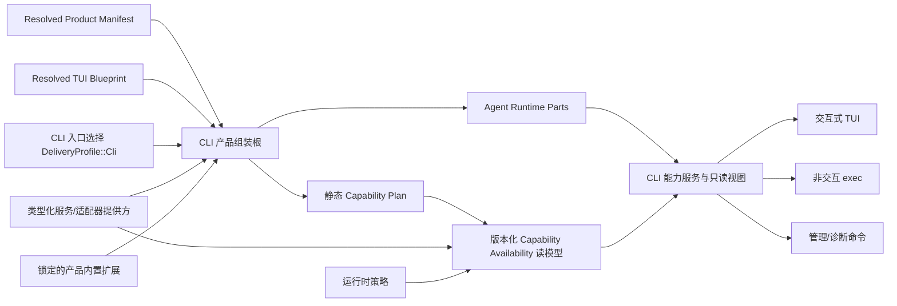

# BitFun CLI 产品线需求与架构设计

本文定义 BitFun CLI 产品线的需求边界、目标架构和阶段验收标准。稳定的仓库级接口边界以
[`product-architecture.md`](product-architecture.md) 为准；Agent Runtime、工具和工作流归属见
[`agent-runtime-services-design.md`](agent-runtime-services-design.md)；插件宿主与 OpenCode 适配边界见
[`plugin-runtime-host-design.md`](plugin-runtime-host-design.md)；跨 GUI/TUI 的产品定制、品牌资源、Surface
Blueprint 和内置扩展见 [`product-customization-blueprint.md`](product-customization-blueprint.md)。本文只补充
CLI 产品入口、配置兼容、TUI Blueprint 消费和 CLI Agent 体验，不重复定义这些文档中的通用契约或内部 ABI。

本文是目标设计，不记录单次 PR 进度。已有能力必须在迁移中保持兼容；尚未完成的能力不能因为
出现在本文中就被视为已交付。

本文使用 CLI-P0/CLI-P1/CLI-P2 表示 CLI 产品线阶段，不替代插件设计中的 P0-C.1、P0-C.2、P0+
技术里程碑。映射关系固定为：

| CLI 阶段 | 可消费的插件里程碑 | 边界 |
|---|---|---|
| CLI-P0 / CLI-P1 | P0-C.1；插件管理命令可消费 P0-C.2 | 提供受管来源、审核、显式激活和候选预览；不把候选注册为可执行工具。 |
| CLI-P2 可执行插件 | 首个可执行 custom tool 里程碑 | 只有受限执行单元、真实工具提供方和调用时权限闭环同时可用后，才将插件工具接入 CLI Agent 工具快照。 |
| CLI-P2 本地插件安装 | 运行时插件安装里程碑 | 只交付本地来源安装与卸载；更新、撤销、在线仓库和组织策略另行立项，不与执行器或可写钩子合并。 |

## 1. 目标与边界

### 1.1 产品目标

BitFun CLI 应成为可独立安装和发布的 Agent 产品，而不是 Desktop 的终端壳。目标包括：

1. 覆盖交互式 TUI、非交互自动化、会话生命周期、工具与权限、MCP、Skill、Subagent 和诊断等
   高频工程闭环。
2. CLI、Desktop、Server、ACP 和 SDK 共享 Agent Runtime 语义，不复制会话、工具、权限或上下文逻辑。
3. 通过受控适配器导入 OpenCode、Codex 和 Claude Code 的常用配置资产；外部配置不成为 BitFun
   权威配置。
4. 通过 BitFun 受管插件包逐步接入 OpenCode-compatible 扩展；插件不能绕过权限、审计和工具 ABI。
5. 消费已解析的 Product Profile、Resolved Product Manifest 和 TUI Blueprint，生成不同品牌和能力范围的
   CLI 产物；通用产品定制不在 CLI 入口重复实现。
6. 以任务成功率、恢复能力、工具正确性、上下文效率和资源开销评估 Agent 能力，而不是只比较命令数量。

### 1.2 能力对齐口径

“与 Codex CLI、OpenCode CLI 或 Claude Code CLI 平齐”只指本地 CLI 常用工程场景，不自动包含
其云端、桌面端、浏览器扩展、组织后台或托管执行能力。对齐项分为三类：

| 类别 | 处理方式 |
|---|---|
| 通用工程能力 | 由 BitFun 原生实现并保持自己的运行时语义，例如会话、工具、权限、上下文和结构化执行。 |
| 可迁移资产 | 按类型处理：规则原地引用、MCP/模型作为配置候选、Skill 进入受管内容路径。 |
| 生态专属能力 | 仅在有真实消费方、安全评审和兼容测试时适配；不复制对方完整运行时。 |

竞品官方文档仅用于维护能力基线，不构成 BitFun 内部接口规范：

- [Codex CLI](https://learn.chatgpt.com/docs/codex/cli) 与
  [Codex 非交互模式](https://learn.chatgpt.com/docs/non-interactive-mode)
- [OpenCode CLI](https://opencode.ai/docs/cli/) 与
  [OpenCode 配置](https://opencode.ai/docs/config/)
- [Claude Code CLI](https://code.claude.com/docs/en/cli-reference) 与
  [Claude Code 交互模式](https://code.claude.com/docs/en/interactive-mode)

### 1.3 非目标

当前设计明确不包含：

- 逐像素复制其他产品的 TUI，或复用其内部主题键、快捷键模型和界面状态。
- 把 OpenCode、Codex 或 Claude Code 的配置文件作为 BitFun 运行时配置源持续读取。
- 同时建立 OpenCode、Codex 和 Claude Code 三套插件运行时；首个插件执行兼容对象只有 OpenCode。
- 在 Product Profile 或 TUI Blueprint 中加入任意命令、动态代码、renderer、源码文本替换或运行时 Hook。
- 为每个白标产品 Fork 一套 Rust/React/TUI 实现。
- 为追求接口完整而提前发布无消费方的 SDK、Hook、UI contribution 或多生态抽象。
- 一次性把 `bitfun-core` 的全部行为迁移到 Agent Runtime；所有 owner 迁移仍需行为等价证明。

## 2. 当前基础与主要缺口

当前主线已经具备以下基础：

- 交互式 TUI、Markdown/代码/Diff/工具卡片、权限交互基础、主题、模型/Agent/MCP/Skill/Subagent/Session 选择；
  当前入口默认策略仍需按 CLI-P0 迁移。
- `exec` 的 stdin、`text/json/stream-json`、会话恢复/分叉和 Patch 输出。
- Agent、模型、MCP、会话、用量、诊断、ACP 外部 Agent 和插件来源管理命令。
- BitFun 受管插件包发现、哈希校验、来源审核、OpenCode-compatible 只读解释和候选项映射基础。
- `DeliveryProfile::Cli`、Product Capability、Runtime Services、Plugin Runtime Host 和独立 CLI 打包工作流。

目标态仍存在以下结构缺口：

| 缺口 | 影响 | 本设计的处理 |
|---|---|---|
| CLI 生产入口仍直接依赖 `bitfun-core/product-full` 和部分具体管理器 | CLI 能力难以独立裁剪，入口继续承担组装和全局状态职责 | 逐步改为 `DeliveryProfile::Cli` 的显式产品组装和能力服务投影；迁移期间保留兼容门面。 |
| TUI 编排、输入、命令、副作用和渲染仍有大文件聚集 | 交互回归难以隔离，终端状态与业务状态容易耦合 | 在现有模块上增量收敛为事件、状态归约、副作用和渲染四个边界，不重写全部 TUI。 |
| CLI 配置只覆盖入口本地选项，缺少统一层级、来源解释和兼容导入 | 用户无法安全迁移其他 CLI 资产，也难以解释最终配置来源 | 建立 BitFun Canonical Config、来源视图和一次性导入报告。 |
| 插件来源审核、适配器候选和生产执行尚未形成完整闭环 | “兼容包可识别”容易被误解为“插件可执行” | 把来源、激活、执行和分发分成独立阶段，继续复用插件主机和安全控制面。 |
| Product Capability 已有，但品牌、资源、默认策略和发行配置没有统一 Profile | 白标需要修改多处常量和工作流，能力隐藏不等于后端禁用 | Product Profile 只在组装/构建边界选择身份、资源、能力包、默认策略和发行事实。 |
| 主 CI 仍排除 CLI，当前保护集中在局部测试和打包工作流 | CLI 常规改动缺少稳定的快速门禁 | 增加独立 CLI check/test/协议契约任务；不强制把终端依赖重新塞回通用 workspace job。 |

## 3. 分阶段产品需求

### 3.1 CLI-P0：产品基础收敛

CLI-P0 的目标是建立后续功能补齐所需的稳定边界，不改变现有用户主路径。

必须完成：

- CLI 通过显式 `DeliveryProfile::Cli` 获取 Capability Plan、服务可用性和扩展可用性。
- 保持现有 TUI、`exec`、会话、MCP、ACP 和插件诊断的功能覆盖；兼容门面退出必须有等价测试。
  权限默认值和结构化输出属于本阶段的有意迁移，不得以“保持现状”为由继续使用全局可变开关或
  未版本化协议。
- TUI、`exec` 和 ACP 使用本次调用内的类型化 Approval Policy，不写回全局配置：TUI 默认 `ask`；
  无交互的 `exec`/ACP 默认在需要确认时失败；只有显式参数或托管策略才能批准。
- `text/json/stream-json` 输出拥有版本化 envelope、稳定退出码、单调事件序号和 stdout/stderr 边界；
  现有输出先完成消费方盘点，再按兼容窗口迁移到 v1。
- 建立 Canonical Config 层级、配置来源解释和兼容导入 Dry-run，不在 CLI-P0 自动写入。
- 消费最小 Product Profile、Resolved Product Manifest 和已注册 TUI Blueprint/`host-default`，并能从同一
  源码生成两个不同身份/主题的最小 CLI smoke artifact。
- 为 CLI 增加独立 CI check、focused test 和命令/协议 smoke test。
- TUI 先提取终端恢复守卫、命令分发和副作用边界；不在 CLI-P0 改版视觉设计。

CLI-P0 不包含插件 JS/TS 执行、完整 checkpoint/rewind 或大规模 TUI 重写。

### 3.2 CLI-P1：常用 CLI 工程闭环

#### 交互式 TUI

CLI-P1 应提供：

- 新建、恢复、继续、分叉、压缩和中断会话；所有动作使用同一 Session/Turn Runtime 语义。
- `@` 文件/目录引用和受控 `!` shell 请求；shell 仍进入工具、权限、取消和审计路径。
- 对话 checkpoint 与工作区 checkpoint 的独立事实；rewind 必须明确选择只回退对话、只回退工作区或两者。
- 后台 Agent/工具/工作流的状态、取消和结果回收，不允许无结果的隐式 detached task。
- 外部编辑器、命令历史、详情/用量视图、图片附件和终端能力降级。
- 鼠标关闭、低色彩、窄终端、无剪贴板、非 TTY、屏幕阅读器和不可用通知能力下的纯文本回退。
- 基于真实长会话建立首屏反馈、按键到绘制、滚动和峰值内存基线，再设置回归预算；不先拍脑袋冻结阈值。

其中：

- compact 只重建模型上下文，不删除权威 transcript。
- rewind 只有在对应持久化和工作区提供方支持时才可用；不支持时返回类型化原因。
- `!` 不成为绕过 Tool Runtime 的第二条 shell 执行路径。
- detached 只有在存在明确生命周期 owner 和结果回收入口时才允许；否则 CLI 退出必须取消任务并返回结果。

#### 非交互自动化

CLI-P1 应保证：

- stdin、显式 prompt、固定/恢复/继续/分叉会话互斥关系可验证。
- `stream-json` 每行一个完整事件；`json` 只输出一个完整结果文档；日志和诊断默认进入 stderr。
- 事件包含 schema 版本、session/turn 身份、每 turn 单调 sequence、辅助时间、完成原因、用量和产物引用。
- 失败使用稳定退出码分类：输入/配置、认证、权限、运行时、取消、超时、工具/工作流、输出写入。
- 支持可选结果 JSON Schema 约束；Schema 失败不得伪装成成功结果。
- 大型工具结果和二进制附件使用 Artifact Ref，不把 data URL 或大块内容写入事件流。
- 结构化模式下 Patch 只能进入版本化事件、结果文档、Artifact Ref 或显式文件，不能混入协议 stdout。

v1 最小协议固定如下；字段只能兼容增加，删除或改义必须提升 schema 版本：

| 项目 | v1 约束 |
|---|---|
| `stream-json` | 每行一个 `{schema_version,type,session_id,turn_id,sequence,payload}` envelope；每 turn 恰有一个 terminal event。 |
| `json` | 只输出一个 `{schema_version,outcome,session,turn,usage,artifacts,error}` 结果文档。 |
| 退出码 | `0` 成功；`2` 输入/配置；`3` 认证；`4` 权限；`5` 运行时；`6` 取消；`7` 超时；`8` 工具/工作流；`9` 输出写入。 |
| 多错误 | terminal outcome 只设置一次，以首个因果终止错误为准；结果无法写出时由输出写入错误覆盖。 |

迁移期新增显式 `--output-schema v1`；未指定时保留旧行为一个已公告的兼容窗口并在 stderr 提示弃用。
兼容窗口结束后 v1 成为默认，旧协议是否继续保留由已盘点的真实消费方决定，不能无限期双轨。

#### 管理与诊断

CLI-P1 应统一以下命令的文本和结构化只读视图：

- Agent、模型、MCP、Skill、Subagent、Session、Plugin、用量和运行时健康状态。
- Provider/认证来源的可用性、失效原因和登录/退出入口；密钥值只进入受控凭据提供方，不进入普通配置。
- 配置来源、被覆盖项、策略拒绝、未支持能力和降级原因。
- 外部 ACP 智能体与 OpenCode-compatible 插件必须作为两个独立能力展示。
- CLI-P1 只允许显式应用已支持的非执行型配置候选；规则引用、Skill、MCP 启用和插件包仍按各自生命周期处理。

### 3.3 CLI-P2：扩展、定制与差异化 Agent 能力

CLI-P2 是 CLI-P0/CLI-P1 稳定后的规划集合，不是一个 PR 或统一退出阶段。以下路线分别立项、验收和发布：

| 路线 | 用户价值 | 不并入该路线 |
|---|---|---|
| 插件执行 | 用户可以在 CLI/TUI 会话中调用已审核的插件工具，并看到权限确认、执行结果和失败原因 | 安装分发、可写钩子、界面贡献和多生态运行时 |
| 本地插件安装 | 用户可以从明确选择的本地来源安装或卸载插件；失败不改变已有插件和激活状态 | 插件执行器、自动更新、在线仓库、组织策略和产品内置扩展生命周期 |
| TUI 扩展 | 用户可以使用宿主接受的插件命令、状态、通知和主题语义角色，并能识别冲突或终端能力降级 | GUI 路由、组件、主题键和可执行界面代码 |
| 产品定制 | 用户获得与产品身份一致的 CLI 品牌、能力和内置扩展，并能看到缺失或隔离导致的降级原因 | 通用 Bundle 构建、签名和更新实现 |
| Agent 能力 | 用户可以恢复复杂任务、理解上下文来源并获得可复核的多智能体结果 | 通过插件或 TUI 专用分支替代共享运行时能力 |

OpenCode、Codex 和 Claude Code 的配置资产覆盖可以继续扩展，但不改变 CLI-P1 已冻结的资产分类、写入边界和各生态的执行能力状态。

CLI-P2 仍不承诺任意 OpenCode npm/Bun 插件兼容，也不发布 Codex/Claude 插件执行 ABI。

## 4. 目标架构

### 4.1 分层与归属

| 层/模块 | 负责 | 不负责 |
|---|---|---|
| `src/apps/cli` | Clap 入口、TUI 状态/渲染、终端事件、入口本地设置、命令投影、结构化输出 | 会话状态机、工具执行、权限裁决、插件 Host ABI、品牌能力真值 |
| `assembly/product-capabilities` | Delivery Profile、Capability Pack、静态 eligibility、服务需求和组装计划 | 品牌资源读取、动态可用性、用户配置、UI 状态、具体服务创建 |
| Product Customization Resolver | 构建/打包期校验 Product Profile、Brand Pack、TUI Blueprint 和摘要，生成 Manifest | 创建运行时服务、实现终端行为或保存用户配置 |
| Runtime Product Assembly | 读取 Resolved Product Manifest 和 TUI Blueprint 投影，选择能力/服务/扩展，构建 Runtime Parts | 读取 authoring Bundle、实现 Agent/Tool/插件适配器/终端行为或执行构建任务 |
| Runtime Configuration Service | Canonical Config 层级、来源解释、导入 plan/apply、原子写入、回滚和 provenance | 解析外部生态格式、决定权限或读取凭据值 |
| `agent-runtime` | Session/Turn/Task、调度、取消、上下文、事件、checkpoint fact、Subagent 和用量事实 | CLI 命令、TUI 状态、品牌、外部配置格式 |
| Tool/Harness/Runtime Services | 工具 ABI、工作流、类型化服务和平台端口 | 产品命令、入口默认策略、外部生态权威状态 |
| Plugin Runtime Host | 隔离、deadline、幂等、诊断、候选项和 quarantine | 直接写权限/审计/工具结果、解释 TUI 或品牌资源 |
| 生态配置适配器 | 解析受支持外部格式并生成导入候选/诊断 | 直接写运行时配置、读取密钥、决定最终权限 |

Runtime Configuration Service 的当前兼容 owner 是 `bitfun-core/service/config`。在经评审的 port/provider
迁移完成前，CLI 和生态适配器不得另建写入器；adapter 只做 discover/parse/normalize，配置 owner 才能
plan/apply、持久化 provenance 并通过远程工作区 provider 写目标层。Product Profile、Brand Pack、Surface
Blueprint 和内容摘要校验由构建期 Product Customization Resolver 按
[`product-customization-blueprint.md`](product-customization-blueprint.md) 负责；Runtime Product Assembly 只消费
已解析投影，不另设含糊的 Product Bootstrap 服务。

### 4.2 Profile、Blueprint、Config 与 Availability 必须分离

| 对象 | 生命周期 | 权威归属 | 示例 |
|---|---|---|---|
| Product Profile | 构建/产品组装期，通常不可变 | Product Customization Resolver | 品牌身份、能力上限、默认策略引用、内置扩展和发行事实 |
| TUI Blueprint | 构建/产品组装期，通常不可变 | TUI Surface / Product Customization Resolver | 已注册 layout、panel、command、status、keymap 和 theme ID |
| Delivery Profile | 组装期稳定枚举 | Product Capability | CLI、Desktop、ACP、SDK |
| Runtime Configuration | 用户/项目/会话期可变 | 配置服务 | 模型选择、MCP、主题、快捷键、入口行为 |
| Capability Availability | 启动和运行期派生 | 单一能力可用性读模型 | available、status-only、unsupported、policy-denied |

Product Profile 不能替代用户配置；TUI Blueprint 只决定入口投影；用户配置和运行时插件都不能启用
未被 Product Profile 组装的能力。隐藏一个 TUI 入口也不能视为能力已禁用。

本文的 Product Profile 描述 BitFun 发行产品；它与 SDLC Harness 用于描述目标仓库事实和质量策略的
[`Project Profile`](../sdlc-harness/architecture/project-profile-integration.md) 是两个独立概念，不能共享
schema、存储或优先级。

### 4.3 产品启动流



启动规则：

- Manifest、TUI Blueprint、能力依赖或资源校验失败时构建/启动失败，不静默退回 full 产品。
- Runtime Product Assembly 在构建 Runtime Parts 前必须验证 Manifest 绑定的 TUI Blueprint digest、
  `DeliveryProfile::Cli`、Surface ID、schema 和 host registry/version；不匹配时失败，不能接受替换投影。
- 可选服务不可用时进入 Capability Availability；必需服务缺失时组装失败。
- CLI 不直接创建新的全局 manager；现有兼容路径按等价测试逐步迁移。
- 静态 Plan 只记录 eligibility、依赖和服务要求；动态健康、策略和 quarantine 不固化进 Plan。
- TUI、Exec 和管理命令消费同一带版本的 Capability Availability 读模型，不能分别维护可用性判断。

### 4.4 TUI 内部边界

现有 TUI 采用增量拆分，不另建平行框架：

| 边界 | 职责 |
|---|---|
| Terminal Session | raw mode、alternate screen、鼠标/粘贴、panic/取消后的恢复 |
| Input/Event | 键盘、鼠标、resize、paste、runtime event 的标准化输入 |
| State/Reducer | 纯状态转移；不直接执行文件、网络、配置或 Agent 操作 |
| Effect/Controller | 把状态意图映射为能力服务请求，并把结果重新投递为事件 |
| View/Widget | 根据状态渲染；不读取具体 manager 或写配置 |
| Command Dispatcher | 统一 slash/palette/CLI 管理命令元数据与权限要求 |

`modes/chat.rs` 最终只保留生命周期编排；现有 `ui/chat/state.rs`、`input.rs`、`render.rs` 等模块继续作为
收敛基础。拆分以可测试边界为目的，不以文件数量为目标。

## 5. CLI/TUI 对产品定制结果的消费

Product Customization Bundle、Product Profile、Brand Pack、产品内置扩展、Controlled Build Task 和
Resolved Product Manifest 的通用边界由
[`product-customization-blueprint.md`](product-customization-blueprint.md) 定义。本节只约束 CLI/TUI 消费。

CLI 入口只接收已解析的 Manifest 和当前 Delivery Profile 对应的 TUI Blueprint 投影，不读取 authoring
Bundle，也不运行构建任务。首期 TUI Blueprint 只允许引用宿主已注册的稳定 ID：

| 定制面 | CLI/TUI 消费 | 宿主保留决定权 |
|---|---|---|
| 品牌 | text/compact Logo、产品名、帮助/法律资源 | Unicode/纯文本回退、宽度裁剪和终端恢复 |
| Layout | layout preset、panel region、默认 mode | resize、窄终端折叠和焦点 |
| Commands | capability-backed command group、顺序和帮助分组 | dispatcher 映射、权限和冲突处理 |
| Status | 已注册 status/notice/只读视图 | 事件归一化、刷新和降级 |
| Keymap | 已注册 preset 与可覆盖范围 | 冲突、平台按键和用户允许覆盖 |
| Theme | TUI preset/语义投影 ID | ANSI/truecolor/monochrome 适配 |

TUI Blueprint 不携带 renderer、终端句柄、shell helper、GUI key、任意脚本或运行时插件状态。Runtime
Configuration 只能覆盖 Product Profile 明确允许的默认值；用户插件只能向允许的 TUI extension point 提交
候选，不能改写 Blueprint、产品身份、capability ceiling 或内置扩展锁。

产品内置扩展来自只读产品 source root，随产品升级；用户/工作区插件继续使用独立来源审核、激活授权、
更新、禁用和卸载路径。两者可以复用 Host ABI、隔离、权限和审计，但不能共享信任或安装状态。

## 6. Canonical Config 与外部配置导入

### 6.1 BitFun 配置层级

普通设置按以下优先级解析：

```text
命令行/本次运行参数
  > 工作区本地设置
  > 项目设置
  > 用户设置
  > Product Profile 声明为可覆盖的运行时默认值
```

项目设置是可共享的仓库事实；工作区本地设置是机器/工作区实例私有且不随仓库同步的覆盖。二者不能
只靠路径巧合区分，远程工作区必须由 provider 显式给出作用域和写入能力。

组织/托管策略不是普通覆盖层。最终能力和权限是“用户请求与托管约束的交集”，低层配置不能放宽
托管策略、沙箱、数据范围或扩展来源限制。

每个有效值必须可解释：值、来源层、来源文件/策略标识、是否被覆盖、是否被策略限制。配置解析失败时
只可在同一作用域和策略 epoch 内保留最后一个有效快照并产生诊断；没有有效快照时失败。安全相关配置
不得回退到更宽松的旧快照或默认值。

### 6.2 导入流程

外部资产发现固定经过以下步骤；CLI-P0 截止到 Dry-run，CLI-P1 才允许对受支持的非执行型配置执行 apply：

```text
发现 -> 解析 -> 归一化 -> 冲突分析 -> Dry-run 报告 | CLI-P1: 用户选择 -> 原子写入 BitFun 层 -> 复核/回滚
```

每项同时记录校验状态和处置类型。校验状态只有 `mapped`、`requires-review`、`unsupported`、`invalid`；
处置类型只有 `native-reference`、`config-candidate`、`managed-content-candidate`、`unsupported`。不得静默忽略，
也不得用 `mapped` 推导为已写入、已信任或已启用。

项目级来源默认写入 BitFun 项目层，用户级来源默认写入用户层；用户可以在确认时选择更窄的目标层，
但不能写入托管策略层。导入记录保留来源产品、来源范围、内容摘要和导入时间；再次导入必须给出差异，
不得持续监听或与外部配置双向同步。

| 来源 | 首期可导入 | 首期不导入 |
|---|---|---|
| OpenCode | 规则/instructions 原地引用；受支持的 MCP、模型引用和语义主题映射作为配置候选；Skill/插件只生成受管内容候选 | npm 自动安装、Hook 执行顺序、OpenCode 权限作为最终策略、原始插件直接执行 |
| Codex | `AGENTS.md` 原地引用；受支持的 MCP 和稳定配置项作为候选；Skill 只生成受管内容候选 | `auth.json` 等凭据、私有/未文档化字段、Codex App Server 状态 |
| Claude Code | `CLAUDE.md` 原地引用；受支持的 MCP 和稳定设置作为候选；Skill 只生成受管内容候选 | OAuth/Token、插件执行、可写钩子、托管策略的降级 |

规则文件优先复用项目已有文件，不复制出第二份内容。若不同生态规则冲突，导入报告必须展示目标文件、
优先级和冲突段，不能自动拼接。

现有对 `.claude/.codex/.opencode/.agents` Skill 根的直接发现属于迁移期兼容路径，CLI-P0 必须先补 provenance、
作用域和可见性测试，不得再增加新的 live source。首期受管 Skill 只接受声明式说明；脚本、二进制、
符号链接和外部依赖均为 `requires-review` 或 `unsupported`，配置导入不得自动激活。MCP 候选默认 disabled，
启用时重新走能力、权限和凭据引用校验；只能保留 secret 名称/引用，不能复制值。

### 6.3 凭据边界

- 凭据发现、凭据使用和配置导入是三条独立路径。
- 默认只报告可用认证来源，不复制 token、OAuth refresh token 或 API key。
- 只有外部产品明确稳定支持的授权方式才能成为产品级 provider；读取私有文件格式只能作为可关闭的
  本地兼容能力，并提供失效诊断。
- 日志、结构化事件、导入报告和诊断不得包含原始凭据或完整敏感路径。

## 7. 扩展与 OpenCode-compatible 能力

### 7.1 三条能力必须分开

| 能力 | 入口 | 说明 |
|---|---|---|
| 外部 ACP 智能体 | `bitfun-cli acp ...` | 启动外部智能体进程并通过 ACP 协作。 |
| 配置导入 | `bitfun-cli config import ...` 目标形态 | 把外部声明映射为 BitFun 配置候选，不执行插件。 |
| 运行时插件 | `bitfun-cli plugins ...` | 当前提供发现、审核、激活和候选预览；执行能力需独立交付。 |

三者不能共享“已安装/已启用”状态，也不能互相推导信任。

### 7.2 插件阶段

| 阶段 | 交付 | 不交付 |
|---|---|---|
| 来源 | 发现、manifest/hash 校验、来源审核、诊断 | 能力启用和代码执行 |
| 激活 | 展示适配类型、入口、能力、副作用和权限后建立独立激活授权记录 | 把 `SourceApproved` 或激活记录直接视为可执行 |
| 执行 | 隔离进程/工作进程、期限、资源预算、权限裁决和隔离状态 | 插件直接写权限、工具结果、审计或会话状态 |
| 本地安装 | 从明确选择的本地来源安装和卸载 | 自动更新、在线仓库、组织策略、随产品携带包和直接扫描执行外部生态目录 |

OpenCode 用户目录或项目目录必须先经独立的插件包导入/安装流程生成 BitFun 受管包；该流程与
Canonical Config 应用流程分开，不能复用配置批准、凭据或信任。OpenCode 适配器本身不扫描外部目录。
Codex/Claude 当前只进入配置资产导入，不进入插件执行阶段。

CLI 不展示“可用工具”状态，除非后端已注册能够真实执行的工具提供方。只有候选、执行单元不可用、制品不受支持或权限链路不完整时，CLI 只显示预览、诊断或 `unsupported`，不能把激活成功解释为工具可调用。

现有 `plugins activate` 命令只建立候选读取授权。首个执行能力交付前，命令回执以及 `list/status` 必须分别显示“候选读取已授权”和“执行能力不可用”，不能使用“插件已启用”“运行中”或不带限定的“激活成功”。

`plugins list/status/doctor` 只展示插件来源、激活授权和可用性；来源或完整性错误、未激活、执行不可用或隔离按阻止调用的原因显示。工具进入可调用快照后，排队、权限确认、运行、成功、失败和取消继续使用现有 Tool Runtime 状态与结果，不新增插件专用调用状态模型。

### 7.3 CLI 扩展贡献

首批 CLI 扩展贡献只允许声明：

- 斜杠命令及其能力/权限要求。
- 状态行或通知候选。
- 终端主题语义 token。
- 只读状态和诊断视图。

键位冲突、终端颜色映射、文本回退和命令排序由 CLI 宿主决定。插件不能提供可执行 TUI 代码、
终端句柄、任意 shell helper 或 GUI 主题键。

## 8. Agent 能力加强

CLI Agent 能力加强必须落在共享 Agent Runtime、Tool Runtime 或 Harness，而不是只在 TUI 增加分支。

### 8.1 会话、上下文与恢复

- Session、Dialog Turn、Model Round 和后台 Task 维持稳定身份与事件顺序。
- 长程目标公开预算、进度、阻塞原因、continuation 和完成事实，TUI 只负责展示和操作入口。
- compact 产生带来源和预算事实的新上下文快照，原 transcript 保持可审计。
- 对话 checkpoint 与工作区 checkpoint 分离；workspace 恢复依赖 Git/文件系统提供方并报告未跟踪文件风险。
- rewind 不承诺跨会话存储和文件系统原子提交。它先持久化 plan/基线和影响预览，再执行并验证 workspace
  provider，最后提交对话指针；取消和重入使用同一 operation id。
- 任一步失败先尝试补偿；无法补偿时返回 `partially-applied`，逐项报告 workspace、transcript、未跟踪文件
  和可恢复动作，不得报告成功或留下无解释状态。
- 指令、Skill、规则、用户上下文和工作区事实保留来源与优先级，便于解释上下文为何进入模型。
- Prompt cache、压缩和模型切换不能改变权限、工具清单或隐藏的安全上下文。

### 8.2 执行可靠性

- Turn、Tool、Subagent 和 Harness Step 都支持取消，并产生类型化 outcome。
- 工具调用使用稳定幂等/调用身份；重试必须区分可重试传输错误、模型错误、权限拒绝和确定性工具错误。
- 后台任务必须有结果投递、显式 detached 状态或取消结果，不能仅依赖日志。
- 不以字符串或次数硬编码阻止 Agent loop；先从工具语义、上下文、模型交互和状态同步定位根因。
- 大型结果物化为 Artifact Ref，并在后续轮次通过受控读取进入上下文。

### 8.3 多 Agent 与工作流

- Subagent 声明角色、输入、工具/能力边界、预算和期望输出；父 Agent 负责结果收敛。
- 并行任务必须有并发上限、取消传播和写冲突策略；需要写同一工作区时优先隔离工作树或串行化。
- 委派结果包含来源 Agent、完成状态、产物和未解决风险，不把子会话原始上下文全部注入父会话。
- Deep Review、Debug、Research 等复杂流程进入 Harness Provider，不在 CLI 写专用运行时循环。

### 8.4 模型与评测

- 模型路由保持 provider-neutral；产品只选择策略和默认值，不在内核按品牌分支。
- fallback 必须展示原因，并保留模型、用量、缓存和失败事实。
- Agent 改进使用固定任务集和重复运行评估：完成率、错误恢复率、工具失败率、人工确认次数、Token/缓存、
  执行时长和产物正确性。
- 权限绕过、未授权副作用、敏感信息泄露和不可解释的部分应用属于零容忍 guardrail，不用平均成功率抵消。
- 竞品对比必须记录版本、模型、权限、工作区、运行次数和失败分类；单次结果不能作为架构完成标准。
- 共享 Harness/Evaluation owner 维护版本化 eval manifest；每个 manifest 固定任务/工作区摘要、模型/provider、
  工具与权限策略、成功判定、性能预算和对比基线。每个 case 对候选与基线各重复至少 3 次，报告原始 outcome、
  中位数和失败分布；更高统计要求由 manifest 声明，不在 CLI 写专用评测循环。

## 9. 安全、错误与可观测性

- TUI 无论正常退出、取消、panic 或初始化失败，都必须恢复终端状态。
- stdout 只承载用户请求的结果/协议；日志和诊断默认写 stderr 或日志文件。
- 文件、shell、网络、浏览器、桌面、远程、MCP 和插件动作统一进入能力/副作用与权限路径。
- 非交互模式遇到需要人工确认的动作时默认失败并返回类型化诊断；只有显式策略才能自动批准。
- 插件执行使用独立资源预算、deadline、进程/worker 生命周期和 quarantine；默认不继承全部环境变量。
- 配置导入、诊断、事件和崩溃报告统一脱敏；绝对路径只在本地明确需要时显示。
- Remote/Server 不支持的本地能力必须在启动前或调用时给出明确 unsupported，不静默落到本机执行。
- 用户可见文案走 CLI 自有本地化资源；日志保持英文且不使用 emoji。

### 9.1 主要挑战与控制策略

| 挑战 | 主要风险 | 控制策略 |
|---|---|---|
| 兼容门面迁移 | owner 重复、全局状态和行为漂移 | 小步 owner 迁移、旧路径等价测试、协议/权限显式版本化 |
| 终端差异与大会话 | Windows/PTY 差异、闪烁、输入丢失、内存增长 | 终端 guard、纯文本降级、真实会话性能基线和三平台 PTY 测试 |
| 外部生态持续变化 | 未知字段被误映射、live source 成为第二真相源 | 版本化 fixture、资产分类、一次性 plan/apply、unknown fail visible |
| 第三方执行 | 凭据泄露、权限绕过、宿主崩溃 | 受管包、来源审核与激活授权、隔离预算、权限裁决和 quarantine |
| CLI 产品投影 | Manifest/TUI Blueprint 不一致、品牌/数据串用 | 使用产品定制 owner 的内容摘要、独立命名空间、签名与回滚验证 |
| Agent 非确定性 | 单次评测误判、并发写冲突、部分恢复 | 重复评测、guardrail、并发/取消策略和 typed partial outcome |

## 10. 验证与完成标准

### 10.1 验证矩阵

| 范围 | 必须验证 |
|---|---|
| Capability/Profile | Manifest/TUI Blueprint 引用、依赖闭包、冲突、未知能力、缺失资源、capability ceiling 和后端/入口一致性 |
| TUI | Reducer/命令单测、渲染 snapshot、PTY resize/paste/interrupt/restore、Approval Policy、纯文本/屏幕阅读器、性能预算 |
| Exec | v1 `json`/`stream-json` schema（后者为 JSONL）、单调序号/唯一 terminal event、stdout/stderr、退出码、旧协议迁移、取消、超时、resume/fork、Artifact Ref |
| Config | 层级合并、来源解释、策略约束、资产处置、三类外部 fixture、MCP disabled、Skill 可执行资源、冲突、回滚和脱敏 |
| Plugin | 来源、激活授权、权限候选、超时/quarantine、包内容变化、来源撤销和 unsupported fixture |
| Agent Runtime | session/turn/cancel、compact/checkpoint/rewind 的补偿/partial/re-entry、后台投递、Subagent、Hook 顺序和持久化恢复 |
| Evaluation | 版本化 manifest、候选/基线重复运行、原始 outcome、阈值、失败分布和安全 guardrail |
| Product build | 当前 Manifest/TUI Blueprint 生成 CLI smoke artifact；通用 GUI/TUI、Brand、extension、task 和发行验证按产品定制文档执行 |
| 平台 | Windows、macOS、Linux 的 build/smoke；Windows 单独覆盖 ConPTY、Ctrl+C、路径和进程树清理 |

CLI 可以继续从通用 `cargo check --workspace` 中排除终端依赖，但必须有等价的独立 CI 任务运行
`cargo check -p bitfun-cli`、`cargo test -p bitfun-cli`、结构化协议测试和打包 smoke test。

### 10.2 阶段退出条件

CLI-P0 完成：

- CLI 使用显式组装计划和统一能力可用性，不新增入口侧产品逻辑。
- 结构化输出、Approval Policy、配置来源和 Manifest/TUI Blueprint 消费有可复核契约测试。
- 两个已解析产品输入能在不修改源码的情况下生成当前平台最小 CLI smoke artifact。
- CLI 独立 CI 成为必需检查。

CLI-P1 完成：

- 常用交互与非交互场景在三平台通过自动化测试。
- compact/checkpoint/rewind、后台任务和 `@`/`!` 不绕过 Runtime、Tool 和权限语义。
- 用户能够解释配置、能力、模型 fallback 和失败原因。

CLI-P2 各路线独立完成：

- 插件执行：OpenCode-compatible 插件从来源、激活到一次真实工具调用形成受控闭环；不支持制品不进入工具快照。
- 本地插件安装：安装和卸载不读取或复制凭据，不自动建立来源审核或激活授权，失败不改变已有插件和激活状态。
- TUI 扩展：所有贡献声明目标入口形态，由 TUI 宿主处理冲突、终端能力和文本降级。
- 产品定制：CLI 产物正确消费产品定制归属模块生成的身份、资源、能力、数据和更新信息。
- Agent 能力：每项改进由自己的重复评测证明，且没有通过放宽权限或扩大上下文掩盖问题。

## 11. 已收敛的架构决策

1. 使用 BitFun 统一能力内核，不嵌入或 Fork OpenCode Runtime 作为产品内核。
2. CLI 是产品入口，产品逻辑进入共享 Runtime/Capability/Harness，TUI 实现留在 `src/apps/cli`。
3. Product Profile、Delivery Profile、Runtime Configuration 和 Capability Availability 分离。
4. 外部配置只做可解释的一次性导入；凭据和插件执行分别治理。
5. OpenCode 是首个插件执行兼容生态；Codex/Claude 首期只做配置资产导入。
6. CLI 只消费 Resolved Product Manifest 和 TUI Blueprint；产品构建脚本、GUI Blueprint、品牌和发行契约由
   产品定制 owner 管理。
7. 先补产品组装、协议、配置和测试基础，再扩展插件执行和复杂 TUI 功能。
8. Agent 能力以共享运行时语义和重复评测加强，不用 CLI 专属硬编码模拟高级能力。
