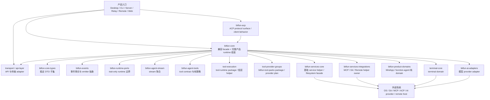
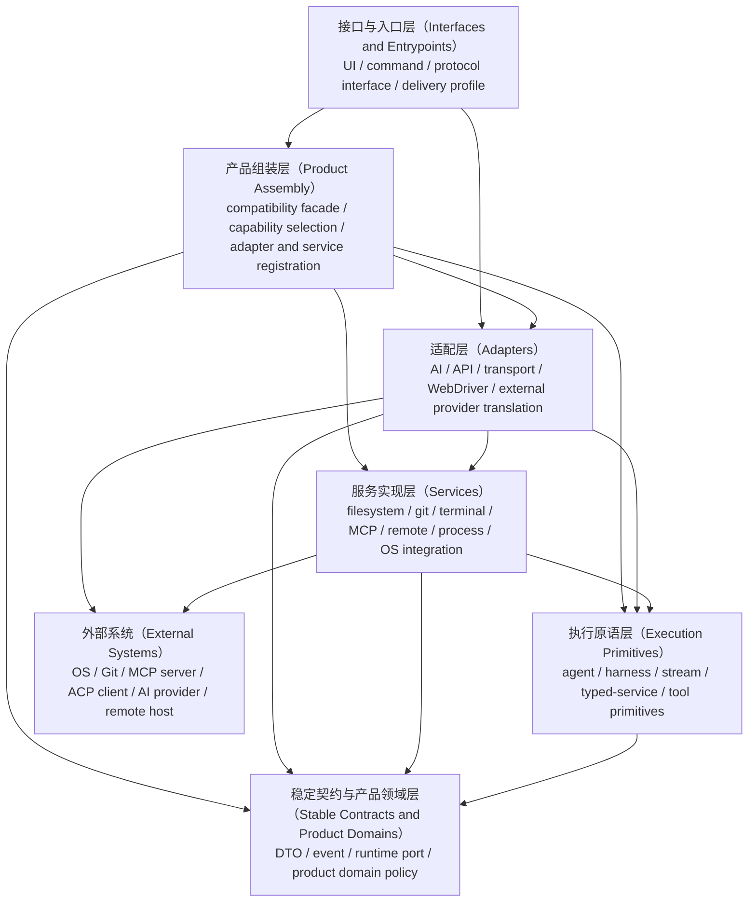
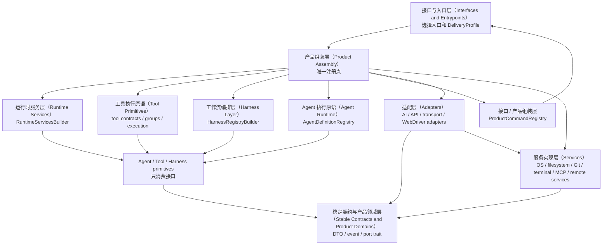

# BitFun Core 拆解架构

本文概括 BitFun core runtime 拆解的两个稳定设计维度：**初始状态**和**目标状态**。
初始状态描述设计建立时的事实架构、耦合关系和主要问题；目标状态描述期望分层、稳定接口、
实现归属、组装边界、依赖方向和风险约束。

本文聚焦设计结论。详细接口、crate 内部模块和测试设计见
[`agent-runtime-services-design.md`](agent-runtime-services-design.md)。

## 1. 背景与目标

设计建立时，BitFun 已经从 `bitfun-core` 中抽出了若干 owner crate，但 `bitfun-core` 仍承担兼容 facade、
完整产品 runtime 组装、agent loop、service 接线、tool materialization 和部分 product domain
adapter。这个形态在功能上可运行，但会让 runtime 拆解持续面临三个问题：

- 产品逻辑、平台接入和具体 service 实现边界不够稳定。
- Desktop、CLI、Server、Remote、ACP、Web 等产品形态容易被完整 `bitfun-core` 牵引。
- Tool、MCP、ACP、subagent、skills、harness 等扩展点缺少统一的分层归属。

目标形态不是在 `bitfun-core` 内继续扩张完整 `AgentRuntime`，而是形成可独立嵌入的
Agent Runtime SDK。稳定契约定义上层可依赖的接口，Product Assembly 负责注册具体实现，
Runtime Services、Tool primitives 和 Harness Layer 分别隔离 service、tool、工作流和产品形态差异。

目标状态必须保持产品行为、默认能力集合、权限语义、工具曝光、事件语义和 release 构建形态等价。

## 2. 架构原则

- 依赖只能从产品入口 / 产品组装流向产品能力、具体适配、服务和执行原语，再流向稳定契约；下层不得感知上层产品形态。
- 接口和实现必须分开：接口属于稳定契约、Runtime Services、Tool primitives 或 Harness contract；
  具体实现属于 Product Assembly 的注册边界、Adapters 或 Services。
- Product interface 可以有差异，capability contract 必须收敛。不同产品入口可以选择不同能力集合，
  但不能通过下沉 UI、命令或协议逻辑来换取复用。
- `bitfun-core` 保留兼容 facade 和 `product-full` 组装边界；新 owner crate 不得依赖回
  `bitfun-core`。
- Hook 是受控扩展点，Event 是事实通知。能改变行为的 hook 必须有顺序、timeout、错误策略和等价保护。
- feature group 是构建边界，CapabilitySet 是产品运行时能力边界；两者必须由 Product Assembly
  显式映射。

## 3. 初始状态逻辑视图

初始状态的核心事实是：多个 crate 已经承接了稳定类型、事件、stream、tool contract、部分 service
helper 和 product domain 纯逻辑，但完整运行时仍以 `bitfun-core` 为中心。

初始状态主要模块范围：

| 模块 | 初始定位 | 架构影响 |
|---|---|---|
| `bitfun-core` | 兼容 facade、agent runtime、tool runtime 组装、service 接线和完整产品能力集合 | 仍是事实上的 runtime owner，拆解必须先保护行为等价 |
| `bitfun-runtime-ports` | 面向 runtime/service 边界的 DTO 和 trait | 只定义 contract，不拥有 runtime 实现 |
| `tool-contracts` / `bitfun-agent-tools` | provider-neutral tool DTO、manifest、path/result policy、catalog contract 和 deterministic execution admission gate | 适合承接纯 tool contract 策略，但不应拥有具体 IO tool |
| `tool-execution` / `tool-runtime` | 既有低层工具执行 helper crate | 目标是只承接低层 file/search/tool execution helper，不拥有产品 registry 或 permission policy |
| `bitfun-services-core` | 基础 service helper、本地 filesystem facade、部分通用 service 逻辑 | 适合作为本地基础 service owner，但不能吸收产品 runtime 语义 |
| `bitfun-services-integrations` | MCP、Git、remote-connect、remote-SSH 等 integration helper | 适合拥有外部协议和重依赖 service implementation，不应反向感知产品 interface |
| `bitfun-product-domains` | MiniApp、function-agent 等纯状态、策略、port 和部分决策逻辑 | 适合承接 pure domain，不应直接执行 filesystem/Git/AI concrete call |
| `bitfun-acp` | ACP protocol interface 和 client behavior | 应保持产品协议入口，不下沉到 Agent Runtime |
| `transport` / `api-layer` | surface 到 runtime 的 API/transport adapter | 应保持传输层，不拥有 runtime owner |

## 4. 初始状态主要问题

### 4.1 分层不清晰

同一能力经常同时包含 UI/command、runtime orchestration、tool execution、service IO 和 domain
decision。初始状态代码中这些部分仍大量通过 `bitfun-core` 串联，导致拆解时难以判断“移动的是接口、
实现、组装逻辑还是产品行为”。

### 4.2 接口与实现边界不稳定

已有 `runtime-ports` 和若干 contract crate，但许多 call site 仍依赖 concrete manager、
core-owned context 或完整 product runtime snapshot。接口没有稳定到足以让 runtime 与具体 service
实现独立演进。

### 4.3 产品形态被完整 core 牵引

Desktop、CLI、Server、Remote、ACP 和 Web 的入口差异较大，但初始状态下大多仍通过完整 `bitfun-core`
获得能力。这会让轻量交付形态继承不必要的 tool、service、UI 或平台依赖。

### 4.4 Tool contract 与 tool execution 混合

provider-neutral manifest、path policy、result policy、`ToolUseContext` runtime handle、collapsed unlock
lifecycle、runtime artifact persistence 和 product registry materialization 在初始状态下与 concrete tool
execution 交织在 core 及其兼容路径中。目标状态下，tool contracts 应拥有 provider-neutral manifest /
catalog / permission / result / artifact contract，core、services 或 adapter 只保留实际 IO tool adapter、
state update、旧路径 facade 和有等价保护的拆解边界。工具 owner 拆解如果没有快照保护，容易改变
prompt-visible manifest、`GetToolSpec`、MCP/ACP catalog 或 oversized result 行为。

### 4.5 Service、MCP、ACP 与 runtime kernel 容易交叉

MCP 和 ACP 是外部协议/能力接入，不应变成 Agent Runtime SDK 的内部协议依赖。Runtime kernel 只应看见
external capability、tool provider 或 service port；连接生命周期、鉴权、transport 和 timeout 策略应由
Adapters、Services 或 Product Assembly 管理。

### 4.6 扩展点缺少统一语义

agent definitions、subagents、skills、prompt modules、tool providers、MCP providers、hooks 和
product commands 都是扩展点，但目前没有统一表达它们分别属于哪一层、如何注册、是否允许改变行为、
以及如何做权限和测试保护。

### 4.7 feature graph 还不是产品能力矩阵

初始状态下，`product-full` 是完整产品能力的安全网，不是最终按产品拆分的 feature matrix。直接减轻默认 feature
或把 feature group 当成产品能力边界，都会引入构建形态和发布能力漂移。

### 4.8 构建与测试牵引过大

重依赖和完整 runtime 聚合在 `bitfun-core` 周围，导致局部测试、owner crate 测试和轻量产品入口容易被
不相关依赖拖入编译和链接路径。目标状态必须让依赖收益可度量，同时不能以牺牲功能等价换取构建收益。

## 5. 对照分析

本节只提炼对 BitFun 分层有用的架构信号，不把其他项目的实现形态直接复制到 BitFun。

### 5.1 Claude Code 相关实现参考

Claude Code 相关 Rust 实现参考中，workspace 将 CLI binary、provider API、runtime、tools、
commands、plugins、telemetry 和 mock harness 拆成不同 crate。其 `runtime` 负责 session、config、
permission、MCP、prompt 和 runtime loop；`tools` 负责 tool specs 与执行；`commands` 负责 slash command
registry；`plugins` 负责 plugin metadata、hook 和 install/enable/disable surfaces。该结构说明：

- 工具规格、命令 surface、plugin/hook 和 runtime loop 可以分开演进。
- permission、MCP lifecycle、task registry、LSP registry 等可作为 runtime/service owner 管理，而不是散落在 UI。
- 如果 runtime crate 同时吸收 session、MCP、permission、prompt 和 tool bridge，也会变成新的重聚合点。

总结：拆分 crate 不是目标本身，关键是让 CLI/TUI、commands、tools、plugins、runtime 和
service integrations 通过稳定 contract 组合，避免把 `bitfun-core` 的聚合问题搬到新的 runtime crate。

### 5.2 Opencode

Opencode 官方文档展示了更偏产品化的扩展模型：同一个 agent 可以运行在 terminal、desktop 或 IDE；
agents 分为 primary agents 和 subagents，可配置 prompt、model 与 tool access；tools 通过 permission 控制，
并可通过 custom tools 或 MCP servers 扩展；plugins 订阅 command、file、permission、session、tool、TUI
等事件；skills 通过独立目录按需发现和加载。

总结：

- Agent、Tool、MCP、Plugin/Hook、Skill 和 Product Surface 应该是互相连接的扩展面，而不是同一个模块内部的分支。
- 权限和工具可见性必须是 runtime 可观测的 contract，不能只存在于 UI 或 prompt 拼接中。
- 多产品形态需要 Product Assembly 做 capability/provider 选择，而不是让 Agent Runtime SDK 判断调用来自
  Desktop、CLI、Remote 还是 ACP。

## 6. 目标逻辑视图

目标架构以六个物理 owner 分区表达依赖方向。`interfaces` 只承载协议和宿主入口；`assembly` 负责产品能力选择与注册；`adapters` 负责协议、transport 和外部 provider 转换；`services` 负责本地系统与 runtime infrastructure 的可复用具体实现；`execution` 只放可移植执行原语；`contracts` 提供稳定事实、port 和产品领域规则。这样可以同时区分“协议适配”和“服务实现”，也避免把 execution 误解为完整运行时实现层。

依赖方向只允许从上到下。接口与入口层暴露产品形态；组装层选择能力集合并注册 adapter/service；适配层翻译协议和外部 provider；服务实现层接触 OS、process、filesystem、git、terminal、MCP 和 remote；执行原语层提供可复用 runtime building blocks；契约层提供稳定事实、port 和产品领域规则。任何下层 crate 反向读取产品入口、组装配置或 host state 都视为边界违规。

## 7. 目标层级

目标层级以物理 owner 分区为入口。每个分区可以包含多个 crate，但 crate 内部职责必须能够通过依赖、测试和边界脚本独立验证。

### 7.1 接口与入口层（Interfaces and Entrypoints）

接口与入口层是用户、协议或外部系统进入 BitFun 的入口，负责 UI、命令、路由、协议接口、交付形态选择和 host integration。对应范围包括 `src/apps/*`、`src/web-ui`、`src/mobile-web`、`BitFun-Installer`、`tests/e2e` 和 `src/crates/interfaces`。入口层可以选择 `DeliveryProfile` 并调用 assembly 或 adapter API，但不拥有共享 runtime 行为。

### 7.2 产品组装层（Product Assembly）

产品组装层负责兼容导出、完整产品能力选择、feature group 到 capability set 的映射、adapter/service 注册和 product-full 接线。物理位置是 `src/crates/assembly`，当前包含 `bitfun-core` 兼容门面和 `bitfun-product-capabilities` 能力模型。`product-capabilities` 只描述 capability id、tool group、service requirement 和 harness selection，不执行 IO，也不承载产品领域状态机。

### 7.3 适配层（Adapters）

适配层负责协议、transport、外部 provider 和宿主通信转换，物理位置是 `src/crates/adapters`。其中 `ai-adapters` 负责 AI provider 请求/响应映射和 provider stream 协议解析，解析结果应转换为 execution 层拥有的统一 stream 契约；`api-layer` 负责产品宿主共用的后端 API adapter，`transport` 负责事件投递和 host transport adapter，`webdriver` 负责 WebDriver 协议和浏览器自动化 adapter。适配层不拥有产品能力选择，也不承载可复用 OS service 实现。

### 7.4 服务实现层（Services）

服务实现层负责接触本地系统和 runtime infrastructure 的可复用具体实现，物理位置是 `src/crates/services`。其中 `services-core` 承载轻量 service primitive，`services-integrations` 承载 MCP、Git、remote、file watch 和产品领域 port 的具体实现，`terminal` 承载 PTY、shell integration 和 terminal session infrastructure。服务实现层可以实现 `contracts`、`execution` 或 `product-domains` 定义的 port，但不选择产品 profile，也不直接暴露 UI/协议入口。

### 7.5 执行原语层（Execution Primitives）

执行原语层提供 provider-neutral 的 runtime building blocks，物理位置是 `src/crates/execution`。`agent-runtime`、`agent-stream`、`harness`、`runtime-services`、`tool-contracts`、`tool-provider-groups` 和 `tool-execution` 分别定义 agent loop facts、统一 stream DTO / tool-call 累积 / replay 契约、workflow descriptor、typed service bundle、tool manifest / permission / result policy、tool group facts 和低层 tool execution helper。当前 Cargo package / lib 名保持兼容，但物理目录按职责命名。它们只能依赖稳定契约或明确的 provider-neutral DTO，不直接创建 Tauri handle、filesystem manager、Git provider、MCP client、AI client 或 host process。

### 7.6 稳定契约与产品领域层（Stable Contracts and Product Domains）

稳定契约与产品领域层是最低层，物理位置是 `src/crates/contracts`。它包含 `core-types`、`events`、`runtime-ports` 和 `product-domains`。`product-domains` 是 Product Domain Model，负责 MiniApp、function-agent 等领域 DTO、纯策略、状态规则和窄 port；具体 Git、filesystem、AI 或 worker execution 实现在 services、adapters 或 assembly/core 的兼容路径中，不得回流到 contracts。

### 7.7 扩展点归属

- AI、API、transport 和 WebDriver 的协议转换属于 Adapters。
- MCP、terminal、filesystem、git、remote 和 file watch 的可复用具体实现属于 Services。
- Tool manifest、permission、execution admission、result / artifact policy 属于 Execution Primitives 的 `tool-contracts`。
- Tool provider group facts 属于 Execution Primitives 的 `tool-provider-groups`；低层 filesystem/search helper 属于 `tool-execution`。
- Agent、subagent、prompt module、scheduler、session / turn facts 和 hook routing 属于 Execution Primitives。
- Harness workflow descriptor 和 route plan 属于 Execution Primitives；具体工作流 IO 留在 Services、Adapters 或兼容路径，直到有等价保护后再迁移。
- Capability pack、delivery profile、adapter/service selection 和 product-full assembly 属于 Product Assembly。
- 产品领域状态、规则、port 和 domain policy 属于 Stable Contracts and Product Domains。

## 8. 接口与实现关系

接口由稳定契约、Runtime Services、Tool Contracts 或 Harness contract 定义；具体实现由 adapter、service 或产品入口创建；注册动作只能发生在 Product Assembly。Agent Runtime、tool contracts、tool execution 和 Harness 只接收已经组装好的接口或 provider registry，不直接创建平台实现。

注册器与前文目标层级的对应关系如下：

| 注册器 / 组装点 | 所属目标层级 | 初始承载与目标承载 | 注册内容 |
|---|---|---|---|
| `ProductAssembler` / `ProductAssemblyPlan` | 产品组装层（Product Assembly） | 初始可在 `bitfun-core` facade 或产品入口；目标可收敛为 assembly owner | `DeliveryProfile`、`CapabilitySet`、feature group、adapter/service 选择 |
| `RuntimeServicesBuilder` | 执行原语层（Execution Primitives）与服务实现层（Services）的边界 | 目标在 `bitfun-runtime-services`；连接 `bitfun-runtime-ports`、`bitfun-services-*` 和初始 service wiring | filesystem、workspace、session store、Git、terminal、network、MCP catalog、remote connection / workspace / projection port |
| `ToolRuntimeBuilder` | 执行原语层（Execution Primitives） | `tool-execution`、`tool-contracts`、`tool-provider-groups`；Cargo package 名保持兼容 | tool provider、tool group、manifest、permission gate、tool hook |
| `HarnessRegistryBuilder` | 工作流编排层（Harness Layer） | 目标在 `bitfun-harness`；初始可由 `bitfun-core::agentic::harness` 注册 legacy-facade provider | SDD、Deep Review、DeepResearch、MiniApp 等 harness provider |
| `AgentDefinitionRegistry` | 执行原语层（Execution Primitives） | 目标在 `bitfun-agent-runtime`；初始可由 `bitfun-core` agent definition 代码承载 | agent、subagent、prompt module、skill definition |
| `ProductCommandRegistry` | 接口与入口层（Interfaces and Entrypoints）与产品组装层（Product Assembly）的边界 | 产品入口或 assembly 模块 | 输入框命令、审核入口、MiniApp 入口到 capability / harness / runtime request 的映射 |
| adapter set | 适配层（Adapters） | `bitfun-ai-adapters`、`bitfun-api-layer`、`bitfun-transport`、`bitfun-webdriver`、app adapters | AI、API、transport、WebDriver 等协议或外部 provider adapter |
| service set | 服务实现层（Services） | `bitfun-services-*`、`terminal-core` 和具体 app service implementations | OS、filesystem、Git、terminal、MCP、remote 的具体 service；Remote service 内部继续区分 SSH、relay、本地隧道、远端 OS 支持 |

注册路径必须是显式、typed、可测试的：

- 接口与入口层（Interfaces and Entrypoints）只选择 `DeliveryProfile` 和产品配置，不直接把 concrete manager 传入 runtime。
- 产品组装层（Product Assembly）根据产品形态创建或接收 adapter/service，并调用 typed builder 完成注册。
- Tool、OS、Remote、Protocol provider 分别留在对应 app、Adapters 或 Services 中，通过同一组 port 暴露。
- Tauri 只能出现在 Desktop app、transport/API adapter 或产品入口命令外观中；Agent Runtime、
  Tool primitives、Harness、Runtime Services contract 和 Product Capabilities 不得依赖 Tauri handle、
  window、command macro 或 desktop app state。
- Remote provider 必须拆分稳定连接接口和具体远端 OS / transport 实现，避免把 SSH、relay 或远端平台差异泄漏到 runtime。
- 不支持的能力在 assembly 的 capability availability 中显式返回 unsupported / unavailable，不在 execution primitive 内写产品分支。
- 禁止使用无类型 `Any` service locator、全局 mutable registry 或下层 crate 反向读取产品配置。

## 9. 风险

| 风险 | 保护方式 |
|---|---|
| 产品组装层（Product Assembly）膨胀为新的全局状态中心 | assembly 只做构建期注册，输出不可变 runtime parts；产品状态仍归 surface 或 runtime owner |
| 接口拆得过细，导致复杂度和动态分发成本上升 | 以 capability 和稳定用例定义 port 粒度，热路径避免运行时 map lookup，优先 builder-time 注入 |
| 平台实现泄漏到 Agent、Tool 或 Harness execution primitives | 依赖检查禁止 execution owner 依赖 app crate、Tauri、CLI TUI、ACP protocol 和 concrete service crate |
| core 拆分后仍隐式绑定 Tauri | Tauri 只允许在 Desktop app 或明确 feature-gated adapter；向下层传递 typed port、DTO、event fact 和 capability availability |
| 不同产品形态能力矩阵漂移 | Product Assembly 维护 capability matrix；减少或替换能力时补产品入口验证和 unsupported 行为测试 |
| Tool、MCP、ACP 的 manifest、permission 或事件语义拆解后不等价 | 保留旧路径兼容 facade，增加 manifest snapshot、permission 决策和事件映射等价测试 |
| Harness provider 只做注册但被误认为已经拥有执行语义 | descriptor-only / legacy-facade provider 只能生成 route plan；执行语义移动必须单独证明行为等价 |
| `bitfun-core` 只是改名为新的巨型 runtime crate | 新 owner crate 必须有单一职责和最小依赖；产品能力、harness、service 实现不得继续堆入 agent kernel |
| 目标 crate 先行创建但没有真实 owner | 只有 owner 边界、旧路径兼容、focused tests、依赖收益和 boundary check 同时成立时才创建 crate；否则继续留在 facade |

## 10. 目标状态判定

- `bitfun-core` 不再是事实上的完整 runtime owner，而是兼容 facade 和 `product-full` 组装边界。
- Agent Runtime、Tool Contracts / Tool Provider Groups / Tool Execution、Runtime Services、Harness 和 Product Capabilities 分别拥有可审查的职责边界。
- 稳定契约和各 execution owner 定义接口；具体 Tool、OS、Remote service 留在 Services，协议和外部 provider 转换留在 Adapters。
- 产品组装层（Product Assembly）是唯一注册点，通过 typed builder / registry 连接接口和具体实现。
- Tauri 只属于 Desktop app 或明确 feature-gated adapter，不进入 core、execution owner 或 contract crate。
- runtime 只依赖 remote connection、remote workspace、remote projection 和 capability facts 等 port；SSH、relay、
  本地隧道、远端 OS 差异和认证方式属于具体 Remote provider。
- 产品形态差异通过 capability matrix 和 Product Assembly 表达，不通过下沉 UI、命令、协议或平台实现表达。
- 权限、工具曝光、事件、session、remote workspace 和 release 构建形态必须保持功能等价。
