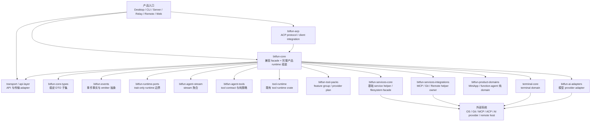
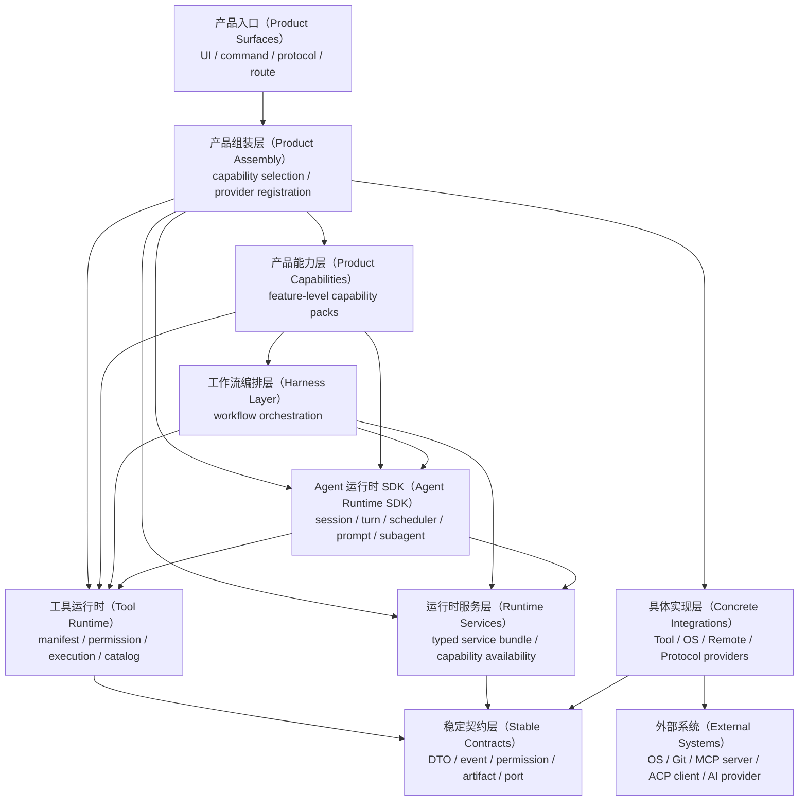
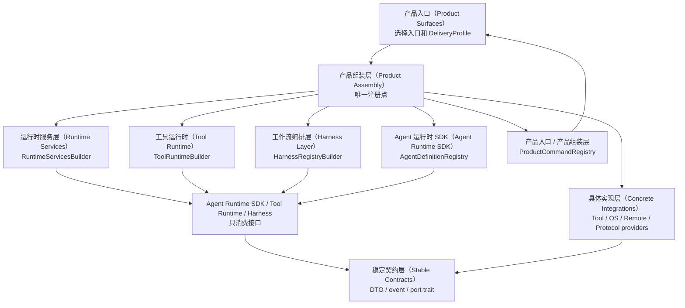

# BitFun Core 拆解架构

本文描述 BitFun 当前 runtime 架构快照、目标分层形态和模块边界。它只回答“系统应该如何分层、
每层负责什么、crate 与能力如何归属”；具体执行顺序、PR 范围和验证命令见
[`core-decomposition-plan.md`](../plans/core-decomposition-plan.md)。详细接口、crate 内部模块和
测试设计见 [`agent-runtime-services-design.md`](agent-runtime-services-design.md)。

## 1. 背景与目标

BitFun 当前已经从 `bitfun-core` 中抽出了若干 owner crate，但 `bitfun-core` 仍承担兼容 facade、
完整产品 runtime 组装、agent loop、service 接线、tool materialization 和部分 product domain
adapter。这个形态在功能上可运行，但会让后续 runtime 迁移持续面临三个问题：

- 产品逻辑、平台接入和具体 service 实现边界不够稳定。
- Desktop、CLI、Server、Remote、ACP、Web 等产品形态容易被完整 `bitfun-core` 牵引。
- Tool、MCP、ACP、subagent、skills、harness 等扩展点缺少统一的分层归属。

目标形态不是在 `bitfun-core` 内继续扩张完整 `AgentRuntime`，而是形成可独立嵌入的
Agent Runtime SDK。稳定契约定义上层可依赖的接口，Product Assembly 负责注册具体实现，
Runtime Services、Tool Runtime 和 Harness Layer 分别隔离 service、tool、工作流和产品形态差异。

迁移期间不得改变产品行为、默认能力集合、权限语义、工具曝光、事件语义或 release 构建形态。

## 2. 架构原则

- 依赖只能从产品层流向 runtime 层，再流向 contract 层；下层不得感知上层产品形态。
- 接口和实现必须分开：接口属于稳定契约、Runtime Services、Tool Runtime 或 Harness contract；
  具体实现属于 Product Assembly 或具体实现层。
- Product Surface 可以有差异，capability contract 必须收敛。不同产品入口可以选择不同能力集合，
  但不能通过下沉 UI、命令或协议逻辑来换取复用。
- `bitfun-core` 在迁移期保留 facade 和 `product-full` 组装点；新 owner crate 不得依赖回
  `bitfun-core`。
- Hook 是受控扩展点，Event 是事实通知。能改变行为的 hook 必须有顺序、timeout、错误策略和等价保护。
- feature group 是构建边界，CapabilitySet 是产品运行时能力边界；两者必须由 Product Assembly
  显式映射。

## 3. 现状逻辑视图

当前架构的核心事实是：多个 crate 已经承接了稳定类型、事件、stream、tool contract、部分 service
helper 和 product domain 纯逻辑，但完整运行时仍以 `bitfun-core` 为中心。

当前主要模块范围：

| 模块 | 当前定位 | 架构影响 |
|---|---|---|
| `bitfun-core` | 兼容 facade、agent runtime、tool runtime 组装、service 接线和完整产品能力集合 | 仍是事实上的 runtime owner，迁移必须先保护行为等价 |
| `bitfun-runtime-ports` | 面向 runtime/service 边界的 DTO 和 trait | 只定义 contract，不拥有 runtime 实现 |
| `bitfun-agent-tools` | provider-neutral tool DTO、manifest、path/result policy、catalog contract 和 deterministic execution admission gate | 已适合承接纯 tool runtime 策略，但不应拥有具体 IO tool |
| `tool-runtime` | 既有工具执行相关 crate | 目标是继续收敛 provider registry、permission gate 和 execution pipeline |
| `bitfun-services-core` | 基础 service helper、本地 filesystem facade、部分通用 service 逻辑 | 适合作为本地基础 service owner，但不能吸收产品 runtime 语义 |
| `bitfun-services-integrations` | MCP、Git、remote-connect、remote-SSH 等 integration helper | 适合拥有外部协议和重依赖 adapter，不应反向感知产品 surface |
| `bitfun-product-domains` | MiniApp、function-agent 等纯状态、策略、port 和部分决策逻辑 | 适合承接 pure domain，不应直接执行 filesystem/Git/AI concrete call |
| `bitfun-acp` | ACP protocol 和 client integration | 应保持 external capability owner，不下沉到 Agent Runtime SDK |
| `transport` / `api-layer` | surface 到 runtime 的 API/transport adapter | 应保持传输层，不拥有 runtime owner |

## 4. 当前主要问题

### 4.1 分层不清晰

同一能力经常同时包含 UI/command、runtime orchestration、tool execution、service IO 和 domain
decision。当前代码中这些部分仍大量通过 `bitfun-core` 串联，导致后续迁移时难以判断“移动的是接口、
实现、组装逻辑还是产品行为”。

### 4.2 接口与实现边界不稳定

已有 `runtime-ports` 和若干 contract crate，但许多 call site 仍依赖 concrete manager、
core-owned context 或完整 product runtime snapshot。接口没有稳定到足以让 runtime 与具体 service
实现独立演进。

### 4.3 产品形态被完整 core 牵引

Desktop、CLI、Server、Remote、ACP 和 Web 的入口差异较大，但当前大多仍通过完整 `bitfun-core`
获得能力。这会让轻量交付形态继承不必要的 tool、service、UI 或平台依赖。

### 4.4 Tool contract 与 tool execution 混合

provider-neutral manifest、path policy、result policy 已部分外移，但 concrete tool execution、
`ToolUseContext`、collapsed unlock state、runtime artifact persistence 和产品 catalog 仍在 core。
工具迁移如果没有快照保护，容易改变 prompt-visible manifest、`GetToolSpec`、MCP/ACP catalog 或
oversized result 行为。

### 4.5 Service、MCP、ACP 与 runtime kernel 容易交叉

MCP 和 ACP 是外部协议/能力接入，不应变成 Agent Runtime SDK 的内部协议依赖。Runtime kernel 只应看见
external capability、tool provider 或 service port；连接生命周期、鉴权、transport 和 timeout 策略应由
integration owner 或 Product Assembly 管理。

### 4.6 扩展点缺少统一语义

agent definitions、subagents、skills、prompt modules、tool providers、MCP providers、hooks 和
product commands 都是扩展点，但目前没有统一表达它们分别属于哪一层、如何注册、是否允许改变行为、
以及如何做权限和测试保护。

### 4.7 feature graph 还不是产品能力矩阵

`product-full` 当前是完整产品能力的安全网，不是最终按产品拆分的 feature matrix。直接减轻默认 feature
或把 feature group 当成产品能力边界，都会引入构建形态和发布能力漂移。

### 4.8 构建与测试牵引过大

重依赖和完整 runtime 聚合在 `bitfun-core` 周围，导致局部测试、owner crate 测试和轻量产品入口容易被
不相关依赖拖入编译和链接路径。中间阶段不保证每个 PR 都变快，但目标架构必须让依赖收益可度量。

## 5. 对照分析

本节只提炼对 BitFun 分层有用的架构信号，不把其他项目的实现形态直接复制到 BitFun。

### 5.1 Claude Code 相关实现参考

Claude Code 相关 Rust 实现参考中，workspace 将 CLI binary、provider API、runtime、tools、
commands、plugins、telemetry 和 mock harness 拆成不同 crate。其 `runtime` 负责 session、config、
permission、MCP、prompt 和 runtime loop；`tools` 负责 tool specs 与执行；`commands` 负责 slash command
registry；`plugins` 负责 plugin metadata、hook 和 install/enable/disable surfaces。该结构说明：

- 工具规格、命令 surface、plugin/hook 和 runtime loop 可以分开演进。
- permission、MCP lifecycle、task registry、LSP registry 等可作为 runtime/service owner 管理，而不是散落在 UI。
- 如果 runtime crate 同时吸收 session、MCP、permission、prompt 和 tool bridge，也会变成新的重聚合点。

总结：拆分 crate 不是目标本身，关键是让 CLI/TUI、commands、tools、plugins、runtime 和
service integrations 通过稳定 contract 组合，避免把 `bitfun-core` 的聚合问题搬到新的 runtime crate。

### 5.2 Opencode

Opencode 官方文档展示了更偏产品化的扩展模型：同一个 agent 可以运行在 terminal、desktop 或 IDE；
agents 分为 primary agents 和 subagents，可配置 prompt、model 与 tool access；tools 通过 permission 控制，
并可通过 custom tools 或 MCP servers 扩展；plugins 订阅 command、file、permission、session、tool、TUI
等事件；skills 通过独立目录按需发现和加载。

总结：

- Agent、Tool、MCP、Plugin/Hook、Skill 和 Product Surface 应该是互相连接的扩展面，而不是同一个模块内部的分支。
- 权限和工具可见性必须是 runtime 可观测的 contract，不能只存在于 UI 或 prompt 拼接中。
- 多产品形态需要 Product Assembly 做 capability/provider 选择，而不是让 Agent Runtime SDK 判断当前是
  Desktop、CLI、Remote 还是 ACP。

## 6. 目标逻辑视图

目标架构以层级为入口描述系统。每层只暴露本层 contract，具体实现由上层组装或下层 integration 提供。

## 7. 目标层级

目标层级以职责边界为入口。每层可以由多个 crate 承载，关键判断标准是依赖方向、接口归属和实现归属是否清楚。

### 7.1 产品入口（Product Surfaces）

产品入口（Product Surfaces）是用户、协议或外部系统进入 BitFun 的入口，负责展示、路由、协议适配和命令外观。
它不拥有共享 runtime 行为，只把请求转换为 capability、runtime request 或 transport DTO。
对应范围是 `src/apps/*`、`src/web-ui` 和 `src/mobile-web`，这些入口可以有形态差异，但差异不能下沉到 runtime。

### 7.2 产品组装层（Product Assembly）

产品组装层（Product Assembly）是唯一的组装入口，负责选择产品能力、tool pack、harness pack、agent definition、
command provider 和 service provider，并把具体实现注册到稳定接口。迁移期它可以留在 `bitfun-core`
facade 或产品入口中，目标形态可以收敛为独立 assembly crate 或清晰的 facade 模块。

### 7.3 产品能力层（Product Capabilities）

产品能力层（Product Capabilities）描述 Code Agent、Deep Review、DeepResearch、MiniApp、Remote Control、MCP App、
Computer Use 等能力的组合边界。它负责定义一个产品能力需要哪些 agent、tool、harness、domain policy
和 service capability，不负责 UI，也不直接执行 IO。当前主要落在 `bitfun-product-domains` 和
`bitfun-core` 的能力组装代码中，后续应收敛为 capability pack 和 domain policy。

### 7.4 工作流编排层（Harness Layer）

工作流编排层（Harness Layer）承载多步骤工作流和策略编排，例如 SDD、Deep Review、DeepResearch、MiniApp 生成或更新流程。
它可以调用 Agent Runtime SDK、Tool Runtime 和 Runtime Services，但不拥有 session manager 内部状态、
具体 filesystem/Git/terminal manager 或产品 UI。`bitfun-harness` 已承接 workflow descriptor、legacy route plan
和 provider registry contract；当前 Deep Review、DeepResearch、MiniApp 仍通过 legacy-facade provider
指向既有 core/product 执行路径，concrete workflow execution 尚未外移。

### 7.5 Agent 运行时 SDK（Agent Runtime SDK）

Agent 运行时 SDK（Agent Runtime SDK）是可嵌入的 agent kernel，负责 session、turn、scheduler、prompt loop、subagent、
background task、permission coordination 和 runtime events。它只依赖稳定契约、tool runtime 和注入的
service ports，不感知 Desktop、CLI、Remote、ACP、Tauri 或 Web UI。当前主体仍在 `bitfun-core`，
但 `bitfun-agent-runtime` 已开始承接可独立构建的 scheduler/background delivery 纯决策；concrete
scheduler lifecycle、session manager、prompt loop 和 subagent registry 仍未外移。

### 7.6 工具运行时（Tool Runtime）

工具运行时（Tool Runtime）负责工具 manifest、catalog、permission gate、execution pipeline、tool hook 和结果归一化。
它只消费 `ToolExecutionServices` 这类窄 service 视图，不直接创建 filesystem、Git、terminal、MCP 等具体实现。
当前相关 crate 包括 `tool-runtime`、`bitfun-agent-tools`、`bitfun-tool-packs` 以及 `bitfun-core`
中的 tool materialization 代码。deterministic execution admission gate 已由 `bitfun-agent-tools` 承接；
`GetToolSpecTool` concrete adapter 已收敛到 `bitfun-core` 的 product runtime owner。`bitfun-core`
的 pipeline 仍负责状态更新、registry lookup、input validation、confirmation、实际执行和 hook。

### 7.7 运行时服务层（Runtime Services）

运行时服务层（Runtime Services）是 runtime 可消费的 typed service bundle 和 capability availability 层。它提供
filesystem、workspace、session store、Git、terminal、network、MCP catalog、remote connection / projection
等端口，不执行产品命令，
不作为无类型 service locator，也不创建平台实现。当前相关 crate 包括 `bitfun-runtime-ports`、
`bitfun-runtime-services`、`bitfun-services-core`、`bitfun-services-integrations` 和 `bitfun-core` 中的 service 接线代码。

### 7.8 具体实现层（Concrete Integrations）

具体实现层拥有外部系统连接和重依赖，但它不是一个混合大筐，需要按实现类型保持边界：
Tool 实现器负责具体 tool provider 和 tool pack；OS 实现器负责 filesystem、terminal、process、network、
environment 等平台能力；协议实现器负责 MCP、ACP、AI provider、Git 等外部协议；Remote 实现器负责 remote
connection、remote workspace projection 和 remote host capability。

Remote 不应作为 Agent Runtime SDK 的内部能力，也不应只按 Desktop/CLI 入口区分。它的稳定接口应拆为
remote connection、remote workspace、remote filesystem/terminal projection、remote capability facts 等 port；
SSH、relay、本地隧道、远端 OS 差异和认证方式属于具体 Remote provider，由 Product Assembly 按产品形态注册。
当前相关 crate 包括 `bitfun-services-*`、`bitfun-ai-adapters`、`terminal-core`、`bitfun-acp` 和 app adapters。

### 7.9 稳定契约层（Stable Contracts）

稳定契约层提供跨层共享的数据结构和接口语言，包括 DTO、event、permission facts、artifact refs、identity
和 port traits。它只描述事实和能力，不包含 IO、网络、进程、UI、runtime manager 或产品策略。当前相关
crate 包括 `bitfun-core-types`、`bitfun-events` 和 `bitfun-runtime-ports`。
当前 remote workspace facts、remote session metadata、remote workspace file projection DTO 和 remote workspace/projection
host trait 已归入 `bitfun-runtime-ports`，`bitfun-services-integrations::remote_connect` 保留旧路径 re-export。

## 8. 接口与实现关系

接口由稳定契约、Runtime Services、Tool Runtime 或 Harness contract 定义；具体实现由产品入口或具体实现层创建；
注册动作只能发生在 Product Assembly。Agent Runtime SDK、Tool Runtime 和 Harness 只接收已经组装好的接口或
provider registry，不直接创建平台实现。

注册器与前文目标层级的对应关系如下：

| 注册器 / 组装点 | 所属目标层级 | 目标或迁移期模块 | 注册内容 |
|---|---|---|---|
| `ProductAssembler` / `ProductAssemblyPlan` | 产品组装层（Product Assembly） | 迁移期在 `bitfun-core` facade 或产品入口；目标可收敛为 assembly owner | `DeliveryProfile`、`CapabilitySet`、feature group、provider 选择 |
| `RuntimeServicesBuilder` | 运行时服务层（Runtime Services） | `bitfun-runtime-services` PR1 基础壳层；迁移期连接 `bitfun-runtime-ports`、`bitfun-services-*` 和 `bitfun-core` service wiring | filesystem、workspace、session store、Git、terminal、network、MCP catalog、remote connection / workspace / projection port |
| `ToolRuntimeBuilder` | 工具运行时（Tool Runtime） | `tool-runtime`、`bitfun-agent-tools`、`bitfun-tool-packs` | tool provider、tool pack、manifest、permission gate、tool hook |
| `HarnessRegistryBuilder` | 工作流编排层（Harness Layer） | `bitfun-harness`；迁移期由 `bitfun-core::agentic::harness` 注册 legacy-facade provider | SDD、Deep Review、DeepResearch、MiniApp 等 harness provider |
| `AgentDefinitionRegistry` | Agent 运行时 SDK（Agent Runtime SDK） | 目标 `bitfun-agent-runtime`；迁移期在 `bitfun-core` agent definition 代码中 | agent、subagent、prompt module、skill definition |
| `ProductCommandRegistry` | 产品入口（Product Surfaces）与产品组装层（Product Assembly）的边界 | 产品入口或 assembly 模块 | 输入框命令、审核入口、MiniApp 入口到 capability / harness / runtime request 的映射 |
| concrete provider set | 具体实现层（Concrete Integrations） | `bitfun-services-*`、`bitfun-ai-adapters`、`terminal-core`、`bitfun-acp`、app adapters | Tool、OS、Remote、Protocol 的具体 provider；Remote provider 内部继续区分 SSH、relay、本地隧道、远端 OS 支持 |

注册路径必须是显式、typed、可测试的：

- 产品入口（Product Surfaces）只选择 `DeliveryProfile` 和产品配置，不直接把 concrete manager 传入 runtime。
- 产品组装层（Product Assembly）根据产品形态创建或接收具体 provider，并调用 typed builder 完成注册。
- Tool、OS、Remote、Protocol provider 分别留在对应 app 或 integration owner 中，通过同一组 port 暴露。
- Remote provider 必须拆分稳定连接接口和具体远端 OS / transport 实现，避免把 SSH、relay 或远端平台差异泄漏到 runtime。
- 不支持的能力在 assembly 的 capability availability 中显式返回 unsupported / unavailable，不在 runtime 内写产品分支。
- 禁止使用无类型 `Any` service locator、全局 mutable registry 或下层 crate 反向读取产品配置。

## 9. 风险

| 风险 | 保护方式 |
|---|---|
| 产品组装层（Product Assembly）膨胀为新的全局状态中心 | assembly 只做构建期注册，输出不可变 runtime parts；产品状态仍归 surface 或 runtime owner |
| 接口拆得过细，导致复杂度和动态分发成本上升 | 以 capability 和稳定用例定义 port 粒度，热路径避免运行时 map lookup，优先 builder-time 注入 |
| 平台实现泄漏到 Agent Runtime SDK、Tool Runtime 或 Harness | 依赖检查禁止 runtime owner 依赖 app crate、Tauri、CLI TUI、ACP protocol 和 concrete service crate |
| 不同产品形态能力矩阵漂移 | Product Assembly 维护 capability matrix；减少或替换能力时补产品入口验证和 unsupported 行为测试 |
| Tool、MCP、ACP 的 manifest、permission 或事件语义迁移后不等价 | 保留旧路径兼容 facade，增加 manifest snapshot、permission 决策和事件映射等价测试 |
| Harness provider 只做注册但被误认为已经迁移执行语义 | PR4 阶段 provider 只生成 legacy route plan，execute 明确返回 unsupported；后续执行迁移必须单独证明行为等价 |
| `bitfun-core` 只是改名为新的巨型 runtime crate | 新 owner crate 必须有单一职责和最小依赖；产品能力、harness、service 实现不得继续堆入 agent kernel |
| 目标 crate 先行创建但没有真实 owner | 只有 owner 边界、旧路径兼容、focused tests、依赖收益和 boundary check 同时成立时才创建 crate；否则继续留在 facade |

## 10. 总结

- 当前架构影响：`bitfun-core` 从事实上的完整 runtime owner 收缩为兼容 facade 和迁移期组装点；Agent Runtime SDK、
  Tool Runtime、Runtime Services、Harness 和 Product Capabilities 分别成为可审查的 owner。
- 接口与实现边界：稳定契约和各 runtime owner 定义接口，具体 Tool、OS、Remote、Protocol provider 留在具体实现层，
  由产品组装层（Product Assembly）通过 typed builder / registry 注册。
- Remote 拆分方向：runtime 只依赖 remote connection、remote workspace、remote projection 和 capability facts 等
  port；SSH、relay、本地隧道、远端 OS 差异和认证方式属于具体 Remote provider。
- 后续工作范围：抽出可独立构建的 runtime kernel；把 service、tool、harness 和 product capability 改为 typed
  provider 注册；建立产品形态与 capability matrix 的对应关系。
- 质量保护：用等价测试保护权限、工具曝光、事件、session、remote workspace 和构建形态不发生功能偏移。
- 非目标：不改变默认产品能力、命令语义、权限策略或 release 构建形态。
