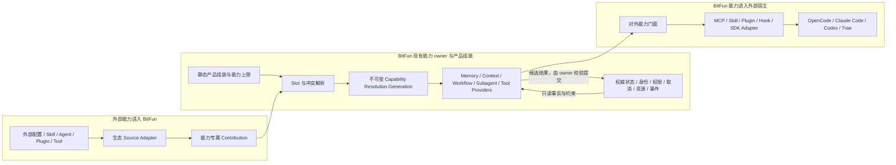

# BitFun 能力装配、SDK 与外部宿主集成设计

本文定义 BitFun 如何把记忆、上下文、工作流、Subagent、工具和调度策略做成可装配能力，以及这些能力如何在
不修改外部产品内核的前提下接入 OpenCode、Claude Code、Codex、Trae 等宿主。本文同时约束反向路径：外部
配置、插件和能力如何进入 BitFun。

仓库级依赖方向、接口切面和产品形态以[产品运行时架构](../product-architecture.md)为准；Agent Runtime SDK、
运行时服务、工具和工作流归属见[智能体内核与运行时服务](../agent-runtime-services-design.md)；第三方进程可靠性见
[插件运行时主机](plugin-runtime-host-design.md)；外部来源的发现、确认和产品体验见
[外部 AI 工作内容](external-ai-work-sources-design.md)；OpenCode 的具体兼容承诺见
[OpenCode 扩展兼容总览](opencode-extension-compatibility.md)。

本文是目标设计和演进约束，不表示已存在一个通用 `CapabilityRuntime` crate、稳定公共 SDK、跨宿主插件包或下文
所有 Provider 接口。只有真实消费方、独立版本边界和端到端验证同时成立的接口才能进入公开面。

## 1. 设计结论、目标与非目标

BitFun 采用“一个能力核心，多种宿主适配”的方向，而不是试图发布一个能直接安装到所有产品的相同插件包：

1. **BitFun 内部装配**：产品组装选择已编译能力、Provider/factory 和能力上限；运行时能力 owner 消费不可变静态组装结果，并维护自己的不可变 Resolution Generation。
2. **外部能力进入 BitFun**：生态 adapter 保留外部来源、顺序和行为，再转换成 BitFun 能力专属贡献。
3. **BitFun 能力进入外部产品**：对外能力门面暴露窄用例，MCP、Skill、Plugin、Hook 或 SDK adapter 再映射到具体宿主。
4. **以外部 Runtime 组装新产品**：Claude Agent SDK、Codex App Server、OpenCode Server 等可成为新产品的执行内核，
   但这不等于替换原 Claude Code、Codex 或 OpenCode 产品中的内核模块。

目标：

- 允许记忆、上下文贡献、压缩策略、工作流、Subagent 定义、工具提供方和部分调度策略独立替换或组合。
- 保持会话/轮次身份、状态提交、权限上限、取消、资源额度、事件因果和审计只有一个权威 owner。
- 对外按宿主真实扩展面提供能力，不把 SDK 控制面、产品插件和源码级定制混成同一兼容结论。
- 让每个阶段只交付一条可观察纵向路径；未实现项明确降级，不阻塞已完成能力。
- 用户可以理解能力来源、当前状态、覆盖关系、风险、成本和恢复动作。

非目标：

- 不定义跨 OpenCode、Claude Code、Codex、Trae 的通用插件 manifest 或 Hook ABI。
- 不建立一个可以定位任意服务、任意状态和任意生态对象的全局服务定位器。
- 不开放第三方代码替换权限 owner、状态机、审计、取消树、资源硬上限或产品身份。
- 不设计跨 GUI/TUI 的通用组件协议，不承诺把外部原始 UI 组件树直接运行在 BitFun。
- 不承诺跨宿主完整迁移私有 transcript、文件系统快照、凭据、进程、终端或未文档化状态。
- 不复制完整 OpenCode Server、Claude Code 或 Codex 产品协议来证明插件兼容。
- 不为了覆盖竞品矩阵同时实现全部 Memory、Workflow、Hook、Subagent、Server 和 Remote 能力。

## 2. 能力分类与可替换边界

“模块可拆卸”不等于“所有事实都可以被替换”。能力按下表分为实现、策略、贡献和内核事实：

| 领域 | 可装配或替换 | 必须由现有 owner 保持权威 |
|---|---|---|
| Memory | 存储实现、检索器、排序器、写入候选处理器、保留策略 | 记忆来源、作用域、版本、删除/撤销事实、权限、审计和注入决策 |
| Context | 上下文贡献器、预算分配策略、相关性排序、压缩 Provider | 会话历史、当前轮次、禁止字段、最终上下文提交、token/成本事实 |
| Workflow / Harness | 工作流 Provider、计划、步骤和结果处理器 | Run 身份、状态转换、取消、恢复、产物引用和资源上限 |
| Subagent | 定义、角色、模型/工具候选、委派策略、结果聚合器 | 父子 lineage、权限上限、并发额度、取消传播、递归保护和结果交付 |
| Tool | 内置、MCP、插件和接口 Tool Provider；名称解析和展示可按明确规则组合 | 最终 schema 校验、调用时权限、执行身份、结果状态、产物和副作用审计 |
| Model routing | Provider adapter、候选排序、成本/质量偏好和 fallback 策略 | 可用模型事实、组织上限、凭据归属、用量/成本记账和最终调用身份 |
| Scheduler | 优先级、权重、候选排序和公平性策略 | admission、队列容量、硬并发上限、deadline、取消和 stale result 拒绝 |
| Hook / Event | 类型化变换器、验证器、Observer、Telemetry Processor | Hook 顺序规则、超时、最终状态提交、事件身份、因果链和保留策略 |

每类装配点必须声明一种组合语义，不能依赖一个全局优先级解释所有冲突：

| Slot 模式 | 适用场景 | 规则 |
|---|---|---|
| `exclusive` | 主 Session Store、最终 Compactor 等只能有一个 active owner 的能力 | 组装时选出一个 Provider；运行时不允许两个实现双写。 |
| `ordered-chain` | Context Transformer、Prompt/Tool Hook、验证器 | 顺序由能力 owner 或生态 adapter 明确；每步校验，失败策略类型化。 |
| `namespace-union` | Tools、Commands、Agents | 先按来源限定身份保留候选，再按名称和作用域解析；同名不静默跨生态覆盖。冲突界面先列 BitFun、再按稳定 provider 身份列其他生态，但展示顺序不自动决定胜者。 |
| `ordered-namespace` | 现有 Skill 根 | 保留来源限定身份并按 Skill Registry 已发布的根顺序解析同名项；被覆盖项继续可见。来源元数据只用于解释结果，不参与重新排序。 |
| `fallback` | Memory Retriever、模型 Provider、外部服务 | 只对声明为可恢复的错误切换；权限拒绝、取消和副作用不自动 fallback。 |
| `fan-out` | 只读事件 Observer、运维遥测 | Observer 互相隔离；不能阻塞或改变权威业务结果。 |

新增 Slot 的门槛：

1. 已有一个权威 owner 和真实调用路径。
2. 出现第二个真实实现或外部消费者，现有结构已经无法清楚表达。
3. 已定义组合、错误、取消、状态、权限、降级和退场语义。
4. 可以用一条纵向测试证明替换后没有第二个状态 owner。

因此不会先创建 `MemoryProviderRegistry`、`ContextProviderRegistry` 等一整套公共对象，再等待未来调用方填充。

## 3. 逻辑架构与双向数据流



上图是职责关系，不要求新增一个大而全的运行时服务。对应职责继续分布在现有 owner：

BitFun 自身 GUI、TUI/CLI、Server、Remote 和 Agent Runtime SDK 继续消费产品组装后的能力服务、只读视图或
Runtime 接口，不经过对外能力门面。只有某个具体 DTO 同时出现真实内外部消费者并满足独立版本要求时，才评审
共享该 DTO；不能让内部入口与外部宿主共享整个 facade。

| 部分 | 负责 | 不负责 |
|---|---|---|
| 能力 owner | 定义该能力的稳定事实、Slot 语义、最终校验和状态提交 | 解释外部产品格式或管理 UI。 |
| Product Assembly | 选择已编译 Provider/factory 和 Slot 支持、验证依赖与产品上限、生成静态产品组装结果 | 发现动态用户来源、执行插件、保存 active Capability Resolution Generation 或成为运行中可变注册表。 |
| 能力 owner / 生命周期协调器 | 在静态产品上限内解析动态候选、冲突和当前策略，生成不可变 Capability Resolution Generation | 重新选择 Delivery Profile、修改产品定义或解释兄弟生态格式。 |
| Source Adapter | 保留单一生态的来源、格式、顺序、错误和生命周期语义 | 定义跨生态最低公分母或直接提交 BitFun 权威状态。 |
| Plugin Runtime Host | 监督第三方调用的期限、取消、队列、逻辑 target 健康和迟到响应，并投影执行服务事实 | 成为物理进程事实 owner、公共 SDK、来源优先级 owner 或产品能力 owner。 |
| 对外能力门面 | 暴露真实消费者需要的窄用例、只读状态、事件和类型化错误 | 暴露内部 manager、插件 Host ABI、任意服务查找或产品 UI。 |
| Host Adapter | 把门面映射为某宿主的 MCP、Skill、Plugin、Hook、SDK 或 Server 调用 | 声称突破宿主未提供的生命周期、状态或替换能力。 |

当前外部 Subagent 输入切片落实了上述边界：`contracts/product-domains` 只定义来源无关的 Subagent contribution、
provenance、兼容状态、摘要和冲突契约；OpenCode adapter 独立维护本生态来源与字段语义；生命周期协调器隔离 provider
失败并发布不可变候选；现有 AgentRegistry/Task owner 再解析模型、工具、权限上限和同名路由。产品主体不读取
OpenCode 类型，也不通过统一 agent JSON 理解未来 Codex/Claude Code。

fresh external invocation 在 admission 前绑定逻辑名到 runtime generation，并把 generation lease 传入前台或后台
调度请求。来源更新或撤下只改变后续 admission，不修改已接受调用的 prompt/model/tool 绑定；安全策略收紧仍由现有
owner 按原规则优先执行。当前外部 Subagent 不支持 session follow-up，结果与管理 surface 必须明确标为 single-run，
不能用持久化 session 绕过重新审批或 generation 解析。

对外能力门面不等于 Agent Runtime SDK 的全部接口。SDK 可以包含构建与运行 Agent 所需的底层能力；宿主 adapter
只消费当前场景需要的最小子集。外部产品只需要调用一个 BitFun workflow 时，不应被迫嵌入完整 Agent Runtime。

### 3.1 宿主 adapter 的产品交付生命周期

真实导出切片必须指定一个现有产品特性或产品入口作为交付 owner；在首个切片出现前，不创建跨宿主安装器、
manifest、插件商店或通用生命周期 manager。外部宿主/包管理器仍是物理安装状态的权威来源，BitFun 只保存自己的
期望状态、宿主映射和对账结果，不伪造“已安装/已卸载”。Host Adapter 负责把以下操作映射到单一宿主，但不保存
第二份权威状态：

- 分发单元和校验版本，以及用户/组织/工作区/项目的注册作用域。
- `install/register -> enable -> invoke -> disable -> uninstall -> restore` 的可观察结果和类型化错误。
- 升级前兼容检查、失败后沿用上一合规版本或显式回滚；不把准备完成当成已生效。
- `disable` 先阻止 BitFun 发起的新调用并撤下宿主贡献；若宿主仍报告生效，状态保持需处理而非静默成功。
- `uninstall` 只清理该 adapter 拥有的包、注册项、sidecar、缓存和凭据引用；删除用户/宿主数据需要单独确认。
- BitFun 被移除、宿主升级或 adapter 崩溃后的恢复/清理入口，以及无法自动清理时的精确人工步骤。

能力 owner 继续只负责用例和权威运行时事实，Plugin Runtime Host 继续只负责第三方导入执行；二者都不接管宿主
分发生命周期。

## 4. 身份、状态与持久化

### 4.1 身份

跨宿主调用至少需要区分以下身份事实；字段名称仅说明语义，不提前冻结公共 DTO：

- 能力身份：稳定 Capability ID 与能力契约版本。
- Provider 身份：实现 ID、来源限定身份和内容版本；跨 Generation 保持可追踪。
- 调用绑定身份：Capability Resolution Generation、scope 和执行域，用于 fencing，不并入稳定 Provider 身份。
- 作用域：产品、用户、组织、工作区、项目、会话或单次运行。
- 执行身份：本地/Remote 执行域、实际用户、工作目录和平台能力。
- 运行身份：session、turn、workflow run、subagent、tool call、hook call。
- 宿主映射：BitFun 身份与外部 host session/thread/task/tool-use ID 的可选映射。

外部 ID 只能作为映射事实，不能取代 BitFun 自己的 session/turn/run 身份。一个 Claude/Codex/OpenCode session
映射失败时，可以降级为无恢复的一次调用，不能伪造已建立双向持久会话。

### 4.2 状态权威

同一能力需要区分以下事实，避免“文件被发现”直接变成“能力可用”：

```text
desired     用户、产品或组织希望启用什么
prepared    哪个候选已经完成解析、依赖准备或隔离加载
active      当前新调用绑定哪个不可变代次
effective   结合产品上限、权限、宿主能力和健康后真正可调用的结果
observed    UI、SDK 和遥测看到的只读投影
```

- 每个事实只有一个 owner；其他模块通过命令或提案请求变更，通过只读投影消费结果。
- Adapter、Plugin、Hook 和外部 SDK 客户端不能直接写 `active/effective`。
- UI 隐藏、宿主菜单缺失或插件配置未加载不等于后端能力已停用。
- 一级用户状态继续复用外部来源文档中的“已发现、已应用、可用、需确认、更新中、沿用上一版本、部分受限、
  暂时过期、已移除/已停用、不可用”，内部 `ready/draining/restarting` 只作为详情。

### 4.3 Generation、租约与迟到结果

每次可执行来源、动态 Provider 集合或关键运行时策略变化，由对应能力 owner/生命周期协调器生成候选 Capability
Resolution Generation；这不是重新执行 Product Assembly，也不把动态来源加入产品组装输入：

1. 在后台解析、准备并验证候选。
2. 比较 Provider、权限、执行包络、事件和可见贡献差异。
3. 在安全边界原子切换新调用。
4. 在途调用持有旧 Generation 租约，按原期限完成或被取消。
5. 已退出 Generation 的迟到响应携带旧身份并被拒绝，不得写入新状态。

明确删除、撤销、停用或权限收紧必须阻止新调用并撤下旧贡献；候选升级失败只有在旧 Generation 仍健康且符合当前
策略时才能继续服务。缓存是恢复手段，不是绕过用户意图或安全策略的授权。

### 4.4 持久化与 fork

- Session transcript、文件系统、终端、进程、外部服务和凭据是不同状态域，不能因为会话可 resume/fork 就宣称
  工作空间已经快照或回滚。
- Provider 持久化必须有 schema/version、来源、scope、generation 和删除语义；禁止多个 Provider 双写同一事实。
- Memory 条目必须保留 provenance、作用域、创建/更新时间、失效/删除状态和可选置信信息；压缩摘要不能覆盖原始
  权威 transcript。
- Remote 断线后先重新协商执行域、宿主能力和 active Capability Resolution Generation，再恢复调用；不得静默回本机执行。

## 5. 生命周期、并发、取消与重试

### 5.1 分层预算

并发额度形成包含关系，而不是每个模块自行维护无关计数：

```text
产品/进程预算
  -> 执行域/工作区预算
    -> Session / Workflow Run 预算
      -> Subagent / Provider 预算
        -> Tool / Hook 调用预算
```

内核拥有 admission、队列容量、deadline、取消和硬上限；外部 Scheduling Policy 只能在已经准入的候选中排序、分配
权重或建议公平性。具体默认数值必须由第一个端到端切片测量后确定，不在设计文档中预设。

最低要求：

- 所有队列有界；过载返回稳定错误和建议，不无限等待或无限创建后台任务。
- 交互调用和后台工作分开预算；插件健康检查不能与长工具调用共用唯一通道。
- 公平性至少防止单个 workspace、workflow、provider 或 subagent 长期饿死其他会话。
- 外部宿主无法表达 BitFun 的并发策略时，由 BitFun 侧收紧，不把宿主“已接受”当成已获得本地资源。

### 5.2 取消树

取消从产品操作向 session/turn、workflow step、subagent、tool/hook、worker 传播。每层必须返回以下之一：

- 已在副作用前取消。
- 已请求取消，但外部副作用可能已经发生。
- 不支持协作取消，已隔离或终止执行单元。
- 已完成，取消到达过晚。

Host Adapter 必须把宿主 `AbortSignal`、turn interruption 或 session stop 映射到同一取消树；映射能力缺失时显示
明确降级，不能让 UI 先显示“已取消”而后台继续无限运行。

### 5.3 幂等与重试

- 查询、健康检查和声明为幂等的准备步骤可以在有界退避后重试。
- 工具写入、发送消息、删除、支付、发布、外部变更和未知副作用默认不自动重放。
- 每次调用带稳定请求身份和 Generation；接收方使用幂等键去重，但不宣称跨所有外部系统 exactly-once。
- `worker-lost`、网络断开或宿主超时只说明结果未知，不能直接推导为“未执行”。
- fallback 不能绕过权限拒绝、用户取消、组织上限或明确不支持。

## 6. 冲突识别与确定性解析

必须分别识别以下冲突，而不是统一显示“插件冲突”：

| 冲突 | 例子 | 处理 |
|---|---|---|
| 来源冲突 | 用户/项目/组织层给出不同值 | 由对应生态 adapter 保留其正式来源顺序。 |
| 身份冲突 | 不同来源声明相同插件 ID | 管理身份保持来源限定，不合并启停和更新状态。 |
| Slot 冲突 | 两个主 Memory Store 或 Compactor | 按 `exclusive/fallback` 规则选择；未决时不激活。 |
| 名称冲突 | 外部 Tool 与内置 Tool 同名 | `namespace-union` 保留候选；生态内按官方规则，跨生态/本地按指纹选择。 |
| 行为冲突 | Hook 顺序、并行或错误策略不同 | 导入语义由对应生态 Source Adapter 保留，导出语义由对应 Host Adapter 保留；二者只共享能力 owner 的类型化事实，不共享生命周期或状态模型。 |
| schema/版本冲突 | 新字段、事件或 Tool schema 不兼容 | 版本协商并局部降级；未知写入不执行、不伪造成功。 |
| 权限冲突 | Hook 允许但组织策略拒绝 | 最终有效权限取上限交集；拒绝不能被低层放宽。 |
| 资源冲突 | Provider 超出并发、token 或进程额度 | admission 拒绝或排队；不靠插件优先级抢占安全额度。 |
| 状态版本冲突 | 旧 Generation 结果写入新状态 | generation/fencing 校验并拒绝迟到结果。 |
| UI 冲突 | 键位、Route、Panel、Dialog 重名 | 由对应 GUI/TUI 宿主解析并提供可退出 fallback。 |

解析结果应形成只读 Resolution Report，最小包含能力、scope、候选来源/版本、Slot 模式、最终顺序或选择、被拒绝/
降级原因、有效权限上限和恢复动作。报告是现有状态的解释，不是新的状态 owner。

需要用户选择时，指纹包含“能力 + 逻辑名称 + 全部候选身份与内容版本 + scope”。指纹未变不重复询问；候选集合、
内容版本、执行域或权限包络变化后重新求值。产品保护项只限身份、数据隔离、权限入口、故障恢复、升级/卸载完整性
和法律要求，不能把所有内置能力设成不可覆盖。

同名候选在 GUI/TUI 中固定先展示 BitFun 来源，其余生态按稳定 `provider_id` 排序，同一生态内部沿用 adapter 的
正式来源顺序。这个顺序只用于减少阅读成本；用户未选择时仍保持冲突未决，不能把“BitFun 排在第一”误实现为静默激活。

## 7. 权限、信任与执行边界

权限检查分成五个不同阶段：

1. **来源准入**：来源是否允许被发现、读取和进入候选清单。
2. **准备/import 包络**：是否允许安装依赖、读取凭据、联网、启动进程或 import 第三方代码。
3. **贡献注册**：动态发现的 Tool、Hook、Agent 或界面贡献是否允许进入有效集合。
4. **调用时决策**：具体 session/turn/agent 在当前参数和 effect 下是否允许执行。
5. **真实执行隔离**：OS、容器、Sandbox、Remote 执行域和宿主权限实际上能限制什么。

这些阶段不能互相替代。来源已批准不表示每次工具调用都允许；Tool permission 已允许也不能证明插件直接使用脚本
运行时产生的文件、网络或子进程副作用已经被拦截。

有效权限是以下上限的交集：

```text
已编译能力 ∩ 产品能力上限 ∩ 组织策略 ∩ 用户有效授权 ∩ 当前执行域可执行限制 ∩ 宿主约束
```

- 任一层拒绝都不能被 Host Adapter、Hook、Provider 或用户级配置放宽。
- 外部能力进入 BitFun，或外部宿主调用 BitFun 能力时，宿主 allow/ask/deny、Hook 合并和审批顺序由 adapter 保留，
  有效权限仍不能放宽 BitFun 上限。BitFun 插件参与宿主自身 Tool/Agent 流程时，宿主是其状态和最终权限 owner；
  BitFun 只能在自己发起或执行的调用内进一步收紧，不能宣称接管宿主权限。
- 凭据只通过 owner 管理的引用和最小作用域代理，值不进入插件状态、事件、日志、Resolution Report 或公共 DTO。
- 凭据引用必须支持过期、轮换和撤销；来源停用、scope 收窄或执行域变化后不能继续复用旧代理。
- Memory/Context 输入标记 provenance、隐私级别和作用域；外部内容默认按不可信数据处理，防止提示注入和记忆污染。
- 第三方包记录来源、固定版本、内容摘要、依赖和安装行为；签名或产品内置身份不绕过运行时权限和故障隔离。

## 8. 事件、打点与可观测性

事件与“产品打点”分为三类：

| 类型 | 用途 | 是否能影响控制流 |
|---|---|---|
| 领域事件 | Session、Turn、Workflow、Subagent、Tool、Permission、Generation 状态变化 | 只有对应 owner 的类型化消费者可以。 |
| 运维遥测 | 延迟、队列、错误、资源、重试、降级、恢复、适配损失 | 不影响业务状态；用于诊断和容量。 |
| 产品分析 | 功能采用、漏斗、体验指标 | 必须受同意、脱敏、采样和保留策略约束，不能作为权威状态。 |

跨协议公开事件只有在真实 Server/SDK 消费方出现时才冻结 schema。冻结前至少需要以下语义：

- `event_id`、schema version、时间和同一流内 sequence。
- correlation/causation，用于关联 session、turn、workflow、subagent、tool 和 hook。
- capability/provider/source/generation/scope/execution-domain。
- outcome、类型化错误、是否可重试、是否可能已产生副作用。
- payload 或 artifact reference，以及隐私/脱敏分类。

投递按 at-least-once 和可去重设计；不承诺跨进程、网络和第三方宿主 exactly-once。Observer 失败只影响观测，不
回滚业务结果。外部宿主事件转换必须记录 loss/degradation，例如“宿主没有 queue-wait 事件”或“只能观察
PostToolUse，无法观察 admission”。

首批应测量的指标保持少而有用：

- discovery/preparation/activation 延迟和失败原因。
- queue wait、执行时间、取消延迟、过载和资源预算命中。
- Hook/Tool/Subagent 成功、失败、超时、拒绝和未知结果。
- Memory 检索命中与实际注入、Context token 预算、压缩前后 token 差和恢复失败。
- conflict、用户选择、fallback、degraded、沿用上一 Generation 和回滚。
- 每个 host adapter 的 native/translated/degraded/unsupported 次数。
- token、模型费用和外部服务成本的单一归属，避免宿主与 BitFun 重复计数。

Prompt、代码、文件路径、凭据、Memory 内容和 Tool 输入输出默认不进入产品分析；运维日志需要内容时使用摘要、引用
或显式诊断开关，并遵守数据驻留、保留和删除要求。

## 9. 兼容定义与外部宿主边界

兼容性必须同时检查六层，API 能调用只表示第一步：

1. 来源/语法：配置、manifest、目录和字段是否可读取。
2. 能力：宿主是否提供相应 Tool、Hook、Agent、Session 或 Server 入口。
3. 行为：顺序、覆盖、并行、错误和权限合并是否等价。
4. 生命周期：启动、取消、恢复、fork、更新、停用和崩溃语义是否等价。
5. 安全与观测：执行域、审批、审计和事件损失是否可解释。
6. 产品体验：用户是否知道当前状态、降级、成本和恢复动作。

每个真实 Host Adapter 按能力维护 `native / translated / degraded / unsupported / experimental`，并记录冻结宿主
版本、样例、已知损失和回退行为。表中的 `translated/degraded` 只表示冻结样例通过后可能达到的最高映射等级，
不是当前实现状态。下表只是 2026-07-17 核对的公开能力上限，不是 BitFun 已实现兼容记录；除
OpenCode 专项文档已冻结的版本外，Claude Code、Codex 和 Trae 目前只有官方滚动文档证据，未冻结版本/样例的
adapter 一律保持 `experimental/unsupported`，不能据本表标记产品可用。

### 9.1 接入现有产品的扩展面

| 宿主 | 不改内核入口 | Memory / Context / 压缩上限 | Workflow / Subagent 上限 | Tool / Hook 上限 | 当前证据与稳妥结论 |
|---|---|---|---|---|---|
| Claude Code | Plugin、Skill、Agent、Hook、MCP | `degraded`：可在生命周期注入上下文、观察压缩，不能替换历史或 Compactor owner | `translated`：可定义 Agent/Subagent 和 Hook，不能替换 Agent Loop 或全局调度 | `translated`：可增加工具并按 Hook 规则修改/拒绝；多个匹配 Hook 并行，最终权限仍属宿主 | 官方滚动文档核对；完整 Provider 替换 `unsupported`，父子权限、Hook 并发和 transcript/文件系统 fork 差异需冻结样例。[Hooks](https://code.claude.com/docs/en/hooks) |
| Codex | Plugin、Skill、Hook、MCP | `degraded`：`SessionStart`/`UserPromptSubmit` 可增加上下文；Compact Hook 只能观察或阻止当前压缩，不能替换历史或 Compactor owner | `translated`：支持 Subagent 和生命周期 Hook，不能通过普通插件替换调度内核 | `degraded`：MCP 可增加工具；Hook 对 Bash、`apply_patch` 和 MCP 提供有限拦截，不是全部内置 Tool 的 enforcement boundary；多个匹配命令 Hook 并发 | 官方滚动文档核对；现有产品扩展以有限生命周期拦截为上限，完整 Provider/权限替换 `unsupported`。[Hooks](https://learn.chatgpt.com/docs/hooks) |
| OpenCode | 配置、Agent、Skill、Plugin、Custom Tool、MCP | `degraded`：Plugin 可变换消息/参数，实验 Hook 可影响压缩 Prompt，不能替换会话内核 | `translated`：Primary/Subagent/Task/子会话可组合，插件不能替换 scheduler | `translated`：Hook 顺序执行；同名插件 Tool 可覆盖内置 Tool，是局部正式替换点 | 具体冻结版本、提交和样例见 [OpenCode 专项文档](opencode-extension-compatibility.md#1-基线与判断方法)；风险是实验 Hook 漂移、加载顺序、Bun/npm 供应链和任意脚本副作用。[Plugins](https://opencode.ai/docs/plugins/) |
| Trae | Rules、Skills、Memory、Custom Agent、MCP、Hooks | `degraded`：可贡献上下文，尚无公开稳定的压缩/Context Provider 契约 | `translated` 候选：Custom Agent 可独立或作为 Subagent；调度和任务状态仍由宿主持有 | `experimental`：MCP 可调用；2026-06 新增 Hooks，但公开事件、顺序和错误契约不足 | 官方滚动 Changelog 核对，尚无冻结版本样例；近期只评估 Rules/Skill/MCP/Custom Agent，Hook 深适配及状态/压缩/调度替换保持 `unsupported`。[Changelog](https://www.trae.ai/changelog) |

### 9.2 使用 SDK/Server 组装新的 BitFun 宿主

| Runtime 控制面 | 可获得的控制 | 不能据此宣称 |
|---|---|---|
| Claude Agent SDK | session、外部 Session Store、Hook、Subagent、取消和 OTel 等嵌入式能力 | 已替换 Claude Code 产品内核，或其 transcript/文件系统 fork 与 BitFun 等价。[Session Store](https://code.claude.com/docs/en/agent-sdk/session-storage)、[Observability](https://code.claude.com/docs/en/agent-sdk/observability) |
| Codex App Server / SDK | thread/turn/item、fork/resume/cancel、审批和事件；schema 随版本生成 | 已在现有 Codex 产品中替换 Memory、Compactor、Scheduler 或 Tool owner；WebSocket 仍是实验且不受支持的传输。[App Server](https://learn.chatgpt.com/docs/app-server)、[SDK](https://learn.chatgpt.com/docs/codex-sdk) |
| OpenCode Server / SDK | HTTP/OpenAPI、Session API、Abort 和 SSE，可用于新客户端控制面 | Plugin 已拥有内部队列/调度，或 Server 暴露可跳过认证和网络隔离。[SDK](https://opencode.ai/docs/sdk/)、[Server](https://opencode.ai/docs/server/) |
| Trae | 尚无已验证的同等级通用 Agent Server/SDK | 在公开稳定控制面出现前，不进入新宿主控制面的交付承诺。 |

两张表分别验收，不能用 SDK/Server 的控制能力抬高现有产品插件覆盖率。无论哪种路径，都不使用“覆盖竞品完整
能力”描述部分 Hook 或 MCP 集成。

## 10. 产品体验要求

1. **不阻塞正常工作**：发现、准备、兼容检查和无关待确认项在后台进行；只有当前操作真正依赖待确认能力时返回
   类型化 `action-required`。
2. **能力状态可解释**：设置页、CLI 和 SDK 能看到来源、scope、host、native/degraded 状态、最终 Provider、权限
   上限、最近错误和恢复动作；默认界面只显示需处理项和聚合摘要。
3. **不重复打扰**：同一来源/能力/候选指纹只询问一次；内部 `prepare/ready/activate` 阶段不逐层重复审批。
4. **不中断当前任务**：候选失败时只保留仍合规的 active Capability Resolution Generation；单一 Provider 或
   adapter 故障不升级为所有会话不可用。
5. **降级仍可操作**：不支持的 UI、Hook 或取消能力必须隐藏无效操作或提供可退出 fallback；不能打开空白页面、
   永久 spinner 或无法退出的 modal。
6. **覆盖可恢复**：用户能查看被覆盖和覆盖来源；停用覆盖来源后按同一解析规则恢复，不要求手工修复内部状态。
7. **成本可见**：模型、外部服务、后台检索和 Subagent 可能增加成本时，在首次使用或策略设置中解释；不为遥测
   自动扩大数据采集。
8. **非交互入口稳定**：返回结构化状态、错误和退出码，不弹交互 UI、不自动批准，也不让无关待办改变当前输出。
9. **宿主状态可对账**：安装、启停、升级和卸载以宿主实际状态为准；残留 Hook、sidecar、注册项或授权必须显示为
   需处理并给出清理动作，不能只更新 BitFun UI 后宣称完成。

## 11. 渐进轨道与退出条件

机制设计完整不等于一次实现全部产品。内部装配、能力导出、外部导入和 SDK 发布是四条正交轨道，不使用一个
阶段号表达整体成熟度，也不能用一条轨道的完成状态抬高另一条。只有同一轨道内的编号表示先后关系：

| 轨道 | 启动门槛 | 只完成什么 | 明确不做 | 退出条件 |
|---|---|---|---|---|
| G0 共享架构与证据 | 当前设计评审 | owner 对齐、双路径宿主上限、风险和非目标 | 新公共 API、通用 registry 或代码迁移 | 文档无双 owner、无当前事实冲突，能指导后续单切片。 |
| A1 内部装配 | 已有 owner 和第二个真实实现 | 只为一个能力增加一个 Slot，证明不可变 Resolution Generation、状态和 fallback | 同时拆 Memory/Context/Workflow/Subagent/Scheduler | 两个真实 Provider 可替换，入口行为等价，只有一个状态 owner。 |
| B1 能力导出 | 具名试点消费者、具体用例、验收 owner、冻结宿主版本 | 一个窄用例通过 MCP/Skill/sidecar 或最小 adapter 接入一个宿主，并完成安装到卸载闭环 | 完整 SDK、全部宿主插件、通用 Hook ABI | 仓库外消费者真实使用；注册、启停、调用、权限、取消、事件、降级、卸载和恢复均有端到端证据。 |
| B2 生命周期导出 | B1 的真实用例被一个生命周期缺口阻塞 | 只增加该用例需要的一个 Host Hook/Plugin adapter | 全事件镜像、多个宿主并行铺开 | 宿主顺序、失败、并发、权限合并和卸载残留有冻结样例；适配损失可查询。 |
| C1 外部能力导入 | 既有 OpenCode 专项前置条件 | 完成一个真实 standalone Tool，再按阻塞样例增加 package/Hook | 全量 config、TUI renderer、Server、Remote plugin | 一个外部能力完成发现、确认、执行、取消、故障、更新和 UX 闭环。 |
| D1 SDK 发布 | 已有非 `bitfun-core` 嵌入方真实使用 B1 或现有 Runtime 能力 | 为已被消费的最小 API 冻结版本和迁移策略 | 发布 `product-full`、manager、Host ABI 或空 profile | 最小依赖、兼容测试、示例、升级路径和独立版本边界同时成立。 |
| X1 单项扩大 | 对应轨道前一切片稳定且有新真实需求 | 每次只增加一个宿主或一个能力类别 | 追求矩阵全绿 | 新切片通过自己的兼容、产品、生命周期和故障验收。 |

近期唯一已承诺实现方向是 C1 的 OpenCode Prompt Command / standalone Tool 纵向路线。A1、B1 和 D1 在各自
启动门槛满足前只允许收集具名需求和冻结证据，不创建公共接口或并行铺开；Trae 在公开稳定 Hook/SDK 契约不足时
继续保持研究状态。

暂停扩大当前轨道的条件：

- 同一事实出现第二个写 owner，或 adapter 开始保存内核权威状态。
- 新增无当前调用方的 DTO、trait、registry、事件 taxonomy 或配置格式。
- 为一个宿主特例修改通用内核语义，或让兄弟 adapter 互相依赖。
- 无法解释权限上限、取消、副作用结果、成本或用户恢复动作。
- 只有静态解析、单测或编译成功，却把能力标记为可用或兼容。
- 当前切片需要同时改 Runtime、插件协议、所有入口、权限系统和 UI。

## 12. 风险登记与接受边界

| 优先级 | 风险 | 必须在首次切片解决 | 可接受或延期的边界 |
|---|---|---|---|
| P0 | 双状态 owner、旧 Generation 污染新状态 | 唯一 owner、不可变 generation、fencing、迟到结果测试 | 不接受。 |
| P0 | 权限被 Hook/Provider/宿主放宽 | 五阶段权限、上限交集、调用时 effect 判断 | 不接受；无法落实的受限模式禁用相应能力。 |
| P0 | 非幂等副作用被自动重放 | 请求身份、结果未知分类、副作用默认不重试 | 不接受。 |
| P0 | 取消后继续运行或资源失控 | 取消树、有界队列、deadline、进程树回收、残余风险展示 | 无硬资源限制平台可保留明确残余风险，不能宣称完全隔离。 |
| P0 | Memory/Context 注入污染或泄密 | provenance、scope、权限、脱敏、删除语义和不可信内容处理 | 不接受静默跨项目或跨用户共享。 |
| P1 | 宿主 Hook 顺序和并发语义漂移 | adapter 冻结样例、版本和 conformance test | 未验证版本保持 experimental/unsupported。 |
| P1 | 事件丢失、重复和打点双计数 | correlation、idempotency、loss map、单一 cost attribution | 允许 at-least-once，不承诺 exactly-once。 |
| P1 | 凭据、依赖和安装脚本供应链风险 | 凭据引用、固定版本/摘要、安装行为可见、进程隔离 | 深签名生态、通用 SBOM 门户可延期到真实发行需求。 |
| P1 | 第三方许可、服务条款或品牌边界被误用 | 只依赖公开接口和允许的分发路径；不冒充竞品二进制或官方兼容认证 | 每个正式分发 adapter 在发布前单独完成许可与条款复核。 |
| P1 | Subagent/Workflow 递归和成本爆炸 | lineage、递归保护、分层预算、成本事件 | 高级自动扩缩容不在首批范围。 |
| P1 | Remote 执行域和路径错配 | logical identity、重新协商、不静默本机 fallback | 跨域无缝迁移可延期。 |
| P2 | 原始外部 UI 无法等价 | 明确 unsupported、可退出降级界面 | 原始 renderer/组件树长期可不支持。 |
| P2 | 跨宿主私有会话完全迁移 | 明确 transcript 与 workspace 边界 | 不作为 SDK 或 adapter 发布前置条件。 |

## 13. 设计完成与文档治理

本设计达到“可指导渐进开发”的判定是：

- 能回答每项能力谁拥有状态、谁可以替换、如何组合、如何取消、如何降级和谁最终提交。
- 能区分外部能力进入 BitFun、BitFun 能力进入现有宿主、以及用外部 Runtime 构建新产品三种路径。
- 宿主覆盖矩阵明确公开上限和不支持项，不把未来目标描述为当前实现。
- 每条轨道的单个切片只有一个可观察结果、独立退出条件和停止扩大条件。
- 产品体验覆盖后台发现、非阻塞确认、状态解释、覆盖恢复、失败降级、成本和非交互入口。

本文件不冻结具体 Rust/TypeScript 类型和默认并发数。实施某个切片时，只在对应 owner 文档补该切片真实需要的
接口、状态和验证；宿主版本变化只更新相应 adapter 审计，不修改通用内核事实。若某项实现需要本文未允许的第二
状态 owner、跨生态通用 payload 或全局服务定位器，应先修正文档并重新审查，而不是在代码中隐式扩张。
