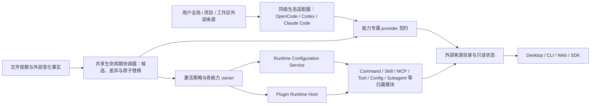

# 外部 AI 工作内容发现、导入与持续兼容设计

本文定义 BitFun 如何发现、展示和消费 OpenCode、Codex、Claude Code 等外部 AI 应用留下的工作内容。OpenCode
是第一条完整兼容来源；其他生态只在有稳定格式和真实消费方时接入。各生态的解析、加载顺序和运行语义仍由对应
适配器负责，本文不建立跨生态通用配置格式或脚本 SDK。BitFun 自身能力如何通过 MCP、Skill、Plugin、Hook、
SDK 或 Server 输出到外部宿主，以及内部 Provider Slot、状态、事件和并发边界，见
[`capability-runtime-integration-design.md`](capability-runtime-integration-design.md)；两条方向共用适用的身份事实和能力 owner，
但不共用一个大一统 adapter 或状态模型。

本文同时记录当前可用纵向切片与目标架构。当前 BitFun 已具备通用外部来源目录和生命周期协调器，并通过
OpenCode Prompt Command 适配器接入本地用户全局/项目来源；Desktop 可查看、刷新、抑制和处理跨来源冲突，
交互式 TUI（ChatMode）可列出并执行 prompt-only Command。第二条纵向切片已让受支持的单文件 OpenCode `.js` standalone Tool 经静态
预览、来源/能力确认和同名冲突选择后进入现有 Tool Runtime；Desktop 与交互式 TUI（ChatMode）使用同一决策状态。第三条纵向
切片已把 OpenCode 全局/项目 Subagent 的安全子集通过独立 provider 契约接入现有 Subagent owner：首次启用与
同名冲突使用非阻塞决策，fresh 调用固定不可变 generation，更新和撤下不会静默切换到同名实现。第四条纵向切片
已把 OpenCode 用户/项目 MCP 的 local stdio 与 HTTPS remote 安全子集接入现有 MCP owner，沿用显式审批、冲突、
工作区隔离和失败回推；现有 Skill Registry 另行展示来源、用户/项目作用域和固定优先级产生的覆盖结果，不并入上述
可执行来源选择规则。完整
TypeScript/Bun、包依赖、package plugin、Codex/Claude Code 适配器、primary agent 替换和外部 Subagent 续接仍属于
后续阶段，不能因来源被识别就宣称已经可用。

## 1. 产品判断与竞品启示

竞品事实与 BitFun 的产品判断分开记录：

| 产品 | 已验证的交互 | 对 BitFun 的启示 |
|---|---|---|
| [Codex 从其他智能体导入](https://learn.chatgpt.com/docs/import.md) | 设置中同时检测用户级与所选项目级内容，支持全部导入或自定义选择；插件和连接需要后续设置时显示状态卡 | 先给用户完整资产清单和作用域，再把需要授权的内容留在非阻塞的后续任务中。 |
| [Cursor 从 VS Code 迁移](https://docs.cursor.com/get-started/migrate-from-vs-code) | 一键迁移扩展、主题、设置和快捷键 | 对来源高度相似、风险可控的内容提供低摩擦默认路径，不要求逐项理解内部格式。 |
| [VS Code Profiles](https://code.visualstudio.com/docs/configure/profiles) | 可按类别选择、浏览内容、预览后创建，并把 Profile 与文件夹或工作区关联 | 作用域、内容预览和工作区关联应是一等信息；用户不需要先提交变更才能理解结果。 |
| [Claude Code 导入 Claude Desktop MCP](https://docs.anthropic.com/en/docs/claude-code/mcp) | 命令启动后交互选择 MCP Server，并可在导入后通过列表验证 | 高副作用连接适合选择性启用和可验证完成状态，不能因为识别成功就宣称可用。 |
| [OpenCode 配置](https://opencode.ai/docs/config/) | 用户级、项目级、环境指定和目录资产按固定顺序实时成为运行输入 | 对已有 OpenCode 项目应保留持续关联，不把一次性复制作为可用前提。 |

因此 BitFun 不照搬单一竞品。默认路径采用“持续兼容来源”，吸收 OpenCode 的实时性和 Skills 的低摩擦发现；
设置中同时提供类似 Codex 的统一来源清单、选择和完成状态；“显式导入”只作为用户希望把外部内容转成 BitFun
原生配置时的可选快照操作。

## 2. 目标与非目标

目标：

1. 自动发现当前执行域中的用户全局、项目和工作区外部来源，不阻塞项目打开、TUI 输入或无关会话。
2. 当前能够安全消费且不存在同名冲突的低风险内容默认无感应用，并通过可撤销的非阻塞摘要说明来源和影响；
   Command、Tool、Subagent 等外部可执行能力与产品本地能力、或独立外部 provider 之间发生同名冲突时，不得
   静默选择胜者。现有 Skill 根继续按已发布顺序解析，但必须展示来源和默认覆盖状态；带模式的管理界面再展示
   应用模式开关后的实际采用项。
3. 插件、Hook、Command、MCP 等可执行或有外部副作用的内容先发现，首次启用或能力扩大时再由用户确认。
4. 运行中感知来源修改、升级、删除和重新出现；成功更新安全切换，失败时优雅保留仍合规的上一有效代次。
5. 用户始终能解释“发现了什么、来自哪里、当前是否生效、为何降级、下一步能做什么”。
6. 产品体验可复用于未来生态，但解析、优先级、权限和运行语义不被抽象成最低公分母。
7. 冲突选择按“能力 + 逻辑名称 + 全部候选身份与内容版本”形成指纹；同一指纹只询问一次，任一候选更新后才重新询问。

非目标：

- 不要求用户先完成阻塞式迁移向导才能打开已有项目。
- 不把“已发现”“已解析”“已应用”和“可执行”合并为一个模糊的“已加载”状态。
- 不双向写回外部应用文件，也不自动删除、移动或升级外部来源。
- 不复制凭据值、私有会话数据库或未文档化的内部状态。
- 不新建一套跨领域信任数据库、通用权限语言或大一统外部资产对象。
- 不因候选更新失败继续使用已被删除、显式停用、撤销或不再满足当前安全策略的旧代码。

## 3. 用户体验

### 3.1 首次发现

发现始终在后台进行。Desktop、交互式 TUI（ChatMode）和 Peer 控制界面消费事实所在 Host 的同一来源状态，但按
宿主展示；Peer 控制界面只代理 Peer Host，不读取控制端同名来源。Server 当前只提供只读快照，未来 Web 入口必须
通过已接入的 Host 能力消费，不能由浏览器扫描来源：

```text
已发现 OpenCode 工作内容
2 项配置、7 个 Skills、1 个插件
已应用当前支持的低风险内容；1 个插件需要确认。

[查看详情] [撤销已应用内容] [以后先询问]
```

- 默认打开“自动应用低风险内容”；应用完成后显示一次聚合摘要，不弹阻塞式 Modal。
- 用户可以改为“低风险内容也先询问”。此时发现结果保持待选择状态，但项目和会话继续可用。
- 自动应用仍须通过已有工作区来源校验、组织上限和归属模块校验，且不能授予工具或扩大权限；未通过时只进入
  “已发现”或“需确认”。
- 可执行内容因首次启用、更新策略要求询问或 import 前摘要扩大而等待确认时，不得 import module、启动进程、
  读取凭据或主动联网；提示可以稍后处理。
- 当前阶段范围外的 TypeScript、依赖型 Tool 和 package plugin 只进入“已发现，静态预览”清单，不进入模型可调用
  集合；受支持 JS Tool 也必须在明确启用前保持同一状态。
- 外部 Subagent 即使只是声明文件，也会把 prompt、模型和工具集合带入一次独立 agent 调用，因此按当前行为与能力
  包络确认；列表和 IPC 只显示描述、来源、模型、工具和诊断摘要，不传输 prompt 正文。
- 全局来源首次在当前执行域识别时提示一次；项目来源按工作区提示。相同全局来源不能在每个项目重复轰炸用户。
- “撤销已应用内容”对持续兼容来源表示在用户选择的当前项目或当前执行域内抑制对应来源/资产并重新计算下一
  来源或产品默认；后续 watcher 更新不得绕过该偏好重新应用。该操作不写回外部文件，也不同于显式导入的字段级撤销。

### 3.2 外部 AI 应用设置页

设置中提供统一的“外部 AI 应用”入口，先按来源产品和作用域分组，再展示资产：

| 信息 | 产品要求 |
|---|---|
| 来源 | 产品、规范化位置、用户全局/项目/工作区作用域、实际执行域；Agent 普通视图只接收 `<workspace>/…`、`~/.config/…` 或 `<remote>/…` 等安全标签，不传绝对用户路径。 |
| 内容 | 配置、Rules、Agents、Skills、Commands、MCP、插件、工具等类别与数量。 |
| 状态 | 已发现、已应用、可用、需确认、更新中、沿用上一版本、部分受限、暂时过期、已移除/已停用或不可用。 |
| 变化 | 最近成功读取时间、候选摘要、已应用摘要、权限或能力变化。 |
| 操作 | 查看详情、应用/启用、按项目或执行域抑制/恢复兼容来源、停用执行 target、撤销显式导入、重新加载、低风险/代码更新改为先询问、显式导入为 BitFun 配置。 |

默认视图只展示用户需要处理的事项和聚合结果；文件级诊断、字段来源、依赖和执行身份进入详情。来源删除或更新
失败不要求用户阅读日志才能理解结果。

### 3.3 兼容来源与显式导入

| 方式 | 适用场景 | 来源变化后 | 写入边界 |
|---|---|---|---|
| 持续兼容来源（默认） | 继续使用外部应用维护的用户/项目内容 | 重新解析候选，按风险和用户策略自动切换或等待确认 | 不写 BitFun 配置，不写回外部文件。 |
| 显式导入（可选） | 用户希望取得一份由 BitFun 独立维护的快照 | 只提示外部来源有变化，用户选择是否重新导入 | 只写用户选定的 BitFun 配置层，支持字段级预览和撤销。 |

显式导入完成后，已选字段由 BitFun 原生配置拥有，不再同时叠加外部值；未导入内容仍可继续作为兼容来源。
插件、Tool 和 Hook 不通过配置复制获得执行资格。

## 4. 来源、资产与加载策略

### 4.1 来源身份与作用域

来源身份至少包含生态、来源类型、规范化位置、作用域和执行域。作用域必须明确区分：

- 本地用户全局来源：可影响本地多个项目，决定只记录一次；项目可以单独停用或覆盖。
- 项目来源：随仓库共享，只影响按该生态规则命中的项目树。
- 工作区本地来源：只影响当前机器上的当前工作区实例，不随仓库同步。
- 远端用户或项目来源：在远端执行域发现和决策，不把本地同名路径或选择静默复制过去。

“全局来源只提示一次”只表示来源级加载偏好在同一执行域去重，不表示首个项目的工作目录、环境、凭据或策略
结论自动授权其他项目。全局来源可以共享原始文件解析、内容摘要和精确物化缓存；候选准备、import、健康和切换
必须按“有效来源图 + 项目/工作区实例 + 执行域 + 工作目录/环境”分别计算。一个项目失败不能把同一全局来源在
其他项目中的健康状态覆盖成失败。Remote 使用独立来源偏好和实例结论，不静默继承本机选择。

### 4.2 风险分级

风险由实际副作用和当前阶段能力决定，不用“来自 OpenCode”或“文件扩展名”代替判断：

| 等级 | 示例 | 默认行为 |
|---|---|---|
| L0 仅清单 | 尚未支持的字段、静态插件/工具名称、来源元数据 | 自动发现和展示，绝不宣称已经应用或可执行。 |
| L1 被动声明 | 本地 Rules、Instructions、纯声明配置、Skill 的说明和索引 | 校验后默认自动应用；显示一次可撤销摘要。不得启动进程、读取凭据或主动联网。 |
| L2 受归属模块保护的外部能力 | 可执行 Skill/Command、远程 Reference、MCP、LSP、Formatter、Provider 连接 | 发现后进入“需确认”；由真实归属模块展示命令、网络、凭据和作用域后启用。 |
| L3 任意第三方代码 | JS/TS Tool、服务插件、Hook、TUI target、动态 import | 发现但不 import；首次按来源/target 启用时说明执行用户、工作目录和直接文件/网络/进程的粗粒度执行包络，不能承诺 import 前已知全部动态贡献。 |

OpenCode Subagent 属于 L2：adapter 只读取声明，不执行外部代码；激活仍需确认实际模型、工具、执行域和来源谱系。
仅 description 等 catalog 文案变化不扩大包络，不重复询问；prompt 行为、provenance、模型或工具变化必须重新确认。
生态 adapter 只提交类型化的模型请求，不能把 `provider/model` 等来源语法交给通用 owner 解析。Subagent owner 在审批
前将请求物化为唯一、已启用的具体模型，并形成“配置 ID + 运行配置指纹”的不可变绑定；`inherit`、`primary`、`fast`、
`auto`、`default` 等字符串在此绑定中都是普通配置 ID，不能再次经过模型选择器解释。无法唯一确定时保持不可用。provider、
模型名、endpoint 或其他影响运行身份的配置在同一 ID 下变化，也会重建未来 generation 并产生新的审批决策；generation
lease 保留旧绑定事实，执行入口若发现当前配置与旧指纹不一致则安全失败，不能静默改用新配置或父会话模型。

确认结果分成两层：来源级加载偏好按“来源限定身份 + target + 执行域 + 更新策略”保存，并明确作用于当前项目
还是当前执行域内所有已通过来源校验的项目；项目/工作区实例只作为“有效来源图 + 粗粒度执行包络 + 已知贡献
摘要”的重新求值上下文，不形成第二个确认键。选择全局作用域后，跨项目本身不重复询问；只有新实例使执行包络、
凭据或能力扩大时才进入“需确认”。工作目录仍在当前已校验项目根和已批准包络内时，子目录变化也不重复询问。

普通配置更新在摘要未扩大时可自动切换。L3 代码内容变化只有同时满足来源身份/完整性可验证、来源更新策略允许，
且 import 前的执行用户、工作目录、直接文件/网络/进程包络、凭据范围和安装行为未扩大时，才允许在原批准包络内
准备隔离候选。已激活项目中的同一份本地源码可以按持续重载偏好自动准备；软件包版本/完整性或远程内容变化默认
先询问，除非用户或组织明确允许该来源自动更新。用户始终可以改为“每次代码更新先询问”。

动态工具和 Hook 可能只有在 module import 后才可知。候选 worker 必须与激活 worker 隔离，import 后先返回真实
贡献差异，不立即注册；新增受 BitFun owner 管理的工具、Hook 或界面贡献需要确认时，候选保持待确认，旧代次继续
服务。由于候选 import 已可能在原批准包络内产生直接文件、网络或进程副作用，产品只能承诺“不激活新贡献”，
不能把后置确认描述成能够撤销 import 副作用。

## 5. 运行中变化与优雅降级

每次来源解析产生不可变候选代次。已经生效的结果使用激活代次；不得在原对象上边读边改：

```text
发现变化
  -> 解析并校验候选代次
  -> import 前比较来源、执行包络、凭据与依赖行为
  -> 自动准备或先等待确认
  -> 隔离候选 import，取得真实贡献差异
  -> 自动切换或在注册前等待确认
  -> 在安全边界原子提交新代次
```

在途调用固定使用发起时的激活代次。新调用只在切换完成后使用新代次；旧代次的迟到响应和贡献引用在退出后失效。
Subagent 通过随调度请求传递的 generation lease 实现这一点；路由撤下后有 lease 的精确运行定义保留到调用结束，
无 route 且无 lease 的旧定义立即回收。该机制不允许新调用使用已删除或已撤销的来源。

文件观察事件不是业务事实。协调器先按来源聚合连续 create/rename/write/remove 事件，并在可配置的文件稳定窗口后
重新扫描完整来源图；编辑器的原子保存不能被误判成删除后重装。用户显式停用、组织策略收紧或安全撤销不等待
稳定窗口；文件只有在稳定重扫后仍不存在才进入“已移除”。

| 变化 | 目标行为 |
|---|---|
| L1 内容有效更新 | 后台解析并原子应用；合并到一次变更摘要，不打断当前任务。 |
| 已启用 L2/L3 内容更新，来源更新策略允许，且 import 前包络与 import 后贡献均未扩大 | 在原批准包络内后台准备并于安全边界切换；执行中的旧调用按原期限完成或被用户取消。 |
| import 前发现执行包络、凭据范围、依赖安装行为或执行域扩大 | 不 import 候选；显示差异并等待确认。健康且仍合规的旧代次可继续服务。 |
| 候选 import 后发现新的 owner 管理贡献 | 不注册新贡献；显示真实差异并等待确认。候选 import 已可能产生的直接副作用不可伪装成已撤销。 |
| 候选解析、依赖准备或健康检查失败 | 保留仍合规的上一有效代次，状态显示“更新失败，仍使用上一版本”；首次加载则只禁用该资产。 |
| 暂时不可读或远程断线 | 标记“暂时过期”。仅允许无安全影响且仍可验证的上一结果在有界宽限期内继续；恢复后重新协商。 |
| 稳定重扫确认删除、显式停用、来源撤销、权限收紧或策略失效 | 阻止新调用并撤下相关贡献；在期限内完成或取消在途调用，不能用缓存绕过当前事实。声明式配置重新计算并回退到下一来源或产品默认。显式停用和安全撤销立即生效。 |
| 来源重新出现 | 作为新候选重新验证。身份、内容和能力摘要未变化且策略允许时可自动恢复，否则重新确认。 |

“上一有效代次”是可校验的物化结果，不是从已变化源文件重新构造的想象版本。旧代码不存在精确物化内容时，
必须显示“上一版本不可恢复”。缓存只用于可靠性，不能改变删除、撤销和权限收紧的语义。

## 6. 架构与职责



| 部分 | 负责 | 不能承担 |
|---|---|---|
| 外部来源目录 | 聚合来源身份、作用域、资产清单、用户处理偏好和可读状态 | 解释所有生态格式、保存凭据、授予脚本权限或管理 worker。 |
| 生态发现与解析适配器 | 发现本生态标准来源，保留真实优先级、格式、参数展开和诊断，并通过能力专属 provider 输出 | 写 BitFun 配置、依赖兄弟生态 adapter、执行其他生态语义或创建跨生态最低公分母。 |
| 能力专属 provider 契约 | 用来源限定身份交付 Command、Tool、Subagent 等类型化定义与调用/展开结果 | 携带任意 payload 的通用资产对象，或让一种能力的新增字段污染其他能力。 |
| 文件观察服务 | 提供可订阅、去抖的文件变化事实 | 解释生态路径、决定优先级、提交业务状态。 |
| 本地 JSON 存储服务 | 提供跨进程锁、锁内读改写和严格同卷原子替换等通用文件能力；替换失败时保留旧文件 | 定义外部来源偏好 schema、冲突策略或生态语义。 |
| 共享生命周期协调器 | 调用已注册 provider、生成不可变候选、按 provider 原子替换、保留隔离诊断，并请求能力 owner 切换 | 按生态 ID 分支业务行为、解析生态文件、直接提交配置、工具、权限或界面状态。 |
| 产品展示投影 | 按作用域、工作区或用户目录关系统一生成安全来源位置，清理可见诊断文本中的已知绝对路径，并按 `Source / Command / Tool / Subagent` 资源类型路由诊断 | 让 GUI/TUI 解析 provider 诊断码前缀、识别 `.opencode`、`.claude` 等私有目录结构，或接收原始用户/工作区路径。 |
| 冲突解析 | 对独立 provider 或产品本地可执行能力的同名候选建立版本敏感指纹；未选择时不激活，选择后只在指纹不变时复用。现有 Skill 固定根顺序由 Skill owner 独立维护 | 用 adapter 优先级静默覆盖另一生态或本地可执行能力，或把选择写回外部文件。 |
| 激活策略与各能力 owner | 根据风险、用户选择、组织上限和执行域决定自动应用、等待确认或限制 | 修改生态加载顺序或把策略拒绝伪装成解析失败。 |
| Runtime Configuration Service | 应用兼容配置视图，执行显式导入、冲突预览、原子写入和撤销 | 读取凭据值或加载插件代码。 |
| Plugin Runtime Host / 执行服务 | 准备代次、监督进程、期限、取消、背压、健康和贡献生命周期 | 决定来源优先级、产品提示策略或最终业务状态。 |
| 产品入口 | 展示统一状态并发起用户操作 | 直接扫描目录、同步安装依赖或依赖生态原始对象。 |

来源目录是产品级只读聚合视图，不是新的配置 owner、权限 owner 或插件管理器。实现时先复用现有 Config、Skill、
MCP、Tool、Permission 和 Plugin Runtime 边界；不得建立同时扫描目录、写配置、下载依赖、执行命令和注册贡献的
“大导入器”。

`ecosystem_id`、来源类型和执行域 ID 是开放且可校验的标识，不是 core 中持续扩大的枚举分支。只有 Product
Assembly 知道当前构建注册了哪些具体 adapter；产品入口、目录、协调器和能力 owner 不得导入 OpenCode、Codex
或 Claude Code 的私有类型。新增生态通过同级 adapter 与现有能力契约接入，不能修改另一个生态 adapter。

provider discovery 必须是可独立调度的 request/result，不在协调器锁内串行扫描。产品组装为每个 provider 设定期限，
超时后只沿用该 provider 的上一有效结果；健康兄弟 provider 继续更新。同步文件适配器超时后底层阻塞任务未必可取消，
因此同一 provider 同时最多保留一个 in-flight discovery，后续刷新复用它，完成后再提交结果，不能无限堆积线程。
未来网络 provider 还应实现协作式 deadline/cancel，但不改变目录、冲突或产品入口契约。

来源降级必须区分粒度：整个配置/目录状态未知时回退对应来源；能确定身份的单个 Command 读取或解析失败时只回退该
Command；明确缺失且未被标记失败的 Command 是稳定删除。产品调用在刷新后还要校验先前投影的候选 ID 与内容版本，
否则菜单展示旧版本、执行新版本会绕过冲突重新确认。

## 7. 状态与提示规则

以下表格是各宿主唯一的一级用户状态集合；Host 的 `ready/restarting/paused` 等内部阶段只能作为详情和原因映射，
不能再形成一套并列产品状态：

| 用户状态 | 含义 |
|---|---|
| 已发现 | 来源或资产已进入清单，但尚未影响运行。 |
| 已应用 | 声明式内容已进入对应归属模块。 |
| 可用 | 可执行能力已完成确认、准备和真实注册。 |
| 需确认 | 首次启用、能力扩大、凭据或执行域变化等待用户处理。 |
| 更新中 | 候选正在后台解析、准备或健康检查，当前任务不被阻塞。 |
| 沿用上一版本 | 候选失败，但上一有效代次仍符合当前策略。 |
| 部分受限 | 某些字段、能力或平台不支持，其他内容仍可用。 |
| 暂时过期 | 来源暂时不可达，正在有界等待恢复。 |
| 已移除 / 已停用 | 新调用和贡献已经撤下。 |
| 不可用 | 没有可安全使用的版本，并附原因和恢复动作。 |

提示遵守以下去噪规则：

- 首次发现、首次应用、需要确认、更新失败、来源删除和权限扩大可以主动提示。
- 普通文件变化、多个同源错误和多项目全局更新按来源聚合；详情进入设置页或 CLI 状态。
- 每次重载最多产生一条摘要，不用 Toast 展示字段级错误。
- 非交互入口只有在当前操作实际依赖待确认资产时才返回类型化 `action-required`；无关待办只进入结构化状态或
  `stderr` 摘要，不阻塞当前操作，也不自动批准。

## 8. 分阶段落地与验收

第一阶段以 Prompt Command 做第一个可用纵向切片：

1. 建立共享来源目录、生命周期协调器、开放生态 ID 和 Prompt Command 专属契约；用第二个 fake adapter 证明
   provider 更新、失败和删除彼此隔离。
2. 发现 OpenCode 当前支持的用户全局和项目 Command 来源，建立来源限定身份、生态内覆盖关系和聚合清单；
   OpenCode 自身定义的项目/用户优先级仍由 adapter 解释，跨 provider 或与 BitFun 本地 Command 的同名冲突进入待选择状态。
3. 支持 `$ARGUMENTS` 与位置参数的 prompt-only 命令在用户显式选择或输入时展开并提交；发现本身不向会话发送内容。
4. 含 `!shell`、`@file`、`{env:...}`、`{file:...}`、`agent`、`model`、`variant` 或 `subtask` 等未接通语义的命令标记为“部分受限”，不做
   静默忽略后的部分执行。
5. Desktop 提供统一来源状态、刷新、按执行域抑制/恢复和冲突候选选择；首次 provider 扫描完成前显示中性检查状态，
   不把暂时空目录误报为最终空结果；已经选择且指纹未变化的冲突退出待处理区。交互式 TUI（ChatMode）使用同一目录列出和执行
   Command；跨 provider 候选以来源限定别名供 TUI 用户直接选择，同次选择也解析本地同名冲突。发现或确认不阻塞
   普通聊天输入；发现未完成时未限定 slash 别名不猜测冲突结果，显式 `/builtin:<name>` 仍可立即执行。执行域全局偏好
   使用独立偏好文件、跨进程锁和严格原子替换，并在查询、刷新和执行前重新读取，使并行 Desktop/CLI 进程不会继续使用
   另一进程已停用的来源或丢失并发选择。Desktop IPC 仅返回设置页所需摘要，不携带 Prompt Command 模板正文。
6. 完成来源变化、无效候选、稳定删除、重新出现、偏好保持和去重提示，为后续能力 owner 提供稳定基线。

第二阶段以 OpenCode standalone Tool 验证可执行内容的完整产品边界：

1. Tool provider 契约与脚本运行时端口独立于 Prompt Command；OpenCode adapter 负责全局/项目 `{tool,tools}`
   来源与格式，Core 激活策略负责审批/冲突，脚本服务负责 Node worker，现有 Tool Runtime 负责最终模型暴露和调用。
2. 发现只读取静态摘要，不 import；首次启用显示来源文件、工作目录与直接文件/网络/环境/进程能力。确认按 target、
   执行域、runtime 和能力集合记忆，内容更新不扩大能力时不重复询问；用户拒绝在内容更新前不再主动提示，但可在
   设置页主动重新审核。
3. 内置、MCP 与外部同名 Tool 使用包含候选身份和内容版本的指纹；选择前保留已有本地实现，不按注册顺序静默覆盖。
   候选集合由已识别定义而非成功加载结果计算；候选更新、暂不可用或删除后重新选择，已选外部实现失效时保持
   unavailable，不静默回退同名本地实现。其他无关 Tool 和生态不受影响。
4. Desktop 提供完整审核卡、主动停用/重新审核和冲突候选；交互式 TUI（ChatMode）状态栏只做非阻塞提示，通用 `/tools`
   入口在“外部 AI 应用”分组中以编号映射稳定 key 完成启用、保持停用、冲突选择和刷新；Agent 相关能力统一复用
   `/agents`，在同一列表中以文字区分主 Agent、Subagent 与外部 AI 应用，不另建 `/subagents` 或 `external-*` 命令。
   普通聊天输入和无关会话不等待用户处理；活动 turn 期间入口仍可查看和管理，但主 Agent 切换单独禁用并说明原因，
   不改变正在执行的 session。
5. 每个 target 使用一个持久 Node worker，支持 load/invoke、`AbortSignal` 取消、500 ms 宽限后的 target 级硬终止、
   30 秒请求期限和 dispose；产品配置的更短外层期限丢弃调用 future 时也会终止 worker，并在终止完成前保持 target
   串行许可。输出限制为 1 MiB，协议帧限制为 8 MiB。稳定删除、抑制或撤销先撤下新调用；更新加载
   失败在没有精确物化旧源码的 PR2 中 fail-closed，不冒充沿用上一版本。worker 崩溃会立即撤下该 target 的全部
   路由并显示失败；空闲退出由 runtime health 事件主动上报，事件携带独立加载代次，旧 worker 的迟到事件不能撤下
   同版本的新实例。调用不自动重放；下一次模型 Tool Catalog 暴露前只尝试恢复一次，之后依赖显式刷新或来源变化，
   不形成循环重启。某个全局、项目、legacy 或显式目录不可读时只降级该目录，其他健康目录继续发现和运行。
6. `.ts`、依赖型 `.js`、`metadata`/`ask`、附件、package plugin、Hook、TUI plugin renderer 和 Remote worker 明确
   延后；本机 Node 进程不是 OS 沙箱，VM realm 与隐藏响应令牌只保护协议稳健性。脚本继承当前用户的文件、网络、
   环境与进程权限；本阶段没有 Job Object/process group，脚本直接启动的后代进程和系统资源风险必须持续显示。

第三阶段以 OpenCode MCP 配置来源验证声明式外部连接的接纳与生命周期：

1. OpenCode adapter 按冻结版本解释用户全局、自定义文件/目录和项目 JSON/JSONC 的 MCP 合并顺序，只输出脱敏静态
   候选；远程地址只展示 HTTPS origin，环境变量只展示变量名，值只在确认后的准备阶段解析。为避免一次确认在环境变化后
   改写可执行文件、参数、工作目录或网络目标，本阶段只允许 `{env:NAME}` 出现在显式 environment 或 Header 值中；其他
   位置明确标记不支持。展开后再次执行大小、HTTPS 与契约校验。
2. MCP coordinator 与 Command、Tool、Subagent 平行，负责 provider 隔离、last-success、稳定删除和 watcher roots；
   审批、同名冲突和 BitFun 原生优先级由产品组装层决定，具体进程、连接、工具注册和回收仍由 MCP owner 负责。
3. 首次启用或命令、参数、工作目录、环境声明、URL origin、Header 名、认证方式等行为变化后重新确认；拒绝在行为变化前不重复
   提示。同名候选未选择时保留 BitFun 当前实现，不把显示顺序当成用户决定，也不在外部失效时静默切换。
4. Desktop 在“外部 AI 应用”设置页显示安全摘要、状态、审批和冲突；交互式 TUI 复用 `/mcps`，在同一列表中用来源
   标签区分 BitFun 与外部候选，不新增 `external-*` 命令。两端使用同一 generation、preference revision 和操作接口。
5. 已确认候选按规范化 workspace 建立独立运行实例；工具包装器同时校验当前 workspace route，Remote owner 未实现前直接
   fail-closed。同名冲突选择外部候选时，只在当前 workspace 隐藏对应 BitFun 原生工具，不停止其他 workspace 的原生实例。
6. 更新、停用、空闲回收或稳定删除先撤下 workspace route 和新工具入口，再有界等待在途连接释放；慢启动在发布连接、
   工具和目录前再次检查撤销标记，不能在撤销后重新发布。第三方启动、握手和回收在后台有界执行，不要求全量重启
   MCP 或 BitFun，也不中断无关 session。
7. 产品快照区分“正在启动”“已启用”“暂时不可用”。后台启动失败会触发快照更新；暂时不可用的候选仍可由用户停用，
   当前恢复入口是先停用该服务器，修复来源配置或认证后再启用；普通刷新不会自动重试失败进程，避免持续拉起故障或恶意
   扩展。删除项的一次性用户通知/有界墓碑尚未实现，当前行会在稳定重扫后消失；该展示增强
   留待后续 PR，不能改变“先撤 route、禁止新调用”的运行语义。
8. 外部本地进程不继承 BitFun 的完整父进程环境，只保留启动所需的系统基线和配置显式声明的变量；这仍不是 OS
   沙箱，进程继续拥有当前用户的文件、网络和子进程权限。Remote 执行域、OpenCode OAuth client 配置、SSE、完整
   `timeout`/Agent 范围和通用凭据 owner 明确延后。
9. 本阶段只把外部 MCP 的 Tool 目录接入 Agent Tool owner。通用 Resource/Prompt/MCP App Desktop 接口不接受无工作区
   上下文的外部 runtime id；外部服务器发起的 roots、sampling 和 elicitation 请求也 fail-closed，防止跨工作区读取或借用
   BitFun 宿主能力。后续若接入这些能力，必须先补独立契约、工作区路由与权限交互，不能复用全局连接绕过当前边界。

验收至少覆盖：

- 项目打开和无关会话不会因发现、解析、依赖准备或确认等待被阻塞。
- 非交互操作只会被自身实际依赖的待确认资产阻止，无关来源待办不改变操作结果。
- 用户级与项目级来源、覆盖关系、执行域和实际生效结果可以解释。
- 任意可执行副作用发生前已经完成对应来源/target 确认和 import 前策略重算。
- 已批准代码更新的来源身份/完整性、更新策略、import 前包络和 import 后真实贡献分别比较；后置确认不被宣传为
  能撤销候选 import 副作用。
- 有效更新原子切换；失败更新、明确删除、权限收紧和暂时不可达的行为彼此不同。
- 原子保存、连续 watcher 事件和真实删除不会造成重复停用/重载或通知风暴。
- 全局来源变化不会造成多项目重复提示或把单项目失败传播为全局失败。
- 全局来源偏好与项目执行实例策略分开；跨项目只重新求值而不重复提示，跨执行域或新实例扩大执行包络时不会
  错误继承确认。
- 持续来源撤销后不会被下一次 watcher 更新重新应用；当前项目与整个执行域的抑制范围可验证。
- 同名外部候选和产品本地能力在用户选择前均不会被静默覆盖；选择在候选内容版本和参与集合不变时不重复询问，
  任一候选更新、删除或参与集合变化后重新进入待选择，即使变化后只剩一个实现也不静默切换。
- 冲突谱系对 0/1/N 个当前参与者都生成当前指纹；自动更新谱系或将旧选择改为“需重选”时，与用户选择一样原子推进
  `preference_revision`。跨进程旧 revision 的操作必须返回 stale，不得重新写入旧授权或旧候选。
- GUI/TUI 的外部 Agent 冲突选择在同一上下文中展示将被原子批准的模型、工具、执行域、安全来源、兼容影响和恢复动作；
  同工作区决策串行化，成功后读取权威快照，不以较旧整表覆盖无关的 Command/Tool 新状态。
- 冲突偏好按执行域与命令族只保留当前指纹，并以去重候选身份标记曾发生冲突；连续内容更新不会按历史指纹线性膨胀。
- 显式导入的字段级预览、冲突、撤销和凭据脱敏可验证。
- 当前只支持静态预览的资产不会被产品文案误报为已应用或可执行；支持子集与完整 OpenCode 兼容不会混写。

具体 OpenCode 能力范围和近期顺序分别见
[`opencode-extension-compatibility.md`](opencode-extension-compatibility.md)和
[`../../plans/opencode-extension-compatibility-plan.md`](../../plans/opencode-extension-compatibility-plan.md)。
