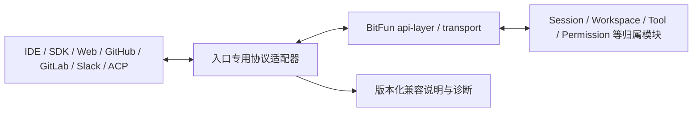

# OpenCode 外部集成适配设计

本文定义 OpenCode 开发工具包、Server、ACP、IDE、Web、GitHub、GitLab 和 Slack 如何与 BitFun 对接。它们是
OpenCode 的外部产品入口，不等同于服务插件或 TUI 插件。总体结论见[能力矩阵](opencode-extension-compatibility.md)。
本文是目标设计，不表示这些外部入口已经交付；当前可用状态必须由真实生产入口和端到端验证证明。

核对入口包括 [SDK](https://opencode.ai/docs/sdk/)、[Server](https://opencode.ai/docs/server/)、
[ACP](https://opencode.ai/docs/acp/)、[IDE](https://opencode.ai/docs/ide/)、[Web](https://opencode.ai/docs/web/)、
[GitHub](https://opencode.ai/docs/github)、[GitLab](https://opencode.ai/docs/gitlab/) 和稳定仓库中的
[`@opencode-ai/slack`](https://github.com/anomalyco/opencode/blob/4473fc3c9055046183990a965d68df3db7ea6f62/packages/slack/README.md)。

## 1. 目标与边界

目标是复用 BitFun 已有会话、工具、工作区和远程能力，为真实外部调用方提供必要兼容接口，并明确原始 OpenCode
客户端能否直接连接。

不做以下事情：

- 不把插件 worker 的私有回环 `serverUrl` 暴露成公共 OpenCode Server。
- 不为了运行原始客户端复制整套 OpenCode Agent Runtime、会话存储和产品命令。
- 不把“BitFun 有同类 GitHub/IDE 功能”写成“原始 OpenCode 集成可直接替换”。

## 2. 能力与产品结论

| 外部入口 | OpenCode 依赖 | BitFun 方案 | 兼容结论 |
|---|---|---|---|
| 插件内 `client` | 冻结版本开发工具包方法 | 提供插件专用门面并转发到 BitFun 归属模块 | 按方法主要适配 |
| 外部开发工具包 | 完整公开 Client 和错误模型 | 只为有真实消费方的方法提供公共兼容服务 | 按方法主要适配，不宣称全量 |
| Server / OpenAPI / SSE | OpenCode Server、事件和认证 | 显式启动独立兼容服务，复用 api-layer/transport 后端能力 | 可逐步适配；不是插件前置条件 |
| ACP | ACP 会话、工具、命令、MCP、权限 | 在现有 ACP 入口转换 OpenCode 可观察字段与错误 | 可主要适配 |
| IDE 扩展 | 终端启动/聚焦、上下文注入、文件引用、`/tui` endpoint | 提供 BitFun IDE 扩展或兼容启动器；只在明确模式开放必要 `/tui` 子集 | 主要能力可做，原扩展直连需单独验收 |
| Web / attach | 完整 Server 协议和共享会话 | 优先使用 BitFun Web/Remote；原始客户端直连进入 Server 兼容项目 | 当前明确降级 |
| GitHub Action / App | `opencode` CLI、事件输入、分支/PR/评论流程 | 提供 BitFun Action/App 和事件到任务的映射 | 提供同类产品能力，不直接运行原 Action |
| GitLab CI / Duo | runner 中的 OpenCode CLI、CI/Duo 事件与回写 | 提供 BitFun CI 模板/触发器和 MR/Issue 回写 | 提供同类产品能力，不冒充 OpenCode CLI |
| Slack | `@opencode-ai/slack`、Socket Mode、线程会话和 OpenCode SDK | 复用 BitFun 会话/消息入口实现独立 Slack 连接器 | 可做原生适配；原包直连依赖 SDK/Server 覆盖 |

## 3. 逻辑与开发视图

| 部分 | 负责 | 不负责 |
|---|---|---|
| 入口专用适配器 | 认证、版本、字段、事件、错误和入口生命周期 | 复制业务状态或直接调用插件进程 |
| api-layer / transport | 复用 BitFun 已有远程与本地传输能力 | 理解 GitHub、IDE 或 OpenCode 特有格式 |
| 归属模块 | 最终会话、工具、权限、工作区和回写状态 | 伪造 OpenCode 未实现行为 |
| 兼容说明 | 列出支持方法、endpoint、事件和降级原因 | 用一个版本号暗示全量兼容 |

插件私有 Client 和公共外部服务可以复用同一组能力处理器，但认证、可见范围、期限和发布承诺必须分开。私有
回环路由的存在不能自动扩张公共协议面。

## 4. 运行与产品体验

### 4.1 显式兼容服务

- 普通 BitFun 启动不因项目 `server` 配置改变监听地址。
- 只有用户选择“OpenCode 协议兼容服务”或某个已安装入口需要时才启动；默认绑定 loopback，并显示地址、认证和兼容版本。
- 未支持 endpoint 返回稳定 `404/501` 和方法级说明；长连接、SSE 和 attach 有连接期限、取消、背压和断线恢复。
- 对外写入方法不得返回伪成功；认证、工作区和权限判断由 BitFun 归属模块执行。

### 4.2 IDE

冻结版 VS Code 扩展的可执行连接契约如下，验收不能只写“启动和 `/tui` 子集”：

| 原扩展行为 | BitFun 适配结论 |
|---|---|
| 创建名为 `opencode` 的终端 | BitFun 原生扩展创建自己的终端；原扩展直连仍要求可寻址的 `opencode` 命令。 |
| 设置 `_EXTENSION_OPENCODE_PORT=<随机端口>`、`OPENCODE_CALLER=vscode` | 显式兼容启动器保留两项环境变量；普通 BitFun 启动不读取并冒充 OpenCode。 |
| 发送 `opencode --port <port>` | 只在用户显式安装同名兼容启动器时可直连；默认不覆盖真实 OpenCode 命令。 |
| 每 200 ms 轮询 `GET /app`，最多 10 次 | 显式兼容服务实现该健康路由和确定错误；BitFun 原生扩展使用自身连接状态。 |
| `POST /tui/append-prompt`，JSON `{ "text": "..." }` | 映射到当前会话输入；无活动会话时返回确定错误，不伪造成功。 |
| 文件引用 `@path#Lx` 或 `@path#Lx-Ly` | 转换到 BitFun 文件/行号上下文，保留工作区相对路径。 |

IDE 产品流程还应提供快速启动/聚焦、新会话、当前选择区或标签页上下文、连接状态和恢复动作。原 OpenCode
扩展只有在上述命令、环境变量、轮询和路由全部通过冻结样例时，才可标记为可直连；否则提供 BitFun 扩展，
不让用户面对无响应按钮。契约来源固定到稳定版
[`sdks/vscode/src/extension.ts`](https://github.com/anomalyco/opencode/blob/4473fc3c9055046183990a965d68df3db7ea6f62/sdks/vscode/src/extension.ts)。

### 4.3 GitHub、GitLab 与 Slack

这些入口按“事件进入任务、结果回写外部线程”的产品流程验收：

1. 显示触发来源、仓库/工作区、身份和将要使用的配置。
2. 复用 OpenCode 配置兼容结果和插件能力，但任务由 BitFun Runtime 执行。
3. 分支、提交、PR/MR、Issue、评论或 Slack thread 由对应连接器负责，失败可重试且不重复回写。
4. 文档明确这是 BitFun 集成还是原始 OpenCode 包直连，不能混用兼容结论。

## 5. 版本演进与验证

每个外部入口单独维护已支持的方法、endpoint、事件和认证方式。OpenCode 升级时先比较 OpenAPI/SDK/ACP 与入口
实际调用，再更新相应适配器；不因一个入口需要新字段而修改通用插件主机。

至少验证：

1. 插件私有 Client 与公共服务使用相同业务处理器但不同认证和可见范围。
2. IDE 启动/聚焦、上下文、文件引用、`/tui` 子集和失败恢复。
3. Web/attach 对未支持协议的可解释失败，不出现连接挂起或无限重连。
4. GitHub/GitLab 事件、权限、分支与评论/MR/PR 回写；Slack 线程与会话对应关系。
5. 未知方法、事件、版本和断线不会导致主进程异常、界面卡顿或日志风暴。
6. 原始客户端直连与 BitFun 原生替代分别标记，不能用同类结果代替协议兼容测试。

当前不承诺原始 OpenCode Web/attach、GitHub Action、GitLab runner 或 Slack 包直接连接 BitFun；这些限制需要随
真实入口需求和 Server/SDK 覆盖度逐项重新确认。
