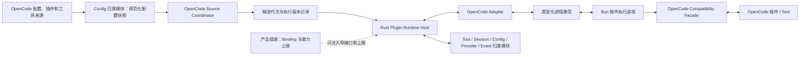

# OpenCode 插件运行时适配设计

本文定义 BitFun 如何在自己的运行时中加载和执行 OpenCode 服务插件、自定义工具和稳定钩子。总体能力状态见
[`opencode-extension-compatibility.md`](opencode-extension-compatibility.md)，配置来源见
[`opencode-config-assets-adapter-design.md`](opencode-config-assets-adapter-design.md)，通用主机边界见
[`plugin-runtime-host-design.md`](plugin-runtime-host-design.md)，终端插件见
[`opencode-tui-plugin-adapter-design.md`](opencode-tui-plugin-adapter-design.md)。

冻结接口以稳定提交的 [`packages/plugin/src/index.ts`](https://github.com/anomalyco/opencode/blob/4473fc3c9055046183990a965d68df3db7ea6f62/packages/plugin/src/index.ts)、
[`packages/plugin/src/tool.ts`](https://github.com/anomalyco/opencode/blob/4473fc3c9055046183990a965d68df3db7ea6f62/packages/plugin/src/tool.ts)
和实际插件 loader/npm 服务为准；[插件文档](https://opencode.ai/docs/plugins/)用于行为说明。

本文是目标设计。当前实现结束于 BitFun 专用目录来源、启用记录、静态 custom tool 名称预览和诊断，尚未包含脚本执行进程、
OpenCode 兼容 Client、真实工具调用或稳定钩子执行。

## 1. 核心决策

BitFun 实现自己的插件 Runtime，不启动完整 OpenCode Runtime：

- 每个外部插件 target 在 BitFun 管理的独立、可终止脚本进程中运行；服务 target 与 TUI target 也彼此隔离。
- 首选执行后端是由 BitFun 固定版本并随产品交付或按需安装的 Bun，而不是自行重写 JavaScript 引擎或用
  Node 兼容层猜测 Bun 行为。Bun 负责 TypeScript、模块执行和 Bun Shell `$`；
  发布前必须完成对应平台的许可证、签名、更新和体积验证。
- 依赖准备不使用 `bun install` 猜测 OpenCode 行为。`v1.17.20` 兼容模块使用 npm 配置、`@npmcli/arborist`、
  `package-lock.json` 和 `ignoreScripts: true`；后续 OpenCode 版本改变实现时随兼容版本更新。
- 执行进程提供 OpenCode 兼容上下文和插件接口；插件无需感知 BitFun Rust 内部类型。
- OpenCode Adapter 把插件调用、钩子变换和工具结果转换成类型化进程消息。
- Rust Plugin Runtime Host 负责生命周期、调用路由、期限、取消、背压、诊断和故障隔离。
- Tool、Session、Message、Config、Provider、Permission、Event 等归属模块校验并提交最终结果。
- 默认本地策略以兼容性为先，不把严格沙箱作为插件可用的前置条件；用户、产品和组织可以按需收紧。

“BitFun 自有 Runtime”表示 BitFun 自己实现来源发现、依赖准备、worker 监督、OpenCode API 适配、进程通信、
Rust 能力转发和状态恢复；并不表示重写 Bun，也不表示在后台启动 OpenCode 的 Agent Runtime。插件工厂和钩子
在 Bun worker 中运行，需要 BitFun 能力时通过兼容接口转发给 Rust 归属模块。

“最终由归属模块提交”不是把 OpenCode 可写钩子降级成只读通知。默认策略允许合法钩子变换生效；归属模块只负责
结构校验、状态一致性和已配置策略，不改变 OpenCode 的正常可观察语义。

## 2. 运行结构



启动和调用分开：

```text
发现来源 -> 解析依赖 -> 生成执行版本记录 -> 启动执行进程
         -> 加载插件 -> 收集真实贡献 -> 注册可用贡献

运行时事件/工具调用 -> Host -> Adapter -> 执行进程 -> 插件
                    -> 结果/变换 -> Host 校验 -> 归属模块提交
```

插件执行进程是兼容载体，不是第二智能体内核。它不拥有 BitFun 会话状态、最终工具结果、配置文件写入或
权限存储。
Runtime Product Assembly 只选择并构造已编译的 adapter/provider，再注入 `PluginRuntimeBinding`、执行服务和产品
能力/策略上限；它不发现来源或 import 插件。Config 归属模块只提供规范化配置快照；OpenCode Source Coordinator
拥有来源身份/顺序、监听、候选代次和切换决定；依赖/脚本执行服务物化候选、唯一持有 worker/进程树并执行物理
健康探测；Host 只保存逻辑 target 状态、调用和贡献注册。插件文件变化不能成为产品组装的隐式输入。

### 2.1 开发视图

| 开发部分 | 负责 | 不能承担 |
|---|---|---|
| OpenCode Source Coordinator | 读取 Config 归属模块提供的快照，维护来源身份/顺序、监听、候选代次和切换决定 | 写 BitFun 配置、安装依赖、管理 worker 或提交贡献 |
| 依赖准备服务 | 按兼容版本管理 npm 配置、Arborist、package-lock、缓存和安装锁 | 执行插件代码或擅自启用安装脚本 |
| 脚本执行服务 | 唯一持有固定版本 Bun、每 target OS 进程树/句柄，负责物理健康探测和资源回收 | 理解 OpenCode Hook 语义或提交 BitFun 业务状态 |
| OpenCode worker 适配库 | 加载真实模块，提供插件工厂上下文、`client`、`$` 和 target API | 暴露 Rust 内部类型或自行修改 BitFun 存储 |
| 进程协议适配器 | 把工具、Hook、Client 和生命周期调用转换成类型化消息 | 使用任意 JSON 和字符串事件替代所有接口 |
| Plugin Runtime Host | 期限、取消、有界队列、逻辑 target 状态、进程失联事实消费、响应校验和诊断 | 持有 OS 进程句柄/进程树，或决定 OpenCode 加载顺序、权限结果和工具结果 |
| Tool / Config / Permission / Session / Provider / Event 归属模块 | 校验并提交最终状态 | 直接加载第三方 JS/TS 模块 |

实现顺序以真实消费方为准：先建立工具调用和稳定 Hook 所需的窄接口，再补 Client 方法和 TUI target；不先设计
覆盖多个生态的通用脚本 SDK。进程协议可以共享请求身份、期限、取消和错误封装，但不同调用的业务字段保持
类型化。

## 3. 默认策略与可调权限

### 3.1 OpenCode 兼容策略（本地默认）

- 使用 BitFun 管理的固定版本 Bun 加载 JS/TS；依赖按冻结 OpenCode 版本的 npm/Arborist 语义准备。
- 自动发现项目/用户插件、standalone tools 和配置目录 `package.json`。
- OpenCode 配置列出的插件和标准插件/工具目录按 OpenCode 默认直接加载，不额外要求 BitFun 来源审批或再次
  激活；用户可以通过 OpenCode 配置或 BitFun 策略停用。
- 来源发现与第三方模块 import 是两个边界。每次 import 前，系统依据来源、target、实际执行域/用户、
  产品/组织策略上限、凭据范围和环境范围重新计算当前有效策略与安全启动参数；不能直接复用发现时的结论。
  安全启动可以在本次启动中暂停全部外部 target，供用户检查来源后再恢复。
- 默认兼容模式不会弹出逐插件审批，也不承诺用户能在自动 import 前临时点停。首次打开未知项目时，在开始后台
  准备前显示包含来源、工作目录、执行用户和兼容/受限模式的非阻塞提示，但直接脚本副作用可能在提示后立即发生；
  需要先检查的用户必须预先启用安全启动或保存受限/停用策略。
- 在 `discovered/preparing` 阶段收到的停用或收紧操作必须使候选失效，并在 import 前重新检查有效策略；import
  已开始后只能阻止后续调用并回收 target，不能宣称撤销已经发生的文件、网络或进程副作用。
- 允许当前用户在该执行域通常拥有的文件、网络、进程、环境变量和动态 import 能力；依赖安装脚本仍按
  OpenCode 稳定版默认禁用，不能因“默认开放”而扩大权限。
- 提供真实 `$` shell 语义、`directory`、`worktree`、`project` 和兼容 Client。
- 复现 OpenCode 稳定版的插件加载顺序、钩子顺序、命名和覆盖行为。
- 不因缺少 BitFun 专用清单、未声明静态工具集合或统一“高风险”标记阻止插件加载。

### 3.2 可选受限策略

权限分成两层，不能把 Host 能看见的调用范围误写成对任意脚本的沙箱：

| 控制层 | 可执行机制 | 控制粒度 |
|---|---|---|
| 经 Compatibility Facade / Tool Runtime 的 BitFun 能力 | 在 Rust 归属模块检查来源、凭据、文件范围、工具覆盖、配置写入、模型请求修改和界面贡献 | 可按调用和贡献细分 |
| Bun 直接文件、网络、环境和子进程能力 | 兼容模式使用当前执行用户；受限模式只能依赖真实操作系统或容器边界 | 只能按执行环境粗粒度限制；边界无法落实时停用 target |

用户、产品或组织可以选择兼容/受限模式，并在 Host 代理层调整自己有权修改的细项。策略必须满足：

- 限制项是显式配置，不是隐式默认。
- 拒绝只影响超出策略的贡献或调用，其他能力继续运行。
- 诊断明确区分插件故障与 `policy-limited`。
- 更低层配置不能放宽组织或产品设置的上限。
- 用户可以查看最终有效策略并调整自己有权调整的部分。

| 执行域 | 首期可执行边界 | 严格文件/网络隔离不可用时 |
|---|---|---|
| 本地 Windows | Job Object 管理进程树和可执行资源预算 | 禁用需要相应直接能力的外部 target，报告 `policy-limited` |
| 本地 Linux | process group；可用时使用 cgroup/rlimit | 没有容器/namespace 等真实边界时同上 |
| 本地 macOS | process group 与可执行的 rlimit | 没有真实 sandbox/container 边界时同上 |
| Remote | 使用远端账号或远端容器的真实边界，不回退到本机 | 远端不能落实策略时同上 |

### 3.3 高权限残余风险

兼容脚本运行时中的代码可以直接调用运行时文件、网络和进程接口。这些直接副作用无法全部经过 Rust
Permission 归属模块拦截。默认兼容策略接受这一点，等价于用户运行本地开发工具；诊断页面必须展示执行用户、
来源、依赖、工作目录和当前策略。需要严格拦截时，用户必须选择真实可执行的受限环境；当前平台不能落实所选
边界时，依赖该直接能力的插件必须停用并报告 `policy-limited`，不能用一条策略记录冒充已经拦截。

## 4. 来源与执行版本

OpenCode 项目和用户目录可以直接成为兼容来源。OpenCode Source Coordinator 自动生成当前执行版本记录，但不要求作者
手工构造 `.bitfun/plugins`：

| 记录内容 | 目的 |
|---|---|
| 来源作用域与加载顺序 | 保留 global/project/config/directory 语义。 |
| 插件和工具入口 | 固定本次准备加载的模块。 |
| 配置目录 `package.json`、npm 配置、`package-lock.json` 及内容摘要 | 判断何时需要重新准备依赖。 |
| 软件包实际解析版本、完整性信息和安装目录摘要（能够取得时） | 避免只记录包名导致错误复用缓存。 |
| Bun 版本、平台和架构 | 解释平台差异并选择正确 worker。 |
| 原生模块和运行时发现的动态依赖 | 展示风险并在变化后使相关缓存失效；安装脚本在当前兼容版本中禁用。 |
| 内容摘要和生成时间 | 缓存失效、诊断和重载。 |

默认流程自动生成和更新记录，不新增多轮人工确认。内容变化后先保持健康旧进程服务，再后台准备候选；新进程
健康检查通过后原子切换。准备失败时只有健康旧进程可以继续服务，并显示“候选更新失败，仍使用旧进程”。

执行版本记录是 BitFun 的内部缓存和诊断信息，不是源码备份或新的插件包规范，也不要求所有动态 import 在启动前
形成完整依赖清单。本地开发插件缺少 package-lock 或完整性元数据时仍可运行，但旧 worker 崩溃或产品重启后，
只有保留了经摘要校验的精确软件包/文件物化目录才能重建旧代次；本地原位源码已变化且没有精确字节时，必须显示
“上一版本不可恢复”，不能从当前来源重建后仍冒充旧版本。运行时发现新依赖后只更新当前代次记录，不能追溯改写
旧代次身份。

BitFun 原生 `bitfun.plugin.json` 包继续使用现有来源校验；OpenCode 兼容来源与原生包最终进入相同 Host
可靠性边界，但来源格式、安装和更新生命周期不必相同。

## 5. 工具与插件加载

### 5.1 Standalone tools

- 扫描项目和用户级 `.opencode/tools/*.ts|js`，兼容 singular 目录。
- 真实加载 default 和多个 named export；按 OpenCode 规则生成 `<file>_<export>` 工具名。
- 工具的原始 Zod shape、refinement 和 `execute` 留在该工具进程；worker 用原始 Zod `safeParse` 校验调用。
- worker 只把工具 identity、description 和转换后的 JSON Schema 传给 Rust，不能序列化 Zod 或函数来伪装等价。
- `ToolContext` 的 session/message/agent/directory/worktree 取真实执行上下文；`abort` 接收 Host 取消信号；
  `metadata({ title?, metadata? })` 与 `ask()` 通过反向类型化调用更新流式元数据和请求权限。
- ToolResult 的 title/output/metadata 与 `attachments: { type: "file", mime, url, filename? }[]` 逐项转换；
  附件 URL 只能指向插件执行域可授权读取的文件或受支持地址，不能把本地路径静默解释为远端文件。
- 任意语言包装继续由插件代码启动子进程；Host 不另建语言专用工具 ABI。

### 5.2 服务插件

- 优先加载 v1 server target：模块 default export 必须是 `{ id?, server }`，并且不能同时导出 tui target。
- v1 文件/path server 插件必须提供非空 `id`；npm 插件缺省 `id` 时回退 package name。旧式函数导出回退
  不套用 v1 id 契约，但状态页仍使用来源身份区分。
- 软件包入口优先 `exports["./server"]`，其次只对 server 使用 `main`；存在 `exports` 但没有 server/main 时不回退包根。
- 文件目录可以回退 `index.ts/tsx/js/mjs/cjs`；npm 插件还必须通过 `engines.opencode` 版本范围检查。
- 只有未识别为 v1 模块时才枚举旧式函数导出作为兼容回退；“一个模块多个插件函数”不是 v1 主路径。
- 外部插件顺序直接使用[完整配置来源图](opencode-config-assets-adapter-design.md#31-opencode-来源图)产生的
  `plugin_origins`：包括各配置来源以及 `ConfigPaths.directories` 中的全局配置目录、项目 `.opencode`、
  `~/.opencode` 和 `OPENCODE_CONFIG_DIR` 目录扫描结果；不能简化成四级 global/project 顺序。
- Internal auth/provider 插件先于所有 external 插件；`--pure` / `OPENCODE_PURE` 只跳过 external 插件。
- 稳定版会跳过已经内置的旧认证包名。BitFun 只有在存在行为等价的内置替代时才应用该别名；否则不得静默
  跳过，必须继续加载或报告缺失的替代能力。
- 导入可以并行准备，但插件工厂和 Hook 激活必须按确定顺序提交。
- npm spec 按解析后的 package name 去重，版本是否相同不影响身份，后来源胜出；file spec 按解析后的精确
  file URL 去重。本地和软件包来源不因相似名称合并，胜出项仍保留完整来源和 options。
- 无 custom tool 的 event/config/auth/provider-only 插件仍然可以加载和启用。

未知 pure/禁用开关不能按“继续加载”处理。无法解释时应停止自动加载 external 插件并给出一次明确诊断，避免
用户期望纯净启动时仍执行第三方代码。

稳定版的软件包缓存命中后不会主动刷新 bare `latest`。BitFun 必须先复现这一实际加载行为；“检查更新”和更新通知
属于明确的产品增强。只有用户触发更新、配置 spec 变化或更新策略明确允许时才重新解析版本，并按第 9 节准备
候选版本，不能把后台静默换包宣称为 OpenCode 等价行为。

### 5.3 注册与覆盖

执行进程加载完成后返回真实贡献清单。静态分析只用于快速预览，不能要求动态工具集合与预览完全一致：

- 运行时新增或缺失工具只更新本次真实贡献和差异诊断。
- 用户策略对能力类别有限制时，超出上限的贡献被拒绝，其他贡献继续注册。
- 同名插件工具默认按 OpenCode 语义覆盖内置工具；原工具保留可诊断身份和可选别名。
- 产品或组织可保护少量安全关键工具。保护冲突必须在加载状态中可见，不能静默改名或丢弃。
- 工具调用继续进入现有可调用工具集合、期限、取消和结果类型；不新增只供插件使用的第二套调用状态机。

当前 `ProviderCandidate` 实际表示 custom tool 提供方，后续接口变更应改用不与 OpenCode `provider` Hook
混淆的 `ToolProviderCandidate` 或等价窄名称。改名属于实施计划，不在本次文档 PR 修改代码。

## 6. 钩子适配与权威提交

### 6.1 钩子分类

| 分类 | 钩子 | 调用规则 |
|---|---|---|
| 生命周期 | `dispose` | 给定期限执行；超时后回收执行进程。 |
| 观察 | `event` | 代理版本化事件，插件异常不影响事件源。 |
| 注册 | `tool`、`auth`、`provider` | 加载期收集真实定义，按归属模块类型化注册。 |
| 输入变换 | `config`、`chat.message`、`chat.params`、`chat.headers`、`command.execute.before`、`tool.execute.before`、`shell.env`、`tool.definition` | 保持插件顺序依次应用；每步做结构和大小检查，最终值交给归属模块。 |
| 输出变换 | `tool.execute.after` | 保留原始工具结果和审计引用，对展示输出、title、metadata 依次应用。 |
| 权限决策 | `permission.ask` | 默认兼容策略接受 OpenCode ask/deny/allow 语义；显式用户/组织上限可收紧。 |

### 6.2 变换规则

- 输入 Hook 看到前一个 Hook 已经变换的值，顺序与 OpenCode 一致。
- `tool.execute.before` 完成后重新校验最终参数 schema，权限界面展示最终副作用对象。
- `tool.definition` 改变的是模型可见的 JSON Schema；真实调用仍在 worker 中由工具原始 Zod shape/refinement
  `safeParse`。这是 OpenCode 的双表示语义，不能为了“看起来一致”把 JSON Schema 反推成不等价的 Zod。
- `tool.execute.after` 不能删除底层原始结果和审计引用；用户可见结果遵循 OpenCode 变换，但诊断仍能定位原始失败。
- `config` 变换作用于当前兼容结果，不直接覆盖来源文件。
- `chat.headers` 和 `shell.env` 的敏感值不进入日志或普通诊断。
- 单个 Hook 抛错只使本次 Hook 调用失败。是否终止当前命令/工具按照 OpenCode 行为和调用类型决定，不升级为
  BitFun 主进程故障。

### 6.3 Permission Hook

默认兼容策略下，`permission.ask` 可以按照 OpenCode 语义修改 ask/deny/allow。BitFun 用户或组织设置了不可
突破上限时：

- deny 可以继续收紧；
- allow 只能在当前策略上限内生效；
- 超出上限返回 `policy-limited`，同时保留插件原始决定和最终决定的审计来源；
- 不能把策略拒绝伪装成插件返回 deny。

## 7. OpenCode Compatibility Facade

插件工厂获得与 OpenCode 对齐的上下文：

| 上下文 | BitFun 实现 |
|---|---|
| `project` | 当前执行域的项目身份和兼容字段。 |
| `directory` | 实际插件工作目录。 |
| `worktree` | 实际工作树根；Remote 时是远端路径。 |
| `serverUrl` | 指向 worker 执行域内真实可访问的回环兼容服务；它实现冻结版本中插件实际需要的 OpenCode 路由，而不是暴露完整外部 Server。 |
| `client` | 插件专用方法代理，经类型化进程通信映射到 BitFun 归属模块。 |
| `$` | 默认兼容策略提供真实 shell；受限策略可提供受控替代并返回差异。 |

Client 方法按冻结版本建立接口清单：

- 已支持方法转成稳定请求并返回 OpenCode 兼容结果。
- 已知未支持方法抛出稳定 `unsupported` 错误，包含方法、版本、插件和替代建议。
- 只读、可选、且 OpenCode 允许空值的方法才能返回空结果；写入和副作用方法不得伪造成功。
- 未知新方法由代理捕获并进入一次性兼容诊断，不能导致 Rust panic 或无限递归。
- Client 返回的大对象使用分页、流或大对象引用，避免阻塞进程通信。

`client` 与回环 `serverUrl` 复用同一组 Rust 能力处理器。插件直接 `fetch(serverUrl)` 时，已声明支持的路由返回
OpenCode 兼容响应；未支持路由返回版本化的 `404/501` 与诊断，不挂起连接或伪造成功。该回环服务只对对应
worker 可见，不能自动成为 BitFun 面向外部用户的 OpenCode Server 兼容承诺。

Compatibility Facade 是 OpenCode Adapter 的内部插件接口，不是 BitFun 公共 SDK，也不要求其他产品入口使用
OpenCode 类型。

## 8. 可靠性与鲁棒降级

### 8.1 故障域

每个外部插件 target 使用独立操作系统进程。单线程内的超时不能终止死循环，进程级隔离是回收失控执行的必要
条件，但独立进程本身不能保证系统级资源耗尽不影响其他插件：

- 插件初始化失败、崩溃或死循环不得直接终止 Host；期限到达后回收该 target 的完整进程树。
- Windows 用 Job Object 管理进程树，Unix 至少使用独立 process group；内存、CPU 和子进程数在平台可执行时使用 Job Object、cgroup/rlimit 等硬预算。无法提供硬限制的平台必须显示残余风险，不能承诺内存或进程风暴完全不影响宿主。
- 初始化失败回滚该插件本次注册的工具、Hook 和状态，继续加载其他插件。
- 服务插件和终端插件分别启动、启停和恢复；一端失败不使另一端自动失效。
- 重启后使用相同执行版本和确定性加载顺序，不重复提交已失效注册项。

OpenCode 稳定实现把 server 插件放在同一进程，因此插件理论上可以通过 `globalThis`、进程环境或模块单例产生
未文档化共享。BitFun 为满足故障隔离会切断这种隐式共享，只保证官方 PluginInput、Hook 顺序和显式接口；依赖
跨插件全局副作用的插件属于明确兼容差异。

### 8.2 调用协议

每条跨进程请求包含协议版本、request id、插件/target、调用类型、期限、取消 id、输入摘要和大小预算。必须具备：

- 初始化、Hook、Tool、Client 和 dispose 各自可配置期限。
- 取消传播和进程失联检测。
- 有界队列和并发上限；过载返回 `overloaded`，不无限排队。
- 输入、输出和日志大小限制；大结果保存后只传递引用。
- 心跳和健康状态不与单次业务调用共用被阻塞的队列。
- 迟到响应、重复响应、未知 request id 和旧执行版本响应直接丢弃并诊断。

各类调用必须使用独立、可配置且受产品或组织上限约束的等待预算。初始默认值在首个端到端切片中测量后由
插件主机的单一配置 owner 确定；设计文档不重复冻结常数，状态页必须显示最终生效值，也不能用无限等待作为兼容回退：

| 调用类别 | 期限归属与可见状态 | 超时结果与重试 |
|---|---|---|
| 依赖准备 | 后台预算；显示准备阶段，可取消候选或停用 target | 候选失败；健康旧进程可继续，手动重试 |
| 初始化/模块 import | target 启动预算；显示正在启动，可取消整个 target | target 不可用并回收进程；自动恢复只使用统一重启预算 |
| 顺序变换 Hook | 单 Hook 与整条链均有预算；显示当前插件与 Hook，可取消业务操作 | 当前操作失败，不静默跳过，也不自动重放 |
| 通知型 `event` | 通知链预算；不阻塞主界面，可停用相应 Hook/target | 丢弃本次通知并聚合诊断，不重试 |
| Tool | 继承本次工具期限并受宿主上限约束；复用工具进度和取消 | 返回 `timeout/cancelled`；可能有副作用，不自动重放 |
| Client 代理 | 读写分别配置；显示插件正在访问的能力，可取消本次请求 | 写请求不重试；只读请求仅在明确暂时不可用时按 owner 策略重试 |
| `tool.execute.after` | 后处理链预算；显示当前后处理插件 | 原工具不重放；保留原始结果并附超时诊断 |
| `dispose` | 清理总预算；不得阻止产品退出 | 到期终止 target 进程树，不重试清理 |

取消当前调用不等于停用插件；停用 target 会拒绝新调用并取消该 target 的全部在途调用。等待提示必须区分依赖
准备、排队、插件执行、重启和策略限制，不能统一显示为“处理中”。

### 8.3 错误隔离

稳定错误至少区分：`unsupported`、`incompatible-version`、`dependency-failed`、`plugin-failed`、`timeout`、
`cancelled`、`overloaded`、`policy-limited`、`worker-lost`、`temporarily-unavailable` 和 `invalid-response`。
`temporarily-unavailable` 允许在既定退避后重试；其他错误是否可重试由对应能力明确声明。

- 错误按插件、能力和根因聚合；相同错误限流，不持续刷日志和 Toast。
- 已知不兼容能力只禁用相应贡献；插件其他工具和 Hook 继续工作。
- 连续失败可以暂停对应 Hook 或工具，用户可以查看原因并恢复；不能无提示永久隔离。
- 插件状态页显示最后健康时间、失败能力、恢复动作和当前执行版本，不要求用户阅读原始日志。
- UI/TUI 线程不等待依赖安装、插件初始化或长 Hook；通过异步状态显示准备中和降级。
- worker 丢失时在途调用以 `worker-lost` 失败，绝不自动重放可能已有副作用的调用。自动恢复按 target 使用
  插件主机统一配置的有界重启预算、退避和健康重置条件；预算耗尽进入 `paused`。用户手动重试可开启新预算，
  但不恢复或重放旧调用。

## 9. 生命周期

```text
discovered -> preparing -> ready -> active
                |           |       |
                v           v       v
             degraded    restarting failed/paused
```

- `discovered`：发现来源但尚未准备依赖。
- `preparing`：准备执行版本、安装依赖或启动 worker；不阻塞产品启动。
- `ready`：执行进程健康，真实贡献已加载但尚未提交；用户状态为“准备完成”，不可调用。
- `active`：贡献已经进入对应归属模块。
- `degraded`：部分接口、策略或平台能力不可用，其他贡献仍可用。
- `restarting`：内容变化或 worker 丢失后重建。
- `failed/paused`：无法安全继续；保留诊断和用户恢复入口。

只有 `active` 对外显示为“可用”；静态名称预览不进入 `ready/active`。来源、启用、依赖准备和运行状态是不同
事实，但默认兼容流程不要求逐层重复确认。OpenCode 标准目录和配置来源
按其默认自动加载。

本地文件或配置 spec 变化时自动准备候选进程；健康检查通过后在无在途调用的边界切换。来源仍启用且健康旧进程仍
满足当前策略时，代码或依赖更新准备失败只允许健康旧进程继续服务；旧进程丢失后仅在精确旧物化目录仍可校验时
重建，否则明确“上一版本不可恢复”。显式停用、删除、来源撤销、权限收紧或安全策略失效必须先阻止新调用并
撤下旧贡献，不能走旧版本回退。软件包的显式“安装”和“更新”分开：安装增加
来源并启用，更新先显示工具、Hook、依赖和权限变化，再切换候选版本；停用无需删除缓存，只有精确旧物化目录
仍可校验时才提供恢复旧代次的动作。

## 10. Remote 与执行域

- 项目插件在工作区所在执行域发现、安装依赖和运行。
- `directory`、`worktree`、Client、`$`、网络和凭据都指向该执行域。
- 本地界面只代理状态、事件和用户操作，不执行远端插件的本地 fallback。
- 用户全局插件是否传播到 Remote 必须由用户显式选择 local/remote scope；不能按同名目录自动复制。
- 当前执行版本、依赖缓存和 worker 健康由远端 Runtime Services 管理。
- 连接中断时调用返回 `temporarily-unavailable`，恢复后重新协商版本和当前注册项。

## 11. 当前实现迁移

现有 P0-C.1/P0-C.2 保留以下成果：BitFun 专用包的来源完整性、状态诊断、启停版本校验、主机期限、故障暂停
和静态名称预览测试。需要纠正：

- `bitfun.plugin.json` 不是所有 OpenCode 插件的强制作者格式。
- 静态候选不是工具真实定义，不能要求运行时集合与字符串扫描完全相同。
- 无 custom tool 的插件仍可因 Hook、auth 或 provider 被启用。
- `client/server facade` 不再一律拒绝；改为插件专用 Compatibility Facade。
- 可写 Hook 不再一律拒绝；改为依次变换、结构校验和归属模块提交。
- 默认不再把所有插件能力统一视为必须逐次批准的“高风险候选”。
- 泛 `PluginDispatchEnvelope/PluginEffectCandidate` 不继续扩张承载所有调用；实施时拆成 source lifecycle、
  worker invoke 和 typed hook transform 等窄路径。

## 12. 验证要求

至少使用冻结 OpenCode 版本的真实 fixture 验证：

1. v1 default server target、旧式多函数回退、standalone tools、配置目录依赖和动态 import。
2. npm/Arborist、npm 配置、package-lock、`ignoreScripts: true`、入口回退与 `engines.opencode`。
3. 插件加载顺序、Hook 顺序、同名工具覆盖和确定性重启。
4. Zod/JSON Schema 双表示、refinement、AbortSignal、metadata、ask 和 `tool.definition`。
5. 所有稳定 Hook 的输入、合法变换、错误、超时和多插件链式行为。
6. Client、`$`、directory/worktree/project/serverUrl 的本地和 Remote 语义。
7. 插件初始化失败、运行崩溃、死循环、内存异常、超大结果、队列过载和用户取消。
8. 未知配置、未知 Client 方法、未知事件和版本不匹配不导致 panic、卡顿或日志风暴。
9. 默认兼容策略与受限策略的行为差异可解释，策略拒绝不误报为插件故障。
10. 插件更新、停用、worker 重启后旧工具定义和迟到响应不能继续生效。
