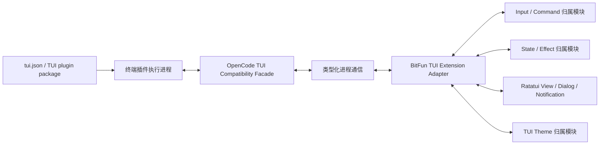

# OpenCode 终端界面插件适配设计

本文定义 OpenCode TUI Plugin v1 如何适配到 BitFun 基于 Ratatui 的终端界面。总体能力矩阵见
[`opencode-extension-compatibility.md`](opencode-extension-compatibility.md)，插件执行进程和兼容 Client 见
[`opencode-plugin-runtime-adapter-design.md`](opencode-plugin-runtime-adapter-design.md)，BitFun CLI/TUI 归属模块见
[`cli-product-line-design.md`](../cli-product-line-design.md)。

OpenCode `v1.17.20` 已包含独立终端插件 target，依据稳定版
[`packages/plugin/src/tui.ts`](https://github.com/anomalyco/opencode/blob/4473fc3c9055046183990a965d68df3db7ea6f62/packages/plugin/src/tui.ts)
和
[`packages/opencode/specs/tui-plugins.md`](https://github.com/anomalyco/opencode/blob/4473fc3c9055046183990a965d68df3db7ea6f62/packages/opencode/specs/tui-plugins.md)。
它没有 experimental 前缀，仓库称其为当前 v1 体系，但公共文档成熟度低，因此 BitFun 必须按 release commit
锁定样例并监控变化。

本文是目标设计。当前 BitFun 尚未加载 `@opencode-ai/plugin/tui` 或运行 OpenCode 的终端组件。

## 1. 目标与非目标

目标：

1. 覆盖 OpenCode 终端插件的发现、加载、顺序、插件参数/元数据、生命周期和非渲染接口。
2. 将 Route、Command、Keymap、Dialog、Toast、Prompt、Theme、Attention、State、KV、Client 和 Event 映射到
   BitFun TUI 归属模块。
3. 对需要 OpenTUI/Solid 原始组件运行时的能力明确降级，不以“存在构建期 TUI 布局选择”冒充兼容。
4. 插件渲染或事件异常不能卡住终端输入、破坏终端恢复或拖垮 Agent 会话。
5. 保持服务插件和终端插件 target 分离，一个 target 失败不使另一个 target 自动失效。

非目标：

- 不逐像素复制 OpenCode TUI。
- 不把 OpenCode `CliRenderer`、Solid 组件或 OpenTUI 节点泄漏为 Rust/Ratatui 公共接口。
- 不建立跨 GUI/TUI 的通用组件树或 UI DSL。
- 不让运行时终端插件修改构建期 TUI 布局选择、产品身份或产品能力上限。
- 不为了全量渲染兼容在首期维护第二棵完整终端渲染树。

## 2. 两类 TUI 能力

OpenCode 终端插件能力分为两类，适配策略不同：

| 类别 | 示例 | 适配判断 |
|---|---|---|
| 宿主操作和声明 | 命令、键位、导航、通知、Prompt、Theme、Attention、State、KV、Client、Event、插件启停 | 可以通过兼容 Facade 和 BitFun TUI 归属模块良好适配。 |
| 原始组件渲染 | Route component、Slot component、自定义 Dialog、`CliRenderer`、Solid/OpenTUI 节点 | 与 Ratatui 组件运行时不等价，首期只能降级或使用宿主提供的结构化容器。 |

这个区分不是安全限制，而是两种渲染器、组件模型、焦点和生命周期不兼容造成的技术边界。

## 3. 运行结构

TUI Facade 与服务插件 Facade 共享来源、依赖、Client、事件、期限和错误基础设施，但 target、注册表、生命周期
和渲染能力分别管理。

### 3.1 开发视图

| 开发部分 | 负责 | 不能承担 |
|---|---|---|
| TUI worker 适配库 | 加载 `@opencode-ai/plugin/tui` target，跟踪插件注册项并提供兼容 Facade | 持有 Rust 终端句柄或直接绘制 Ratatui Frame |
| TUI Extension Adapter | 把 Route、Command、Keymap、Dialog、Slot、Theme、State 等转换成类型化宿主操作 | 把 Solid/OpenTUI 组件函数伪装成可跨进程结构 |
| Input / Command 消费边界 | **已有行为、边界未抽取**：从当前 `chat.rs`、`ui/chat/*` 等真实终端路径增量提取最终键位、模式、冲突、命令和取消接口 | 理解 OpenCode 软件包和组件生命周期，或先建通用扩展框架 |
| TUI State / Effect 消费边界 | **已有行为、边界未抽取**：从当前终端状态和 effect 路径提取导航、Prompt、Dialog、Toast、Attention 与插件状态操作 | 允许 worker 直接写 reducer 状态 |
| Ratatui View / Theme 归属模块 | 结构化内容布局、焦点、颜色降级、终端恢复和可访问性 | 执行任意 Solid/OpenTUI 组件 |
| 插件状态与诊断服务 | target 启停、加载错误、渲染降级和恢复动作 | 把 TUI 插件失败升级为 Agent 会话失败 |

目标不是增加一套“通用界面扩展框架”。每项 OpenCode TUI API 只映射到已有或本阶段从真实终端路径补齐的最小
消费接口；若 BitFun 没有真实消费位置，则返回具体降级或不支持，不预先发布新的 GUI/TUI 公共组件契约。

## 4. 发现、加载和生命周期

目标复现稳定版行为：

- 一个软件包可以同时提供 server 和 tui target，但必须解析到两个各自只导出 `server` 或 `tui` 的独立模块，
  不能从同一模块导出两者；两个 target 独立启用。
- TUI 插件只从合并后的 `tui.json/jsonc` `plugin` 列表加载；OpenCode 不自动扫描 TUI 插件目录。BitFun 不把
  服务插件目录发现规则错误复用到 TUI target。
- TUI 模块只读取 default export `{ id?, tui }`，named exports 被忽略；文件插件必须提供 `id`，npm 插件可回退包名。
- npm TUI 入口只使用 `exports["./tui"]`，不回退 `main` 或包根；文件目录可以回退
  `index.ts/tsx/js/mjs/cjs`。npm 插件必须通过 `engines.opencode` 检查。
- 依赖按当前稳定版的 npm/Arborist 语义准备并禁用安装脚本，不使用 `bun install` 替代。
- Internal plugins 先加载；外部模块可以并行解析和 import，但激活串行提交，保持命令、路由和副作用顺序。
- 软件包按 package name 去重，后来源胜出，版本是否相同不影响身份；文件插件按解析后的精确 file URL 去重，
  胜出项保留 options 和来源。
- Route 同名时最后注册者胜出；实际胜出来源必须在诊断视图可见。
- `plugin_enabled` 配置按来源合并；应用级 KV 中保存的运行时启停状态在启动时覆盖同 id 的配置值。
- 初始化失败回滚该插件已经跟踪的注册项，继续加载其他插件。
- 主题专用软件包可以只声明 `oc-themes` 而不提供 `./tui` 入口；先同步主题，再以无操作 TUI 模块进入插件列表。
- 只有 file plugin 在动态 import 之前的 resolve/install 阶段出现可重试错误（冻结版具体为
  `missing package.json or index file`）时，才在依赖准备完成后重试一次；dynamic import、模块形状和初始化失败
  不重试，避免重复模块副作用或依赖 Bun 的失败 import 缓存。
- `--pure` / `OPENCODE_PURE` 只跳过外部 TUI 插件，不跳过内部插件。
- 启用、停用、重载和 dispose 不阻塞 TUI 输入线程；状态变更通过事件归约提交。
- 清理按注册的反向顺序等待执行，并使用插件主机统一配置的每 target 有界总预算；超时或异常后继续终端恢复。

BitFun 默认兼容策略允许 TUI 插件按 OpenCode 行为加载。用户或产品策略可以禁用终端插件、声音、系统通知、
工具覆盖或特定槽位，但策略差异必须显示为 `policy-limited`。

## 5. 能力映射

### 5.1 顶层接口完整清单

下表逐项对应稳定版 `TuiPluginApi`，不能用“界面能力”等分组名代替接口清单。`options` 和 `meta` 是传给
插件函数的第二、第三参数，不属于 `api` 对象。

| OpenCode 接口 | BitFun 适配 |
|---|---|
| `api.app.version` | 返回通过 `engines.opencode` 检查的冻结兼容版本；该协议没有 renderer 能力协商，不能仅靠版本号宣称 target 全能力可用。 |
| `api.attention.notify`、`api.attention.soundboard.registerPack/activate/current/list` | 转换为终端注意提示、平台通知和声音包操作。 |
| `api.command?.register/trigger/show` | 保留 v1 旧接口并映射到命令分发器，标记为 deprecated，不扩展其语义。 |
| `api.keys.formatSequence/formatBindings` | 按 OpenCode 格式化规则实现。 |
| `api.keymap` | 映射公开 command/binding/layer/mode 方法；依赖 OpenTUI Renderable 的部分明确降级。 |
| `api.mode.current/push` | 映射终端模式栈；`push` 返回的清理函数随插件清理。 |
| `api.route.register/navigate/current` | 保留 route identity、注册顺序、导航和当前路由；原始 render 单独判定。 |
| `api.ui.Dialog` | 原始 children/JSX 不可等价渲染，返回明确不支持。 |
| `api.ui.DialogAlert`、`api.ui.DialogConfirm` | 文本属性和结果映射到宿主对话。 |
| `api.ui.DialogPrompt`、`api.ui.DialogSelect` | 文本、选项和结果可映射；JSX description/footer 明确降级。 |
| `api.ui.Slot`、`api.ui.Prompt` | 原始组件渲染明确降级；Prompt ref 的结构化操作单独适配。 |
| `api.ui.toast`、`api.ui.dialog` | Toast 映射通知；dialog stack 的 clear/size/open 可映射，任意 replace(render) 降级。 |
| `api.tuiConfig` | 提供按独立 TUI 来源顺序生成的实时只读视图。 |
| `api.kv.get/set/ready` | 保持 OpenCode 应用级共享 KV 和 ready 语义。 |
| `api.state` | 提供版本化实时只读状态视图。 |
| `api.theme.current/selected/has/set/install/mode/ready` | 转换到 TUI 主题归属模块。 |
| `api.client` | 复用 OpenCode 插件客户端兼容门面。 |
| `api.event.on` | 提供 v2 事件订阅与清理。 |
| `api.renderer` | 原始 `CliRenderer` 不可等价，返回稳定 `unsupported` 并标记原因 `renderer-required`。 |
| `api.slots.register` | 保留注册身份、顺序、模式和清理；原始组件内容降级。 |
| `api.plugins.list/activate/deactivate/add/install` | 逐项映射查询、启停、当前会话加载和安装。 |
| `api.lifecycle.signal/onDispose` | 传播取消，反向执行清理并应用统一的有界总预算。 |

稳定源码中定义了 `TuiWorkspace` 类型，但它不在 `TuiPluginApi`，BitFun 不把它误列为插件接口。

### 5.2 配置、元数据与生命周期

| OpenCode API | BitFun 映射 | 兼容边界 |
|---|---|---|
| `api.app.version` | 返回当前冻结的 OpenCode TUI 兼容版本，不冒充 BitFun 产品版本 | 协议没有能力位；renderer 依赖必须按 target 运行结果判定，见下文。 |
| `api.tuiConfig` | 精确提供 `$schema`、`theme`、`plugin`，并把 `tui.scroll_speed`、`tui.scroll_acceleration`、`tui.diff_style` 展开到顶层，再补 `leader_timeout`、`attention`、`plugin_enabled`、`keybinds` | 不暴露一个额外 `tui` 属性；字段由冻结 `TuiConfigView` fixture 生成并保持实时只读。 |
| `options` | 第二参数是从 `[spec, options]` 提取后的 options record；字符串 spec 时为 `undefined` | 未知 option 由插件解释，Host 只做大小和可序列化检查。 |
| `meta` | 第三参数精确提供 id/source/spec/target、requested/version/modified、first_time/last_time/time_changed/load_count/fingerprint/state | `state` 只为 `first|updated|same`；字段来自实际加载记录，不伪造缺失信息。 |
| `api.lifecycle.signal` | target 停用或 TUI 退出前触发取消 | 先触发 signal，再执行清理。 |
| `api.lifecycle.onDispose(fn)` | 在 worker 内登记清理函数并返回取消登记函数 | 清理有期限；超时后回收 worker，不能阻塞终端恢复。 |

`options`、`meta` 和 `tuiConfig` 的字段表从冻结版 `packages/plugin/src/tui.ts` 生成 fixture；实现与验收不再手写
近似摘要。插件初始化时调用原始 renderer/JSX 能力并且该能力是 target 成立前提时，整个 target 返回
`unsupported(renderer-required)` 而不是“部分激活”；只在后续懒路径调用时仍可能得到同一稳定错误。
由于 `api.app.version` 没有能力位，BitFun 无法让插件在版本分支前识别这一差异，这是需明确确认的协议限制。

### 5.3 Route 与导航

| OpenCode 能力 | BitFun 映射 | 兼容程度 |
|---|---|---|
| Route id、注册、最后注册者胜出 | TUI Route Registry 保存来源和顺序 | 等价适配 |
| `route.navigate` 与只读 `route.current` | TUI State/Effect 事件 | 原生映射；稳定接口没有单独 back 方法。 |
| Route `render()` 返回的任意 Solid/OpenTUI component | 首期不直接嵌入；导航进入安全降级页并提供返回动作 | 不完整，见第 8 节 |
| BitFun 额外提供的结构化页面 | Markdown/列表/状态等宿主视图 | 仅属 BitFun 增强，不能计为现有 OpenCode 插件兼容 |

Route 注册成功不代表原始组件可渲染。若只有 route id 可识别、component 不可承载，状态必须显示
“Route 已注册、renderer 不支持”，不能打开空白页面或卡住导航。

### 5.4 Command 与 Slash Alias

- 映射到统一 Command Dispatcher，保留命令标识、标题、别名、来源和激活顺序。
- 保留 deprecated `api.command.register/trigger/show`，并把 v1 Keymap command 作为主路径。
- 命令处理通过终端插件执行进程调用，不在输入线程同步运行。
- 同名冲突按 OpenCode 顺序处理；产品保护命令生效时保留插件命令别名和差异诊断。
- 命令异常只终止本次命令，不破坏输入状态或退出终端 raw mode。

### 5.5 Keys、Keymap、Layer、Binding 与 Mode

- `api.keys.formatSequence/formatBindings` 按 OpenCode 字符串规则实现，不使用 BitFun 自有显示格式猜测。
- OpenCode command、layer、binding、mode 转成 BitFun TUI Input 事件和可解释绑定视图。
- leader、组合键、禁用和模式条件保留；平台不支持的按键产生明确 fallback。
- Keymap Hook 不能直接修改 Ratatui 状态；它提交绑定变更，由 Input 归属模块原子切换。
- 冲突或插件停用后重新计算最终映射，旧 handler 不继续接收按键。
- `api.keymap` 在 OpenCode 中暴露原始 `Keymap<Renderable, KeyEvent>`。文档化的 command、binding、layer、
  `dispatchCommand`、`runCommand`、查询和资源引用计数可以映射；依赖 OpenTUI `Renderable` 或未版本化内部方法的
  扩展返回明确降级，不能把这一组写成完全等价。

### 5.6 Dialog、Toast 与 Prompt

| 能力 | 映射 | 降级 |
|---|---|---|
| 文本/选择/确认 Dialog | BitFun TUI Dialog 归属模块 | 交互结果等价，布局不逐像素一致。 |
| Toast | Notification 归属模块 | 无弹层能力时进入状态行或日志视图。 |
| Prompt `current/set/reset/blur/focus/submit` | Input/Effect 归属模块 | 受当前输入状态和取消语义约束；稳定 `PromptRef` 没有 append。 |
| `api.ui.DialogAlert`、`api.ui.DialogConfirm` | worker 适配库把文本属性转成类型化宿主对话 | 布局不等价，交互结果和取消语义对齐。 |
| `api.ui.DialogPrompt`、`api.ui.DialogSelect` | 映射文本、值、选项、筛选和结果 | description/footer 中的 JSX 不能等价渲染。 |
| 基础 `Dialog`、`ui.dialog.replace` 或任意 children/render | 无法从任意 JSX 推导结构，返回 `unsupported(renderer-required)` | 不打开空白对话框，也不冻结 modal mode。 |

通知重复和插件异常必须限流；不能让一个插件持续弹窗阻断用户输入。

### 5.7 Slots

稳定版 Host slots 及其传入属性为：

| 模式 | Slot 与属性 |
|---|---|
| `replace` | `home_logo {}`、`home_prompt { ref? }`、`session_prompt { session_id, visible?, disabled?, on_submit?, ref? }` |
| `single_winner` | `home_footer {}`、`sidebar_title { session_id, title, share_url? }`、`sidebar_footer { session_id }` |
| 默认模式 | `app {}`、`app_bottom {}`、`home_prompt_right {}`、`session_prompt_right { session_id }`、`home_bottom {}`、`sidebar_content { session_id }` |

同一稳定提交的规范文字与 `tui.ts` 类型若存在属性差异，以冻结源码和可执行样例为验收依据，并记录差异，
不能把两边字段直接并集后宣称兼容。

`api.slots.register` 注册的是 Solid/OpenTUI 组件插件，不是文本或结构化槽位声明。因此首期可以识别槽位名称、
注册顺序、插件身份和清理生命周期，但不能渲染任意已有插件的槽位内容。所有当前 host slot 的内容统一标记
`unsupported(renderer-required)`，不创建空白占位、不永久占用布局，也不把“名称已识别”计为功能兼容。

如果某个插件只需要文本或状态，BitFun 可以额外提供结构化终端贡献接口，但这属于 BitFun 增强，现有 OpenCode
插件不会自动改用，不能用它替代原始 slot 兼容度。只有未来终端子表面桥能够承载原始组件后，slot 内容才可
提升为等价适配。

插件 slot 和构建期 TUI 布局选择不是同一控制平面。布局选择决定产品允许哪些区域，运行时插件只能向允许
区域贡献候选；不存在的区域使用上述降级，不修改构建期布局。

### 5.8 Theme

- `current/selected/has/set/install/mode/ready` 映射到 TUI Theme 消费接口；冻结 API 不额外提供主题列举方法。
- OpenCode 主题 JSON 先按自身键和覆盖顺序解析，再映射到 BitFun 终端语义色。
- 终端不支持 truecolor 时降级到 ANSI 或 monochrome，并保留原主题 id 和来源。
- 插件停用不自动删除用户已经显式安装的主题；临时主题预览随插件生命周期清理。
- `oc-themes` 主题专用软件包按 OpenCode 元数据状态同步；无 `./tui` 入口仍可安装，并在插件与主题来源状态中可见。

### 5.9 Attention、系统通知和声音

- attention 映射到状态行、窗口注意提示或平台通知。
- 系统通知按平台能力执行；不可用时退回 TUI 文本通知。
- sound pack 只在当前入口和平台有音频能力时启用；无能力时不报主流程错误。
- 用户可以关闭通知或声音；关闭状态显示为策略选择，不是插件失败。

### 5.10 State、KV、Client 与 Events

- `api.tuiConfig` 和 TUI synced state 通过实时兼容视图映射，不暴露 BitFun 内部 reducer 对象。状态至少覆盖
  config、provider、path、vcs、session count/diff/todo/messages/status/permission/question、part、LSP 和 MCP。
- OpenCode v1 的 `api.kv` 是同一 TUI 应用共享的 KV，不按插件命名空间隔离。默认兼容策略必须保持共享键和
  ready 语义；这意味着插件可能发生键冲突。用户选择受限策略时可以按插件隔离，但必须显示兼容降级。
- KV 读写在 worker 外持久化，写入失败返回稳定错误且不阻塞渲染线程。
- OpenCode Client 复用插件运行时兼容 Facade；TUI 专用方法映射到 TUI Effect 归属模块。
- TUI Plugin 使用 v2 SDK Event union，服务插件使用 v1 Event union；两者分别生成版本化事件清单。
- 冻结清单中的已知事件按版本化 schema 转发，并在进入插件前执行大小、深度和敏感字段处理。
- TUI v2 新事件采用 `unknown-but-observable`：只转发事件类型标记，不转发未经验证的 payload；待适配层加入该事件 schema 后再开放字段。服务 v1 未知事件跳过并聚合诊断。两种行为都必须显示兼容版本差异。

### 5.11 插件安装、启用和停用

- `api.plugins.list/activate/deactivate/add/install` 逐项适配；`add` 只加载当前会话，`install` 只安装并修改配置，
  不自动加载，两者不能合并成一个含糊的“安装成功”。
- `install` 成功后固定显示“已写入配置，当前会话尚未加载”，并提供“本会话加载”动作；若用户不加载，下次
  启动按配置正常发现并加载。重复安装同一精确 spec 返回已安装状态，不再启动第二次准备。
- TUI 发起的安装请求进入统一插件来源/依赖流程，不在界面进程直接修改依赖目录。
- 默认本地策略允许安装和启用，过程异步展示；失败不改变其他插件状态。
- 启停 target 独立：停用 tui 不自动停用同包 server target。
- OpenCode TUI API 有运行时 `list`，但稳定版 CLI 没有外部插件的 uninstall/list/update 命令。BitFun 可以提供
  额外管理命令，但必须标为 BitFun 增强，不能把推测行为标为 OpenCode 等价兼容。
- BitFun 增强的卸载入口必须显示将修改的配置层、server/tui target 和受影响项目；卸载先撤下对应贡献、处理
  在途调用，再移除配置引用。共享缓存只有在没有其他来源引用时才能回收。
- 显式 `pkg@version` 固定版本且不检查更新。稳定版规范称 bare `pkg` 可在缓存过期时刷新，但同一提交的实际
  `Npm.add` 在缓存命中后直接复用。BitFun 的兼容加载先遵循可执行源码；“检查更新/更新”单独查询 bare spec 的
  新版本，显示工具、Hook、依赖和权限差异后再切换。该源码/规范差异保留为冻结样例，后续 OpenCode 修正任一侧时
  只更新版本化适配规则。

## 6. 输入、焦点和终端恢复

- Ratatui/Crossterm Terminal Session 始终拥有 raw mode、alternate screen、鼠标、粘贴和退出恢复。
- 插件不能直接持有终端句柄或调用宿主绘制循环。
- Input Dispatcher 先解析最终绑定：没有活动插件绑定的按键只执行一次宿主默认处理；命中插件绑定后先标记为已消费，再异步调用 handler。插件 TUI effect 在成功返回前缓冲并原子提交；超时或取消时丢弃缓冲与全部迟到 effect，不再重放宿主默认动作，避免同一按键产生双重副作用。
- Dialog、Route 和 Slot 卸载时归还焦点；插件崩溃触发宿主安全页面和返回动作。
- panic、worker 丢失和用户中断都必须恢复终端状态，插件 dispose 不得阻塞恢复。

## 7. 界面异常隔离

- 插件状态变化经事件提交，不从执行进程直接写 Ratatui Frame。
- 原始组件不支持时直接进入可退出的降级页，不创建空白区域或占用焦点。
- 相同错误聚合并限流；用户可以从诊断页停用插件或恢复默认界面。
- 任意插件进程异常都不能阻止输入、退出或终端状态恢复。

## 8. 无法直接等价的边界

### 8.1 原始 `CliRenderer` 和组件树

OpenCode TUI Plugin 可以持有原始 `CliRenderer` 并注册 Solid/OpenTUI component；BitFun CLI 使用 Rust
Ratatui。二者在以下方面不兼容：

- 组件实例和响应式生命周期。
- 布局、测量、焦点、输入和事件传播。
- 终端 cell buffer、刷新节奏和样式对象。
- 插件持有的 renderer 方法、宿主 slot 上下文和清理语义。

直接把组件函数跨进程传给 Rust 不可行。首期适配宿主操作、结构化内容和交互结果，原始组件返回明确
`unsupported(renderer-required)`，并尽量保留插件其他命令、事件和状态能力。

### 8.2 可选的未来渲染桥

只有真实高价值插件因原始 renderer 被阻断，且结构化容器无法承载时，才评估独立“终端子表面”方案：在
OpenTUI worker 中离屏渲染受限区域，将 cell buffer、输入和焦点桥接到 Ratatui 区域。该方案需要解决双渲染树、
光标、宽字符、剪贴板、鼠标、resize、可访问性和崩溃恢复，故不进入当前粗粒度计划，也不能提前声明接口。

这项能力是当前最明确的功能降级。最终兼容复核必须列出受影响插件和替代行为，并由用户确认是否接受。

## 9. 验证要求

至少覆盖：

1. server/tui 双 target、default export、入口回退、插件 id、版本范围和依赖安装脚本禁用。
2. Internal、软件包和文件插件的去重、并行 import、串行激活和确定性冲突。
3. 第 5.1 节每一个顶层接口，以及 options、meta、KV 覆盖、反向清理和有界清理预算。
4. 所有稳定 Host slots 的名称、属性、模式、顺序和清理语义，以及统一的 `unsupported(renderer-required)` 状态。
5. 插件初始化回滚、运行崩溃、事件风暴、慢 handler、超大状态和 worker 丢失。
6. 终端 resize、窄宽度、低色彩、非 TTY、鼠标、粘贴、中断、panic 和 raw mode 恢复。
7. 原始组件不支持时，其他贡献继续工作，导航不进入空白或不可退出页面。
8. Windows、macOS、Linux 的键位、通知、声音和终端能力差异。
