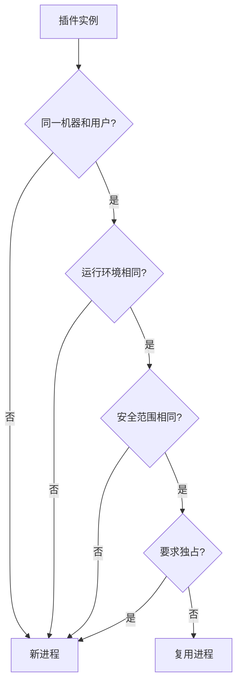
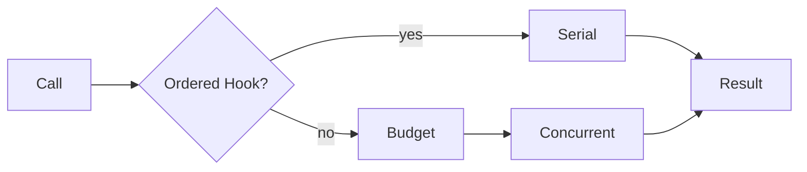
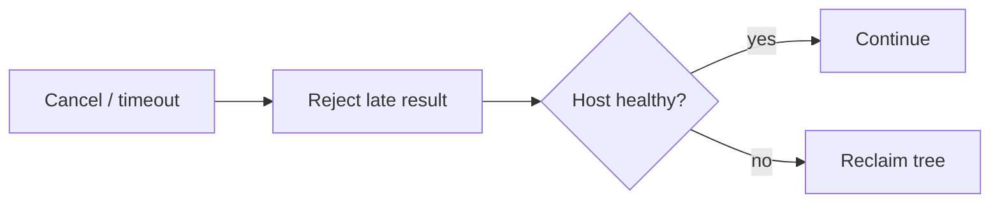
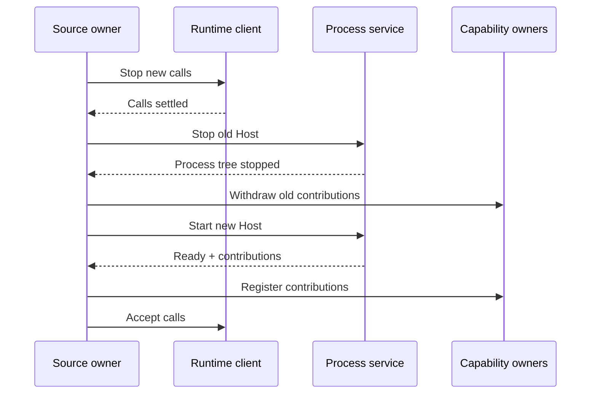
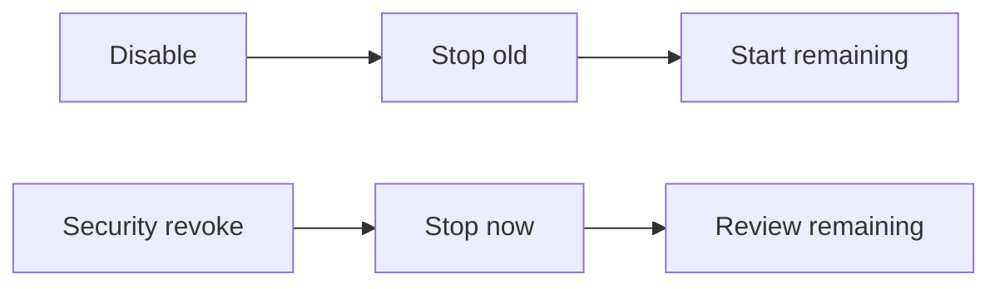
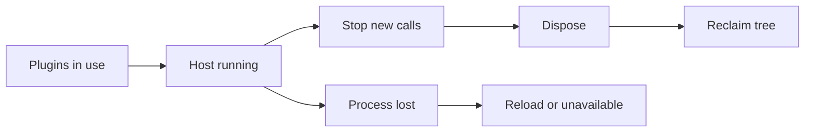
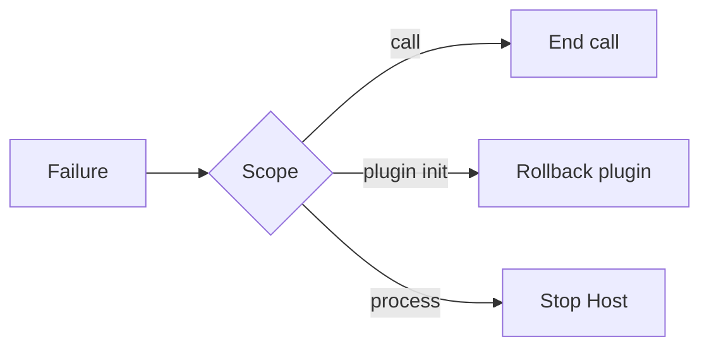
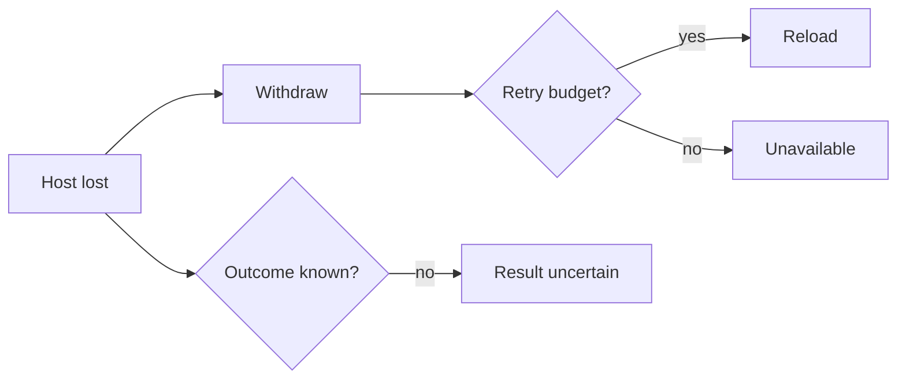
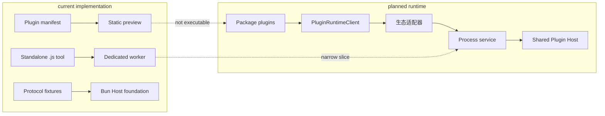

# 插件运行时与 Plugin Host 设计

本文定义 BitFun 主应用与第三方插件代码之间的运行边界。OpenCode 的兼容范围见
[`opencode-extension-compatibility.md`](opencode-extension-compatibility.md)，生态语义与脚本接口见
[`opencode-plugin-runtime-adapter-design.md`](opencode-plugin-runtime-adapter-design.md)，外部来源的发现、确认和状态见
[`external-ai-work-sources-design.md`](external-ai-work-sources-design.md)。详细设计与
[`../product-architecture.md`](../product-architecture.md) 冲突时，以产品运行时架构为准。多个 GUI/TUI/Remote/CLI/SDK
实例并存时，Rust Runtime 部署与 Plugin Host 复用关系见
[`../agent-runtime-deployment-design.md`](../agent-runtime-deployment-design.md)。

本文同时区分目标设计和当前实现；目标不能被写成已经交付的能力。

## 1. 名词和边界

本专题只使用以下既有对象，不再为同一职责增加 Host、Controller、Manager 或 Coordinator 别名：

| 名称 | 唯一含义 |
|---|---|
| Plugin Host | 运行 Bun 与第三方 JS/TS 插件的受监督子进程；Host 不在 Rust 主应用进程内 |
| `PluginRuntimeClient` | Rust 主应用内部现有调用端口；校验请求和响应，管理超时、同一插件的串行调用、重复请求结果缓存、诊断与故障隔离 |
| `ScriptToolRuntime` / `NodeScriptToolRuntime` | 现有脚本执行端口及 services 实现；当前负责 standalone Tool worker，后续 Plugin Host 的物理进程职责也应沿此边界扩展 |
| 插件实例 | 由来源、插件身份和当前内容版本确定的已启用插件；启停事实仍由现有来源与能力模块管理 |
| contribution | Tool、Hook、Command、Route 或界面项等对外行为；由对应能力归属模块注册和提交 |

workspace、project、session、turn、run 和 working directory 是不同事实。它们不能统称为 runtime scope，也不默认
决定 Plugin Host 进程数量。只有某项并发或权威状态确实要求单一实例时，负责该状态的归属模块才能把 workspace
或其他身份加入自己的状态键，并说明清理与迁移语义。

当前产品运行路径不执行第三方 package 插件。仓库中的 Bun Host、RPC 和 OpenCode 适配代码是协议与进程隔离基础，
由 fixture/mock 验证；Desktop 与 CLI 的自动启动策略保持关闭。在 contribution 归属、执行许可和故障恢复接入既有
Tool、Config、Permission、Session、Event、TUI 等模块之前，不得把这套基础设施视为已交付的插件执行能力。

## 2. 职责

| 部分 | 负责 | 不负责 |
|---|---|---|
| `PluginRuntimeClient` | 当前校验请求和响应；管理超时、同一插件的串行调用、重复请求结果缓存、诊断与故障隔离。目标再增加队列上限、取消后的结果失效，并拒绝旧 Host 的结果 | 运行 JS/TS、持有 OS 进程、决定来源顺序或提交业务状态 |
| 生态适配器 | 保留对应生态的加载顺序、参数、结果、错误和 Hook 语义 | 创建跨生态最低公分母或成为第二个业务归属模块 |
| `ScriptToolRuntime` 与 services 实现 | 当前启停 standalone worker；目标态沿同一 services 边界启停 Plugin Host，并持有完整进程树、资源预算、物理健康、IPC 和强制回收 | 解释 Hook、决定权限或保存插件业务状态；不得把 Rust 侧实现命名为 Host |
| Plugin Host | 加载真实模块，保存进程内模块实例，按适配协议执行 Plugin/Hook/Tool/Client 调用 | 成为第二个 Agent Runtime、写入 Rust 归属模块的权威状态或决定产品策略 |
| 能力归属模块 | 校验并提交 Tool、Hook 变换、配置、权限、会话、事件和界面贡献 | 直接加载第三方模块或管理 Plugin Host 进程 |

来源发现、用户选择和当前启用版本继续由各自已有归属模块管理；`PluginRuntimeClient` 只使用已经允许执行的插件实例，
不建立第二套来源、信任、激活状态或插件生命周期对象。

## 3. Plugin Host 进程布局

### 3.1 默认复用规则

同一实际承载 Agent Runtime/`RuntimeServices` 的 Rust 进程中，Plugin Host 按下面的兼容性决策复用：

workspace、session、插件和贡献数量都不是默认进程键。一个 Plugin Host 可以承载多个来源、多个
workspace 的逻辑实例和多个 session 的调用；这些身份必须随请求显式传递，进程内状态仍按生态的真实语义分区。
因此 Shared Agent Runtime 中多个 GUI/TUI/Remote Client 不会各自创建 Plugin Host；一次性 Embedded CLI、私有 SDK Host 和
目标机器 Runtime 则各自只管理自己的子进程树，不跨 Rust 进程或 execution domain 共享模块实例。

容量压力本身不直接创建进程。只有测量证明单进程队列不足，并且待拆调用同时满足“无共享模块状态、无顺序 Hook
语义、状态可序列化且可独立恢复”，才允许增加 Plugin Host。它不是通用 worker pool；闭包、模块实例、`globalThis`
或隐式单例没有显式合同与兼容测试时，仍留在原 Host。

### 3.2 插件之间的隔离承诺

Plugin Host 的首要目的，是把第三方 JS/TS 异常与 Rust 主应用进程隔开，不是把插件彼此隔开。共享同一 Host 的
插件会共同承担同步死循环、OOM、`process.exit`、进程级环境修改和未文档化全局状态带来的风险。BitFun 可以按
插件身份归因普通异常和撤下贡献，但不承诺同一 Host 内的插件故障互不影响，也不承诺兼容插件之间依赖
`globalThis` 或模块缓存的未文档化协作。

## 4. 生命周期

### 4.1 首次启动与装载

静态准备：

运行激活：

不能等到“首次工具调用”才启动通用 Plugin Host，因为 Hook、事件订阅、认证或 Provider 插件可能没有工具调用，
但必须先完成 import 才能知道真实贡献。依赖准备和 Host 启动在后台进行，不阻塞 GUI/TUI 主线程。

同一 Host 内的插件初始化按固定生态顺序执行。单个初始化抛错时，回滚该插件本次收集的贡献并继续处理后续
插件；如果初始化破坏进程、阻塞事件循环或使协议不可用，则按整个 Host 故障处理。

### 4.2 正常运行与并发

调用调度：

取消与超时：

写调用和可能产生副作用的调用不自动重试；只读调用仅在归属模块明确声明可重试时使用有限退避。心跳与进程存活由
Rust 监督路径检查，不能依赖可能已被同步插件代码阻塞的业务消息队列。并发额度来自在途请求、队列字节、调用类别和
真实资源测量，不由 workspace 数量推导。

通用设计不承诺自动识别 CPU 密集调用或把它们移入 worker pool。若未来为某类明确的无状态、可序列化调用增加
独立执行进程，必须单独定义状态复制、取消、如何拒绝迟到结果、资源上限和兼容差异。

### 4.3 更新与安全重启

插件 import 可能立即启动后台任务或产生文件、网络和进程副作用。因此新旧 Plugin Host 不能同时加载同一组插件。
旧 Host 服务期间只能做不执行插件代码的来源、完整性、依赖和策略检查；真正加载新代码需要一个短暂停机窗口。

进程服务必须通过 OS 进程句柄确认主进程退出，并确认 Job Object 或 process group 管理的后代已经回收；IPC 连接关闭本身
不构成停止证据。若旧进程树无法确认停止，不启动新 Host。若新 Host 加载或贡献注册失败，插件保持不可用；只有保存了
完整、校验通过的旧版本文件时，才可以按同一停机顺序重新启动旧版本，不能让旧进程在后台继续运行。

更新期间显示“更新中”。每个响应只按产生它的进程连接和 request id 结算；旧连接的迟到消息只记诊断。进程服务只管理
进程和连接，不发布 Tool、Hook 或其他业务贡献。

### 4.4 停用、空闲与应用退出

共享 Host 中的模块可能在加载时启动后台任务，因此停用一个插件不能只撤下它的贡献。普通停用也先停止并确认旧 Host，
再启动只包含剩余插件的新 Host；权限撤销或安全策略失效时立即阻止新调用并停止旧 Host，再检查和恢复仍然合规的插件。
取消后的迟到响应按 request id 丢弃，不需要增加插件级编号。

Host 生命周期由真实使用情况驱动：

首个完整 package-plugin 实现不对通用 Plugin Host 做空闲回收：保持一个共享进程通常比反复冷启动、import 全部
模块和重建状态更省时，也更容易维护。以后只有仅含可确定重建的按需工具、没有订阅和内存状态依赖，并且实测
内存收益高于冷启动成本时，才可以增加有期限的休眠；恢复时重新读取当前插件内容，并在新连接完成初始化后接受调用。

承载 RuntimeServices 的 Rust 进程退出时按以下顺序处理：停止新调用、取消可取消请求、有限等待正在执行的调用、逆序 dispose、
终止完整进程树。Shared Agent Runtime 的单个 Client 断线不是该生命周期事件；只要仍有活动插件实例、在途调用、事件订阅、
后台任务或其他 Client，兼容 Plugin Host 继续复用。清理超时不能阻止监督进程退出。

## 5. 状态归属与恢复

| 状态 | 权威位置 | Host 重启后的处理 |
|---|---|---|
| 来源、用户选择、执行许可和内容摘要 | 外部来源与安全归属模块 | 重新读取，不由 Host 猜测 |
| 当前内容版本与贡献注册 | 对应来源/能力归属模块 | 重新读取内容版本；完整重载并校验后再发布 |
| 重复请求结果和故障诊断 | `PluginRuntimeClient` 及只读诊断视图 | 按明确恢复条件清理，不由新进程静默抹除 |
| 子进程句柄、IPC 连接、物理健康和重启预算 | `ScriptToolRuntime` 所在的 services 实现 | 同一进程故障只消费一次进程级重启预算 |
| 模块实例、`globalThis`、闭包和内存缓存 | Plugin Host | 易失；不复制、不持久化，也不承诺恢复 |
| Tool/Hook/Config/Permission/Session 最终状态 | 各能力归属模块 | 不从 Host 内存反向恢复 |

workspace 可以参与来源查找、working directory、配置和某个插件实例的逻辑键，但不能因此升级为进程生命周期
归属模块。session、turn 和 call 只用于调用身份、取消和权限上下文，也不拥有 Plugin Host。

## 6. 故障传播与恢复

故障范围：

进程恢复：

Windows 使用 Job Object，Unix 至少使用独立 process group 管理完整进程树。无法阻止后代脱离或限制资源时必须显示
残余风险，不能把“独立进程”描述为完整沙箱。Plugin Host 故障不会终止 Rust 主应用，也不能让每个插件实例分别拉起
整组进程形成重启风暴。

## 7. 当前实现

当前受管 `bitfun.plugin.json` 链路仍只有来源校验、启停记录、CLI 诊断和 custom tool 静态预览，不执行 package
plugin、Hook、完整 Client 或 TUI 插件入口。与其独立的 standalone `.js` Tool 端到端能力当前由
`ScriptToolRuntime` 为每个脚本启动 Node worker；这是现有窄实现事实，不是目标 package-plugin 的进程模型。
Bun Host 基础设施仅覆盖模块加载、RPC/HTTP 桥和进程树生命周期等隔离边界；配置插件时 CLI 会明确报告该执行链路
尚未启用，不会静默导入或运行插件代码。

因此当前代码不得声称已经具备共享 Plugin Host、安全重启、通用进程级恢复或 Bun 兼容。目标实现应先用
固定 OpenCode fixture 验证多个插件的顺序初始化、Hook 顺序、共享进程崩溃、安全重启和状态恢复，再替换现有
窄执行路径。

## 8. 验证要求

当前 Rust 边界调整至少运行：

- `cargo test --locked -p bitfun-runtime-ports --no-default-features --features plugin-runtime --test plugin_runtime_contracts plugin_runtime_contracts`
- `cargo test --locked -p bitfun-runtime-ports --no-default-features --features plugin-runtime --test plugin_runtime_contracts plugin_runtime_diagnostics_contracts`
- `cargo test -p bitfun-plugin-runtime-client`
- `cargo test -p bitfun-opencode-adapter --test opencode_source_adapter`
- `cargo test -p bitfun-core --no-default-features --features plugin-runtime --lib plugin_runtime::tests`
- `node scripts/check-core-boundaries.mjs`

目标 Plugin Host 还必须使用固定版本真实 fixture 验证：

1. 多插件确定加载顺序、多个导出、Hook 顺序和并发 Tool 调用；
2. 普通异常、初始化失败、同步死循环、OOM、`process.exit`、协议损坏和进程树回收；
3. 共享进程故障时全部插件实例的同时失效、单次重启预算和禁止副作用重放；
4. 更新时先完成不执行插件代码的静态检查；停止旧组新调用并有界完成或取消在途调用，确认旧进程树已终止后，
   才加载新 Host 并发布贡献；验证旧连接迟到消息、结果未知、新 Host 加载失败和贡献注册失败；
5. 本地与 Remote、不同 OS 用户、不同后端，或沙箱、网络、环境变量和凭据条件不兼容时的必要多进程拆分；
6. 启动时间、常驻内存、并发吞吐、队列等待、安全重启停机时间和恢复时间。
