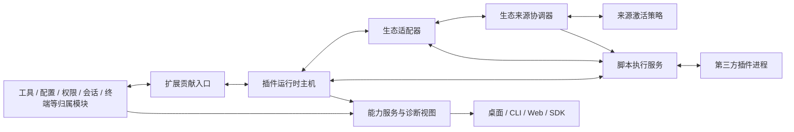
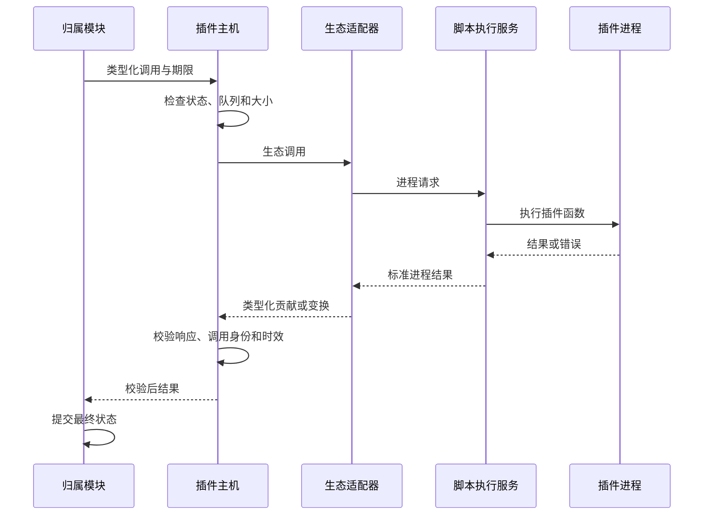

# 插件运行时主机设计

本文定义 BitFun 通用插件主机的职责、开发边界和运行方式。OpenCode 只是首个需要真实执行兼容的外部生态，
其完整能力矩阵见 [`opencode-extension-compatibility.md`](opencode-extension-compatibility.md)，脚本执行、兼容接口
和稳定钩子见 [`opencode-plugin-runtime-adapter-design.md`](opencode-plugin-runtime-adapter-design.md)，终端插件见
[`opencode-tui-plugin-adapter-design.md`](opencode-tui-plugin-adapter-design.md)。产品内置扩展与运行时插件的关系见
[`product-customization-blueprint.md`](../product-customization-blueprint.md)。
外部来源的产品发现、确认、导入与变更体验见
[`external-ai-work-sources-design.md`](external-ai-work-sources-design.md)；BitFun 能力输出到外部宿主、Provider Slot 和
跨宿主状态/事件边界见[`capability-runtime-integration-design.md`](capability-runtime-integration-design.md)。

本文同时描述目标架构和当前实现。标为“当前”的内容只解释现有代码，不构成 OpenCode 插件的长期接入要求。

## 1. 设计目标与边界

插件主机要解决四件事：

1. 在产品逻辑与第三方进程之间提供稳定、类型清晰的调用边界。
2. 管理调用期限、取消、有界队列、进程失联、崩溃恢复和诊断。
3. 把不同生态的输入交给对应适配器，不让生态原始类型进入 BitFun 内核或产品入口。
4. 把验证后的插件贡献交回工具、配置、权限、会话、终端界面等归属模块，由这些模块提交最终状态。

插件主机不负责：

- 复制 OpenCode 的智能体循环、会话内核、模型调度或完整服务器。
- 解释某个生态的配置、钩子或终端组件；这些工作属于生态适配器。
- 直接写入权限结果、工具结果、审计事实、会话状态或界面状态。
- 充当产品入口、公共 SDK 或插件商店。
- 用一个通用事件对象承载所有未来工具、钩子、客户端和界面调用。
- 承担 BitFun 能力导出到外部宿主的通用代理。导出 adapter 调用对外能力门面；只有需要运行第三方代码的导入
  路径才经过插件主机。

默认权限是否开放与主机可靠性是两件事。即使本地默认允许插件使用当前用户的文件、网络和进程能力，主机仍
必须提供进程隔离、期限、取消、背压、大小限制和崩溃回收。

## 2. 逻辑视图



| 部分 | 负责 | 不负责 |
|---|---|---|
| 扩展贡献入口 | 为真实消费方定义工具调用、钩子变换、客户端代理、界面贡献等窄操作 | 生态格式解析、进程管理、界面渲染 |
| 插件运行时主机 | 调用路由、期限、取消、队列、逻辑 target 状态、响应校验和故障状态 | OS 进程句柄/进程树、OpenCode 语义、最终业务状态、产品入口接口 |
| 生态适配器 | 保留生态加载顺序、参数、结果、错误和生命周期语义 | 成为新的 BitFun 业务归属模块 |
| 生态来源协调器 | 根据配置快照维护来源身份、监听、候选代次和切换决定 | 解析通用 BitFun 配置、管理 worker 或提交最终贡献 |
| 来源激活策略 | 结合来源/target、能力摘要、用户选择、执行域和组织上限给出自动应用、待确认或限制结论 | 解释生态加载顺序、管理 worker 或代替调用时权限判断 |
| 依赖准备服务 | 按生态兼容版本准备依赖、缓存和安装锁 | 执行插件代码或决定生态加载语义 |
| 脚本执行服务 | 唯一持有 OS 进程树与句柄，准备运行时/target，执行物理健康探测、资源预算、类型化请求和进程回收 | 决定工具权限、修改会话或直接操作界面 |
| 归属模块 | 校验并提交最终配置、权限、工具、会话、主题或终端状态 | 直接理解第三方模块和进程协议 |
| 能力服务与诊断视图 | 向产品入口说明可用、准备中、降级、失败及原因 | 暴露进程句柄或生态原始对象 |

OpenCode 的可写钩子不是只读通知。适配器按 OpenCode 顺序执行合法变换，归属模块只做结构、状态和当前策略
校验；默认兼容策略下不能无故丢弃变换。

## 3. 开发视图

当前代码与目标职责按下表收敛，避免再增加职责重叠的“管理器”或“大一统插件对象”：

| 代码位置或模块 | 当前职责 | 目标调整 |
|---|---|---|
| `src/crates/contracts/runtime-ports/src/plugin.rs` | 当前主机只读、通用派发和诊断契约 | 保持为通用、窄且有真实消费方的契约；不把所有 OpenCode 接口继续塞进通用派发 |
| `src/crates/execution/plugin-runtime-host` | 当前请求校验、期限和故障状态 | 承担通用调用可靠性；不依赖具体脚本运行时或生态类型 |
| `src/crates/assembly/core` 的产品组装点 | 当前选择插件运行时 binding 与可用性 | 选择并构造已编译的 adapter/provider，注入窄 `PluginRuntimeBinding`、执行服务和产品能力/策略上限；不发现动态来源、不准备依赖、不 import 插件代码 |
| `src/crates/contracts/product-domains` / `src/crates/services/services-integrations` 的插件来源模块 | 当前 BitFun 专用目录、内容校验、审核与启停状态 | 继续服务 BitFun 原生包；OpenCode 外部目录由兼容来源发现流程直接读取，不要求重新打包 |
| `src/crates/adapters/opencode-adapter` | 当前分别解释受支持的 Command、standalone Tool 和 Subagent 来源，并映射到独立 provider 契约 | 承担 OpenCode 格式/进程协议适配和 OpenCode Source Coordinator；不持有 worker、最终工具、配置、权限或界面状态 |
| 脚本执行服务 | standalone Tool 已有 provider-neutral `ScriptToolRuntime` 端口和 Node worker；package plugin 的依赖准备、Bun loader 与通用 worker 服务尚不存在 | 作为可替换服务管理运行时、依赖、worker 和资源回收；产品组装只依赖窄接口 |
| Tool / Config / Permission / Session / TUI 等消费边界 | Tool、Config、Permission、Session 等已有真实 owner；TUI Input/Command/State/Effect 等仍聚集在现有终端代码 | 复用已有 owner；缺失边界只从真实消费路径增量抽取，不先建通用扩展框架 |
| `src/apps/cli` 交互式 TUI（ChatMode） | 当前通过外部来源能力服务使用 Command、管理 standalone Tool 和 Subagent；顶层 headless CLI/`exec` 没有对应入口，也尚无 OpenCode package plugin 执行闭环 | 只消费能力服务、状态视图和操作接口，不直接调用主机或适配器 |
| Desktop | “外部 AI 应用”已展示来源、standalone Tool 与 Subagent 的审批、冲突和诊断；仍没有 managed-plugin/package plugin 的生产管理入口 | 继续只消费能力服务、状态视图和操作接口，不直接调用主机或适配器 |
| Web、Server、Remote | 当前没有生产插件执行入口；Server 仅有健康检查、信息与 ping 路由 | 出现真实入口后仍只消费类型化状态和操作接口，不复制插件主机 |

`src/crates/assembly/core` 的 `plugin_runtime` 运行时组合点是唯一可以选择具体生态 adapter factory、构造 adapter
trait object 并注入 Host 的位置。Host 只围绕注入对象工作，不自行发现生态模块。Config 归属模块只发布规范化
配置快照；OpenCode Source Coordinator 据此维护来源身份、监听、候选代次和切换决定；依赖/脚本执行服务负责
物化候选、唯一持有 worker/进程树并报告物理健康；Host 只负责逻辑 target 状态、调用和贡献注册。来源变化不触发产品重新组装，也不能把依赖或 worker
生命周期塞回 Config Service。

目标调用边界只需要四个窄接口；下列名称用于说明方向，不表示当前代码已有稳定 API：

| 方向 | 最小输入/输出 | 状态归属 |
|---|---|---|
| Config owner → OpenCode Source Coordinator | 规范化配置值、来源身份与顺序、配置代次；不含 worker 或动态导出 | Config owner 保存配置与来源解释 |
| Source Coordinator → 依赖/脚本执行服务 | 来源限定身份、target、候选代次、入口、依赖与有效策略；返回经摘要校验的 prepared target 引用 | Coordinator 保存候选/激活代次；执行服务保存缓存、进程句柄和物化结果 |
| Source Coordinator → Plugin Runtime Host | 已完成来源准入的 prepared target 引用、adapter binding、切换/停用请求；返回激活或失败状态 | Host 保存逻辑 target 状态、在途调用和贡献注册状态，不保存产品确认偏好 |
| Host → 依赖/脚本执行服务 | 经注入控制端口请求启动、类型化调用、取消、整树终止和物理健康探测；返回类型化结果/健康事实 | 执行服务保存 OS 句柄、进程树与资源事实；业务结果仍由归属模块提交 |

新增接口前必须先指出真实调用方和最终状态归属。工具调用、钩子变换、OpenCode Client 代理和终端贡献的输入、
期限、错误与返回语义不同，应分别建立窄路径；不能为了减少接口数量把它们编码成字符串事件和任意 JSON。

OpenCode `Provider` 钩子与当前代码中的 `ProviderCandidate` 名称含义不同。实施真实工具注册时，应把后者改为
`ToolProviderCandidate` 或等价的清楚名称，避免继续扩大歧义；本次文档变更不修改代码。

## 4. 运行视图

### 4.1 目标启动流程

```text
发现用户和项目来源
  -> 解析配置、入口和依赖
  -> 生成候选代次和能力摘要
  -> 来源激活策略自动允许或形成非阻塞待确认项
  -> 为已准入候选准备当前执行版本记录
  -> 为每个插件 target 启动独立脚本进程并进行健康检查
  -> 按生态顺序加载插件
  -> 收集真实工具、钩子和界面贡献
  -> 比较动态贡献；扩大时形成注册前待确认项
  -> 对每项贡献做结构与策略校验
  -> 注册可用贡献并发布状态
```

依赖准备、模块导入和健康检查在后台执行，不阻塞桌面或 TUI 主线程。来源仍启用、健康旧进程仍满足当前策略时，
代码或依赖更新准备失败可以继续使用旧进程并标记更新失败；旧进程丢失后只有精确旧物化目录仍可校验时才能
重建，否则明确“上一版本不可恢复”。首次准备失败只影响相应插件。显式停用、
删除、来源撤销、权限收紧或安全策略失效必须先阻止新调用并撤下旧贡献，不能以旧版本回退绕过当前意图。

来源发现和加载顺序不授予执行权限。任何可执行来源在首次激活、启动或 import 前，以及来源身份/内容版本、
target、执行域/用户、策略上限、凭据或环境范围变化时，由对应生态和安全 owner 重新评估来源准入；Host 不增加
第二套激活状态或通用信任数据库。产品层只按来源/target 保存加载偏好；经 BitFun owner/facade 的每次调用继续
执行调用时权限判断。OpenCode 来源首次启用或能力扩大时由外部来源体验形成非阻塞确认，激活后的默认运行策略
可以兼容优先；其他生态仍保留各自 owner 的 allow/ask/deny 语义。脚本运行时直接副作用只受真实
OS/容器边界约束，不能由 Host 调用准入推断为已拦截。

### 4.2 目标调用流程



每次调用都必须有唯一请求身份，以便取消、丢弃迟到响应和排查重复响应。需要重试时，由真实调用方根据错误
类型决定，主机不得默认重复执行有副作用操作，也不把内部请求身份暴露成用户配置概念。调用同时绑定来源限定
实例，以及能力 owner/生命周期协调器下发的 Capability Resolution Generation target fence；Host 只为在途调用
缓存和校验该派生 fence，不选择、持久化或恢复权威 active generation。切换或退出后的旧代次响应即使结构合法，
也不能提交到新代次状态。

Host 只产生调用、逻辑 target、队列、错误、取消和 fence 校验等运维事实，并投影脚本执行服务产生的物理进程、
健康和资源事实；它不成为这些事实的第二 owner。领域事件和产品分析继续由对应 owner 与事件/遥测边界产生；
Host 不解析 Prompt、Memory 或 Tool 内容自行打点，也不重复计算模型成本。

### 4.3 停用、变更与恢复

- 停用先阻止新调用，再从归属模块移除贡献，最后在有限期限内执行插件清理并回收进程。
- 来源或依赖变化会准备候选版本；切换后，旧版本的迟到响应和工具引用全部失效。
- import 前能够判断的直接执行包络、凭据范围、依赖行为或执行域扩大时，候选在准备/import 前进入待确认；
  import 后才发现的新工具、Hook 或界面贡献在注册前进入待确认。健康且仍合规的旧代次可继续服务。
- 已批准代码更新只有在来源身份/完整性可验证、来源更新策略允许且执行包络未扩大时，隔离候选才可以在原批准
  包络内 import；候选不得在确认前注册扩大后的贡献，但 Host 不能宣称注册前确认能够撤销 candidate import
  已产生的直接脚本副作用。
- worker 崩溃后由执行服务重建；重建旧代次必须绑定经摘要校验的精确物化目录，不能用当前来源冒充旧代码。
  同一插件连续失败时只暂停相应 target 或贡献，并提供恢复入口。
- 停用即使遇到来源文件缺失、损坏或扫描不完整，也必须能够清理残留启用状态；持久化结果不确定时明确返回
  失败，不能向用户宣称已经完成。
- 服务插件和终端插件是独立 target；一端失败、停用或重启不自动影响另一端。
- 暂时不可读与明确删除分开处理；删除、撤销、停用或策略失效必须撤下贡献，来源重新出现时作为新候选验证。

### 4.4 运行实例身份与贡献身份

管理对象必须使用“来源限定的运行实例身份”，至少包含生态、来源类型、规范化来源地址和 target；插件声明的
`id` 只是生态身份，不能单独作为查询、停用、更新、锁或故障隔离键。产品内置、BitFun 原生包和 OpenCode
标准来源即使声明相同 `id`，也必须能被分别查询和管理。

工具、命令、Hook 或 Route 等贡献继续使用各自公开 ID，并按 OpenCode 顺序参与覆盖。运行实例身份决定“管理
哪一个来源”，贡献 ID 决定“哪个行为最终胜出”，两者不能合并。当前仅以 `plugin_id` 过滤或加锁的契约不足以
支持同名来源共存，实施时必须先补来源限定身份，再开放产品内置与用户同名覆盖。

## 5. 调用类别与边界

| 调用类别 | 发起方 | 主机返回 | 最终提交方 |
|---|---|---|---|
| 工具发现与调用 | Tool 归属模块 | 真实定义、调用结果或类型化错误 | Tool 归属模块 |
| 钩子变换 | Config、Message、Provider、Command、Tool、Permission 等归属模块 | 按顺序变换后的值和来源 | 对应归属模块 |
| OpenCode Client 代理 | 插件执行进程 | 兼容结果或稳定 `unsupported` | 被调用能力的归属模块 |
| 生命周期 | 产品组装或插件管理服务 | 加载、健康、清理和恢复状态 | 插件管理状态归属模块 |
| 终端贡献 | TUI 归属模块 | 命令、键位、导航、通知、主题等结构化贡献 | TUI 归属模块 |
| 事件订阅 | Event 归属模块 | 版本化事件或订阅错误 | Event 归属模块 |

通用主机只承载跨生态都需要的调用可靠性。生态特有的 OpenCode Client 方法、`$`、TUI 槽位、事件联合类型
和原始配置留在 OpenCode 适配层；转换后才能跨越适配边界。

## 6. 可靠性要求

### 6.1 进程与队列

- 外部插件 target 使用独立操作系统进程，不与 Rust 主进程或其他插件共享不可终止的执行线程。
- 脚本执行服务必须唯一持有完整进程树：Windows 使用 Job Object，Unix 至少使用独立 process group。Host 不持有
  平台句柄，只能经注入的执行控制端口请求取消、超时、停用和退出时终止整棵树，不能只回收直接子进程。
- 内存、CPU 和子进程数使用平台可执行的 Job Object、cgroup/rlimit 等预算；无法提供硬限制的平台必须显示残余风险，不能仅凭独立进程承诺资源耗尽不会影响其他插件或宿主。
- 初始化、工具、钩子、客户端代理和清理分别设置期限；清理超时不能阻止产品退出或终端恢复。
- 请求队列和并发数必须有上限；过载立即返回稳定错误，不无限堆积。
- target 队列预算必须受产品/进程、执行域/工作区和 session/workflow 上层预算约束；插件或生态 adapter 只能在
  已准入调用中排序，不能通过创建更多 target 绕过总额度。具体默认数值由首个真实执行切片测量后确定。
- 心跳与健康检查不能与可能被长任务堵塞的业务队列共用唯一通道。
- 输入、输出和日志有大小限制；大结果使用现有对象存储引用或流式能力。
- 取消向执行进程传播；插件不响应时终止对应进程，且不得继续接受其迟到响应。
- 请求、取消、worker 丢失和响应校验必须保留 correlation/causation 与 Generation，供统一诊断；内容载荷默认不
  进入运维遥测。

### 6.2 错误与降级

至少区分：需要用户处理、不支持、版本不兼容、依赖准备失败、插件异常、超时、取消、过载、策略限制、进程失联、暂时不可用和无效响应；“暂时不可用”可在退避后重试，其他错误是否可重试由具体能力声明。

- 单个插件初始化失败只回滚该插件本次注册的贡献，继续加载其他插件。
- 单个钩子或工具失败只影响本次调用或相应贡献，不升级为主进程故障。
- 相同错误按插件、能力和根因聚合并限流，避免日志、Toast 和状态刷新风暴。
- 未知可选配置保留并诊断；未知事件按生态版本处理（服务 v1 跳过，TUI v2 只转发类型标记）；未知写入接口返回稳定错误，不伪造成功。
- UI 和 TUI 通过异步状态展示准备中、降级和恢复，不同步等待依赖安装或插件初始化。
- worker 丢失时，在途调用以“进程失联”结束，不自动重放可能已产生副作用的调用。自动重启必须按 target
  使用可配置的有界预算、退避和健康重置条件；预算耗尽进入“已暂停”，用户手动重试可开启新预算，但仍不重放旧调用。
  默认值只能依据首个端到端切片的测量结果确定，不能由多份设计文档分别冻结。

### 6.3 运行状态映射

产品一级状态统一使用[外部 AI 工作内容设计](external-ai-work-sources-design.md#7-状态与提示规则)中的集合。Host 只提供
可诊断的内部/详情事实，再映射为一级状态，不能公开第二套并列状态词：

| Host 内部/详情事实 | 一级用户状态 | 含义 |
|---|---|---|
| `discovered` | 已发现 | 已找到来源，尚未准备执行环境。 |
| `pending-preparation` / `pending-activation` | 需确认 | 详情必须区分 import 前等待与 import 后、贡献注册前等待。 |
| `preparing` / `ready` / `restarting` | 更新中 | 分别可显示“准备中”“准备完成，尚未激活”“正在恢复”的详情，不作为一级状态。 |
| `active` | 可用 | worker 健康且至少一项真实贡献可以调用。 |
| `degraded` | 部分受限 | 某些接口、平台能力或策略受限，其他贡献可用。 |
| 候选失败，健康旧代次继续 | 沿用上一版本 | 上一有效代次仍健康且符合当前策略。 |
| 来源暂时不可达 | 暂时过期 | 正在有界等待恢复。 |
| `failed` / `paused` | 不可用 | 详情显示失败或暂停原因及恢复建议。 |
| `removed` | 已移除 / 已停用 | 来源删除、撤销或显式停用，贡献和新调用已经撤下。 |

内部 `ready` 只能作为“更新中”的详情，内部 `active` 才映射为“可用”。静态名称预览只属于“已发现”，不进入
`ready/active`。来源记录、用户选择、来源准入、依赖准备和运行状态是不同事实；同一来源/target 能力摘要下不要求
用户对内部阶段逐层重复确认。

## 7. 默认权限与可选限制

OpenCode 来源完成首次激活后，本地默认运行策略以兼容为先：插件进程可使用当前用户通常拥有的文件、网络、子进程、环境和动态模块
能力。经 BitFun 能力接口的调用可以按来源、凭据、文件范围、工具覆盖和界面贡献细分；脚本直接文件、网络、
环境和子进程能力只能由真实操作系统/容器边界粗粒度限制，无法落实时必须停用相应 target。

策略收紧时：

- 只拒绝超出上限的贡献或调用，能继续工作的部分保持可用。
- 诊断明确标记“策略限制”，不伪装成插件异常或解析失败。
- 用户可以查看最终有效策略及其来源，并调整自己有权修改的部分。
- 插件直接使用脚本运行时产生的文件、网络和进程副作用未必能被 Rust 逐项拦截；受限模式不能可靠支持时，
  必须明确列出差异，不能宣称完整隔离或完整兼容。

默认开放不取消凭据脱敏、进程隔离、调用期限、取消、大小限制和崩溃恢复。

## 8. 当前实现附录

BitFun 受管插件包的 P0-C.1/P0-C.2 链路当前只验证了原生来源和静态预览：

1. 从用户数据目录的 `plugins` 和项目 `.bitfun/plugins` 发现 `bitfun.plugin.json` 包。
2. 校验清单、路径、文件大小和内容摘要，并保存工作区的来源审核与启停状态。
3. CLI 在启用前展示精确内容摘要；内容变化时旧启用状态失效。
4. 该受管包链路中的 OpenCode 投影只读取固定文件，使用有限字符串规则预览 custom tool 名称。
5. 产品组装只能读取带权限要求的工具候选；不加载 JS/TS，不注册或执行工具，也不运行钩子。

因此，受管包链路只能表述为“来源可识别、静态候选可预览”，不能表述为“OpenCode package plugin 可运行”。
CLI 已允许在包文件缺失或损坏时清理残留启用状态，这是现有链路必须保留的恢复能力。与此独立的外部来源轨道
已经接入 prompt-only Command、受支持的单文件 `.js` standalone Tool、Subagent 安全子集和 OpenCode MCP 配置
安全子集；其中 standalone Tool
通过窄 `ScriptToolRuntime` 真实执行，但这不证明 package plugin、Hook、完整 Client 或 TUI target 已经可运行。
四个切片当前都只在事实所在 Host 的本地执行域运行；本机 Desktop/CLI 直接使用本机 Host，Peer 控制界面可代理
Peer Host 的来源发现、审批与冲突决策，并按 Host 身份与工作区隔离结果。该能力不等于 SSH Remote 工作区执行；
SSH Remote 外部来源发现仍明确返回不支持，也不回退读取控制端或 Host 的同名本机来源。MCP
运行实例和工具 route 额外按规范化 workspace 隔离；更新、停用、空闲回收和删除先撤 route，再异步回收连接与进程，
慢启动在发布工具前复核撤销状态。

`bitfun.plugin.json` 继续作为 BitFun 原生包格式。现有外部来源轨道已直接发现用户和项目的 Command、standalone
Tool、Subagent 与 MCP 安全子集，包括配置文件中的受支持声明；远程、组织、系统管理员、MDM 和内联内容等完整
OpenCode 配置来源图尚未接入。后续 package plugin
路径还需直接发现 `.opencode/plugins` 和软件包配置并记录当前执行版本，不得要求作者先复制到 `.bitfun/plugins`
或维护另一份清单。

当前内部契约中的 `PluginRuntimeBinding`、通用派发、状态版本和静态候选可在迁移期保留，但不能据此设计完整
OpenCode API。package plugin 真实执行接入后，未被消费的过渡对象应删除或收窄，避免新旧两套调用模型长期并存。

## 9. Remote 与多执行域

- 项目插件在工作区实际所在的执行域发现、准备依赖和运行。
- 工作目录、工作树、shell、Client、网络和凭据都指向该执行域；远程项目不得静默回退到本机执行。
- 用户全局插件是否在远端生效必须由用户明确选择本地或远端范围，不能按路径字符串自动复制。
- 本地界面只代理状态、事件和操作；断线时返回暂时不可用，恢复后重新协商兼容版本和当前贡献。

## 10. 验证要求

当前实现修改仍应运行：

- `cargo test -p bitfun-runtime-ports --test plugin_runtime_contracts`
- `cargo test -p bitfun-runtime-ports --test plugin_runtime_host_contracts`
- `cargo test -p bitfun-plugin-runtime-host`
- `cargo test -p bitfun-product-domains --test plugin_source_contracts --features plugin-source`
- `cargo test -p bitfun-services-integrations --no-default-features --features plugin-source plugin_source --lib`
- `cargo test -p bitfun-cli --test plugin_source_cli`
- `cargo test -p bitfun-opencode-adapter --test opencode_source_adapter`
- `cargo test -p bitfun-core plugin_runtime::tests --lib`
- `node scripts/check-core-boundaries.mjs`

目标执行链路还必须使用冻结 OpenCode 版本的真实样例验证：

1. 本地插件、软件包插件、多个导出、standalone tools 和依赖加载。
2. 工具调用、全部稳定钩子、兼容 Client 和服务/TUI 双 target。
3. 初始化失败、死循环、崩溃、超时、取消、过载、大结果、迟到响应和确定性重启。
4. 默认兼容策略与用户收紧策略的差异和恢复路径。
5. Windows、macOS、Linux 以及本地、Remote 执行域行为。
6. 首次待确认不启动 worker；import 前执行包络扩大和 import 后动态贡献扩大分别确认；普通更新还须满足来源身份/完整性和更新策略，才可不重复确认并安全切换。
7. 候选失败、暂时不可达、明确删除、重新出现和上一有效代次不可恢复分别有独立状态与恢复行为。

审查时重点确认：是否有真实消费方、最终状态归属是否唯一、产品入口是否绕过能力服务、生态类型是否越过适配
边界，以及某项能力是否只有静态预览却被描述为可执行。
