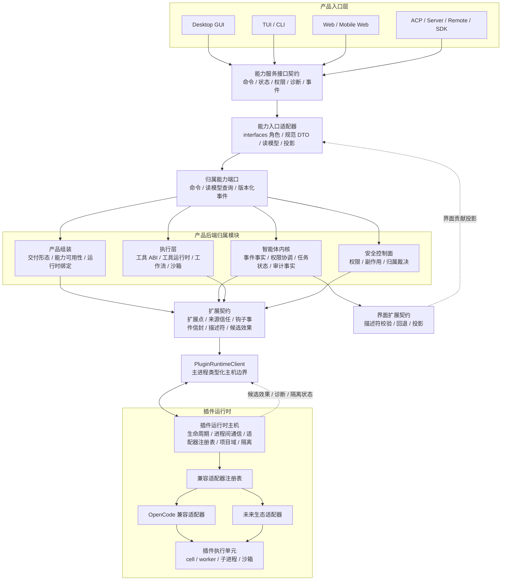
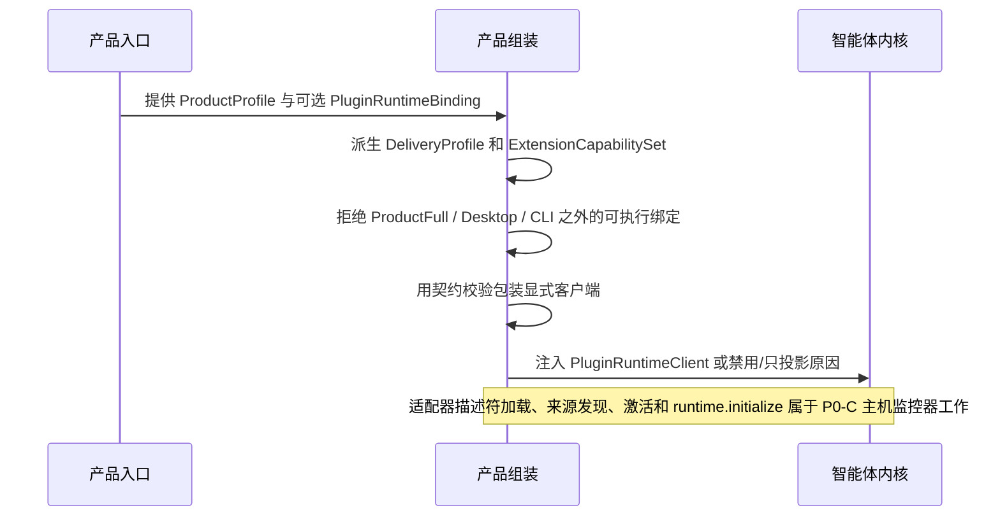
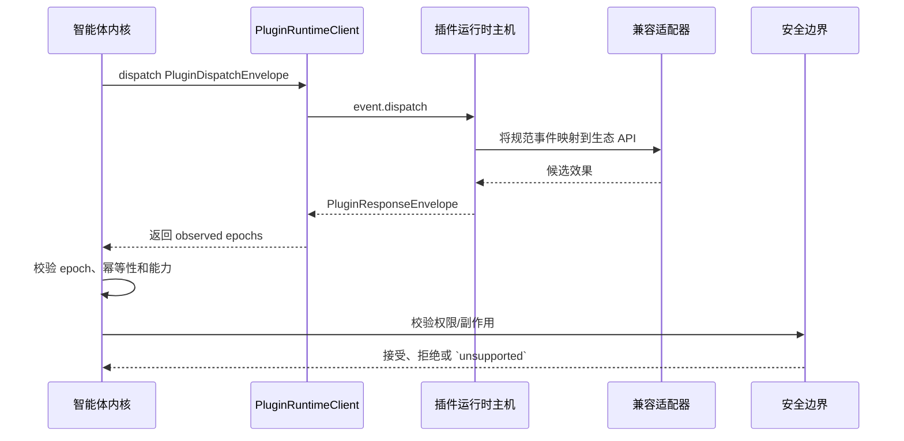
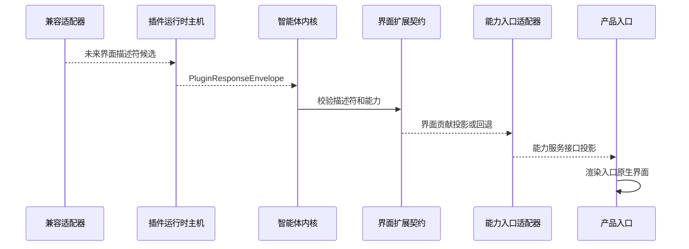

# 插件运行时主机与生态兼容适配层设计

本文件补充 [`product-architecture.md`](product-architecture.md)、
[`agent-runtime-services-design.md`](agent-runtime-services-design.md) 和
[`../sdlc-harness/features/opencode-compatibility.md`](../sdlc-harness/features/opencode-compatibility.md)。
本文件限定目标架构、契约和风险边界，不记录实施进度。

阅读路径：第 1-3 节说明插件运行时主机的目标、非目标、两层契约和总体关系；第 4-6 节说明主体进程 API、
产品组装能力模型和领域对象；第 7-14 节说明运行时、进程间通信、时序、OpenCode 映射、安全和验证细节。

## 1. 设计依据

插件扩展能力必须独立于智能体内核、产品组装、产品入口和具体生态适配器。目标模型包含四个边界：

- **插件运行时主机（Plugin Runtime Host）** 管理插件兼容层生命周期、项目执行域、进程间通信、隔离、健康、超时、幂等和候选效果路由。
- **兼容适配器（Compatibility Adapter）** 只负责把 OpenCode、Claude Code 等 JS/TS 运行时插件生态或 BitFun 原生插件 API 映射为 BitFun 稳定契约；Codex 插件按长期包元数据、skills、apps、MCP bridge 候选处理，不在 P0 声称 Codex runtime ABI 兼容。
- **BitFun 主体进程** 只依赖 `PluginRuntimeClient`、规范信封、候选效果、能力声明和界面描述符，不依赖任何具体生态适配器类型。
- **客户端入口** 只依赖能力服务接口契约（Server/API Contract），不依赖 `PluginRuntimeHost`、适配器、插件运行单元或生态原始载荷。

该模型将“插件运行时治理”和“生态 API 翻译”分离。主体进程通过稳定客户端替换适配器，插件失败通过显式状态降级，OpenCode
兼容层不得反向成为 BitFun 内部归属模块。主体进程如果需要按 `OpenCodeAdapter`、`ClaudeCodeAdapter` 等类型分支，
或需要读取插件运行单元内部对象，说明该边界已经失效。

契约分层：

| 契约 | 服务对象 | 本文件关系 |
|---|---|---|
| 能力服务接口契约（Server/API Contract） | 桌面 GUI、TUI/CLI、Web、ACP、Server、Remote、SDK 客户端 | 只接收命令请求、设置/能力投影、会话/工作区状态、权限提示、诊断、产物、能力可用性/状态、类型化错误和事件流；不暴露插件内部或主机内部 ABI |
| 扩展契约（Extension Contract） | 插件、钩子、自定义工具/MCP 提供方、界面贡献、生态适配器 | 包含扩展点、来源/信任、事件/钩子信封、描述符、候选效果、诊断和隔离状态 |

插件运行时主机位于扩展契约一侧。它产生的状态需要先经过能力入口适配器转成能力服务接口契约中的
能力、状态、诊断、产物、错误和事件投影，再由 GUI/TUI/Web/SDK 等客户端展示。

## 2. 目标与非目标

目标：

- 在智能体内核外提供受控插件运行时主机，承载 OpenCode 等生态兼容适配层。
- 让插件、钩子、自定义工具、事件订阅和界面贡献统一映射到 BitFun 的事件、工具 ABI、
  权限/副作用和界面扩展契约。
- 保持内核是任务状态、事件和审计事实的权威源；执行层是工具结果权威源；安全边界是权限权威源。
  插件只能返回候选效果。
- 让 Desktop、CLI、Server、Remote、ACP、Web、Mobile Web 和 SDK 显式启用、禁用或降级插件能力。
- P0 目标垂直切片是 Desktop/CLI 的 OpenCode 兼容插件；当前 P0-B 只交付主机边界
  与产品形态保护，Desktop/CLI 消费属于 P0-C。P0-B 不暴露用户可执行恢复动作，只保留
  隔离读模型、主机诊断、`HostRestarted` 清除条件和主机内部 `restart(project_domain_id, workspace_id)` 清理路径。Server、Remote、ACP、Web、Mobile Web 和 SDK 的完整插件运行时
  均按第 12 节进入 P0+。
- 支持插件在已声明扩展点上追加或覆写贡献，但覆写必须由产品组装、能力归属模块和安全控制面共同约束。

非目标：

- 不复制完整 OpenCode 运行时，不承诺任意社区插件无修改运行。
- 不将插件系统作为内置产品能力裁剪的主要机制；产品形态裁剪仍由 `ProductProfile`、`CapabilityPack` 和
  产品组装负责。
- 不将 JS/TS 运行时、worker、WebView 或子进程视为安全边界。
- 不允许插件直接写通过、失败、阻断、授权、审计、工具结果或产品状态。
- 不将插件 API 暴露成无约束 localhost 服务；默认使用受控 IPC。
- 不将插件运行时主机内嵌到智能体内核、工具运行时、工作流或产品组装的内部实现。
- 不将插件侧契约直接暴露给 GUI/TUI/Web/SDK；客户端只能消费能力服务接口契约中的投影。

### 2.1 产品形态、运行策略与扩展贡献

`ProductProfile`、`CapabilityPack`、`ProductCapabilitySet` 和 `OverridePoint` 的权威定义见
[`product-architecture.md`](product-architecture.md#8-产品如何成形)。本文件限定说明插件运行时涉及的子集：

| 类别 | 进入 BitFun 的方式 | 插件运行时关系 |
|---|---|---|
| 产品形态 | 产品入口、发布配置或白标配置选择 `ProductProfile`，产品组装选择内置 `CapabilityPack` | 不由插件决定；主机只按组装绑定启用、禁用或降级 |
| 运行策略 | 产品组装由 `CapabilityPlan`、提供方健康状态、许可证、工作区策略和安全策略派生 `CapabilityAvailabilitySet`，再形成 `ProductCapabilitySet` | 主机消费 `ProductCapabilitySet`、`CapabilityAvailabilitySet` 与策略快照；不能启用未构建能力 |
| MCP 提供方 | 组装层注册外部提供方；MCP 传输/目录在平台适配器，工具/资源/提示投影在执行层 / 稳定契约 | 不属于插件运行时主机，除非插件显式提供 MCP 适配器 |
| 插件贡献 | 主机校验描述符、提供方候选、事件订阅和候选效果 | 默认追加；只能在已声明 `OverridePoint` 上覆写 |
| 兼容适配器 | 主机内部适配器把 OpenCode、Claude Code 等 JS/TS 运行时插件生态或其他已评审生态 API 转为 BitFun 规范信封 | 适配器仅执行映射，不成为产品能力、权限或工具结果归属模块；Codex 插件仅作为长期元数据、skills、apps、MCP bridge 候选，不进入 P0 runtime ABI |

插件运行时主机只负责运行期扩展治理。外部生态可在受控位置增加或替换贡献，但不得替代产品组装
决定产品形态，也不得将运行时扩展结果写成新的内核事实。

## 3. 目标逻辑视图



依赖规则：

- 客户端入口只消费能力服务接口契约；它看到的是命令、设置、状态、权限提示、诊断、产物和可用性投影。
- 能力入口适配器是 `src/crates/interfaces` 层的受限 Server/API 适配器角色，负责规范 DTO、读模型、类型化错误、事件流和入口版本兼容；客户端入口不直接连到内核、执行层或安全控制面。
- 能力入口适配器只能通过归属能力端口或读模型查询访问后端事实，不能持有完整运行时、服务管理器、具体提供方或插件运行时客户端。
- 产品组装选择是否启用插件运行时、选择适配器集合、注入信任策略、执行域和禁用原因。
- 内核、执行层和安全控制面只通过扩展契约和 `PluginRuntimeClient` 通信；不加载插件代码，不读取 OpenCode 或其他生态内部对象。
- 插件运行时主机负责运行时治理和主机通信；不写权威状态，不绕过内核调用服务；进程、进程间通信监控、文件系统、网络或沙箱等平台能力必须来自 services/app 适配器注入的端口契约。
- 兼容适配器负责生态 API 到 BitFun 扩展契约的转换；不拥有工具执行、权限决策、审计或界面状态。
- 界面只消费经界面扩展契约校验后再投影到能力服务接口契约的界面贡献投影，不执行插件返回的界面代码。

### 3.1 契约分层规则

| 变化来源 | 应吸收变化的位置 | 不应影响 |
|---|---|---|
| Desktop / Web / TUI 展示方式变化 | 能力服务接口适配器或入口实现 | 扩展契约、插件运行时主机、兼容适配器 |
| 插件运行时主机实现变化 | `PluginRuntimeClient` / 主机归属 crate 内部 | 产品入口协议、智能体内核状态机 |
| OpenCode / 其他生态 API 变化 | 兼容适配器 | 产品组装、内核、执行层、产品入口 |
| 新插件贡献类型 | 扩展契约增量版本 + 产品真实消费方 | 既有能力服务接口请求/状态语义 |
| 后端服务归属迁移 | 产品组装注入和稳定端口 | 前端能力服务接口契约、插件 API |

跨模块间接调用数量不是本设计的优化目标；高频变化必须停留在对应适配器、门面或主机归属模块内部。

## 4. 主体进程 API 暴露面

BitFun 主体进程的插件相关 API 属于扩展契约，不是产品入口契约。GUI/TUI/Web/ACP 等入口不能直接调用这些 API；
它们只能消费能力服务接口契约中的命令请求、设置投影、会话/工作区状态、权限提示、诊断、产物、能力状态、类型化错误和事件流投影。

扩展契约中只允许包含下列稳定概念：

| 概念 | 所属 | 作用 |
|---|---|---|
| `PluginRuntimeClient` | 内核 / 产品组装可见 | 主体进程调用插件运行时主机的类型化客户端 |
| `PluginRuntimeBinding` | 产品组装可见 | enabled client、projection-only client 或 disabled stub |
| `PluginRuntimeAvailability` | 产品组装可见 | 表达交付形态、兼容等级、降级和不可用原因 |
| `PluginDispatchEnvelope` / `PluginResponseEnvelope` | 内核与主机边界 | 事件投递、响应、epoch、截止时间和诊断 |
| `PluginEffectCandidate` | 内核 / 安全边界可见 | 插件候选效果；必须重新校验后才能应用 |
| `UiContributionDescriptor` | 界面扩展契约 / 能力入口适配器可见 | 扩展契约侧声明式界面贡献；不携带可执行界面代码，进入客户端入口前必须转换为能力服务接口投影 |
| `PluginTrustPolicy` / `PluginSourceRef` | 安全边界可见 | 来源、hash、信任状态、能力和执行域 |

禁止暴露：

- `OpenCodeCompatibilityAdapter`、`ClaudeCodeCompatibilityAdapter`、`CodexPluginCompatibilityAdapter` 等具体适配器对象。
- 插件进程句柄、worker 句柄、WebView、包管理器客户端、解释器实例或内部模块对象。
- 完整 `RuntimeServices`、具体提供方句柄、会话管理器、界面状态、Tauri 句柄或产品命令注册表。
- 生态原始载荷作为公共 DTO；原始载荷只能存在于对应兼容适配器内部。
- 客户端入口专用界面状态、前端状态动作、Tauri 命令或 TUI 组件；这些属于能力服务接口契约或入口实现。

能力服务接口契约可以投影插件状态，但投影后的对象必须是客户端语义，例如插件状态投影、界面贡献投影、诊断、权限提示、产物链接、类型化错误、事件信封或命令可用性，而不是主机内部对象。

## 5. 产品组装能力模型

插件能力进入产品组装的类型化能力矩阵，不得隐藏在钩子、服务定位器或全局注册表中。
`ExtensionCapabilitySet` 表示产品扩展能力聚合，不表示旧的扩展主机类型；插件运行时边界由
`PluginRuntimeAvailability` 和 `PluginRuntimeBinding` 表达。

产品组装必须先根据 `ProductProfile` 和 `SurfaceContract` 派生 `DeliveryProfile`、内置能力计划
和扩展可用性，再把插件贡献叠加到允许的扩展点上。叠加规则是：默认追加、显式覆写、
失败可回滚、状态可诊断。插件不得通过运行时发现改变 `ProductProfile`、隐式启用未构建能力，或替换没有归属模块的内部实现。

```rust
pub struct ExtensionCapabilitySet {
    pub plugin_runtime: PluginRuntimeAvailability,
    pub adapters: Vec<PluginAdapterCapability>,
    pub ui: UiExtensionAvailability,
}

pub enum PluginRuntimeAvailability {
    Disabled { reason: UnsupportedReason },
    ProjectionOnly { reason: UnsupportedReason },
    Available,
    TemporarilyUnavailable { reason: UnsupportedReason },
}

pub enum PluginRuntimeBinding {
    Disabled(DisabledPluginRuntimeClient),
    ProjectionOnly(ProjectionOnlyPluginRuntimeClient),
    Client(/* sealed; use PluginRuntimeBinding::client(Arc<dyn PluginRuntimeClient>) */),
}
```

`PluginRuntimeAvailability` 可以作为主机 / 组装层的内部可用性事实，但进入能力服务接口契约时只能投影为
`available`、`projection-only`、`status-only`、`artifact-only`、`temporarily-unavailable`、`unsupported`、
`policy-denied` 或 `quarantined`；不得把原始 `unavailable` 作为能力服务接口状态词。

内部 SDK 最小特性只能依赖 disabled stub 或测试替身，不得隐式启动 JS/TS 运行时。`DeliveryProfile` 只能影响
绑定和能力选择，不得让智能体内核出现 `if desktop`、`if cli` 或 `if opencode` 分支。

允许覆写的贡献必须满足：

- 有稳定 `OverridePoint` id、能力归属模块、适用入口和回退。
- 有冲突策略，例如 single-winner、ordered-chain、内置能力锁定或 `policy-denied`。
- 有 permission/effect 声明，且最终授权、审计和状态写入仍由安全控制面完成。
- 有产品形态验证，证明启用、禁用、失败和回滚时不会改变未声明的产品行为。

## 6. 领域模型

| 领域对象 | 定义 | 关键约束 |
|---|---|---|
| `PluginRuntimeHost` | 管理插件兼容层生命周期、通信和隔离的运行时主机 | 不写权威状态，不执行产品策略 |
| `PluginRuntimeClient` | 主体进程调用主机的窄接口 | 不暴露具体生态适配器或运行单元句柄 |
| 主机内部 `CompatibilityAdapter` | 生态 API 映射器 | 仅执行翻译，不拥有权限、工具结果或界面状态 |
| `PluginExecutionUnit` | cell、worker、subprocess 或 sandbox | 只能访问主机门面白名单 |
| `ProjectExecutionDomain` | 工作区、信任、权限、工具注册表和事件订阅的隔离域 | 本地/远端必须用逻辑路径和执行域表达 |
| `PluginSourceRef` | 插件来源、版本、hash、签名和作用域 | hash 或来源变化必须重新信任 |
| `PluginTrustPolicy` | 信任状态、能力范围、撤销策略和执行等级 | 默认拒绝未知能力 |
| `PluginEffectCandidate` | P0-B 提供方候选；后续候选类型必须先绑定真实消费方 | 不能表示最终授权、审计或工具结果 |
| `UiContributionDescriptor` | 界面贡献的声明式描述 | 不能包含 React、DOM、Tauri 或可执行代码 |

## 7. 关键模块开发视图

目标放置原则：

```text
src/crates/contracts
  core-types / events / runtime-ports
    可执行客户端的 PluginRuntimeBinding 契约校验
    插件运行时 DTO、事件、能力/副作用、信任、界面描述符契约

src/crates/execution
  agent-runtime
    通过类型化运行时部件消费 PluginRuntimeClient
  plugin-runtime-host
    拥有可移植主机边界：生命周期、分发幂等、截止时间诊断、
    失败隔离和诊断读模型投影；具体 JS/TS 执行单元留在该 crate 外
  tool-contracts / tool-execution
    通过工具 ABI 物化已接受的工具提供方候选

src/crates/adapters
  opencode-adapter
    将 OpenCode 配置和本地插件来源事实映射为 BitFun 读模型与候选效果
    不得实现 PluginRuntimeClient 或声明可执行可用性
  future compatibility adapters
    通过同一适配器 trait 映射其他插件生态

src/crates/services
  services-integrations / terminal / services-core
    在端口后提供进程、进程间通信、文件系统、网络、远端和沙箱原语

src/crates/assembly
  product-capabilities / core
    从 ProductProfile 与 SurfaceContract 派生 DeliveryProfile、PluginRuntimeBinding、适配器集合和回退策略

src/apps/* / src/web-ui / src/mobile-web
  界面宿主和产品入口
    渲染已校验描述符或 `unsupported` 类型化错误状态
```

开发约束：

- 兼容适配器可以依赖规范契约和必要协议解析器；不能依赖 `bitfun-core/product-full`、界面实现
  或具体服务管理器。
- 主机门面由插件运行时主机提供；插件运行单元不能直接调用 OS、shell、网络、文件系统或凭据。
- 工具提供方候选只有被内核、安全边界和工具 ABI 接受后，才能物化为可执行提供方。
- 界面贡献只能通过描述符进入界面宿主；前端渲染实现位于对应产品入口。

## 8. 运行时与通信模型

默认模型是一个受产品组装选择的插件运行时主机。主机可以承载多个项目执行域，但每个执行域必须隔离：

- 工作区、worktree、执行主机、逻辑路径。
- 信任记录、权限范围、工具覆写表、事件订阅。
- 插件状态、环境变量、依赖缓存、审计流和资源预算。

Host 内部按风险选择执行单元：

| 等级 | 适用场景 | 约束 |
|---|---|---|
| cell | 受信任的观察、建议和只读 hook | 无 shell、无网络、无凭据；必须有 deadline |
| worker | 轻量保护、格式化建议、低风险工具候选 | 只能调用主机门面白名单 |
| subprocess | 高风险依赖、工具复写、崩溃隔离需求 | 独立进程、环境白名单、资源预算、工作目录限制 |
| sandbox | 未知来源或强隔离场景 | 无凭据、受控网络、临时或只读 worktree、可审计 |

远端工作区场景下，主机应靠近实际执行域运行。界面端只接收逻辑路径、描述符、诊断和审计摘要；
不得把远端绝对路径、SSH 细节或远端 OS 差异泄漏给插件 API 消费方。

## 9. IPC 与候选效果契约

传输可以用 JSON-RPC、framed protobuf 或 gRPC over pipe 实现；稳定契约只承诺 schema、语义和错误模型。
主机生命周期由产品组装或主机监控器管理；内核只通过 `PluginRuntimeClient` 投递事件、刷新快照并消费响应。

| 方法 | 方向 | 语义 |
|---|---|---|
| `PluginRuntimeBinding::Client` | 产品组装 -> 内核 | P0-B 只注入已构造且契约校验过的 `PluginRuntimeClient`，或注入 disabled / projection-only reason |
| `read_plugins` | 内核 / 组装层 -> 客户端 | 读取项目和工作区作用域内的插件来源、状态、诊断和隔离投影 |
| `dispatch` | 内核 -> 客户端 -> 主机 | 投递规范事件并等待提供方候选、诊断、隔离状态或超时 |
| P0-C `runtime.initialize` | 主机监控器 -> 主机 | 后续传入适配器清单集合、策略快照、传输能力；不属于 P0-B 已交付面 |
| P0-C `plugin.discover` | 主机监控器 -> 主机 | 后续发现配置、插件来源、hash、声明能力和兼容等级；不属于 P0-B 已交付面 |

```ts
interface PluginDispatchEnvelope {
  envelope_version: 1;
  event_id: string;
  event_type: string;
  event_version: string;
  project_domain_id: string;
  workspace_id: string;
  source: PluginSourceRef;
  declared_capability: PluginCapabilityRef;
  correlation_id: string;
  causation_id?: string;
  idempotency_key: string;
  deadline_ms: number;
  epochs: PluginRuntimeEpochs;
  payload_ref?: PayloadRef;
}

interface PluginResponseEnvelope {
  envelope_version: 1;
  request_event_id: string;
  project_domain_id: string;
  workspace_id: string;
  adapter_id: string;
  plugin_id?: string;
  completed_at_ms: number;
  effects: PluginEffectCandidate[];
  diagnostics: PluginDiagnostic[];
  quarantine?: PluginQuarantineState;
  // Extension-contract status only; clients receive Server/API projection.
  plugin_statuses: PluginStatusSnapshot[];
  observed_epochs: PluginRuntimeEpochs;
}

interface PluginEffectBase {
  effect_id: string;
  schema_version: string;
  declared_capability: CapabilityId;
  target_ref: TargetRef;
  data_classification: DataClassification;
  risk_level: "low" | "medium" | "high";
  permission: PluginPermissionGate;
  source_ref: PluginSourceRef;
}

interface CapabilityOwnerRef {
  kind: "product_feature" | "extension_contract" | "assembly_policy";
  id: string;
}

interface OverrideRollbackPolicy {
  mode: "remove_contribution" | "restore_previous" | "disable_plugin";
  reason_ref?: string;
}

interface PluginEffectCandidate extends PluginEffectBase {
  payload: PluginEffectCandidatePayload;
}

type PluginEffectCandidatePayload = {
  kind: "provider_candidate";
  provider_id: string;
  tool_contract_id: string;
};

type PermissionPromptEffectKind = "provider_candidate";

interface PermissionPromptDescriptor {
  descriptor_version: 1;
  prompt_id: string;
  plugin: PluginSourceRef;
  requested_capability: CapabilityId;
  requested_effect: PermissionPromptEffectKind;
  target: TargetRef;
  risk_level: "low" | "medium" | "high";
  owner: CapabilityOwnerRef;
  rollback: OverrideRollbackPolicy;
  // Extension-contract value; Server/API projection uses kebab-case stable status words.
  deny_state: "no_state_change" | "candidate_discarded" | "temporarily_unavailable" | "policy_denied" | "quarantined";
  audit: {
    correlation_id: string;
    event_id?: string;
  };
}

interface PluginDiagnosticBase {
  diagnostic_id: string;
  severity: "info" | "warning" | "error";
  plugin_id: string;
  source_ref: PluginSourceRef;
  audit_ref: {
    correlation_id: string;
    event_id?: string;
  };
}

type PluginDiagnostic =
  | (PluginDiagnosticBase & {
      kind: "trust_config";
      trust_result: "trusted" | "untrusted" | "revoked" | "requires_confirmation";
      config_validation: "valid" | "invalid" | "missing" | "unsupported";
    })
  | (PluginDiagnosticBase & {
      kind: "manifest";
      manifest_validation_error: string;
    })
  | (PluginDiagnosticBase & {
      kind: "host_availability";
      host_availability_reason: string;
    })
  | (PluginDiagnosticBase & {
      kind: "deadline";
      deadline_reason: string;
    })
  | (PluginDiagnosticBase & {
      kind: "quarantine";
      quarantine_reason: PluginQuarantineState["reason"];
      quarantine_scope: PluginQuarantineState["scope"];
    });

interface PluginQuarantineState {
  schema_version: 1;
  quarantine_id: string;
  source_ref: PluginSourceRef;
  scope: {
    kind: "plugin" | "capability" | "target" | "project_plugin";
    project_domain_id: string;
    workspace_id: string;
    plugin_id: string;
    capability_id?: string;
    target_kind?: string;
    target_id?: string;
  };
  reason: "host_failure" | "policy_violation" | "trust_changed" | "deadline_exceeded" | "adapter_failure";
  // P0-B exposes only host restart as a passive clear condition.
  clears_when: Array<"host_restarted">;
  log_ref?: PayloadRef;
  audit_ref: {
    correlation_id: string;
    event_id?: string;
  };
}
```

`HostRestarted` 由主机内部 `restart(project_domain_id, workspace_id)` 执行。该方法只清理对应执行域的主机隔离、隔离诊断投影、幂等 dispatch 缓存和空闲 dispatch lock；不得生成用户可执行恢复动作，也不得写内核、权限或审计成功状态。

P0-B 稳定主机内部 ABI 只允许 `payload_ref`，不得在公共 API 中绕过 schema 传递原始 JSON 或规范载荷。

`PermissionPromptDescriptor`、`PluginDiagnostic` 和 `PluginQuarantineState` 是扩展 / 主机侧结构化事实，
不是桌面设置、权限提示、CLI 诊断或审计的能力服务接口 DTO。需要用户确认的提供方候选
必须携带 `PluginPermissionGate::PermissionRequired`，并且 Host 侧事实必须绑定同一个 plugin、capability、target、
归属模块、回滚、拒绝后状态和审计/关联信息。

能力入口适配器必须只把这些共享事实投影为能力服务接口权限提示、诊断、插件状态投影或审计记录；桌面提示、CLI 诊断和审计不能直接消费主机内部 ABI 同一对象。
投影不一致必须让契约校验失败。主机不得只返回本地化文案或不可解析错误来表达权限确认、诊断或隔离状态；P0-B
不提供恢复动作字段，任何用户可执行恢复动作都必须等 P0-C / P0+ 有归属模块支持的恢复端口、审计事实和真实消费方后再暴露。

`UiContributionDescriptor`、`override_point` 和描述符渲染不属于 P0-B 主机内部 ABI。后续进入 P0-C / P0+ 时，
描述符仍不得包含 React 组件、HTML script、DOM selector、Tauri 命令、状态修改或任意可执行代码；
未知槽位、未知动作或缺失能力时，入口必须按回退策略降级，是否接受、排序、回滚和审计由产品组装、安全控制面与能力归属模块共同裁决。

`tool_result`、`permission_granted`、`audit_written` 和 `state_changed` 不允许作为插件响应类型。真实工具结果由
执行层写入；真实权限状态由安全边界写入；审计事实由内核写入。

## 10. 关键时序

### 10.1 插件运行时启动



### 10.2 事件分发与候选效果



### 10.3 P0-C / P0+ UI contribution 投影



P0-B 不公开界面贡献副作用载荷；界面贡献、描述符投影和入口原生渲染
属于 P0-C / P0+，必须在有真实产品消费方和安全评审后再进入稳定合同。

## 11. OpenCode 兼容映射

OpenCode 兼容适配器是插件运行时主机内部适配器，不是 BitFun 内部插件模型。
当前 `bitfun-opencode-adapter` crate 只提供测试夹具范围的来源/配置发现和类型化候选投影；
其公开 API 预算为空。它不得实现 `PluginRuntimeClient`，不得向产品组装或内核声明可执行可用性。
生产消费必须先经过插件运行时主机的注册、生命周期、信任/策略和副作用门禁设计评审。
界面 / CLI 消费降级状态时必须同时使用状态、诊断和隔离状态，不得只根据可用性原因推导用户可见结论。

| OpenCode 能力 | BitFun 映射 | 约束 |
|---|---|---|
| workspace / global plugin 配置 | P0-B 测试夹具范围的来源/状态投影；P0-C `plugin.discover` | 默认发现但不执行 |
| hooks object | P0-B unsupported 钩子投影为诊断 / 状态；P0-C 后再接入事件订阅 | 不伪造成副作用 |
| custom tools | `provider_candidate` | 启用后仍走工具 ABI 和权限门禁 |
| tool execute before | P0-B 诊断 / status-only；P0+ 才能设计受控只读候选 | 不能直接改写执行结果 |
| tool execute after | P0-B 诊断 / status-only；P0+ 才能设计证据候选 | 不能伪造工具结果 |
| permission hooks | P0-B 只能通过 `PluginPermissionGate::PermissionRequired` 表达候选需要确认；P0+ 才能设计权限桥接 | 不能直接批准 |
| client / server API | 受限适配器门面 | 只暴露规范事件、只读状态和候选提交 |
| shell helper | 默认禁用；可映射为受控工具请求候选 | 必须经过 shell 权限和沙箱策略 |
| SSE event stream | 内核规范事件订阅 | 不暴露主机内部事件作为权威流 |
| TUI/UI contribution | P0-B unsupported/status-only；P0-C/P0+ 才能设计描述符投影 | 只允许描述符，不允许直接操作界面状态 |

OpenCode 载荷只能存在于适配器内部。进入内核、执行层、界面或质量数据面的对象必须先转换为 BitFun 规范
DTO。

## 12. 产品形态与降级（长期矩阵）

本节能力矩阵是长期设计边界，不是 P0 验收范围。P0 约束以
[`product-architecture.md`](product-architecture.md) 为准：P0 只验收桌面设置/命令入口 + CLI 诊断的同一条
OpenCode 兼容插件垂直切片；ACP、Server、Remote、Web、Mobile Web 和内部 SDK 最小可用性在 P0 中只能是
`unsupported`、`temporarily-unavailable`、`projection-only` 或 `status-only`。`artifact-only` 是长期 Server/API 状态词，
只有在真实产物/结果投影消费者出现后才能进入入口验收。Server / Remote 主机、ACP 能力/权限桥接
和其他入口的完整插件运行时必须进入 P0+，并具备单独产品决策、迁移/回滚和验证指标。

| 产品形态 | 插件运行时策略 | UI 策略 | 失败语义 |
|---|---|---|---|
| Desktop / product-full | 可启用本地主机；高风险能力按信任策略提权 | 渲染已校验描述符 | 主机崩溃或超时不影响默认任务 |
| CLI | 可启用本地主机或只读投影 | 文本描述符 / 警告 | unsupported 明确输出，不静默忽略 |
| Server | P0 为 `unsupported` / `projection-only`；P0+ 才可按部署策略受控启用 | API 返回 `unsupported` 类型化错误或描述符投影 | 不自动启动本地 JS/TS 运行时 |
| Remote | P0 为 `temporarily-unavailable` / `projection-only`；P0+ 才可让主机靠近远端执行域 | 界面只接收逻辑路径和描述符 | 不回落到本地路径执行 |
| ACP | P0 为 `status-only` / `projection-only` / `unsupported`；P0+ 才可暴露 capability 或 permission bridge | 以 ACP 状态或 unsupported 表达 | 不将插件失败解释为 agent 失败 |
| Web / Mobile Web | 不启动本地主机 | 只消费后端投影描述符 | 不持有插件执行单元 |
| 内部 SDK 最小可用性 | P0 仅 disabled stub 或测试替身/客户端；生产可执行客户端注入属于 P0+ | 无默认界面宿主 | 不牵引 product-full 或具体提供方 |

能力矩阵：

| 能力 | Desktop / product-full | CLI | Server | Remote | ACP | Web / Mobile Web | 内部 SDK 最小可用性 |
|---|---|---|---|---|---|---|---|
| 发现 | 支持本地/项目发现 | 支持本地/项目发现 | P0 `projection-only` / `unsupported`；P0+ 由部署策略启用 | P0 `projection-only` / `temporarily-unavailable`；P0+ 在远端执行域发现 | P0 `status-only` / `projection-only` / `unsupported`；P0+ 通过 ACP 能力暴露 | 只消费后端投影 | 调用方注入或 disabled |
| 只读事件钩子 | 支持候选建议/证据 | 支持文本诊断 | P0 诊断投影；P0+ 支持 API 诊断 | P0 只读投影；P0+ 靠近远端主机执行 | P0 status-only；P0+ 映射为 ACP 事件/能力 | 只展示投影 | 测试替身/客户端可选 |
| 工具提供方候选 | 支持，必须经工具 ABI | 支持，必须经工具 ABI | P0 不执行；P0+ 受部署策略限制 | P0 不执行；P0+ 绑定远端执行域 | P0 不执行；P0+ 只作为外部工具能力 | 不执行 | 默认 disabled |
| 权限候选 | 只作建议，最终由安全边界决策 | 只作建议 | P0 不产生候选；P0+ 只作 API 候选 | P0 不产生候选；P0+ 绑定远端信任/策略 epoch | P0 不接入权限桥接；P0+ 映射为 ACP 权限桥接 | 只展示状态 | 默认 disabled |
| 界面贡献 | 描述符渲染 | 文本或命令投影 | P0 API 投影 / unsupported；P0+ 受控 API 投影 | P0 只使用逻辑路径投影；P0+ 受控远端投影 | P0 unsupported/status-only；P0+ ACP 能力或 unsupported | 描述符投影 | 默认无界面宿主 |
| shell helper | 默认禁用，可映射为工具请求候选 | 默认禁用 | 默认禁用 | 只允许远端策略批准 | 不直接暴露 shell | 不执行 | disabled |
| 只读状态视图 | 支持脱敏投影 | 支持文本投影 | 支持 API 投影 | 支持远端脱敏投影 | 映射为协议状态 | 支持只读投影 | 测试替身/客户端可选 |
| 可写 JS/TS 运行时 | 非默认能力，需独立安全评审 | 非默认能力 | 非默认能力 | 非默认能力 | 不作为默认能力 | 不执行 | disabled |

产品入口必须区分“未启用”“只读建议”“能力不可用”“候选被接受”。插件降级不能被解释为任务成功保障。

## 13. 安全与供应链

插件能力必须声明以下绑定：

- 来源：project、global、enterprise registry、signed bundle 或 remote source。
- 身份：适配器 id、插件 id、版本、hash、签名状态。
- 能力声明：事件、工具、文件、网络、凭据、界面贡献和执行域。
- 信任状态：未信任、只读信任、项目级信任、组织级信任、撤销。
- 执行位置：local、remote、worker、subprocess、sandbox、container。

安全规则：

- 未信任插件只能发现和展示，不能执行。
- 凭据、网络、shell、进程创建、包安装和动态 import 默认拒绝。
- 文件访问使用逻辑路径和工作区策略，不能暴露宿主绝对路径。
- 配置、插件源码或 package hash 变化后必须重新信任。
- 插件失败、崩溃、超时和旧 epoch 响应必须可诊断、可丢弃、可审计。

## 14. 验证矩阵

可执行验证目标以 [`../plans/core-decomposition-plan.md#8-验证矩阵`](../plans/core-decomposition-plan.md#8-验证矩阵)
为准。主机、适配器、产品形态或内部 SDK 最小可用性相关 PR 必须更新并运行其中固定命令；本节只说明覆盖面，不能用临时测试或
PR 文案替代执行计划里的固定目标。

| 验证面 | 必须覆盖 |
|---|---|
| 主体进程 API | 只暴露运行时客户端、绑定、信封、候选、信任和描述符 |
| schema | dispatch / response / effect candidate / permission prompt / diagnostic / quarantine state 序列化往返 |
| 时序 | initialize、deadline、cancel、stale epoch、idempotency key |
| 权限 | 插件不能 approve、不能写审计、不能伪造 tool result；权限提示字段必须覆盖来源/hash、副作用、目标、风险、归属模块、回滚、拒绝结果和审计引用 |
| 工具 | 工具提供方候选经工具 ABI 和权限门禁后才能物化 |
| UI | 描述符校验、未知贡献回退、无直接界面状态修改 |
| 安全 | 未信任插件不执行、hash 变化重新信任、secret/network/shell 默认拒绝 |
| 崩溃 | 主机、worker、subprocess 或 adapter failure 不影响默认任务；quarantine state 必须提供范围、原因、清除条件、诊断引用和审计引用；`log_ref` 为可选，P0-C 通过独立端口物化 |
| 远程 | 逻辑路径、远端执行域和权限范围不泄漏本地路径 |
| 产品形态 | Desktop、CLI、Server、Remote、ACP、Web、Mobile Web、SDK 的 unsupported 行为明确 |

通过标准是：插件运行时缺失、适配器不支持某能力、插件失败或外部插件返回非法结果时，默认 BitFun 任务行为、
权限语义、工具执行和审计事实保持等价。
