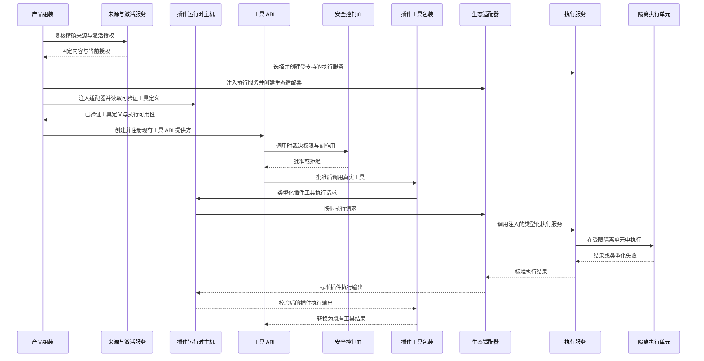
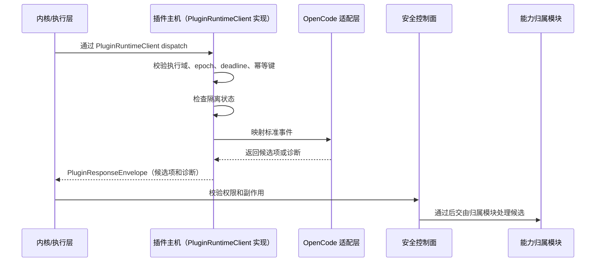
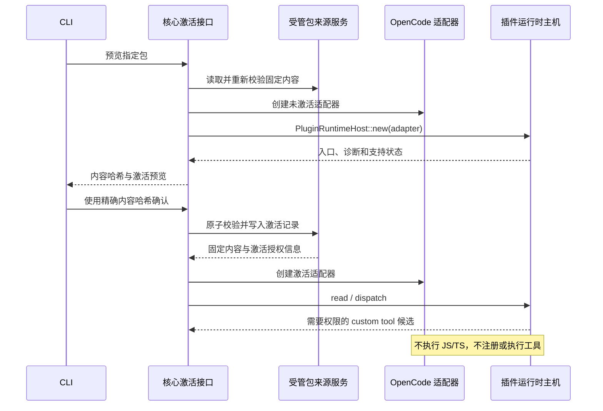

# 插件运行时主机与 OpenCode 适配层设计

本文件补充 [`product-architecture.md`](product-architecture.md)。产品入口、前后端 DTO 和产品形态状态词以主架构文档为准；本文件只定义插件运行时主机内部 ABI、主机职责、OpenCode 适配边界和验证要求。CLI 配置导入和插件管理入口见
[`cli-product-line-design.md`](cli-product-line-design.md)；产品内置扩展的组装、锁定和发行生命周期见
[`product-customization-blueprint.md`](product-customization-blueprint.md)。

## 1. 职责定位

插件运行时主机位于 BitFun 扩展贡献接口之后、插件执行单元之前。当前候选链路由它校验请求、收集候选项、记录诊断并维护隔离状态；后续启用插件执行时，它负责类型化调用边界、期限、隔离通信和生命周期事实校验，具体工作进程、沙箱和执行单元生命周期由产品组装注入的 `services` 执行服务负责。主机不能因为存在候选项就宣称执行能力可用。

插件运行时主机不是：

- 产品入口协议。
- SDK 门面。
- 第二个智能体内核。
- OpenCode 运行时复制品。
- 权限、审计、工具结果或界面状态的权威写入方。


关键边界：

- 产品表层入口、前端和命令只能消费能力服务接口和只读视图，不直接调用 `PluginRuntimeClient`。
- 产品运行时归属模块或组装后的主体进程访问主机时，只能通过 `PluginRuntimeClient` 和标准 read/dispatch 请求与响应对象。
- 适配器只在主机内部出现；主体进程不得按 `OpenCodeAdapter` 等具体类型分支。
- OpenCode 原始 payload 只存在于适配器内部，跨出适配层前必须转换为 BitFun 来源、诊断、候选项或类型化 unsupported。

## 2. 主机内部 ABI

当前主机内部 ABI 的唯一代码主入口是 [`src/crates/contracts/runtime-ports/src/plugin.rs`](../../src/crates/contracts/runtime-ports/src/plugin.rs)。根 re-export 受 `scripts/core-boundaries/rules/source/public-api-rules.mjs` 的公开接口预算约束；每个公开符号必须声明消费方、验证目标、线缆影响和 `contractSlice`。

| 对象 | 作用 | 稳定范围 | 禁止承载 |
|---|---|---|---|
| `PluginRuntimeClient` | 主体进程调用插件主机的窄接口 | `availability`、`read_plugins`、`dispatch` | install/enable UI 动作、具体适配器、worker 句柄、服务管理器 |
| `PluginRuntimeBinding` | 产品组装注入 disabled、projection-only 或 sealed client | 组装期绑定和降级事实 | 自动启动完整产品、隐式启用插件运行时 |
| `PluginRuntimeAvailability` | 主机可用性事实 | disabled、projection-only、available、unavailable | 前后端最终状态词原样泄漏 |
| `PluginRuntimeReadRequest/Response` | 插件状态、诊断和隔离只读视图 | 只读视图和诊断 | 用户可执行恢复动作、生态原始配置 |
| `PluginDispatchEnvelope` | 主体进程向主机投递标准事件 | event type、extension point、source、capability、deadline、epoch、payload ref | 原始 JSON payload、UI DTO、最终权限或工具结果 |
| `PluginResponseEnvelope` | 主机返回候选项和诊断 | 候选项、诊断、隔离、状态视图、epoch | accepted bool、授权写入、审计写入、工具结果写入 |
| `PluginEffectCandidate` | 插件贡献的候选项 | 当前只承载提供方候选（`ProviderCandidate`） | final result、permission granted、audit written、state changed |
| `PluginDiagnostic` / `PluginQuarantineState` | 诊断和隔离事实 | 类型化原因、范围、清除条件、诊断引用、审计引用 | 本地化文案作为唯一事实、不可解析错误、恢复动作 |

主机 ABI 不包含 `UiContributionDescriptor`、OpenCode client/server facade、shell helper、泛 hook registry、TUI/GUI 主题键或完整生态能力矩阵。
相关能力进入后续 PR 前，必须映射到已有工具、事件、权限子接口，或已预算的入口形态声明接口，并具备目标入口形态、消费方和验证路径。主机 ABI 不承载界面实现、渲染句柄或跨入口主题键。

`ProjectionOnly` 表示主机只返回只读视图、诊断或受权限门禁保护的候选项；插件代码没有被执行，最终工具结果、权限结果和审计写入也没有提交。

## 3. P0-B 与 P0-C 边界

| 阶段 | 交付内容 | 明确不交付 |
|---|---|---|
| P0-B | 主机内部 ABI、产品形态保护、read/dispatch 校验、deadline、epoch、幂等、隔离、诊断、`HostRestarted` 清除路径 | Desktop/CLI 插件消费、来源发现、激活、副作用执行、用户可执行恢复动作、界面贡献载荷 |
| P0-C.1 | BitFun 受管插件包发现、完整性校验、工作区来源审核和 CLI 诊断 | 插件执行、生产主机绑定、安装复制、随产品携带包和外部 OpenCode 目录导入 |
| P0-C.2 | 工作区激活、生产组装和 OpenCode custom tool 候选读取 | 最终工具注册或执行、完整 OpenCode 运行时、外部 OpenCode CLI 前置依赖、界面扩展矩阵、可写 hook |
| 首个可执行 custom tool（后续） | 一种明确制品的受限执行单元、真实工具提供方、工具快照与权限闭环、失败隔离 | 占位工具、隐式 npm 安装、依赖用户 OpenCode CLI、同时扩展钩子/界面/多生态 |
| 运行时插件本地安装与卸载（独立后续） | 用户或项目范围的本地安装、卸载和状态清理 | 把安装视为来源审核或激活、直接扫描并执行外部生态目录、在线仓库或自动更新 |
| 首个 CLI 内置扩展试点（独立后续） | Resolved Product Manifest 锁定的只读产品来源、来源凭据校验和既有执行路径复用 | 复用用户插件来源根、审核记录、更新或卸载状态；完整安装器、升级和回滚链路另行交付 |
| 其他 P0+ 能力 | Server/Remote/ACP/SDK 受控运行、更多 OpenCode hook、界面贡献、跨生态兼容 | 让外部生态接口成为 BitFun 内部归属接口，或将这些能力并入首个执行 PR |

P0-B 的完成标准只能证明主机边界安全，不能宣称 OpenCode-compatible 产品体验完成。
P0-C.1 只证明 BitFun 可以识别、校验和审核受管包；P0-C.2 覆盖 custom tool 候选预览和激活授权。两者都不表示插件代码已可执行。分发、执行和产品内置扩展具有不同生命周期，必须分别验收。

## 4. OpenCode 适配边界

OpenCode 适配层是主机内部的兼容适配层。它只解释来源服务提供的固定受管包内容，输出 BitFun 主机接口对象或诊断。

| OpenCode 输入 | BitFun 输出 | 当前边界 |
|---|---|---|
| 受管包内的 `opencode.json` | 配置诊断和 npm 插件只读状态 | 不安装或执行 npm 插件 |
| 受管包内的 `.opencode/plugins/*.js|ts` | 候选来源、配置诊断、能力诊断 | 不直接加载为权威状态 |
| 用户已有项目或全局 OpenCode 目录 | 当前无输出 | 未来必须经独立导入流程转换为受管包 |
| custom tool | `PluginEffectCandidatePayload::ProviderCandidate` | 当前只产生候选；受限执行单元就绪后才能进入工具 ABI 和权限路径 |
| permission hook | 当前只返回诊断；未来可映射为 `PluginPermissionGate::PermissionRequired` | 没有真实权限消费方时不产生候选，且不能直接批准 |
| `tool.execute.before/after` | 当前阶段诊断或 status-only | 不改写工具输入或结果 |
| events / SSE | 当前只返回诊断；未来可映射为公开事件清单的受控订阅声明 | 没有公开事件子集和真实订阅方时不产生声明，不读取内部事件结构 |
| TUI/GUI 界面贡献 | P0-B 返回 unsupported/status-only；P0-C/P0+ 需真实入口消费方、目标入口形态和主题语义 token 映射 | 不暴露可执行界面代码、渲染句柄或跨入口原始主题键 |
| shell helper | 默认 unsupported | 未来只能成为受控工具请求候选 |

OpenCode-compatible 表示文件形态和插件能力可被识别并映射，不表示：

- 用户必须安装 `opencode` CLI。
- BitFun 复刻 OpenCode 配置系统。
- OpenCode 的权限、启用顺序或插件状态成为 BitFun 权威状态。
- BitFun 为 OpenCode 暴露独立产品入口接口。

入口形态规则：

- 主机只接收目标入口形态、能力声明和候选项，不解释 TUI 键位、GUI 路由、CSS 变量或终端颜色键。
- TUI 只能消费命令、键位、状态/通知、主题语义 token 和只读状态；GUI 只能消费路由、面板、槽位、对话框、提示、主题语义 token 和只读状态。
- 主题键差异由对应入口宿主的映射表处理；插件主机不得把 GUI 主题键透传给 TUI，也不得把 TUI 键位或终端颜色键透传给 GUI。

## 5. 可执行工具准入

当前 P0-C.2 结束于 `ProviderCandidate` 和诊断。`ProviderCandidate` 不能直接转换为 `DynamicToolDescriptor` 或加入最终工具快照，因为它没有执行实现，静态声明也不足以证明输入 schema、依赖和副作用。

首个可执行 custom tool 必须形成一条完整路径。下图表示推荐的单一类型化主机执行操作方案；开始实现前仍需完成接口决策：



准入要求：

- BitFun 提供或随产品交付执行单元，不要求用户安装 OpenCode CLI；是否允许使用外部 Node/Bun 必须由产品策略明确决定，不能自动探测后静默启用。
- 首版只支持一种明确的插件制品和依赖规则。未支持语法、依赖或入口返回诊断，不注册占位工具。
- 工具名称、描述和输入 schema 必须来自执行单元实际加载后的定义或等价的可验证制品；静态探测结果只用于预览。
- 实际加载的工具标识必须与同一内容哈希下确认的候选集合一致；新增、缺失或重名均视为制品不受支持，不得部分注册。
- 插件工具包装由工具 ABI 的归属层持有，在权限批准后发起类型化主机执行请求，并把主机返回的插件输出转换为既有工具结果。主机只校验调用边界、隔离事实和标准输出，不创建工具提供方，也不提交最终工具结果。
- 具体工作进程、沙箱和执行单元生命周期属于 `services` 的执行服务实现。产品组装选择该实现并注入生态适配器；适配器只完成生态请求映射并调用注入的执行服务。插件主机不得依赖具体服务、执行载体或生态适配器类型。
- 当前 `PluginRuntimeClient` 和适配器都没有执行操作。PR2 必须在一个类型化主机执行操作与独立执行接口之间完成选择；不能复用 `dispatch` 承载最终工具调用。无论采用哪种入口，都必须保持上述所有权。新增接口必须同时具有插件工具包装这一真实消费方、公开接口预算和聚焦接口测试。
- 执行单元必须有独立期限、资源上限、环境变量白名单、取消和崩溃回收；网络、文件、进程和凭据能力默认关闭并走现有权限路径。
- 工具注册、激活授权和执行单元生命周期必须关联；包变化、停用、卸载、撤销或执行单元退出后，旧工具快照不得继续调用。
- 该阶段复用现有工具 ABI、权限和工具结果，不新增插件专用工具接口，也不同时引入可写 hook、界面贡献或多生态运行时。

## 6. 生命周期与隔离



隔离规则：

- 插件失败、超时、旧 epoch、非法响应或策略拒绝只能产生诊断、隔离或候选丢弃。
- 主机不得伪造权限通过、工具成功、审计成功或产品状态变更。
- `HostRestarted` 是 P0-B 唯一隔离清除条件；用户可执行清除、重试、重新审核和打开日志等动作必须在具有归属接口、审计事实和真实消费方后再暴露。
- `restart(project_domain_id, workspace_id)` 是内部清理路径，用于清除对应执行域的隔离、诊断只读视图和幂等缓存。
- 后续显式停用或清理残留激活记录时，必须按项目、工作区、包和可选激活代次定位记录；包已缺失或损坏时不能要求重新读取包内容。清理激活状态不等于删除来源审核历史。

## 7. 目录与来源原则

P0-C.1 只读取两个 BitFun 受管目录：用户数据目录的 `plugins` 和项目目录的 `.bitfun/plugins`。工作区同 ID 包覆盖用户包。包目录名必须与 `bitfun.plugin.json` 的 `id` 一致；清单声明文件及其哈希构成来源标识。信任记录按本地项目与工作区作用域存放在用户运行数据目录，不写回项目或插件包。

`adapter` 是来源模块不解释的小写标识；`opencode_compatible` 包的入口和能力只由 OpenCode 适配层解释。当前来源模块不扫描用户的 `opencode.json`、全局 OpenCode 目录，也不要求 `opencode` CLI 存在。外部目录导入、用户/工作区安装复制和卸载属于独立运行时插件流程，不复用 Canonical Config apply；接入后必须转换为用户或工作区范围的 BitFun 包来源和审核输入。插件包流程不得复制凭据、继承配置批准或直接建立激活授权。

产品内置扩展不是第三个用户扫描根。它从只读产品 bundle/source root 读取，由 Resolved Product Manifest 固定
`id/version/hash/signer`，随产品安装、升级、回滚和撤销；不读取用户 `SourceApproved`，用户/工作区同 ID 包
不能 shadow，也不能把产品来源信任推导为副作用授权。两类扩展只共享包清单/内容校验、Host ABI、隔离执行、
权限、审计和 quarantine，不共享来源根、信任记录、安装状态、优先级、更新通道或卸载生命周期。

当前 P0-C.1 只实现用户和项目两个受管目录；产品内置扩展 source root 在产品组装、安装器和更新链路存在
真实消费方及签名/回滚验证前不得伪装成已交付能力。

版本 1 包清单示例：

```json
{
  "schemaVersion": 1,
  "id": "acme.demo",
  "version": "1.0.0",
  "adapter": "opencode_compatible",
  "files": [
    {
      "path": ".opencode/plugins/demo.ts",
      "sha256": "sha256:<64 lowercase hex characters>"
    }
  ]
}
```

- `id` 以小写字母或数字开头，只允许小写字母、数字、`.`、`-`、`_`；`adapter` 以小写字母开头并使用同一字符集合。
- 清单文本字段拒绝控制字符；CLI 在输出包路径和诊断前再次转义控制字符。
- 文件路径必须相对包根目录，不能包含 `.`、`..`、反斜杠或盘符。来源标识和后续适配器访问范围只包含清单声明文件；未声明文件不进入审核范围，也不得被适配器读取或执行。
- 单文件、包总量、一次来源刷新或审核操作的总读取字节、总扫描时间和信任文件均有固定上限；校验失败或部分失败的读取同样计入操作预算，二次稳定性扫描不得重置预算。符号链接、Windows reparse point 和越出受管根目录的路径按错误处理。
- 工作区包存在时，用户级同 ID 包及其诊断归一化为 `shadowed_package`；工作区包无效时也不得回退。
- 本地项目 ID、工作区 ID 和来源标识基于平台原生路径摘要生成，避免非 UTF-8 或非法 UTF-16 路径经有损转换后共享信任；Remote、Server 或组织项目必须提供自己的身份来源。
- 信任文件按平台原生工作区路径摘要隔离并存放在用户运行数据目录。BitFun 进程的完整读改写使用同一文件锁；锁等待受操作期限约束，阻塞写入任务持锁直至替换与同步完成，调用 future 取消不能提前释放锁。写入使用同目录临时文件、大小上限、Windows 备份恢复和平台原子替换；提交前复核文件身份。激活后目录同步失败时返回持久性警告；停用后目录同步失败时返回错误，不能向用户声明已确定停用。该锁只协调遵守同一锁文件的 BitFun 进程，不承诺阻止其他进程直接篡改用户信任文件；外部修改在后续读取时按文件身份或内容校验结果处理。文件重建时使用新的随机初始 epoch；扫描不完整时保留原记录但不返回 `SourceApproved`，也不允许写入新决定。
- 具体文件系统校验和信任持久化归 `services-integrations/plugin_source`，`bitfun-core/plugin_source` 只注入产品目录并保留兼容接口。
- 产品路径初始化失败或全局路径管理器已降级到临时目录时，来源列表、审核和 `doctor` 必须返回错误，不得在临时目录中创建信任记录。
- 产品域的 `SourceApproved` 只确认来源内容。CLI 激活预览展示适配器、入口、静态候选名称、高风险标记、权限要求和内容哈希；确认命令必须提交相同哈希。
- 来源服务按包重新校验清单、声明文件和哈希，并返回固定内容的包输入。OpenCode 适配器不得根据包路径再次访问文件系统，也不得直接扫描工作区或用户 OpenCode 目录。
- 来源服务维护精确来源激活记录，并为每条新记录保存签发代次。内容变化、拒绝、撤销或停用会清除对应记录；重复写入相同状态不推进代次，其他包的状态变化不使当前记录失效。
- 激活提交必须保证选中来源、来源优先级、内容摘要和审核代次在提交点一致；并发变化时失败关闭，后续使用时继续复核激活授权。锁范围、内容重哈希和提交点属于来源服务实现设计，只有在锁等待或慢文件系统测试证明存在问题后才调整。
- 普通固定输入保持未激活，只返回来源和诊断。激活授权信息只包含项目、工作区、精确来源和激活代次，不复制包内容；产品组装点在 read 前以及 dispatch 前后向来源服务复核授权。
- 当前只读取声明，无法判断 custom tool 的实际副作用，因此候选统一采用高风险级别；适配器不得根据工具名称降低风险。
- 当前 Binding 使用 `PluginRuntimeEpochs.trust_epoch` 传递激活代次，适配器只用它校验激活作用域。来源审核代次不进入 Host；当前候选投影不消费项目状态和产品策略，因此 `project_epoch`、`policy_epoch` 为 `0`，`tool_registry_epoch` 为空。具体适配器工厂只允许由 `bitfun-core/plugin_runtime` 调用。
- 单个来源服务实例串行生成固定内容输入；扫描和稳定性复核共享同一字节与时间预算，返回前再次确认信任 epoch、目标来源身份和 `SourceApproved` 状态。固定输入构造同时限制文件数量、单文件大小、包总量和声明文件集合。
- OpenCode 声明解析限制单个来源最多 128 个 custom tool、单个受管包最多 256 个、单个工具标识 64 字节；`opencode.json` 最多声明 128 个 npm 插件且名称与元数据总量受限。超限包不进入候选构造。



## 8. 验证要求

最小验证目标：

- `cargo test -p bitfun-runtime-ports --test plugin_runtime_contracts`
- `cargo test -p bitfun-runtime-ports --test plugin_runtime_host_contracts`
- `cargo test -p bitfun-plugin-runtime-host`
- `cargo test -p bitfun-product-domains --test plugin_source_contracts --features plugin-source`
- `cargo test -p bitfun-services-integrations --no-default-features --features plugin-source plugin_source --lib`
- `cargo test -p bitfun-cli --test plugin_source_cli`，验证 `list/approve-source/activate/deactivate/deny/revoke/doctor`，以及过期内容哈希不得激活。
- `cargo test -p bitfun-opencode-adapter --test opencode_source_adapter`，验证普通输入仅返回只读状态，激活输入产生权限候选，错误作用域或旧代次不触发永久隔离。
- `cargo test -p bitfun-core plugin_runtime::tests --lib`，验证唯一产品组装点、无支持能力时不写入激活，以及停用或内容变化使既有 Binding 失效。
- `node scripts/check-core-boundaries.mjs`

PR 审查重点：

- 是否新增无消费方的公开接口。
- 是否绕过公开接口预算。
- 是否把 OpenCode 概念提升为 BitFun 内部归属模块。
- 是否让产品入口直接消费 host ABI。
- 是否新增可写 hook、shell/env helper、界面贡献或多生态兼容能力，但没有真实消费方和安全评审。
