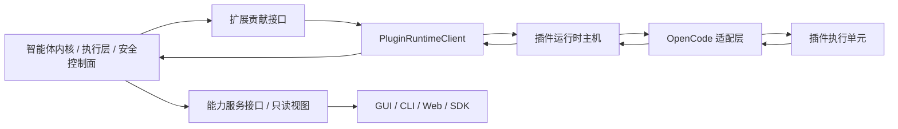
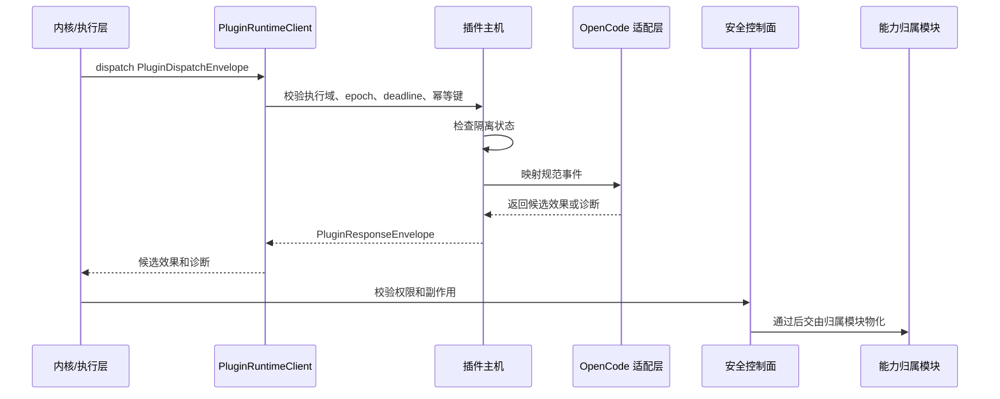

# 插件运行时主机与 OpenCode 适配层设计

本文件补充 [`product-architecture.md`](product-architecture.md)。产品入口、前后端 DTO 和产品形态状态词以主架构文档为准；本文件只定义插件运行时主机内部 ABI、主机职责、OpenCode 适配边界和验证要求。

## 1. 职责定位

插件运行时主机位于 BitFun 扩展贡献接口之后、插件执行单元之前。它负责隔离插件执行、分发规范事件、收集候选效果、记录诊断、维护隔离状态和保护默认任务路径。

插件运行时主机不是：

- 产品入口协议。
- SDK 门面。
- 第二个智能体内核。
- OpenCode 运行时复制品。
- 权限、审计、工具结果或界面状态的权威写入方。

关键边界：

- 产品入口只能消费能力服务接口和只读视图，不直接调用 `PluginRuntimeClient`。
- 主体进程只能通过 `PluginRuntimeClient` 和规范信封访问主机。
- 适配器只在主机内部出现；主体进程不得按 `OpenCodeAdapter` 等具体类型分支。
- OpenCode 原始 payload 只存在于适配器内部，跨出适配层前必须转换为 BitFun 来源、诊断、候选效果或类型化 unsupported。

## 2. 主机内部 ABI

当前主机内部 ABI 的唯一代码主入口是 [`src/crates/contracts/runtime-ports/src/plugin.rs`](../../src/crates/contracts/runtime-ports/src/plugin.rs)。根 re-export 受 `scripts/core-boundaries/rules/source/public-api-rules.mjs` 的公开接口预算约束；每个公开符号必须声明消费方、验证目标、线缆影响和 `contractSlice`。

| 对象 | 作用 | 稳定范围 | 禁止承载 |
|---|---|---|---|
| `PluginRuntimeClient` | 主体进程调用插件主机的窄接口 | `availability`、`read_plugins`、`dispatch` | install/enable UI 动作、具体适配器、worker 句柄、服务管理器 |
| `PluginRuntimeBinding` | 产品组装注入 disabled、projection-only 或 sealed client | 组装期绑定和降级事实 | 自动启动完整产品、隐式启用插件运行时 |
| `PluginRuntimeAvailability` | 主机可用性事实 | disabled、projection-only、available、unavailable | 前后端最终状态词原样泄漏 |
| `PluginRuntimeReadRequest/Response` | 插件状态、诊断和隔离读模型 | 只读视图和诊断 | 用户可执行恢复动作、生态原始配置 |
| `PluginDispatchEnvelope` | 主体进程向主机投递规范事件 | event type、extension point、source、capability、deadline、epoch、payload ref | 原始 JSON payload、UI DTO、最终权限或工具结果 |
| `PluginResponseEnvelope` | 主机返回候选和诊断 | effect candidates、diagnostics、quarantine、status projection、epoch | accepted bool、授权写入、审计写入、工具结果写入 |
| `PluginEffectCandidate` | 插件贡献的候选效果 | 当前只承载 provider candidate | final result、permission granted、audit written、state changed |
| `PluginDiagnostic` / `PluginQuarantineState` | 诊断和隔离事实 | 类型化原因、范围、清除条件、诊断引用、审计引用 | 本地化文案作为唯一事实、不可解析错误、恢复动作 |

主机 ABI 不包含 `UiContributionDescriptor`、OpenCode client/server facade、shell helper、泛 hook registry、TUI/GUI 主题键或完整生态能力矩阵。只有真实入口消费方和安全评审出现后，相关能力才能作为扩展贡献接口的子集进入后续 PR，并且必须声明目标入口形态。

## 3. P0-B 与 P0-C 边界

| 阶段 | 交付内容 | 明确不交付 |
|---|---|---|
| P0-B | 主机内部 ABI、产品形态保护、read/dispatch 校验、deadline、epoch、幂等、隔离、诊断、`HostRestarted` 清除路径 | Desktop/CLI 插件消费、来源发现、激活、副作用物化、用户可执行恢复动作、界面贡献载荷 |
| P0-C | BitFun 插件来源发现、启用/禁用、OpenCode-compatible 最小映射、最小入口诊断视图和一个真实候选效果消费路径 | 完整 OpenCode 运行时、外部 OpenCode CLI 前置依赖、全入口界面扩展矩阵、任意可写 hook |
| P0+ | Server/Remote/ACP/SDK 受控运行、更多 OpenCode hook、界面贡献、跨生态兼容 | 反向把外部生态接口稳定为 BitFun 内部归属模块 |

P0-B 的完成标准只能证明主机边界安全，不能宣称 OpenCode-compatible 产品体验完成。
执行计划中的 P0-C.1 只覆盖来源、信任和诊断；P0-C.2 才覆盖 custom tool 候选效果消费。产品架构里提到的 P0-C 产品边界必须同时满足这两段，不能用 P0-C.1 代替完整候选链路。

## 4. OpenCode 适配边界

OpenCode 适配层是主机内部反腐层。它读取 OpenCode 形态，输出 BitFun 接口对象或诊断。

| OpenCode 输入 | BitFun 输出 | 当前边界 |
|---|---|---|
| `opencode.json` plugin 配置 | 导入 provenance、manifest、hash、诊断、候选 BitFun 来源 | 可选导入，不执行 |
| `.opencode/plugins/*.js|ts` | 候选来源、配置诊断、能力诊断 | 不直接加载为权威状态 |
| 全局插件目录 | 候选来源和冲突诊断 | 不继承 OpenCode 启用顺序 |
| custom tool | `PluginEffectCandidatePayload::ProviderCandidate` | 后续物化必须走工具 ABI 和权限门禁 |
| permission hook | `PluginPermissionGate::PermissionRequired` 或诊断 | 不能直接批准 |
| `tool.execute.before/after` | 当前阶段诊断或 status-only | 不改写工具输入或结果 |
| events / SSE | 公开事件清单的受控订阅声明 | 不读取内部事件结构 |
| TUI/GUI 界面贡献 | P0-B 返回 unsupported/status-only；P0-C/P0+ 需真实入口消费方、目标入口形态和主题语义 token 映射 | 不暴露可执行界面代码、渲染句柄或跨入口原始主题键 |
| shell helper | 默认 unsupported | 未来只能成为受控工具请求候选 |

OpenCode-compatible 表示文件形态和插件能力可被识别并映射，不表示：

- 用户必须安装 `opencode` CLI。
- BitFun 复刻 OpenCode 配置系统。
- OpenCode 的权限、启用顺序或插件状态成为 BitFun 权威状态。
- BitFun 为 OpenCode 暴露独立产品入口接口。

入口形态规则：

- 主机只接收目标入口形态、能力声明和候选效果，不解释 TUI 键位、GUI 路由、CSS 变量或终端颜色键。
- TUI 只能消费命令、键位、状态/通知、主题语义 token 和只读状态；GUI 只能消费路由、面板、槽位、对话框、提示、主题语义 token 和只读状态。
- 主题键差异由对应入口宿主的映射表处理；插件主机不得把 GUI 主题键透传给 TUI，也不得把 TUI 键位或终端颜色键透传给 GUI。

## 5. 生命周期与隔离

隔离规则：

- 插件失败、超时、旧 epoch、非法响应或策略拒绝只能产生诊断、隔离或候选丢弃。
- 主机不得伪造权限通过、工具成功、审计成功或产品状态变更。
- `HostRestarted` 是 P0-B 唯一清除条件；用户可执行清除、重试、重新信任和打开日志等动作必须等 P0-C/P0+ 有归属端口、审计事实和真实消费方后再暴露。
- `restart(project_domain_id, workspace_id)` 是内部清理路径，用于清除对应执行域的隔离、诊断只读视图和幂等缓存。

## 6. 目录与来源原则

权威来源只属于 BitFun。来源事实和生命周期动作必须分开：

| 形态 | 来源事实归属 | 生命周期动作 | 主机职责 |
|---|---|---|---|
| 动态安装包 | BitFun 插件来源注册表、manifest、hash、签名和信任事实 | 安装、启用、禁用、卸载由能力服务 / 产品特性命令和审计路径负责 | 只消费已启用来源视图，不写安装状态 |
| 随产品携带包 | 构建配置、安装器和产品组装 | 可禁用、隔离和诊断；物理删除随产品更新或卸载处理 | 按组装结果加载或返回诊断，不把包存在性当成启用事实 |
| 协同发布包 | 发布流水线、安装器和产品组装 | 更新随产品版本或插件包版本治理；用户侧通常是禁用或恢复，不是主机物理卸载 | 校验版本、hash 和策略结果后消费 |
| 项目 / 组织插件源 | 项目、组织或受控 registry 策略 | 启用、禁用、策略拒绝和诊断展示属于产品命令和能力服务接口 | 只接收当前执行域允许的来源集合 |
| 受控外部包源、签名包或 registry | BitFun 来源策略和信任事实 | 安装与更新必须进入 BitFun 审计路径 | 不直接访问未纳入来源视图的外部 registry 状态 |

兼容输入只读扫描外部生态目录：

- OpenCode 的 `opencode.json`、`.opencode/plugins`、全局插件目录。
- 未来其他生态的配置或插件目录。

兼容输入不得回写外部目录，不要求外部产品运行时存在，也不得继承外部产品的启用状态或权限语义。OpenCode 兼容导入只能生成 BitFun 来源候选、诊断和能力声明；是否安装、启用、禁用或卸载，必须回到 BitFun 能力服务和产品特性命令。

## 7. 验证要求

最小验证目标：

- `cargo test -p bitfun-runtime-ports --test plugin_runtime_contracts`
- `cargo test -p bitfun-runtime-ports --test plugin_runtime_host_contracts`
- `cargo test -p bitfun-plugin-runtime-host`
- `cargo test -p bitfun-opencode-adapter opencode_fixture_contracts`，仅证明 OpenCode 输入可被诊断并转换为 BitFun 来源视图，不等同于 P0-C 产品体验完成。
- `node scripts/check-core-boundaries.mjs`

PR 审查重点：

- 是否新增无消费方的公开接口。
- 是否绕过公开接口预算。
- 是否把 OpenCode 概念提升为 BitFun 内部归属模块。
- 是否让产品入口直接消费 host ABI。
- 是否新增可写 hook、shell/env helper、界面贡献或多生态兼容能力，但没有真实消费方和安全评审。
