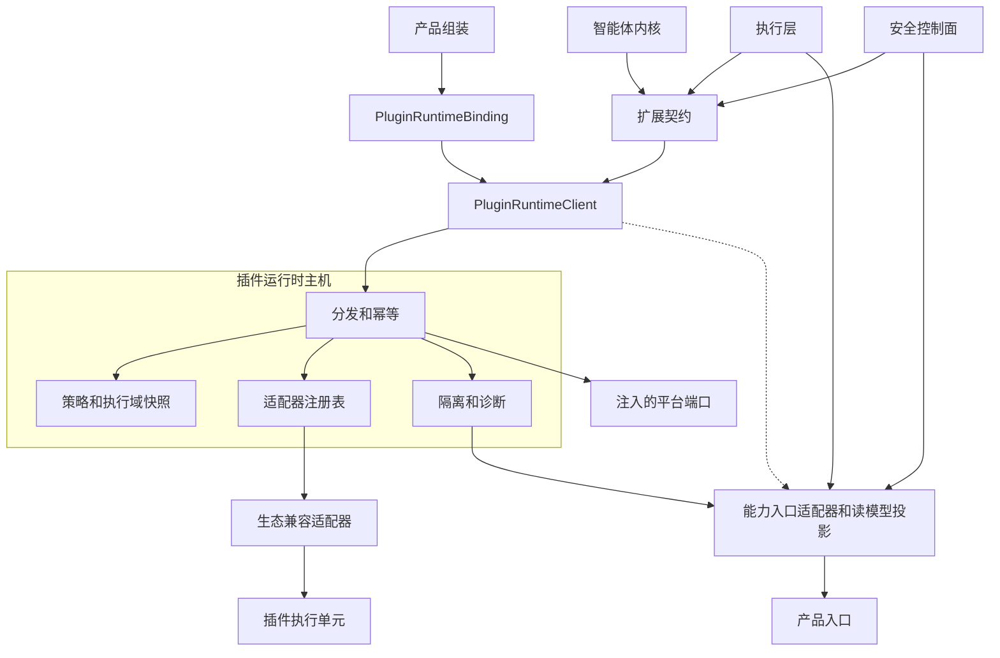
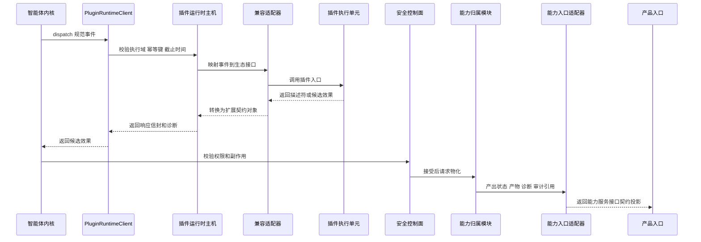
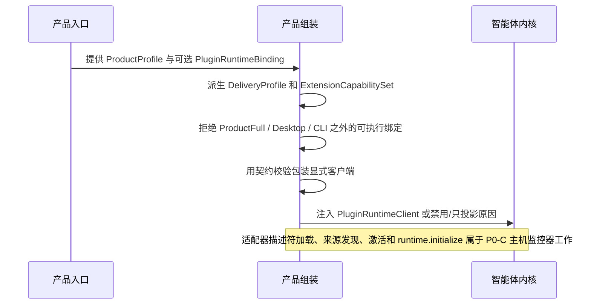
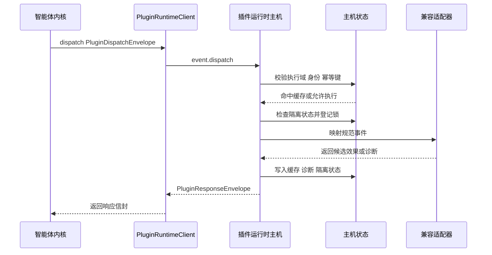
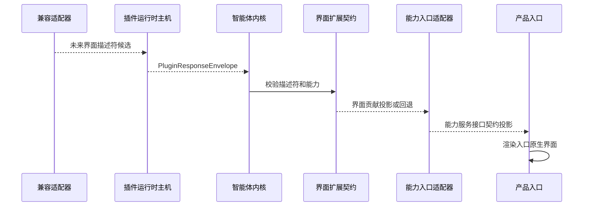

# 插件运行时主机与生态兼容适配层设计

本文件补充 [`product-architecture.md`](product-architecture.md)、
[`agent-runtime-services-design.md`](agent-runtime-services-design.md) 和
[`../sdlc-harness/features/opencode-compatibility.md`](../sdlc-harness/features/opencode-compatibility.md)。
本文件只定义插件运行时主机、主机内部 ABI、生态适配和候选效果的设计边界，不重复产品入口契约。

阅读路径：第 1 节确认接口面；第 2 节说明目标、非目标和产品形态关系；第 3 节给出主机运行视图与贡献处理时序；
第 4-6 节说明主体进程接口、产品组装能力模型和领域对象；第 7-14 节说明运行时、进程间通信、OpenCode 映射、安全和验证细节。

## 1. 接口面和稳定边界

插件运行时主机位于扩展契约之后、插件执行单元之前。它治理插件生命周期、项目执行域、进程间通信、隔离、健康、超时、幂等和候选效果路由；它不是产品入口协议，也不是第二个智能体内核。

| 接口面 | 主要消费方 | 稳定对象 | 允许变化的位置 | 不允许穿透 |
|---|---|---|---|---|
| 能力服务接口契约投影 | GUI、TUI/CLI、Web、ACP、Server、Remote、SDK | 插件状态投影、界面贡献投影、权限提示、诊断、产物、类型化错误、事件信封、稳定状态词 | 入口适配器、读模型、传输实现 | `PluginRuntimeClient`、主机状态快照、生态原始载荷、worker 句柄 |
| 扩展契约 | 内核、执行层、安全控制面、产品组装、生态适配器 | 扩展点、来源/信任、能力/副作用声明、钩子事件信封、描述符、候选效果、隔离事实 | 新扩展点、新候选类型、新生态适配器 | 最终权限结果、最终工具结果、审计写入、内核权威状态 |
| 主机内部 ABI | 主进程与插件运行时主机 | `PluginRuntimeClient`、`PluginRuntimeBinding`、dispatch/read 信封、响应信封、状态快照、诊断、隔离、幂等键 | 主机实现、IPC、缓存、隔离和适配器注册表 | GUI/TUI/Web/SDK DTO、产品入口状态、具体适配器对象 |
| 生态适配器内部接口 | 插件运行时主机内部 | 适配器 manifest、生态映射上下文、执行单元门面 | OpenCode、Claude Code、BitFun 原生插件或未来生态映射 | 产品组装、内核、执行层、界面实现和具体服务管理器 |

主体进程如果需要按 `OpenCodeAdapter`、`ClaudeCodeAdapter` 等类型分支，或需要读取插件执行单元内部对象，说明主机边界失效。GUI/TUI/Web/SDK 如果直接消费主机 ABI 或插件载荷，说明能力服务接口契约投影失效。

## 2. 目标、非目标和产品形态关系

目标：

- 在智能体内核外提供受控插件运行时主机，承载 OpenCode 等生态兼容适配层。
- 让插件、钩子、自定义工具、事件订阅和界面贡献映射到 BitFun 的扩展点、工具 ABI、权限/副作用和界面描述符。
- 保持内核是任务状态、事件和审计事实的权威源；执行层是工具结果权威源；安全控制面是权限权威源。
- 让 Desktop、CLI、Server、Remote、ACP、Web、Mobile Web 和 SDK 显式启用、禁用或降级插件能力。
- 区分 BitFun 插件来源、OpenCode 配置导入和外部 OpenCode CLI/ACP 互操作，避免把兼容输入误认为运行时前置条件。
- P0-B 只交付主机边界与产品形态保护；Desktop/CLI 消费、来源发现、激活和副作用物化属于 P0-C。

非目标：

- 不复制完整 OpenCode 运行时，不承诺任意社区插件无修改运行。
- 不要求用户本机已安装 `opencode` CLI 才能加载或诊断 OpenCode-compatible 插件。
- 不把 `opencode.json`、OpenCode 全局配置或 `.opencode/plugins` 作为 BitFun 插件生态的主配置系统。
- 不把插件系统作为内置产品能力裁剪的主要机制；产品形态裁剪仍由产品组装负责。
- 不把 JS/TS 运行时、worker、WebView 或子进程视为安全边界。
- 不允许插件直接写通过、失败、阻断、授权、审计、工具结果或产品状态。
- 不把插件接口暴露成无约束 localhost 服务；默认使用受控 IPC。
- 不把插件侧契约直接暴露给 GUI/TUI/Web/SDK。

`ProductProfile`、`CapabilityPack`、`CapabilityAvailabilitySet` 和 `OverridePoint` 的权威定义见
[`product-architecture.md`](product-architecture.md#6-产品形态与能力装配)。本文件只说明插件运行时涉及的子集：

| 类别 | 进入 BitFun 的方式 | 插件运行时关系 |
|---|---|---|
| 产品形态 | 产品入口、发布配置或白标配置选择 `ProductProfile`，产品组装选择内置 `CapabilityPack` | 不由插件决定；主机只按组装绑定启用、禁用或降级 |
| 运行策略 | 产品组装根据能力计划、策略、授权和健康状态派生可用性事实 | 主机消费策略快照和执行域；不能启用未构建能力 |
| 原生 MCP 提供方 | 平台适配器和执行层注册 | 不属于插件运行时主机，除非插件显式贡献 MCP 候选 |
| 插件贡献 | 主机校验描述符、事件订阅、提供方候选和候选效果 | 默认追加；覆写必须绑定已声明 `OverridePoint` |
| 兼容适配器 | 主机内部把外部生态接口转为 BitFun 信封、描述符和候选 | 只做映射，不成为产品能力、权限、审计或工具结果归属模块 |

BitFun 插件来源模型：

| 来源类型 | 产品定位 | 进入主机前的要求 |
|---|---|---|
| BitFun 插件安装包 | P0-C 主入口；用户或项目显式安装 | manifest、插件 id、版本、hash、签名/信任、能力声明、执行域和启用状态 |
| 随版本携带的插件包 | P0-C 主入口；由产品打版携带或白标预装 | 与安装包相同，另需记录内置包版本和发布来源 |
| 项目/组织插件源 | P0-C 主入口；由项目、组织或企业策略声明 | 来源作用域、策略来源、hash、信任状态和禁用/回滚方式 |
| 受控外部包源 / 签名包 / registry | P0-C 主入口；由用户、项目或组织从受控渠道安装 | 包来源、版本、hash、签名/信任、撤销/回滚策略、能力声明和执行域 |

兼容导入与外部互操作不属于插件来源模型：

| 路径 | 定位 | 约束 |
|---|---|---|
| OpenCode 配置导入 | 迁移或读取已有 OpenCode 项目的兼容输入 | 只能生成导入事实、诊断和候选 BitFun 插件来源；原始配置不得直接成为运行时主状态 |
| 外部 OpenCode CLI / ACP | P0+ 互操作；用于外部 agent、ACP client/server 或迁移辅助 | 不进入插件来源模型，不能作为 P0-C 插件加载前置条件；失败只影响互操作能力 |

接入方式与目录职责：

| 接入方式 | 目录 / 配置职责 | 生命周期职责 |
|---|---|---|
| 动态安装 / 卸载 | 写入 BitFun 管理的用户或项目插件来源记录；包内容进入内容寻址缓存；项目可通过 `.bitfun` 声明共享来源 | install、enable、disable、uninstall、trust、revoke、quarantine 和 diagnostics 必须可审计 |
| 随产品协同发布 / 完整打包 | 插件包随 `ProductProfile` 或发行包携带，manifest 和 hash 是只读发布事实；运行时不得修改发行目录 | 可按工作区禁用、隔离或重新信任；升级、移除和默认启用策略必须通过新发行包或签名更新完成 |
| 组织 / 企业来源 | 由组织配置、企业 registry 或 managed policy 声明；本地只保留解析后的来源事实和缓存 | 用户可在权限允许范围内启用或禁用；组织撤销必须覆盖本地启用状态 |
| 兼容导入 | 只读扫描外部产品配置或插件目录，生成 `imported_from`、原始路径、hash 和转换诊断 | 导入结果进入候选 BitFun 插件来源；不得回写外部目录，不要求外部产品运行时存在 |

目录规则：

- 权威目录只属于 BitFun：安装目录中的内置插件包、用户数据目录、项目 `.bitfun` 配置、组织/企业 registry、本地内容寻址缓存和隔离/诊断状态目录。
- 兼容目录只作为输入：OpenCode 的 `opencode.json`、`.opencode/plugins`、全局插件目录；Claude Code 的 marketplace、`.claude-plugin`、`.claude` 配置；Codex 的 `~/.codex`、`.codex` 配置和 skill / plugin 目录。
- 平台适配器解析 OS 具体路径；跨 crate 稳定合同只能传递逻辑来源类型、scope、provenance、hash、manifest、trust state、diagnostic 和 quarantine state。
- 同一个物理包被多个来源引用时，以内容 hash 和插件 id / version 去重；启用状态、信任状态和策略覆盖仍按来源 scope 独立记录。
- 外部生态的加载顺序只能影响导入诊断和冲突提示，不能直接决定 BitFun 运行时启用顺序。BitFun 启用顺序由产品组装、来源 scope、信任策略和显式优先级决定。

## 3. 主机运行视图



依赖规则：

- 产品组装选择是否启用插件运行时、适配器集合、信任策略、执行域和禁用原因。
- 内核、执行层和安全控制面只通过扩展契约和 `PluginRuntimeClient` 通信；不加载插件代码，不读取生态内部对象。
- 主机可以使用注入的平台端口执行进程、文件系统、网络、沙箱或 IPC 操作；不得直接依赖 app 状态或具体服务管理器。
- 兼容适配器只执行生态接口到 BitFun 扩展契约的转换；不拥有权限、审计、工具结果或界面状态。
- 产品入口只接收能力入口适配器产出的能力服务接口契约投影；不直接调用 `PluginRuntimeClient`。

### 3.1 插件贡献处理时序



插件失败、超时、旧 epoch、策略拒绝或进入隔离时，主机只能返回诊断和隔离事实；不得伪造权限通过、工具结果、审计成功或产品状态变更。

## 4. 主体进程接口暴露面

BitFun 主体进程的插件相关接口属于扩展契约和主机内部 ABI，不是产品入口契约。GUI/TUI/Web/ACP 等入口只能消费能力服务接口契约中的投影。

| 概念 | 可见范围 | 稳定能力 | 不得承载 |
|---|---|---|---|
| `PluginRuntimeClient` | 内核、执行层、产品组装 | `availability`、`read_plugins`、`dispatch` | 具体适配器、worker、进程句柄、服务管理器 |
| `PluginRuntimeBinding` | 产品组装、内核注入点 | disabled、projection-only、sealed client | 自动启动完整产品、隐式启用插件运行时 |
| `PluginRuntimeAvailability` | 产品组装和主机状态 | 可用、只投影、禁用、暂不可用及原因 | 能力服务接口的最终状态词原样泄漏 |
| `PluginDispatchEnvelope` / `PluginResponseEnvelope` | 内核与主机边界 | 事件投递、响应、epoch、截止时间、诊断、幂等 | 产品入口 DTO、生态原始载荷 |
| `PluginEffectCandidate` | 内核、执行层、安全控制面 | 插件候选效果 | 最终授权、工具结果、审计写入、状态写入 |
| `UiContributionDescriptor` | 扩展契约和入口投影适配 | 声明式槽位、命令、状态视图和回退 | React、DOM、Tauri、可执行界面代码 |
| `PluginTrustPolicy` / `PluginSourceRef` | 安全控制面和主机 | 来源、hash、信任状态、能力和执行域 | 凭据、平台私有路径、包管理器句柄 |

禁止暴露：

- `OpenCodeCompatibilityAdapter`、`ClaudeCodeCompatibilityAdapter`、`CodexPluginCompatibilityAdapter` 等具体适配器对象。
- 插件进程句柄、worker 句柄、WebView、包管理器客户端、解释器实例或内部模块对象。
- 完整 `RuntimeServices`、具体提供方句柄、会话管理器、界面状态、Tauri 句柄或产品命令注册表。
- 生态原始载荷作为公共 DTO；原始载荷只能存在于对应兼容适配器内部。

能力服务接口契约可以投影插件状态，但投影后的对象必须是客户端语义，例如插件状态投影、界面贡献投影、诊断、权限提示、产物链接、类型化错误、事件信封或命令可用性。

## 5. 产品组装能力模型

插件能力进入产品组装的类型化能力矩阵，不得隐藏在钩子、服务定位器或全局注册表中。
`ExtensionCapabilitySet` 表示产品扩展能力聚合，不表示旧的扩展主机类型；插件运行时边界由
`PluginRuntimeAvailability` 和 `PluginRuntimeBinding` 表达。

产品组装必须先根据 `ProductProfile` 和 `SurfaceContract` 派生 `DeliveryProfile`、内置能力计划
和扩展可用性，再把插件贡献叠加到允许的扩展点上。叠加规则是：默认追加、显式覆写、
失败可回滚、状态可诊断。插件不得通过运行时发现改变 `ProductProfile`、隐式启用未构建能力，或替换没有归属模块的内部实现。

```rust
pub struct ExtensionCapabilitySet {
    pub plugin_runtime: PluginRuntimeAvailability,
    pub adapters: Vec<PluginAdapterCapability>,
    pub ui: UiExtensionAvailability,
}

pub enum PluginRuntimeAvailability {
    Disabled { reason: UnsupportedReason },
    ProjectionOnly { reason: UnsupportedReason },
    Available,
    TemporarilyUnavailable { reason: UnsupportedReason },
}

pub enum PluginRuntimeBinding {
    Disabled(DisabledPluginRuntimeClient),
    ProjectionOnly(ProjectionOnlyPluginRuntimeClient),
    Client(/* sealed; use PluginRuntimeBinding::client(Arc<dyn PluginRuntimeClient>) */),
}
```

`PluginRuntimeAvailability` 可以作为主机 / 组装层的内部可用性事实，但进入能力服务接口契约时只能投影为
`available`、`projection-only`、`status-only`、`artifact-only`、`temporarily-unavailable`、`unsupported`、
`policy-denied` 或 `quarantined`；不得把原始 `unavailable` 作为能力服务接口状态词。

内部 SDK 最小特性只能依赖 disabled stub 或测试替身，不得隐式启动 JS/TS 运行时。`DeliveryProfile` 只能影响
绑定和能力选择，不得让智能体内核出现 `if desktop`、`if cli` 或 `if opencode` 分支。

允许覆写的贡献必须满足：

- 有稳定 `OverridePoint` id、能力归属模块、适用入口和回退。
- 有冲突策略，例如 single-winner、ordered-chain、内置能力锁定或 `policy-denied`。
- 有 permission/effect 声明，且最终授权、审计和状态写入仍由安全控制面完成。
- 有产品形态验证，证明启用、禁用、失败和回滚时不会改变未声明的产品行为。

## 6. 领域模型

| 领域对象 | 定义 | 关键约束 |
|---|---|---|
| `PluginRuntimeHost` | 管理插件兼容层生命周期、通信和隔离的运行时主机 | 不写权威状态，不执行产品策略 |
| `PluginRuntimeClient` | 主体进程调用主机的窄接口 | 不暴露具体生态适配器或运行单元句柄 |
| 主机内部 `CompatibilityAdapter` | 生态接口映射器 | 仅执行翻译，不拥有权限、工具结果或界面状态 |
| `PluginExecutionUnit` | cell、worker、subprocess 或 sandbox | 只能访问主机门面白名单 |
| `ProjectExecutionDomain` | 工作区、信任、权限、工具注册表和事件订阅的隔离域 | 本地/远端必须用逻辑路径和执行域表达 |
| `PluginSourceRef` | 插件来源、版本、hash、签名和作用域 | hash 或来源变化必须重新信任 |
| `PluginTrustPolicy` | 信任状态、能力范围、撤销策略和执行等级 | 默认拒绝未知能力 |
| `PluginEffectCandidate` | P0-B 提供方候选；后续候选类型必须先绑定真实消费方 | 不能表示最终授权、审计或工具结果 |
| `UiContributionDescriptor` | 界面贡献的声明式描述 | 不能包含 React、DOM、Tauri 或可执行代码 |

## 7. 关键模块开发视图

目标放置原则：

```text
src/crates/contracts
  core-types / events / runtime-ports
    可执行客户端的 PluginRuntimeBinding 契约校验
    插件运行时 DTO、事件、能力/副作用、信任、界面描述符契约

src/crates/execution
  agent-runtime
    通过类型化运行时部件消费 PluginRuntimeClient
  plugin-runtime-host
    拥有可移植主机边界：生命周期、分发幂等、截止时间诊断、
    失败隔离和诊断读模型投影；具体 JS/TS 执行单元留在该 crate 外
  tool-contracts / tool-execution
    通过工具 ABI 物化已接受的工具提供方候选

src/crates/adapters
  opencode-adapter
    将 OpenCode-compatible 插件来源和可选 OpenCode 配置导入映射为 BitFun 读模型与候选效果
    不得实现 PluginRuntimeClient 或声明可执行可用性
  future compatibility adapters
    通过同一适配器 trait 映射其他插件生态

src/crates/services
  services-integrations / terminal / services-core
    在端口后提供进程、进程间通信、文件系统、网络、远端和沙箱原语

src/crates/assembly
  product-capabilities / core
    从 ProductProfile 与 SurfaceContract 派生 DeliveryProfile、PluginRuntimeBinding、适配器集合和回退策略

src/apps/* / src/web-ui / src/mobile-web
  界面宿主和产品入口
    渲染已校验描述符或 `unsupported` 类型化错误状态
```

开发约束：

- 兼容适配器可以依赖规范契约和必要协议解析器；不能依赖 `bitfun-core/product-full`、界面实现
  或具体服务管理器。
- 主机门面由插件运行时主机提供；插件运行单元不能直接调用 OS、shell、网络、文件系统或凭据。
- 工具提供方候选只有被内核、安全边界和工具 ABI 接受后，才能物化为可执行提供方。
- 界面贡献只能通过描述符进入界面宿主；前端渲染实现位于对应产品入口。

## 8. 运行时与通信模型

默认模型是一个受产品组装选择的插件运行时主机。主机可以承载多个项目执行域，但每个执行域必须隔离：

- 工作区、worktree、执行主机、逻辑路径。
- 信任记录、权限范围、工具覆写表、事件订阅。
- 插件状态、环境变量、依赖缓存、审计流和资源预算。

Host 内部按风险选择执行单元：

| 等级 | 适用场景 | 约束 |
|---|---|---|
| cell | 受信任的观察、建议和只读 hook | 无 shell、无网络、无凭据；必须有 deadline |
| worker | 轻量保护、格式化建议、低风险工具候选 | 只能调用主机门面白名单 |
| subprocess | 高风险依赖、工具复写、崩溃隔离需求 | 独立进程、环境白名单、资源预算、工作目录限制 |
| sandbox | 未知来源或强隔离场景 | 无凭据、受控网络、临时或只读 worktree、可审计 |

远端工作区场景下，主机应靠近实际执行域运行。界面端只接收逻辑路径、描述符、诊断和审计摘要；
不得把远端绝对路径、SSH 细节或远端 OS 差异泄漏给插件接口消费方。

## 9. IPC 与候选效果契约

传输可以用 JSON-RPC、framed protobuf 或 gRPC over pipe 实现；稳定契约只承诺 schema、语义和错误模型。
主机生命周期由产品组装或主机监控器管理；内核只通过 `PluginRuntimeClient` 投递事件、刷新快照并消费响应。

| 方法 | 方向 | 语义 |
|---|---|---|
| `PluginRuntimeBinding::Client` | 产品组装 -> 内核 | P0-B 只注入已构造且契约校验过的 `PluginRuntimeClient`，或注入 disabled / projection-only reason |
| `read_plugins` | 内核 / 组装层 -> 客户端 | 读取项目和工作区作用域内的插件来源、状态、诊断和隔离投影 |
| `dispatch` | 内核 -> 客户端 -> 主机 | 投递规范事件并等待提供方候选、诊断、隔离状态或超时 |
| P0-C `runtime.initialize` | 主机监控器 -> 主机 | 后续传入适配器清单集合、策略快照、传输能力；不属于 P0-B 已交付面 |
| P0-C `plugin.discover` | 主机监控器 -> 主机 | 后续发现 BitFun 插件来源、hash、声明能力和兼容等级；OpenCode 配置导入只能作为兼容输入分支，输出候选 BitFun 插件来源和诊断，默认不执行；不属于 P0-B 已交付面 |

```ts
interface PluginDispatchEnvelope {
  envelope_version: 1;
  event_id: string;
  event_type: string;
  event_version: string;
  project_domain_id: string;
  workspace_id: string;
  source: PluginSourceRef;
  declared_capability: PluginCapabilityRef;
  correlation_id: string;
  causation_id?: string;
  idempotency_key: string;
  deadline_ms: number;
  epochs: PluginRuntimeEpochs;
  payload_ref?: PayloadRef;
}

interface PluginResponseEnvelope {
  envelope_version: 1;
  request_event_id: string;
  project_domain_id: string;
  workspace_id: string;
  adapter_id: string;
  plugin_id?: string;
  completed_at_ms: number;
  effects: PluginEffectCandidate[];
  diagnostics: PluginDiagnostic[];
  quarantine?: PluginQuarantineState;
  // Extension-contract status only; clients receive Server/API projection.
  plugin_statuses: PluginStatusSnapshot[];
  observed_epochs: PluginRuntimeEpochs;
}

interface PluginEffectBase {
  effect_id: string;
  schema_version: string;
  declared_capability: CapabilityId;
  target_ref: TargetRef;
  data_classification: DataClassification;
  risk_level: "low" | "medium" | "high";
  permission: PluginPermissionGate;
  source_ref: PluginSourceRef;
}

interface CapabilityOwnerRef {
  kind: "product_feature" | "extension_contract" | "assembly_policy";
  id: string;
}

interface OverrideRollbackPolicy {
  mode: "remove_contribution" | "restore_previous" | "disable_plugin";
  reason_ref?: string;
}

interface PluginEffectCandidate extends PluginEffectBase {
  payload: PluginEffectCandidatePayload;
}

type PluginEffectCandidatePayload = {
  kind: "provider_candidate";
  provider_id: string;
  tool_contract_id: string;
};

type PermissionPromptEffectKind = "provider_candidate";

interface PermissionPromptDescriptor {
  descriptor_version: 1;
  prompt_id: string;
  plugin: PluginSourceRef;
  requested_capability: CapabilityId;
  requested_effect: PermissionPromptEffectKind;
  target: TargetRef;
  risk_level: "low" | "medium" | "high";
  owner: CapabilityOwnerRef;
  rollback: OverrideRollbackPolicy;
  // Extension-contract value; Server/API projection uses kebab-case stable status words.
  deny_state: "no_state_change" | "candidate_discarded" | "temporarily_unavailable" | "policy_denied" | "quarantined";
  audit: {
    correlation_id: string;
    event_id?: string;
  };
}

interface PluginDiagnosticBase {
  diagnostic_id: string;
  severity: "info" | "warning" | "error";
  plugin_id: string;
  source_ref: PluginSourceRef;
  audit_ref: {
    correlation_id: string;
    event_id?: string;
  };
}

type PluginDiagnostic =
  | (PluginDiagnosticBase & {
      kind: "trust_config";
      trust_result: "trusted" | "untrusted" | "revoked" | "requires_confirmation";
      config_validation: "valid" | "invalid" | "missing" | "unsupported";
    })
  | (PluginDiagnosticBase & {
      kind: "manifest";
      manifest_validation_error: string;
    })
  | (PluginDiagnosticBase & {
      kind: "host_availability";
      host_availability_reason: string;
    })
  | (PluginDiagnosticBase & {
      kind: "deadline";
      deadline_reason: string;
    })
  | (PluginDiagnosticBase & {
      kind: "quarantine";
      quarantine_reason: PluginQuarantineState["reason"];
      quarantine_scope: PluginQuarantineState["scope"];
    });

interface PluginQuarantineState {
  schema_version: 1;
  quarantine_id: string;
  source_ref: PluginSourceRef;
  scope: {
    kind: "plugin" | "capability" | "target" | "project_plugin";
    project_domain_id: string;
    workspace_id: string;
    plugin_id: string;
    capability_id?: string;
    target_kind?: string;
    target_id?: string;
  };
  reason: "host_failure" | "policy_violation" | "trust_changed" | "deadline_exceeded" | "adapter_failure";
  // P0-B exposes only host restart as a passive clear condition.
  clears_when: Array<"host_restarted">;
  log_ref?: PayloadRef;
  audit_ref: {
    correlation_id: string;
    event_id?: string;
  };
}
```

`HostRestarted` 由主机内部 `restart(project_domain_id, workspace_id)` 执行。该方法只清理对应执行域的主机隔离、隔离诊断投影、幂等 dispatch 缓存和空闲 dispatch lock；不得生成用户可执行恢复动作，也不得写内核、权限或审计成功状态。

P0-B 稳定主机内部 ABI 只允许 `payload_ref`，不得在公共接口中绕过 schema 传递原始 JSON 或规范载荷。

`PermissionPromptDescriptor`、`PluginDiagnostic` 和 `PluginQuarantineState` 是扩展 / 主机侧结构化事实，
不是桌面设置、权限提示、CLI 诊断或审计的能力服务接口 DTO。需要用户确认的提供方候选
必须携带 `PluginPermissionGate::PermissionRequired`，并且 Host 侧事实必须绑定同一个 plugin、capability、target、
归属模块、回滚、拒绝后状态和审计/关联信息。

能力入口适配器必须只把这些共享事实投影为能力服务接口权限提示、诊断、插件状态投影或审计记录；桌面提示、CLI 诊断和审计不能直接消费主机内部 ABI 同一对象。
投影不一致必须让契约校验失败。主机不得只返回本地化文案或不可解析错误来表达权限确认、诊断或隔离状态；P0-B
不提供恢复动作字段，任何用户可执行恢复动作都必须等 P0-C / P0+ 有归属模块支持的恢复端口、审计事实和真实消费方后再暴露。

`UiContributionDescriptor`、`override_point` 和描述符渲染不属于 P0-B 主机内部 ABI。后续进入 P0-C / P0+ 时，
描述符仍不得包含 React 组件、HTML script、DOM selector、Tauri 命令、状态修改或任意可执行代码；
未知槽位、未知动作或缺失能力时，入口必须按回退策略降级，是否接受、排序、回滚和审计由产品组装、安全控制面与能力归属模块共同裁决。

`tool_result`、`permission_granted`、`audit_written` 和 `state_changed` 不允许作为插件响应类型。真实工具结果由
执行层写入；真实权限状态由安全边界写入；审计事实由内核写入。

## 10. 关键时序

### 10.1 插件运行时启动



### 10.2 主机分发、隔离与缓存



### 10.3 P0-C / P0+ UI contribution 投影



P0-B 不公开界面贡献副作用载荷；界面贡献、描述符投影和入口原生渲染
属于 P0-C / P0+，必须在有真实产品消费方和安全评审后再进入稳定合同。

## 11. OpenCode 兼容映射

OpenCode 兼容适配器是插件运行时主机内部适配器，不是 BitFun 内部插件模型。
当前 `bitfun-opencode-adapter` crate 只提供测试夹具范围的 OpenCode 配置导入、来源发现和类型化候选投影；
其公开接口预算为空。它不得实现 `PluginRuntimeClient`，不得向产品组装或内核声明可执行可用性。
生产消费必须先经过插件运行时主机的注册、生命周期、信任/策略和副作用门禁设计评审。
界面 / CLI 消费降级状态时必须同时使用状态、诊断和隔离状态，不得只根据可用性原因推导用户可见结论。

OpenCode 兼容有三层含义，不能混用：

| 层次 | 含义 | P0-C 处理 |
|---|---|---|
| 插件形态兼容 | 识别 JS/TS plugin module、hook、自定义工具、permission hook、UI contribution 等形态 | 作为生态适配器的输入格式，转换为 BitFun 扩展契约 |
| 配置导入兼容 | 读取 `opencode.json`、`.opencode/plugins/*.js|ts` 或 OpenCode 全局插件目录，帮助已有项目迁移 | 可选导入源；导入后生成 BitFun 插件来源、manifest、hash、诊断和信任状态 |
| 外部 OpenCode 互操作 | 调用用户安装的 OpenCode CLI、ACP client 或 server API | P0+；不得成为 BitFun 插件加载和诊断的前置条件 |

外部生态兼容策略：

| 外部生态 | 可读取的事实 | BitFun 处理 |
|---|---|---|
| OpenCode | npm 插件列表、项目插件目录、全局插件目录、hook / custom tool / permission hook / UI contribution | 作为 OpenCode-compatible 适配器输入；导入后转为 BitFun source、manifest、hash、capability、diagnostic 和 trust state |
| Claude Code | marketplace 安装记录、`.claude-plugin/plugin.json`、skills、agents、hooks、MCP / LSP servers、user / project / local scope | 后续通过 Claude-compatible 适配器读取；组件先转为 BitFun 扩展描述符和候选效果，不继承 Claude Code 的启用状态或权限决定 |
| Codex | `~/.codex/config.toml`、项目 `.codex/config.toml`、AGENTS.md / override、skills、plugin 分发单元、MCP 配置 | 后续通过 Codex-compatible 适配器读取；skills 作为工作流能力输入，plugin 作为分发 provenance，不要求 Codex CLI / App 安装 |

跨生态原则：

- 优先兼容“文件形态、manifest、组件目录和配置层级”，不兼容外部产品运行时状态。
- 每个外部生态对应独立 compatibility adapter；多个生态适配器只能输出同一组 BitFun 描述符、候选效果和诊断，不增加产品入口专用接口。
- 兼容导入必须保留 `ecosystem`、`imported_from`、原始位置、原始版本和转换诊断，便于回滚、重新导入和向用户解释能力差异。
- BitFun 原生插件体系是长期权威格式；OpenCode、Claude Code、Codex 兼容层应收敛到 BitFun manifest / capability / effect / UI descriptor，而不是形成三套稳定插件 API。

| OpenCode 能力 | BitFun 映射 | 约束 |
|---|---|---|
| workspace / global plugin 配置 | 可选导入源；P0-B 仅测试夹具投影；P0-C 可由 `plugin.discover` 的兼容输入分支生成候选 BitFun 插件来源 | 不作为主配置系统；默认只导入和诊断，不执行 |
| hooks object | P0-B unsupported 钩子投影为诊断 / 状态；P0-C 后再接入事件订阅 | 不伪造成副作用 |
| custom tools | `provider_candidate` | 启用后仍走工具 ABI 和权限门禁 |
| tool execute before | P0-B 诊断 / status-only；P0+ 才能设计受控只读候选 | 不能直接改写执行结果 |
| tool execute after | P0-B 诊断 / status-only；P0+ 才能设计证据候选 | 不能伪造工具结果 |
| permission hooks | P0-B 只能通过 `PluginPermissionGate::PermissionRequired` 表达候选需要确认；P0+ 才能设计权限桥接 | 不能直接批准 |
| client / server API | 受限适配器门面 | 只暴露规范事件、只读状态和候选提交 |
| shell helper | 默认禁用；可映射为受控工具请求候选 | 必须经过 shell 权限和沙箱策略 |
| SSE event stream | 内核规范事件订阅 | 不暴露主机内部事件作为权威流 |
| TUI/UI contribution | P0-B unsupported/status-only；P0-C/P0+ 才能设计描述符投影 | 只允许描述符，不允许直接操作界面状态 |

OpenCode 载荷只能存在于适配器内部。进入内核、执行层、界面或质量数据面的对象必须先转换为 BitFun 规范
DTO。

## 12. 产品形态与降级（长期矩阵）

本节能力矩阵是长期设计边界，不是 P0 验收范围。P0 约束以
[`product-architecture.md`](product-architecture.md) 为准：P0 只验收桌面设置/命令入口 + CLI 诊断的同一条
OpenCode-compatible 插件垂直切片；该切片以 BitFun 插件来源、安装/打包携带、信任和诊断为主路径，
OpenCode 配置导入只是兼容入口。ACP、Server、Remote、Web、Mobile Web 和内部 SDK 最小可用性在 P0 中只能是
`unsupported`、`temporarily-unavailable`、`projection-only`、`status-only`、`policy-denied` 或 `quarantined`。`artifact-only` 是长期能力服务接口状态词，
只有在真实产物/结果投影消费者出现后才能进入入口验收。Server / Remote 主机、ACP 能力/权限桥接
和其他入口的完整插件运行时必须进入 P0+，并具备单独产品决策、迁移/回滚和验证指标。

| 产品形态 | 插件运行时策略 | UI 策略 | 失败语义 |
|---|---|---|---|
| Desktop / product-full | 可启用本地主机；高风险能力按信任策略提权 | P0-C/P0+ 渲染已校验描述符；P0-B 不公开界面贡献载荷 | 主机崩溃或超时不影响默认任务 |
| CLI | 可启用本地主机或只读投影 | 文本描述符 / 警告 | unsupported 明确输出，不静默忽略 |
| Server | P0 为 `unsupported` / `projection-only` / `policy-denied` / `quarantined`；P0+ 才可按部署策略受控启用 | 接口返回类型化错误、状态或描述符投影 | 不自动启动本地 JS/TS 运行时 |
| Remote | P0 为 `temporarily-unavailable` / `projection-only` / `policy-denied` / `quarantined`；P0+ 才可让主机靠近远端执行域 | 界面只接收逻辑路径和描述符 | 不回落到本地路径执行 |
| ACP | P0 为 `status-only` / `projection-only` / `unsupported` / `policy-denied` / `quarantined`；P0+ 才可暴露 capability 或 permission bridge | 以 ACP 状态或 unsupported 表达 | 不将插件失败解释为 agent 失败 |
| Web / Mobile Web | 不启动本地主机；只消费投影状态 | 只消费后端投影描述符 | 不持有插件执行单元 |
| 内部 SDK 最小可用性 | P0 仅 disabled stub 或测试替身/客户端；生产可执行客户端注入属于 P0+ | 无默认界面宿主 | 不牵引 product-full 或具体提供方 |

能力矩阵：

| 能力 | Desktop / product-full | CLI | Server | Remote | ACP | Web / Mobile Web | 内部 SDK 最小可用性 |
|---|---|---|---|---|---|---|---|
| 发现 | 支持本地/项目发现 | 支持本地/项目发现 | P0 `projection-only` / `unsupported`；P0+ 由部署策略启用 | P0 `projection-only` / `temporarily-unavailable`；P0+ 在远端执行域发现 | P0 `status-only` / `projection-only` / `unsupported`；P0+ 通过 ACP 能力暴露 | 只消费后端投影 | 调用方注入或 disabled |
| 只读事件钩子 | 支持候选建议/证据 | 支持文本诊断 | P0 诊断投影；P0+ 支持接口诊断 | P0 只读投影；P0+ 靠近远端主机执行 | P0 status-only；P0+ 映射为 ACP 事件/能力 | 只展示投影 | 测试替身/客户端可选 |
| 工具提供方候选 | 支持，必须经工具 ABI | 支持，必须经工具 ABI | P0 不执行；P0+ 受部署策略限制 | P0 不执行；P0+ 绑定远端执行域 | P0 不执行；P0+ 只作为外部工具能力 | 不执行 | 默认 disabled |
| 权限候选 | 只作建议，最终由安全边界决策 | 只作建议 | P0 不产生候选；P0+ 只作接口候选 | P0 不产生候选；P0+ 绑定远端信任/策略 epoch | P0 不接入权限桥接；P0+ 映射为 ACP 权限桥接 | 只展示状态 | 默认 disabled |
| 界面贡献 | 描述符渲染 | 文本或命令投影 | P0 接口投影 / unsupported；P0+ 受控接口投影 | P0 只使用逻辑路径投影；P0+ 受控远端投影 | P0 unsupported/status-only；P0+ ACP 能力或 unsupported | 描述符投影 | 默认无界面宿主 |
| shell helper | 默认禁用，可映射为工具请求候选 | 默认禁用 | 默认禁用 | 只允许远端策略批准 | 不直接暴露 shell | 不执行 | disabled |
| 只读状态视图 | 支持脱敏投影 | 支持文本投影 | 支持接口投影 | 支持远端脱敏投影 | 映射为协议状态 | 支持只读投影 | 测试替身/客户端可选 |
| 可写 JS/TS 运行时 | 非默认能力，需独立安全评审 | 非默认能力 | 非默认能力 | 非默认能力 | 不作为默认能力 | 不执行 | disabled |

产品入口必须区分“未启用”“只读建议”“能力不可用”“候选被接受”。插件降级不能被解释为任务成功保障。

## 13. 安全与供应链

插件能力必须声明以下绑定：

- 来源：安装包、随版本携带包、项目/组织插件源、受控外部包源、enterprise registry、signed bundle 或 remote source；OpenCode 配置导入只能作为来源 provenance 和诊断事实。
- 身份：适配器 id、插件 id、版本、hash、签名状态。
- 能力声明：事件、工具、文件、网络、凭据、界面贡献和执行域。
- 信任状态：未信任、只读信任、项目级信任、组织级信任、撤销。
- 执行位置：local、remote、worker、subprocess、sandbox、container。

安全规则：

- 未信任插件只能发现和展示，不能执行。
- 凭据、网络、shell、进程创建、包安装和动态 import 默认拒绝。
- 文件访问使用逻辑路径和工作区策略，不能暴露宿主绝对路径。
- 配置、插件源码或 package hash 变化后必须重新信任。
- 插件失败、崩溃、超时和旧 epoch 响应必须可诊断、可丢弃、可审计。

## 14. 验证矩阵

可执行验证目标以 [`../plans/core-decomposition-plan.md#8-验证矩阵`](../plans/core-decomposition-plan.md#8-验证矩阵)
为准。主机、适配器、产品形态或内部 SDK 最小可用性相关 PR 必须更新并运行其中固定命令；本节只说明覆盖面，不能用临时测试或
PR 文案替代执行计划里的固定目标。

| 验证面 | 必须覆盖 |
|---|---|
| 主体进程接口 | 只暴露运行时客户端、绑定、信封、候选、信任和描述符 |
| schema | dispatch / response / effect candidate / permission prompt / diagnostic / quarantine state 序列化往返 |
| 时序 | initialize、deadline、cancel、stale epoch、idempotency key |
| 权限 | 插件不能 approve、不能写审计、不能伪造 tool result；权限提示字段必须覆盖来源/hash、副作用、目标、风险、归属模块、回滚、拒绝结果和审计引用 |
| 工具 | 工具提供方候选经工具 ABI 和权限门禁后才能物化 |
| UI | 描述符校验、未知贡献回退、无直接界面状态修改 |
| 安全 | 未信任插件不执行、hash 变化重新信任、secret/network/shell 默认拒绝 |
| 崩溃 | 主机、worker、subprocess 或 adapter failure 不影响默认任务；quarantine state 必须提供范围、原因、清除条件、诊断引用和审计引用；`log_ref` 为可选，P0-C 通过独立端口物化 |
| 远程 | 逻辑路径、远端执行域和权限范围不泄漏本地路径 |
| 产品形态 | Desktop、CLI、Server、Remote、ACP、Web、Mobile Web、SDK 的 unsupported 行为明确 |

通过标准是：插件运行时缺失、适配器不支持某能力、插件失败或外部插件返回非法结果时，默认 BitFun 任务行为、
权限语义、工具执行和审计事实保持等价。
