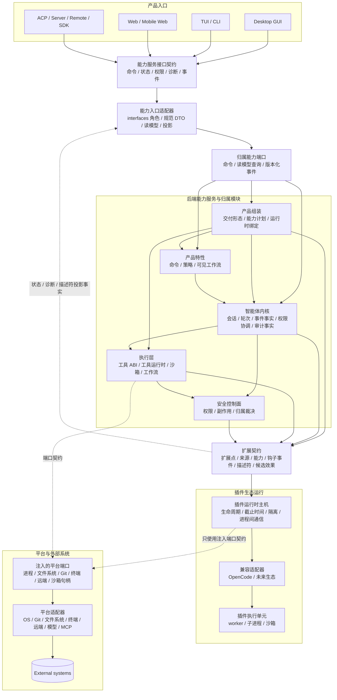

# BitFun 产品运行时架构

本文件定义 BitFun 产品运行时的架构基线，约束下列稳定边界：

1. 面向产品入口、插件生态和后端实现迁移的稳定接口边界。
2. GUI、TUI/CLI、Web、ACP、Server、Remote、SDK 等入口共享后端能力服务的方式。
3. 基础能力服务向插件侧提供扩展点、事件、钩子、候选效果和安全控制的方式。

执行计划见 [`../plans/core-decomposition-plan.md`](../plans/core-decomposition-plan.md)；智能体运行时、服务
和 crate 约束见 [`agent-runtime-services-design.md`](agent-runtime-services-design.md)；插件运行时、进程间通信、候选效果和外部生态适配契约见
[`plugin-runtime-host-design.md`](plugin-runtime-host-design.md)。当详细设计与本文件冲突时，以本文件为准。

本文件不记录实现进度，不展开 crate 内部细节。设计目标是保护核心契约稳定性；调用路径长度只作为工程成本因素处理，不作为独立架构目标。

## 1. 背景与原则

BitFun 同时承载多入口产品形态、插件生态和持续迁移的后端实现。架构边界必须优先降低实现变更对稳定接口的影响：

- 桌面 GUI、TUI/CLI、Web、ACP、Server、Remote、SDK 等入口共享任务、权限、诊断、产物和状态能力。
- OpenCode 兼容插件、钩子、自定义工具、MCP/工具提供方、界面贡献和后续生态适配需要稳定扩展入口。
- 运行时主机、适配器、进程/沙箱、远端能力、服务归属和产品能力仍处在持续迁移阶段。
- 旧 `bitfun-core/product-full` 仍可能成为事实上的大入口，使轻量入口被完整桌面能力牵引。

设计原则：

1. **稳定契约优先**：高频变化的实现只能藏在稳定契约、端口、描述符、绑定或兼容门面后面。
2. **插件生态优先闭环**：扩展契约（Extension Contract）、插件运行时主机（Plugin Runtime Host）、候选效果、安全校验和 OpenCode 兼容插件的最小消费路径属于首要能力。
3. **多入口共享能力服务接口**：GUI/TUI/Web/ACP/Remote/SDK 等入口通过同一层能力服务接口契约（Server/API Contract）访问后端能力，不直接依赖具体实现归属模块。
4. **中间层按责任保留**：只有能写清当前消费方、稳定契约、版本/兼容证明、边界测试或准入清单、退场条件的中间层，才可以作为长期门面保留；不能为了减少层数而让上层直接跟随实现变动。
5. **新增接口要有预算**：新增公开类型、trait 或模块必须说明归属模块、当前消费方、版本/兼容策略、线缆契约影响和退场条件。

## 2. 竞品调研结论

竞品参考用于校准已验证的边界模式：面向调用方的协议保持稳定，运行时激活由宿主控制，实现细节允许替换。下表只纳入已有产品机制可支撑的设计约束，不引入 BitFun 暂无消费方的抽象：

| 平台 | 可借鉴做法 | BitFun 取舍 |
|---|---|---|
| [OpenCode Server](https://opencode.ai/docs/server/) / [SDK](https://opencode.ai/docs/sdk/) | TUI 是 server 的客户端；server 暴露 OpenAPI 3.1，并用同一份规范生成 SDK，支持 TUI、Web、IDE 和程序化调用 | BitFun 的 GUI/TUI/Web/Server/Remote/SDK 应共享能力服务接口契约；SDK 只是该契约的类型化客户端或嵌入门面，不牵引 `product-full` 或主机内部 ABI |
| [Codex app-server](https://developers.openai.com/codex/app-server) | 富客户端通过 JSON-RPC/schema 与 app-server 通信；CLI 可把 TUI 连接到远端 app-server | BitFun 的能力服务接口契约应约束命令、状态、事件、权限、诊断和错误对象；传输可变，但客户端可见 DTO 必须与内部运行时/适配器类型隔离 |
| [OpenCode Plugins](https://opencode.ai/docs/plugins/) | 插件从本地目录或配置加载，可订阅事件并访问受控上下文和 SDK 客户端 | BitFun 的插件侧只进入扩展契约；插件上下文、事件和候选效果不能直接成为 GUI/SDK 的前后端协议 |
| VS Code | `package.json` 中声明贡献点，激活事件决定何时加载扩展 | BitFun 的扩展点和描述符应声明化；插件代码激活必须由主机和产品策略控制 |
| JetBrains Platform | 插件通过 `plugin.xml` 注册扩展；扩展点可以是接口型或 bean/data 型 | BitFun 需要同时支持行为扩展和声明式数据贡献；两者都不能直接写产品权威状态 |
| Eclipse Platform | 扩展点是 XML schema 与 Java interface 组合的契约，平台维护注册表 | BitFun 可以保留注册表和门面，但注册表必须表达稳定契约和归属模块，而不是空目录 |
| MCP | 初始化阶段做协议版本和能力协商；工具有名称、元数据和 schema | BitFun 的插件、MCP、工具提供方都应先表达能力，再进入权限和归属模块裁决 |
| Claude Code | 钩子绑定明确生命周期点，并携带 JSON 上下文；钩子可观察或阻断，但需要事件语义 | BitFun 钩子必须由智能体内核事件事实驱动，不能让插件自定义未审计生命周期 |
| Zed | 扩展可提供语言服务器或 MCP/context server，把能力通过声明和主机 API 接入 | BitFun 插件贡献提供方时先生成候选，再由工具 ABI、权限和归属模块物化 |

架构约束：

- 必须区分 **能力服务接口契约（Server/API Contract）** 和 **扩展契约（Extension Contract）**；前者服务 GUI/TUI/Web/ACP/Remote/SDK 等客户端，后者服务插件生态。
- 插件契约不应暴露界面实现、Tauri 句柄、服务管理器、具体提供方或原始生态对象。
- 能力服务接口契约不应暴露插件运行单元、适配器类型或插件内部生命周期。
- 兼容门面只有在承担当前兼容、反腐、聚合、实现选择或迁移缓冲职责时才能长期存在；必须有归属模块、消费方、稳定契约、验证和退场条件。

## 3. 两层对外契约与一个主机内部 ABI

BitFun 的对外稳定面分为两层，二者不能混用；此外还有一个主机内部 ABI（Host ABI），只服务主进程与插件运行时之间的隔离通信，不面向 GUI、TUI、Web 或 SDK。

| 契约层 | 服务对象 | 包含 | 不包含 | 稳定性要求 |
|---|---|---|---|---|
| **能力服务接口契约（Server/API Contract）** | 桌面 GUI、TUI/CLI、Web、ACP、Server、Remote、SDK 客户端 | 命令请求、设置/能力投影、会话/工作区状态、权限提示、诊断、产物、类型化错误、事件流 | 插件运行单元、主机内部 ABI、生态适配器、Tauri/Web UI 状态、具体服务提供方 | 客户端可以独立变化；后端归属迁移不能迫使所有客户端改协议 |
| **扩展契约（Extension Contract）** | OpenCode 兼容插件、未来插件生态、插件贡献的工具/MCP 提供方、钩子、界面贡献 | 扩展点、来源/信任、能力、事件/钩子信封、描述符、候选效果、可用性、诊断、隔离、回退 | 产品入口界面实现、内核权威状态、最终权限结果、最终工具结果、审计写入、Server/API DTO | 插件 API 可以分阶段扩展；不支持能力进入能力服务接口契约时必须投影为 `unsupported` 类型化错误或 `projection-only` |
| **主机内部 ABI（Host ABI）** | 智能体内核 / 执行层 / 产品组装与插件运行时主机 | `PluginRuntimeClient`、dispatch/read 信封、状态快照、诊断、隔离、候选效果 | GUI/TUI/Web/SDK DTO、产品入口状态、生态原始载荷 | 内部契约可随主机归属模块演进，但必须由准入清单、契约测试和投影保护阻止外泄 |

这些层通过后端能力服务的稳定事实连接：权限、能力、副作用、产物、诊断、审计、执行域和可用性。插件不能直接面向前端，前端和 SDK 也不能直接消费插件内部 API 或主机内部 ABI。

## 4. 总体结构

关键规则：

- 产品组装（Product Assembly）是组装根；它选择交付形态、能力计划、服务实现、扩展可用性和插件运行时绑定。
- 产品入口只走能力服务接口契约；入口可以包装成 GUI/TUI/Web/ACP/Remote/SDK 形态，但不能直接选择具体提供方、插件运行单元、内核/执行层内部对象。
- 能力入口适配器（Capability Surface Adapter）是 `src/crates/interfaces` 层的受限角色或入口适配器角色，不是新的全局服务定位器；它只负责把能力服务接口契约映射到归属能力端口。
- 图中的能力入口适配器到后端归属模块连线表示稳定端口或读模型查询，不表示它可以依赖智能体内核、执行层、安全控制面的内部类型或具体服务。
- 智能体内核是会话、轮次、权限协调、事件事实和审计事实的权威源。
- 执行层是工具运行时、工具 ABI、沙箱、MCP 工具和工作流执行的归属模块。
- 插件运行时主机只治理插件运行、隔离、截止时间、隔离状态和适配器通信；不能写内核权威状态，也不能直接依赖平台具体实现，只能消费注入端口契约。
- 兼容适配器仅执行生态 API 到 BitFun 扩展契约的翻译；不能成为产品能力归属模块。
- 平台适配器访问外部系统；上层通过端口和能力事实使用它，不读取具体实现。

## 5. P0 插件体验

P0 第一条插件体验必须是单一可验收的 OpenCode 兼容垂直切片：

1. 从 `opencode.json` 包列表或 `.opencode/plugins/*.js|ts` 本地源发现插件。
2. 桌面设置支持来源、信任、启用/禁用、配置校验和状态展示。
3. CLI 诊断展示同一插件的来源、信任、配置、主机可用性、截止时间/隔离状态和关联/事件 id。
4. BitFun 提供主机拥有的桌面命令入口；该命令调用插件提供的自定义工具或提供方候选。
5. 用户触发命令后进入 BitFun 权限/副作用门禁；插件只能返回描述符、提供方候选或 `PluginEffectCandidate`。
6. 用户确认后，由能力归属模块和安全控制面物化副作用，并产出桌面可见结果、产物/状态、审计和 CLI 诊断。
7. 用户拒绝、超时、策略拒绝、主机失败或进入隔离状态时，不写内核成功状态、审计成功或工具结果。

P0 权限提示和诊断的不可降级字段包括：插件 id、来源、hash、请求副作用、目标/产物、风险、归属模块、回滚、拒绝后状态、审计/事件 id 和关联 id。确认路径、拒绝且无副作用路径、策略拒绝、主机失败、截止时间和隔离状态必须消费同一组规范对象。

P0-B 只交付主机边界与产品形态保护，不交付 Desktop/CLI 消费、来源发现、激活或副作用物化。P0-B 不暴露用户可执行恢复动作；主机内部 `restart(project_domain_id, workspace_id)` 只用于兑现 `HostRestarted` 清除条件，清理对应执行域的隔离、诊断投影和幂等缓存。隔离状态只投影 `scope`、`reason`、`clears_when = host_restarted`、诊断引用和审计引用。`retry`、`disable`、`retrust`、`open log`、`clear quarantine` 和任何产品面恢复动作都必须等 P0-C / P0+ 有归属模块支持的恢复端口、审计事实和真实消费方后再暴露。

ACP 外部智能体/工具桥接是 P0+ 互操作路径。它可以复用扩展契约、权限桥接和诊断，但不能替代 P0 的 OpenCode 兼容插件验收。

## 6. 扩展契约（Extension Contract）

插件生态进入 BitFun 只能走一条路径：声明能力、通过主机隔离执行、返回描述符或候选效果，再由安全控制面和能力归属模块裁决。

| 概念 | 当前含义 |
|---|---|
| `ExtensionPoint` | 稳定扩展点：id、归属模块、适用入口、输入输出、权限/副作用、默认行为、回退和验证责任 |
| `PluginRuntimeBinding` | 产品组装注入的插件运行时绑定：disabled、projection-only 或 host client |
| `PluginDispatchEnvelope` / `PluginResponseEnvelope` | 内核 / 执行层 / 主机边界的类型化信封，包含 epoch、截止时间、诊断和幂等性 |
| `PluginEffectCandidate` | 插件候选效果；必须经过权限、安全、能力归属模块和审计路径后才能生效 |
| `ProviderCandidate` | 插件贡献工具/MCP 提供方的候选声明；不能直接成为提供方权威源 |
| `PluginTrustPolicy` / `PluginSourceRef` | 插件来源、hash、信任状态、数据类别、执行域和能力范围 |
| `UiContributionDescriptor` | 扩展契约侧的声明式界面贡献；只描述槽位、命令、设置入口、状态视图和回退，不携带可执行界面代码；进入前端前必须转换为能力服务接口契约侧的界面贡献投影 |
| `CompatibilityAdapterProfile` | 外部生态适配形态：支持的钩子、工具、事件、界面和副作用能力、不可用原因和降级方式 |

MCP 的原生路径和插件路径必须拆开：

| 能力来源 | 归属模块 | 是否经过插件运行时主机 | 结果形态 |
|---|---|---|---|
| 用户配置的原生 MCP server | 平台适配器 + 执行层 + 稳定契约 | 否 | MCP 工具/资源/提示按既有工具 ABI 执行 |
| 插件贡献的 MCP/工具提供方 | 插件运行时主机 + 兼容适配器 + 执行层 | 是 | 先产出提供方候选，再由工具 ABI、权限/副作用门禁和归属模块裁决 |
| ACP 外部智能体/工具桥接 | Interfaces/acp + 扩展契约 | 不作为 P0 插件体验；可复用权限和诊断契约 | 协议描述符、权限桥接和候选效果，不直接写最终状态 |

## 7. 能力服务接口契约（Server/API Contract）

能力服务接口契约不把后端定义为独立产品层，而是约束后端能力服务向上暴露的稳定协议、DTO、状态词、事件和错误模型。该边界参考 OpenCode server + OpenAPI + SDK 支撑 TUI、Web、IDE 和程序化调用的模式，以及 Codex app-server 用 JSON-RPC 与生成 schema 支撑富客户端和 [remote TUI](https://developers.openai.com/codex/cli/features#connect-the-tui-to-a-remote-app-server) 的模式。BitFun 的能力服务接口契约仅覆盖这些已验证的调用场景。

适用场景：

| 场景 | 契约责任 | 不承担 |
|---|---|---|
| GUI / TUI / Web 客户端 | 提交命令或消息、读取会话/工作区状态、订阅事件、展示权限提示、诊断、产物和能力状态 | 不直接持有内核、执行层、主机、适配器或具体服务 |
| ACP / Server / Remote | 以协议形式暴露同一批能力事实、类型化错误、事件流和权限交互；远端能力只暴露逻辑路径与执行域事实 | 不隐式启用完整插件运行时，不把本地主机迁移到远端之外执行 |
| SDK 客户端 / 嵌入门面 | 作为能力服务接口契约的类型化客户端：启动/附着会话、提交消息/命令、消费事件、回答权限提示、查询诊断/产物/能力状态 | 不是公开产品运行时；不暴露 `product-full`、服务管理器、主机内部 ABI 或插件 worker 句柄 |
| 插件相关投影 | 把扩展契约产出的状态、诊断、隔离、描述符和候选引用投影为客户端可读事实 | 不让插件 API、生态载荷或主机内部 ABI 直接成为前后端协议 |

最小落地标准：

| 项 | 要求 |
|---|---|
| 归属 | `src/crates/interfaces` 拥有线缆/协议 DTO 或 schema；能力入口适配器只能作为该层的受限入口适配器存在；后端能力归属模块只提供稳定端口、事实和命令实现 |
| 适用入口 / 当前验收 | 能力服务接口契约长期适用于桌面 GUI、TUI/CLI、Web、ACP、Server、Remote 和 SDK 客户端；P0 插件必选消费面只由 Desktop/CLI 验收，ACP/Web/Server/Remote/SDK 在 P0 只能消费投影、状态或明确不可用语义 |
| SDK 边界 | SDK 是能力服务接口契约的类型化客户端或嵌入门面，用于启动/附着会话、提交输入、消费事件、回答权限提示、查询诊断/状态；不是公开产品运行时，不暴露 `product-full`、服务管理器、插件运行时主机 ABI 或插件 worker 句柄 |
| DTO 分类 | 命令/动作请求、设置/能力投影、会话/工作区快照、权限提示、诊断、产物引用、能力状态、插件状态投影、界面贡献投影、事件信封、类型化错误；具体命名由首个实现 PR 确认，不能在文档中预占大量未消费公开类型 |
| 稳定状态词 | `available`、`projection-only`、`status-only`、`artifact-only`、`temporarily-unavailable`、`unsupported`、`policy-denied`、`quarantined` |
| 版本策略 | 追加字段默认向后兼容；语义变更必须新增版本、写迁移说明、列客户端兼容计划和聚焦验证 |
| 允许依赖 | 稳定契约、运行时端口、产品领域、能力事实、归属能力端口、版本化事件/读模型投影 |
| 禁止事项 | 客户端入口不得直接依赖内核、执行层、安全控制面、插件运行时主机、适配器、平台具体提供方或完整产品运行时；插件描述符/状态必须先投影成能力服务接口语义对象 |

内部状态到 Server/API 状态的唯一映射：

| 内部事实 | Server/API 状态词 | 规则 |
|---|---|---|
| 可执行主机 / 已启用能力 | `available` | 只有真实归属模块、策略、信任和执行域都允许时可见 |
| 禁用绑定 / 不支持形态 / 未构建 | `unsupported` | 客户端不得根据禁用状态推导成可恢复错误 |
| 策略禁用 / 信任拒绝 | `policy-denied` | 必须携带策略/信任原因，不暴露内部绑定 |
| 只读投影绑定 | `projection-only` | 只读展示、诊断或描述符投影，不允许命令/副作用闭环 |
| 仅状态入口 | `status-only` | 只能展示状态和诊断，不能展示可执行命令 |
| 仅产物入口 | `artifact-only` | 只能展示产物/结果引用，不能启动插件运行时 |
| 主机失败 / 截止时间 / 远端不可用 / 旧内部能力不可用 | `temporarily-unavailable` | 可诊断；可重试语义必须等归属模块支持的恢复端口后再暴露 |
| 隔离状态 | `quarantined` | 只能投影范围、原因、清除条件、诊断引用和审计引用；用户可执行恢复动作按阶段单独开放 |

插件相关投影的最小读模型边界：

| 投影类别 | 最小字段 | 不得包含 |
|---|---|---|
| 插件状态投影 | 插件 id、来源、信任/配置状态、能力服务接口状态词、能力/状态原因、诊断引用、审计/关联 id、隔离范围/清除条件 | 主机内部 `PluginStatusSnapshot`、适配器载荷、worker 句柄、用户可执行恢复动作 |
| 界面贡献投影 | 槽位 id、贡献 id、命令/状态绑定、能力需求、回退、排序策略、诊断/审计引用 | React/DOM/Tauri/状态修改、生态原始描述符、可执行界面代码、未验证命令/副作用 |

对应实现必须定义确切 DTO、入口映射和聚焦测试后，客户端入口才可以消费这些投影。

能力服务接口契约不包含：

- React、Tauri、终端渲染器、Web UI 状态或 TUI 组件实现。
- 具体模型/Git/文件系统/终端/MCP/服务提供方。
- 插件运行时内部对象、适配器实例、worker 句柄、主机内部 ABI 或生态原始载荷。

能力服务接口契约的目标是让 GUI、TUI/CLI、Web、ACP、Server、Remote 和 SDK 客户端能各自演进，但共享后端语义。后端归属迁移时，优先保持能力服务接口契约不变；如果必须变更，需要版本化、迁移说明和客户端兼容计划。

## 8. 产品如何成形

产品形态由组装期决定，不由任务运行时、插件配置或单个 Cargo feature 临时决定。

| 概念 | 当前含义 |
|---|---|
| `ProductProfile` | 产品包、SKU、白标或发布配置的输入选择；长期可与交付结果分化 |
| `SurfaceContract` | 入口约束，例如 GUI、TUI/CLI、Web、ACP、Server、Remote、SDK 的协议、权限和展示限制 |
| `DeliveryProfile` | 产品组装派生出的入口交付形态，例如 ProductFull、Desktop、CLI、ACP、Web、MobileWeb、Server、Remote、SDK |
| `ProductCapabilityId` / `CapabilityPack` | 内置能力声明单元，例如 CodeAgent、DeepReview、DeepResearch、MiniApp、Canvas |
| `ProductCapabilitySet` | 某个 `DeliveryProfile` 中实际包含的内置能力集合 |
| `CapabilityPlan` | 组装期准备注册的内置能力、命令、服务和扩展入口 |
| `CapabilityAvailabilitySet` | 运行时环境、策略、授权和服务健康状态下的可用、降级或不可用事实 |
| `OverridePoint` | 允许插件或能力包替换已声明扩展点时必须具备的显式合同；默认不存在覆写权 |

组装流程：

1. 产品入口声明自身入口类型和约束，发布配置选择目标 `DeliveryProfile`。
2. 产品组装校验内置能力包和扩展贡献的依赖、冲突、适用入口、服务需求、权限/副作用和降级语义。
3. 产品组装生成 `CapabilityPlan`、`CapabilityAvailabilitySet`、扩展可用性、能力服务接口绑定和插件运行时绑定。
4. 智能体内核、执行层、产品能力、插件运行时主机和平台适配只消费注入后的稳定对象，不反向读取产品入口或具体提供方。

必须保持的规则：

- 内置能力通过产品组装加入或裁剪；插件不是裁剪内置功能的主要机制。
- 运行时策略、授权状态和服务健康状态只能让能力降级，不能启用构建包里不存在的内置能力。
- 插件可以追加贡献或返回候选效果；替换已声明行为必须走 `OverridePoint`。
- 能力事实不能散落在 Rust feature、前端路由、Tauri 命令、工具注册表和插件配置里各自维护。
- 兼容门面可以保留，但必须写明当前消费方、稳定契约、版本/兼容证明、边界测试或准入清单、可替换实现和退场条件；没有归属模块、没有消费方、没有验证的门面不应扩张为新稳定 API。

## 9. 安全、接口预算和风险控制

安全边界贯穿所有主线：产品主线声明能力和入口约束，运行主线消费权限和能力事实，扩展主线产出受控贡献，平台边界执行外部调用并保留审计。

关键约束：

- 智能体内核维护可审计事实：会话、工作区、轮次、智能体/子智能体、权限来源、执行域、事件序列、钩子顺序/超时/错误策略、取消、恢复/检查点和诊断事实。
- 执行层在工具、MCP、skills、评审工作流执行前消费权限、沙箱和能力事实。
- 插件运行时主机声明来源、hash、能力、数据类别、副作用、执行域和界面贡献范围；未知或声明不完整的能力默认受限。
- 平台适配表达执行位置和降级原因，例如本地主机、远程 SSH、容器、ACP 客户端、MCP server 或插件执行域。
- 注册应在组装期完成；任务运行期间避免临时查找全局服务、修改全局注册表或做高成本扫描。
- 默认保持当前能力、权限、工具、事件、session、remote 和 release 形态等价。若 P0 插件体验需要改变这些行为，必须记录产品决策、用户影响、迁移/回滚方案、指标和验证。

公开接口预算：

| 问题 | 处理规则 |
|---|---|
| 新增公开 DTO / trait / module | 必须写明唯一归属模块、当前消费方、版本策略、线缆契约影响、测试和退场条件 |
| 实现高频变化但外部消费稳定 | 可以保留稳定门面、契约或适配器，但必须具备归属模块、消费方、版本策略、验证和退场条件；实现变化不得外溢到产品入口或插件 API |
| 同一语义出现多套 DTO | 选择一个归属模块；其他入口做投影或适配，不各自定义新权威对象 |
| 原始生态载荷想进入公共 API | 拒绝；只允许适配器内部解析，跨边界必须转换为类型化信封、描述符或候选 |
| 无真实消费方的描述符、注册表或矩阵 | 不进入稳定 API；若已进入，必须标注实验性、归属模块、删除条件和聚焦验证 |

## 10. 完成判定

阶段验收标准：

- 扩展契约、插件运行时主机、候选效果、信任策略、类型化可用性和同一条 OpenCode 兼容插件桌面命令/设置入口 + CLI 诊断垂直切片形成闭环；ACP 外部智能体/工具桥接不能满足该完成项。
- 能力服务接口契约能同时服务桌面 GUI、TUI/CLI、Web/ACP/Remote/SDK 等客户端；存在明确归属模块、规范 DTO/读模型、稳定状态词、版本策略和聚焦验证，后端归属迁移不要求客户端大面积改协议。
- 插件、ACP 外部智能体/工具桥接、钩子、插件贡献的工具提供方和界面贡献都通过稳定描述符、信封和候选效果进入，不能直接写内核权威状态；原生 MCP 继续走执行层和平台适配器。
- `bitfun-core` 收敛为兼容门面、`product-full` 组装边界和少量迁移期适配器，不再是事实上的完整运行时权威入口。
- ProductFull、Desktop、CLI 和 ACP 的默认能力、权限、工具、事件、session、remote 和 release 形态默认保持等价；P0 插件必选面只由 Desktop/CLI 验收。
- 智能体内核能在不依赖 app crate、Tauri、Web UI、ACP 协议、具体服务管理器或具体插件生态对象的情况下完成最小会话 / 轮次 / 事件流。
- Web、Mobile Web、Server、Remote 和 SDK 不隐式继承完整产品或插件能力；P0 中不得为这些入口声明 `full` 插件能力，只能显式表达 `projection-only`、`status-only`、`temporarily-unavailable`、`unsupported`、`policy-denied` 或 `quarantined`。`artifact-only` 只属于长期能力服务接口状态词，必须等真实产物/结果投影消费者出现后才能用于入口验收。
- 所有会影响默认能力、权限、工具、事件、会话、远端能力、插件副作用或发布形态的迁移，都有行为等价保护、接口稳定性验证、产品形态验证和必要的性能/构建影响说明。
