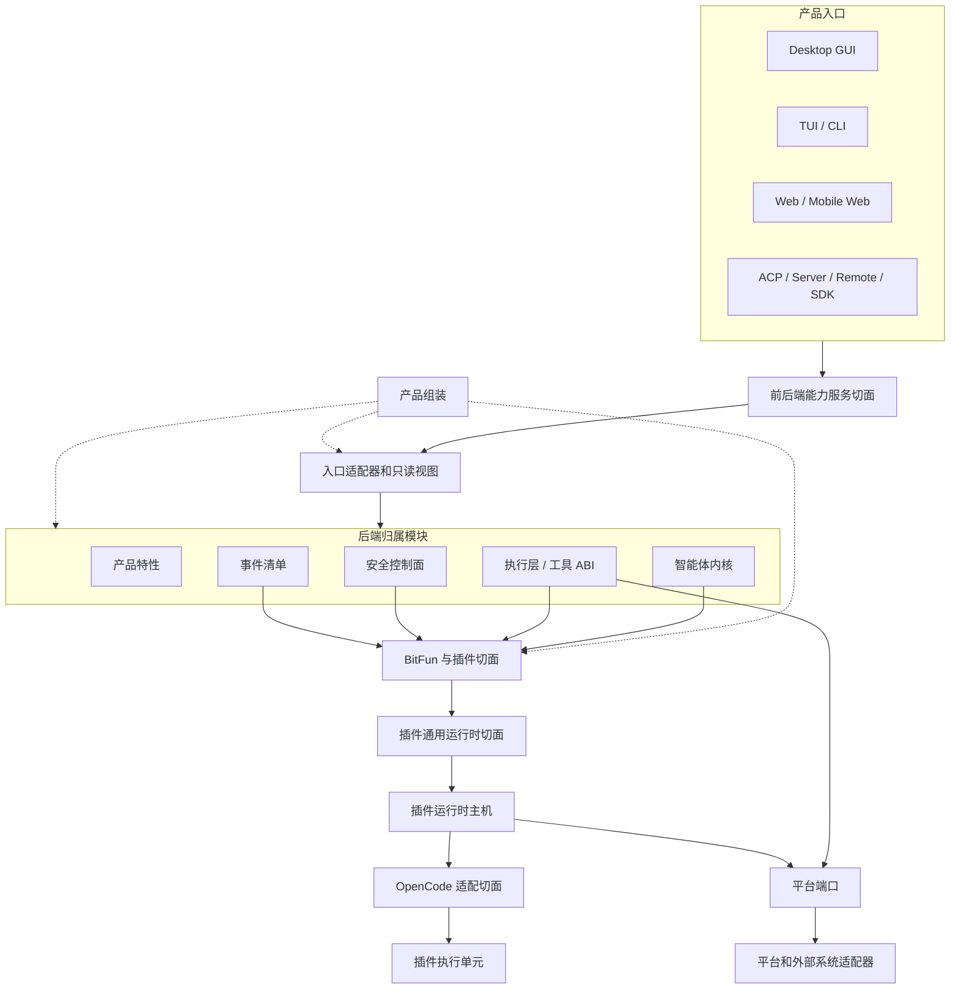

# BitFun 产品运行时架构

本文件定义 BitFun 产品运行时的稳定架构边界。详细执行计划见
[`../plans/core-decomposition-plan.md`](../plans/core-decomposition-plan.md)；智能体内核、运行时服务和 crate
约束见 [`agent-runtime-services-design.md`](agent-runtime-services-design.md)；插件运行时主机内部 ABI 和生态适配细节见
[`plugin-runtime-host-design.md`](extensions/plugin-runtime-host-design.md)；跨 GUI/TUI 的产品定制、布局选择和
内置扩展边界见 [`product-customization-blueprint.md`](product-customization-blueprint.md)；CLI 产品入口和配置
兼容见 [`cli-product-line-design.md`](cli-product-line-design.md)。OpenCode 扩展总矩阵、配置资产、插件执行、
终端插件和外部集成适配分别见 [`opencode-extension-compatibility.md`](extensions/opencode-extension-compatibility.md)、
[`opencode-config-assets-adapter-design.md`](extensions/opencode-config-assets-adapter-design.md)、
[`opencode-plugin-runtime-adapter-design.md`](extensions/opencode-plugin-runtime-adapter-design.md)、
[`opencode-tui-plugin-adapter-design.md`](extensions/opencode-tui-plugin-adapter-design.md) 和
[`opencode-external-integration-adapter-design.md`](extensions/opencode-external-integration-adapter-design.md)。详细设计与本文件冲突时，以本文件为准。

本文件只约束稳定边界，不记录单次 PR 进度，也不把未来可能支持的生态能力提前声明为公开接口。

## 1. 架构目标

BitFun 同时面向桌面 GUI、TUI/CLI、Web、ACP、Server、Remote、SDK 和插件生态。架构目标是降低后端实现高频变更对稳定接口的影响，同时保持插件生态和 OpenCode-compatible 能力可以按受控路径扩展。

设计原则：

1. **接口少而稳定**：每个切面只有一个主入口；不能因为新增生态适配或实现重构而新增平行接口。
2. **实现不外溢**：运行时、平台服务、生态适配器、插件执行单元和传输实现只能通过稳定接口、只读视图或内部 ABI 被消费。
3. **外部语义可变换，最终提交有归属**：OpenCode Hook 可以按其稳定语义修改输入、输出和权限决定；BitFun
   归属模块负责顺序、结构、一致性和用户/组织策略校验并提交最终状态，不能把可写 Hook 一律降级成只读候选。
4. **OpenCode 是兼容目标，不是内部模型**：适配层尽量保持 OpenCode plugin、hook、custom tool、TUI plugin、
   Client、配置和加载顺序的外部可观察行为，但这些类型不能反向成为 BitFun 智能体、配置或界面的内部数据模型。
5. **公开接口有预算**：新增公开 DTO、trait、模块或门面必须同时具备归属模块、真实消费方、版本策略、验证方式和退场条件。
6. **入口形态受宿主约束**：TUI、GUI、Web 和 SDK 共享能力服务接口和只读视图，不共享渲染句柄、主题键、键位模型或界面状态；插件界面贡献必须先声明目标入口形态，再由对应宿主适配。
7. **产品定制先解析，运行时扩展后加载**：产品身份、能力上限和 GUI/TUI 布局选择在构建/组装期解析；用户配置和插件只能在该上限内扩展，不能反向改写产品事实。
8. **兼容默认可用，限制显式可调**：本地 OpenCode 扩展默认按当前用户能力运行；经 BitFun 能力接口的调用可
   细分限制，脚本直接文件/网络/进程能力只在真实操作系统或容器边界存在时可粗粒度收紧，否则停用相应 target。
   策略降级必须与插件故障分开显示。
9. **开放权限不降低可靠性**：第三方代码始终位于受监督的独立执行进程，具备期限、取消、背压、崩溃回收、
   错误去重和结构校验；业务等待不得被单个插件无限阻塞。缺少平台硬资源限制时，内存、CPU 或进程风暴仍是
   明确残余风险，不能用“独立进程”宣称完全隔离。
10. **来源发现与执行准入分离**：生态来源和加载顺序只决定候选输入，不自动授予执行权限。任何可执行来源在
    首次激活、启动或 import 前，以及来源身份/内容版本、target、执行域/用户、策略上限或凭据/环境可见范围
    变化时，由既有 owner 重新评估来源准入。经 BitFun owner/facade 的调用仍执行调用时权限判断；脚本运行时的
    直接文件、网络和进程副作用只能依靠真实 OS/容器边界限制。OpenCode 默认兼容策略可以直接允许，不因此新增
    通用二次激活、trusted-folder 模型或独立信任服务。

调用路径长度只作为工程成本处理，不作为独立架构目标。允许保留承担兼容隔离、只读视图或能力选择职责的中间层；不允许为了兼容而长期暴露没有消费方的抽象接口。

## 2. 接口切面

BitFun 只保留四个稳定接口切面；工具、事件和权限作为归属子接口被复用，不在插件层重复定义。本文使用“接口”描述可被调用或依赖的能力面；只有描述跨进程消息封装、结构化 schema、序列化对象或强兼容约束时才使用“契约”；只读状态视图表示从权威状态派生出的查询结果。

| 切面 | 主要消费方 | 主入口 | 稳定内容 | 禁止暴露 |
|---|---|---|---|---|
| 前后端能力服务切面 | GUI、TUI/CLI、Web、ACP、Server、Remote、SDK 客户端 | 能力服务接口 | 命令请求、会话/工作区状态、权限提示、诊断、产物引用、能力状态、事件流、类型化错误、插件状态只读视图 | 内核状态机、执行层内部类型、`PluginRuntimeClient`、主机内部状态、生态原始载荷、Tauri/React/TUI 实现、具体服务提供方、未预算的界面贡献接口 |
| BitFun 与插件切面 | 插件运行时主机、安全控制面、产品组装、生态适配器 | 扩展贡献接口 | 插件来源、启用状态、能力与副作用、真实工具定义、钩子变换、权限要求、界面贡献、诊断和故障事实 | 最终权限结果、最终工具结果、审计写入、内核权威状态、前后端线缆 DTO、界面实现代码 |
| 插件通用运行时切面 | 智能体内核、执行层、产品组装、插件运行时主机 | 主机内部 ABI | 类型化调用、请求身份、期限、取消、有界队列、健康状态、响应校验和诊断 | SDK 门面、前后端接口、生态适配器对象、worker/subprocess 句柄、产品入口状态 |
| OpenCode 适配切面 | 插件运行时主机和脚本执行进程内部 | 兼容适配层 | OpenCode plugin/config/tool/hook/event/TUI target 的解析、执行、兼容 Client 和 BitFun 模块映射 | 独立智能体内核、OpenCode 原始类型泄漏到产品接口、外部 OpenCode CLI 前置依赖 |

这四项是能力必须归入的概念切面，不表示表中每项已有稳定 API。当前接口仍须满足 2.1 节的真实消费方、版本与验证准入。

归属子接口：

| 子接口 | 归属 | 用法 |
|---|---|---|
| 工具 ABI | `tool-contracts` / 执行层 | 具备真实执行实现的插件 custom tool、MCP 工具和内置工具进入同一可调用工具集合、权限和陈旧调用保护路径；只有声明或候选项的插件工具不能进入该集合。 |
| 事件清单 | `events` / 智能体内核事件 schema | 对固定 OpenCode 版本分别维护服务插件 v1 和终端插件 v2 事件清单；插件观察兼容事件，BitFun 内部私有字段在适配层转换或脱敏。 |
| 权限与副作用 | 安全控制面 / runtime ports | 默认兼容策略允许 OpenCode `permission.ask` 和直接脚本能力按当前用户权限运行；经 BitFun 接口的调用可细分收紧，直接脚本能力只能由真实 OS/容器环境粗粒度限制，否则停用 target。 |

### 2.1 公开接口准入规则

新增或保留公开接口必须满足以下条件：

1. 属于上表一个明确接口切面；公开接口进入预算时必须在 `scripts/core-boundaries/rules/source/public-api-rules.mjs` 声明 `contractSlice`，该字段只用于机器校验接口归属，不能同时承担前后端线缆、插件扩展、host ABI 和生态适配职责。
2. 有当前消费方；仅为了未来兼容、完整矩阵或概念完整性保留的代码接口不进入稳定面。该规则不阻止需求、
   风险、完整能力矩阵和阶段计划记录未来工作，也不能用来把官方稳定能力从兼容审计中删除。
3. 能映射到 OpenCode-compatible P0 关键场景，或属于 BitFun 已有关键路径的稳定子接口。
4. 不能由既有工具 ABI、事件清单、权限控制面或能力服务接口承接时，才允许新增。
5. PR 必须说明版本影响、验证命令和退场条件。

没有 OpenCode 对应能力、没有当前消费方、不能归入关键 BitFun 场景的接口，处理方式只有三种：删除、降级为主机内部实现，或返回类型化 `unsupported` / 诊断。

### 2.2 入口形态接口规则

入口形态接口只描述宿主可消费的声明，不描述具体渲染实现。TUI 与 GUI 的能力边界不同，不能因为存在一个界面插件就自动扩展为全入口稳定接口。

| 目标入口形态 | 可进入稳定接口的内容 | 必须由宿主决定 | 禁止进入插件接口 |
|---|---|---|---|
| TUI / CLI | 斜杠命令、键位候选、状态行/通知候选、终端主题语义 token、只读状态视图 | 键位冲突处理、终端能力降级、ANSI/truecolor 映射、文本回退 | React/DOM/Tauri 句柄、CSS token、GUI 布局、可执行界面代码 |
| Desktop GUI / Web | 路由、面板、槽位、对话框、提示、GUI 主题语义 token、只读状态视图 | 组件装载位置、布局约束、焦点与可访问性、设计 token 映射 | 终端键位、ANSI 颜色、TUI 状态行键、宿主组件实例 |
| SDK / Server / Remote / ACP | 状态、诊断、能力清单、类型化 `unsupported` | 是否暴露只读状态或降级原因 | 任意界面贡献、主题键、渲染句柄 |

主题贡献只能声明语义角色和目标入口形态，例如 `accent`、`danger`、`surface`、`text`、`border`。TUI 宿主把语义角色映射为终端颜色、ANSI 或 truecolor；GUI 宿主把语义角色映射为设计 token 或 CSS 变量。若插件只提供 GUI 主题键而当前入口是 TUI，系统只能使用语义回退或返回类型化 `unsupported`，不得把 GUI 主题键直接传给 TUI。

## 3. 运行视图

关键规则：

- 产品入口只消费能力服务接口和只读视图，不直接调用插件主机。
- 插件只进入扩展贡献接口，不直接写内核状态、工具结果、权限结果或审计事实。
- 插件运行时主机只负责类型化调用、期限、取消、有界队列、逻辑 target 状态、响应校验和故障状态；
  物理进程健康、资源预算与进程树回收属于脚本执行服务。
- OpenCode 适配层负责保留外部格式和调用语义并映射到 BitFun 归属模块；它本身不成为新的业务归属模块。
- 产品组装是组装根，只在组装期选择能力、服务实现、插件运行时绑定和降级策略。
- 依赖方向保持为产品入口 / interfaces → assembly → adapters / services / execution → contracts。assembly
  可以选择下层提供方，但不能依赖 app crate；需要同时被独立应用和嵌入式模式复用的实现必须下沉到可复用 owner，
  再由各 app 和 assembly 组合。

## 4. OpenCode-compatible 当前 P0 基线与目标

当前 P0 只验证了 BitFun 专用插件目录中的来源校验、工作区审核、启停记录、CLI 诊断和 custom tool 名称预览。
它不执行 JS/TS，不注册真实工具，也不运行 OpenCode 钩子、Client 或终端插件。现有能力只能称为“静态预览”，
不能称为“OpenCode 插件运行时”。详细代码事实集中在
[`plugin-runtime-host-design.md#8-当前实现附录`](extensions/plugin-runtime-host-design.md#8-当前实现附录)。

目标路线不要求 OpenCode 插件作者维护 `bitfun.plugin.json` 或复制到 `.bitfun/plugins`。BitFun 直接发现用户和
项目的 OpenCode 配置、插件目录、工具目录和软件包来源，自动记录当前执行版本，在自有脚本进程中真实加载插件，
再通过兼容适配层把工具、稳定钩子、Client 和 TUI target 接入现有归属模块。

稳定决策如下：

- 不启动完整 OpenCode Runtime，也不依赖用户安装 OpenCode CLI；BitFun 实现自己的监督、适配和 Rust 转发层。
  固定版本 Bun 只负责脚本执行，依赖按冻结 OpenCode 版本的 npm/Arborist 语义准备。
- 本地默认按 OpenCode 语义加载和执行，允许当前用户通常拥有的文件、网络、进程和环境能力；用户、产品或组织
  可以按需收紧，差异必须明确显示为策略限制。
- 每个外部插件 target 使用独立可终止进程；期限、取消、有界队列、大小限制、崩溃恢复和终端恢复始终生效，
  不因默认权限开放而省略。
- 执行进程实际加载的工具、钩子和导出是权威结果；静态扫描只可用于快速预览，不能作为拒绝动态插件的依据。
- 插件工具只有具备真实定义和执行函数、接入现有 Tool Runtime 并经过调用时权限判断后，才能显示为可用工具。
- OpenCode 可写钩子按固定版本和原始顺序执行合法变换，最后由对应归属模块做结构和策略校验。
- 服务插件和终端插件独立加载、启停和恢复；一个 target 失败不使另一个 target 自动失效。
- GUI、TUI、Web 和 Remote 只消费能力服务、稳定状态和操作接口，不直接依赖主机、worker 或 OpenCode 原始类型。

最明显的首期降级是 OpenCode TUI 的原始 `CliRenderer`、Solid/OpenTUI 组件树。BitFun CLI 使用 Ratatui，无法直接
执行这些组件；宿主操作和结构化贡献可以适配，原始组件必须返回明确降级且不能打开空白或无法退出的页面。
其他暂不承诺项、原因和风险统一在
[`opencode-extension-compatibility.md#6-明确限制与需确认项`](extensions/opencode-extension-compatibility.md#6-明确限制与需确认项)
维护，不能因为某一项降级就把整体状态写成“完整覆盖”。

产品内置扩展与用户插件可以复用主机可靠性和最终能力归属，但来源、升级、卸载和产品必要性不同。只有产品
身份、安全恢复或法律要求等少量明确保护项不可被覆盖；普通内置命令、工具和主题默认可以按 OpenCode 兼容顺序
被用户扩展替换或关闭。具体规则见
[`product-customization-blueprint.md#8-产品内置扩展与用户插件`](product-customization-blueprint.md#8-产品内置扩展与用户插件)。

完整能力状态、设计细节和阶段顺序分别见
[`opencode-extension-compatibility.md`](extensions/opencode-extension-compatibility.md)、
[`opencode-plugin-runtime-adapter-design.md`](extensions/opencode-plugin-runtime-adapter-design.md) 和
[`../plans/opencode-extension-compatibility-plan.md`](../plans/opencode-extension-compatibility-plan.md)。

## 5. 产品形态与降级

产品定义、Delivery Profile、Runtime Configuration 和 Capability Availability 必须分离：

- 产品定义只在构建/组装期选择产品身份、品牌资源、产品能力上限、默认策略引用、内置扩展版本和发行事实；
  不承载用户配置、凭据或任意脚本。
- Delivery Profile 只表示 CLI、Desktop、ACP、SDK 等交付形态，不表示品牌或 SKU。
- 声明一个 Delivery Profile、生成测试计划或通过 crate 单测，不等于该产品形态已经接入生产。只有入口实际提交
  唯一 profile、消费组装结果和统一能力可用性，并通过入口级行为验证后，才能把该 profile 标为已接入。
- 产品入口向组装根提交唯一 Delivery Profile；组装根只校验并派生静态计划，不在内部再次选择交付形态。
- Runtime Configuration 承载用户、项目、工作区和本次运行的可变配置；不能启用产品定义
  未组装的能力，也不能放宽产品或组织策略。
- Capability Availability 是根据产品计划、服务健康和当前策略计算出的能力状态；所有入口读取同一状态，
  入口隐藏不等于能力已禁用。
- 构建期校验器读取产品定义、品牌资源和 GUI/TUI 布局选择，输出本次交付的产品组装结果；它不是常驻服务，
  也不执行产品定义中携带的任意脚本。
- Runtime Product Assembly 只消费产品组装结果和调用方唯一传入的 Delivery Profile；不读取原始品牌资源，
  不运行构建脚本，也不从产品定义再次选择 Delivery。
- GUI 与 TUI 布局由对应宿主独立校验，只共享产品身份、Capability ID、品牌资源索引和策略引用，不共享布局、
  组件、主题键、键位或渲染状态。
- 布局选择只能引用宿主已注册的稳定 ID；品牌生成和校验继续使用仓库现有构建流程，不新增通用脚本运行时。
- 产品内置扩展、BitFun 原生包和 OpenCode 标准来源不共享来源根、信任/启用记录、安装状态、更新通道或卸载
  生命周期；三者只复用适用的包校验、Host ABI、隔离和经 BitFun 能力接口的权限/审计路径。

产品定制和品牌资源的详细边界见
[`product-customization-blueprint.md`](product-customization-blueprint.md)；CLI/TUI 的消费方式和配置导入见
[`cli-product-line-design.md`](cli-product-line-design.md)。

产品形态由产品组装决定，不由插件配置、单个 Cargo feature 或生态适配器临时决定。

| 产品形态 | 当前 P0 插件能力 | 入口行为 |
|---|---|---|
| Desktop / product-full | 生产入口仍直接依赖 `bitfun-core/product-full`；当前没有 managed-plugin 管理或 OpenCode 静态预览的生产 UI/调用方 | 共享代码可编译不等于 Desktop 已消费插件能力 |
| CLI | 所有执行路径仍依赖 `bitfun-core/product-full`；只为 BitFun 原生包提供来源审核、启用预览、精确内容确认和停用 | `doctor` 选择 `DeliveryProfile::Cli` 并展示静态 profile，但不评估运行时 readiness；尚未构造 Runtime Parts，不代表执行路径已隔离，也不执行 OpenCode 插件代码 |
| ACP | 生产入口仍直接依赖 `bitfun-core/product-full` | `DeliveryProfile::Acp` 尚未进入入口组装；不得把测试中的 profile 解释为生产隔离 |
| Server / Remote | 当前生产路由没有插件状态消费闭环；Remote 插件执行未实现 | 不在本地替远端项目发现、准备或执行插件；未接入时返回明确不支持 |
| Web / Mobile Web | 依赖现有后端入口，不持有插件执行单元 | 对应 profile 当前为空计划或未接入生产，不能据枚举值宣称独立产品能力 |
| SDK | 仅有 preview 门面、空 profile 计划和测试替身 | 不牵引 `product-full`、具体服务管理器或插件 host ABI；未满足独立嵌入验证前不宣称可发布 |

对外状态必须能直接解释为可用、准备中、部分可用、暂不可用、不支持、策略限制、已暂停或失败，并附带原因和
恢复建议。现有代码中的过渡状态只能统一展示为“静态预览、未执行”，不能继续扩展成用户状态体系。

## 6. 完成判定

架构或实现 PR 必须满足：

- 未新增无消费方的公开接口、空注册表、泛描述符或多生态稳定接口。
- 没有把 OpenCode 类型或 CLI 可用性提升为 BitFun 内部数据模型；适配器仍应保持 OpenCode 配置、加载顺序和
  冲突的外部可观察语义。
- 插件可按 OpenCode Hook 语义提出并链式应用变换，最终结构、策略、审计和状态提交仍由对应模块完成。
- 只有名称或静态声明、没有真实执行实现的插件工具不能进入最终可调用工具集合。
- 前后端入口不能消费 `PluginRuntimeClient`、host 内部状态、生态原始载荷或插件执行单元句柄。
- 工具、事件、权限能力优先复用既有归属子接口，不在插件层重复建模。
- TUI 与 GUI 不共享内部主题键、键位模型或界面状态；OpenCode TUI 原始键和组件只存在于适配层，转换后由
  TUI 宿主消费，不能用构建期布局选择冒充运行时插件兼容。
- 只有产品身份、安全恢复和法律要求等明确保护项不能被用户扩展覆盖；普通内置工具、命令和主题默认遵循
  OpenCode 兼容优先级。产品内置扩展不能复用用户来源批准或启用记录，产品签名也不能绕过运行时
  权限、审计和故障隔离。
- GUI/TUI 布局选择不复制主题 schema，不固化动态能力状态，也不携带可执行 UI 或任意构建脚本。
- 新 profile 只有在真实入口消费组装结果、能力可用性和类型化降级后才算接入；仅有枚举、空计划、re-export
  或单测不构成产品支持。
- assembly 不新增对 app crate 的依赖。现有嵌入式 relay 反向依赖必须通过抽取可复用 relay owner 消除，并由
  边界检查阻止同类依赖回流。
- 文档、边界脚本和 focused 测试能说明本次变更保护了哪个稳定接口切面，或删除/降级了哪个过宽接口。
