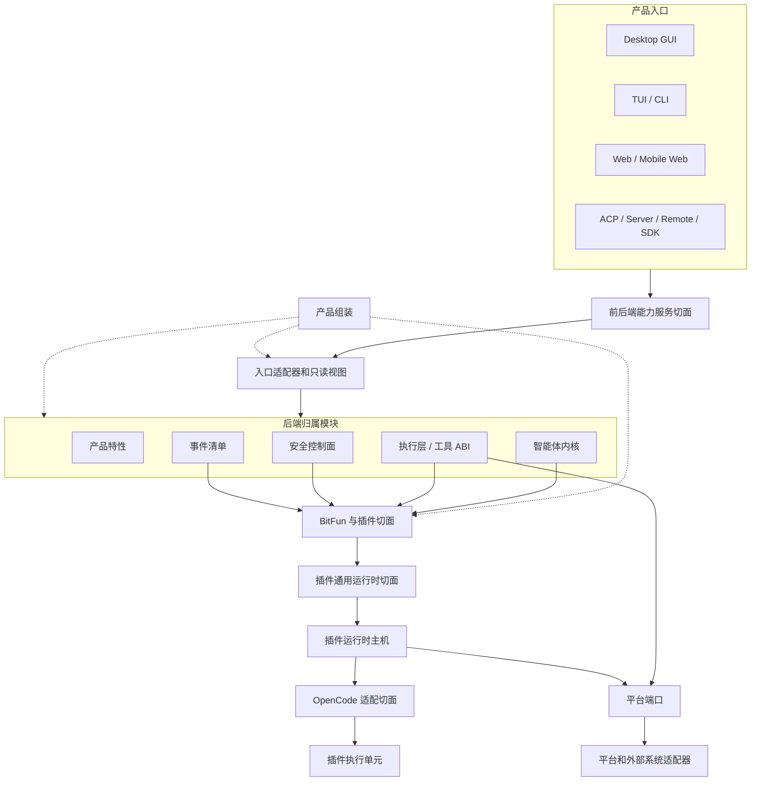
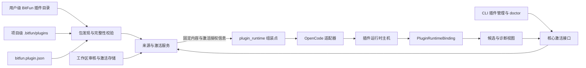
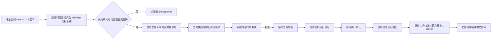

# BitFun 产品运行时架构

本文件定义 BitFun 产品运行时的稳定架构边界。详细执行计划见
[`../plans/core-decomposition-plan.md`](../plans/core-decomposition-plan.md)；智能体内核、运行时服务和 crate
约束见 [`agent-runtime-services-design.md`](agent-runtime-services-design.md)；插件运行时主机内部 ABI 和生态适配细节见
[`plugin-runtime-host-design.md`](plugin-runtime-host-design.md)；跨 GUI/TUI 的产品定制、Surface Blueprint 和
内置扩展边界见 [`product-customization-blueprint.md`](product-customization-blueprint.md)；CLI 产品入口和配置
兼容见 [`cli-product-line-design.md`](cli-product-line-design.md)。详细设计与本文件冲突时，以本文件为准。

本文件只约束稳定边界，不记录单次 PR 进度，也不把未来可能支持的生态能力提前声明为公开接口。

## 1. 架构目标

BitFun 同时面向桌面 GUI、TUI/CLI、Web、ACP、Server、Remote、SDK 和插件生态。架构目标是降低后端实现高频变更对稳定接口的影响，同时保持插件生态和 OpenCode-compatible 能力可以按受控路径扩展。

设计原则：

1. **接口少而稳定**：每个切面只有一个主入口；不能因为新增生态适配或实现重构而新增平行接口。
2. **实现不外溢**：运行时、平台服务、生态适配器、插件执行单元和传输实现只能通过稳定接口、只读视图或内部 ABI 被消费。
3. **扩展先声明，最终写入归属模块**：插件、钩子和工具提供方先产出声明或候选项；最终权限、审计、工具结果和状态写入由归属模块完成。
4. **OpenCode 是适配输入，不是内部模型**：OpenCode plugin、hook、custom tool、permission hook 和配置目录只能映射到 BitFun 接口，不能反向定义 BitFun 的内部接口。
5. **公开接口有预算**：新增公开 DTO、trait、模块或门面必须同时具备归属模块、真实消费方、版本策略、验证方式和退场条件。
6. **入口形态受宿主约束**：TUI、GUI、Web 和 SDK 共享能力服务接口和只读视图，不共享渲染句柄、主题键、键位模型或界面状态；插件界面贡献必须先声明目标入口形态，再由对应宿主适配。
7. **产品定制先解析，运行时扩展后加载**：产品身份、能力上限和 Surface Blueprint 在构建/组装期解析；用户配置和插件只能在该上限内扩展，不能反向改写产品事实。

调用路径长度只作为工程成本处理，不作为独立架构目标。允许保留承担兼容隔离、只读视图或能力选择职责的中间层；不允许为了兼容而长期暴露没有消费方的抽象接口。

## 2. 接口切面

BitFun 只保留四个稳定接口切面；工具、事件和权限作为归属子接口被复用，不在插件层重复定义。本文使用“接口”描述可被调用或依赖的能力面；只有描述跨进程消息封装、结构化 schema、序列化对象或强兼容约束时才使用“契约”；只读状态视图表示从权威状态派生出的查询结果。

| 切面 | 主要消费方 | 主入口 | 稳定内容 | 禁止暴露 |
|---|---|---|---|---|
| 前后端能力服务切面 | GUI、TUI/CLI、Web、ACP、Server、Remote、SDK 客户端 | 能力服务接口 | 命令请求、会话/工作区状态、权限提示、诊断、产物引用、能力状态、事件流、类型化错误、插件状态只读视图 | 内核状态机、执行层内部类型、`PluginRuntimeClient`、主机状态快照、生态原始载荷、Tauri/React/TUI 实现、具体服务提供方、未预算的界面贡献接口 |
| BitFun 与插件切面 | 插件运行时主机、安全控制面、产品组装、生态适配器 | 扩展贡献接口 | 插件来源、来源审核与激活授权、能力/副作用声明、工具贡献候选、权限要求、诊断、隔离事实 | 最终权限结果、最终工具结果、审计写入、内核权威状态、前后端线缆 DTO、界面实现代码 |
| 插件通用运行时切面 | 智能体内核、执行层、产品组装、插件运行时主机 | 主机内部 ABI | `PluginRuntimeClient`、`PluginRuntimeBinding`、read/dispatch 请求与响应对象、deadline、epoch、幂等、隔离、诊断、候选项 | SDK 门面、前后端接口、生态适配器对象、worker/subprocess 句柄、产品入口状态 |
| OpenCode 适配切面 | 插件运行时主机内部 | 兼容适配层 | OpenCode plugin/config/tool/hook/event 的解析、诊断和 BitFun 接口映射 | 独立产品入口、OpenCode 原始类型、外部 OpenCode CLI 依赖、OpenCode 配置作为 BitFun 主配置 |

归属子接口：

| 子接口 | 归属 | 用法 |
|---|---|---|
| 工具 ABI | `tool-contracts` / 执行层 | 具备真实执行实现的插件 custom tool、MCP 工具和内置工具进入同一工具快照、权限和陈旧调用保护路径；只有声明或候选项的插件工具不能进入可调用快照。 |
| 事件清单 | `events` / 智能体内核事件 schema | 当前不向插件开放订阅接口；后续只有公开事件子集和真实订阅方同时存在时才能接入，且不得暴露会话、轮次或工具内部结构。 |
| 权限与副作用 | 安全控制面 / runtime ports | 插件只能提交权限候选或副作用候选；最终裁决、审计和状态写入属于安全控制面和能力归属模块。 |

### 2.1 公开接口准入规则

新增或保留公开接口必须满足以下条件：

1. 属于上表一个明确接口切面；公开接口进入预算时必须在 `scripts/core-boundaries/rules/source/public-api-rules.mjs` 声明 `contractSlice`，该字段只用于机器校验接口归属，不能同时承担前后端线缆、插件扩展、host ABI 和生态适配职责。
2. 有当前消费方；仅为了未来兼容、完整矩阵或概念完整性保留的接口不进入稳定面。
3. 能映射到 OpenCode-compatible P0 关键场景，或属于 BitFun 已有关键路径的稳定子接口。
4. 不能由既有工具 ABI、事件清单、权限控制面或能力服务接口承接时，才允许新增。
5. PR 必须说明版本影响、验证命令和退场条件。

没有 OpenCode 对应能力、没有当前消费方、不能归入关键 BitFun 场景的接口，处理方式只有三种：删除、降级为主机内部实现，或返回类型化 `unsupported` / 诊断。

### 2.2 入口形态接口规则

入口形态接口只描述宿主可消费的声明，不描述具体渲染实现。TUI 与 GUI 的能力边界不同，不能因为存在一个界面插件就自动扩展为全入口稳定接口。

| 目标入口形态 | 可进入稳定接口的内容 | 必须由宿主决定 | 禁止进入插件接口 |
|---|---|---|---|
| TUI / CLI | 斜杠命令、键位候选、状态行/通知候选、终端主题语义 token、只读状态视图 | 键位冲突处理、终端能力降级、ANSI/truecolor 映射、文本回退 | React/DOM/Tauri 句柄、CSS token、GUI 布局、可执行界面代码 |
| Desktop GUI / Web | 路由、面板、槽位、对话框、提示、GUI 主题语义 token、只读状态视图 | 组件装载位置、布局约束、焦点与可访问性、设计 token 映射 | 终端键位、ANSI 颜色、TUI 状态行键、宿主组件实例 |
| SDK / Server / Remote / ACP | 状态、诊断、能力清单、类型化 `unsupported` | 是否暴露只读状态或降级原因 | 任意界面贡献、主题键、渲染句柄 |

主题贡献只能声明语义角色和目标入口形态，例如 `accent`、`danger`、`surface`、`text`、`border`。TUI 宿主把语义角色映射为终端颜色、ANSI 或 truecolor；GUI 宿主把语义角色映射为设计 token 或 CSS 变量。若插件只提供 GUI 主题键而当前入口是 TUI，系统只能使用语义回退或返回类型化 `unsupported`，不得把 GUI 主题键直接传给 TUI。

## 3. 运行视图

关键规则：

- 产品入口只消费能力服务接口和只读视图，不直接调用插件主机。
- 插件只进入扩展贡献接口，不直接写内核状态、工具结果、权限结果或审计事实。
- 插件运行时主机只负责隔离通信、deadline、幂等、诊断、隔离和候选项路由。
- OpenCode 适配层只做解析、诊断和映射；不成为 BitFun 内部真实归属模块。
- 产品组装是组装根，只在组装期选择能力、服务实现、插件运行时绑定和降级策略。

## 4. OpenCode-compatible P0 边界

P0 的目标不是复制完整 OpenCode 运行时，也不是导入用户已有 OpenCode 安装。P0 只验证一条 BitFun 主导的 OpenCode-compatible 插件路径。

P0-C.1 已建立包识别、完整性校验、工作区来源审核和 CLI 诊断。P0-C.2 在此基础上增加工作区激活与 custom tool 候选读取：

1. 用户级包和项目级包只从 BitFun 受管目录发现；工作区同 ID 来源优先且不得回退到用户级包。
2. `bitfun.plugin.json` 只定义生态无关的包来源标识、适配器标识和文件哈希；具体生态入口由对应适配器解释。
3. `SourceApproved` 只确认当前来源内容。`plugins activate` 先展示适配器、入口、静态候选名称、高风险标记、权限要求和内容哈希；激活命令必须提交该哈希，内容变化时拒绝激活。
4. 产品组装根按工作区和包临时组合 OpenCode 适配器、插件运行时主机与 `PluginRuntimeBinding`，只读取受权限保护的 custom tool 候选。不执行 JS/TS，不注册或执行最终工具。

归属边界：`product-domains/plugin_source` 定义来源审核与激活规则，`services-integrations/plugin_source` 负责校验、锁、持久化和实时激活校验，`bitfun-core/plugin_runtime` 是唯一生态适配组装点。CLI 只消费核心提供的激活视图。

当前实现与后续能力边界：

| 能力 | 当前实现 | 后续工作 |
|---|---|---|
| 用户级、项目级包 | 从两个 BitFun 受管目录发现并校验 | 安装复制、更新、卸载和组织策略 |
| 随产品携带包 | 未建立独立扫描根 | 由构建配置、安装器和产品组装提供来源后接入同一校验接口 |
| OpenCode 兼容内容 | 包清单可声明 `opencode_compatible`；来源模块重新校验并固定声明文件，适配器只解释该输入 | 外部目录需经独立导入流程转换为受管包 |
| 来源审核 | 工作区 `SourceApproved`、`Denied`、`Revoked`；内容变化使旧审核与激活失效 | 组织策略、签名和撤销列表 |
| 激活 | 预览后按精确内容哈希确认；激活代次与来源审核代次独立；停用或内容变化立即使既有 Binding 失效 | GUI/Web 管理入口、组织策略，以及包缺失或损坏后的显式记录清理体验 |
| 插件运行 | 只通过 Host 读取 custom tool 候选；候选始终需要权限；不执行 JS/TS，不注册最终工具 | 先建立受限执行单元和真实工具提供方，再接入工具快照与权限裁决；执行能力不可用时只返回诊断 |

OpenCode 适配接入规则：

- OpenCode 适配器的公开入口只接收来源服务重新校验并固定的受管包输入，不直接扫描工作区或用户 OpenCode 目录。
- 来源服务只为当前 `SourceApproved` 的包生成固定内容输入。每条激活记录保存自己的签发代次；激活授权信息只包含项目、工作区、精确来源和该代次，包内容不在授权信息中重复保存，其他包的状态变化不会使当前授权失效。
- 固定内容输入只保证结构、大小和哈希自洽，不作为审核凭据。生产组装必须从来源服务取得输入；即使其他进程内调用方构造了有效输入，适配器仍只能返回未激活状态。
- Host 来源 URI 使用来源模块生成的路径摘要区分用户级包、项目级包和后续其他来源，不暴露原始本地路径。
- 普通包输入只能产生来源与诊断视图。只有产品组装点持有来源服务生成的当前激活授权信息时，适配器才将受支持 custom tool 映射为权限候选。
- 当前源码探测只识别经过测试的单行声明形式，不是完整 JS/TS 解析器；注释中的声明不参与识别，重复工具 id 按歧义输入拒绝。空包或没有任何受支持入口的包必须返回诊断，其他 JS/TS 语法不属于本阶段兼容范围。
- 声明读取不能推断工具的文件、网络、进程或凭据副作用，因此当前 custom tool 候选统一标记为高风险；精确风险只能由后续真实工具接口和权限策略确定。
- 未支持或信任不足的能力必须返回诊断或 `unsupported` 状态，不得因外部插件内容导致运行时崩溃。
- `bitfun-core/plugin_runtime` 是唯一允许调用具体适配器工厂的生产组装点。它在 read 前以及 dispatch 前后重新校验激活授权，产品入口不得直接构造适配器或 Host。
- GUI、TUI/CLI、Web 等产品入口只消费能力服务接口、插件只读视图、诊断和稳定状态词，不直接依赖 OpenCode 适配器内部类型或插件主机内部 ABI。

### 4.1 可执行工具准入（目标设计，当前未实现）

运行时插件的 custom tool 候选只是经过来源审核、激活校验并带有权限要求的声明，不是可调用工具。产品内置扩展不使用用户插件的审核或激活记录，其来源凭据由 Resolved Product Manifest 中的精确摘要、发布签名和产品策略共同确定。两类来源只有通过各自凭据校验后，才能进入相同的工具注册、权限和执行路径。

只有同时满足以下条件时，产品组装才能把插件工具提供方加入现有工具快照：

1. 运行时插件由来源服务确认精确包内容和激活授权有效；产品内置扩展由产品组装确认 Manifest 摘要、发布签名和产品策略有效。
2. BitFun 已提供与该制品匹配的执行单元；不能依赖用户安装 OpenCode CLI，也不能把用户环境中的 Node/Bun 当作默认可用事实。
3. 工具提供方能够完成真实调用并返回既有工具结果类型；仅返回 `unsupported` 的占位实现不能注册为工具。
4. 执行单元实际加载的工具标识必须与同一内容哈希下确认的候选集合一致；出现新增、缺失或重名时拒绝注册并返回诊断。
5. 每次调用继续经过现有工具权限、陈旧快照保护、deadline 和取消路径。
6. 执行单元具备进程或等价隔离、资源上限、受控环境变量、崩溃回收和隔离状态处理。
7. 插件返回值经主机和工具归属模块校验后才能形成工具结果；插件不能写权限结果、审计成功或内核状态。

执行单元的技术载体、支持的首版制品和交付顺序属于实施决策，记录在执行计划中。无论选择哪种方案，上述准入条件以及“不依赖 OpenCode 安装、不注册伪工具”的规则保持不变。

信任 epoch 与生命周期：

- 来源审核 epoch 由 BitFun 来源与信任模块维护。审核、拒绝、撤销、已有记录的来源标识或哈希变化都会推进 epoch；重复写入相同决定不推进 epoch。信任文件重建时使用新的随机初始值，避免旧 epoch 被重复使用。
- 发现的新来源默认为 `Unknown`；CLI 只允许对当前工作区已发现且 id 唯一的包写入 `SourceApproved`、`Denied` 或 `Revoked`。
- 损坏、版本未知或记录冲突的信任文件按失败处理；适配器和主机不得写信任状态。
- `SourceApproved` 不直接映射为 Host 的 `Trusted`。来源审核代次只用于来源存储；每条激活记录的签发代次写入当前 Binding 的 `trust_epoch` 字段，只用于校验该包的激活有效性。该字段不承载来源审核代次。
- 当前链路只读取声明并生成带权限要求的 custom tool 候选，不消费项目状态或产品策略快照，因此 `project_epoch`、`policy_epoch` 固定为 `0`，`tool_registry_epoch` 为空。后续只有在接入相应状态时，才由其归属模块提供实际代次。
- `ProjectionOnly` 在候选路径中表示插件代码没有被执行、最终效果没有提交；它允许主机返回受权限门禁保护的候选项和诊断，不表示插件运行时已经可执行。

OpenCode 能力映射：

| OpenCode 能力 | BitFun P0 处理 | 不允许 |
|---|---|---|
| 受管包内的 `opencode.json` | 当前只读解释配置和 npm 插件声明，返回诊断 | 安装或执行 npm 插件、直接决定启用状态 |
| 用户已有 project/global plugin config | 当前未实现；未来由独立导入流程转换为受管包 | 由适配器直接扫描、作为 BitFun 主配置 |
| custom tools | 映射为工具提供方候选，最终走工具 ABI | 新增插件专用工具模型 |
| permission hooks | 当前只返回诊断或 `unsupported`；存在真实权限消费方后，才能映射为权限候选 | 插件直接批准、拒绝或写审计 |
| events / SSE | 当前只返回诊断或 `unsupported`；存在公开事件子集和真实订阅方后，才能产生订阅声明 | 读取内部 session、turn、tool 或 UI 状态 |
| tool execute before/after | 当前阶段只允许诊断或只读候选；可写变换必须进入 P0+ 安全评审 | 改写工具结果、伪造成功或绕过权限 |
| TUI 命令/键位/主题 | 当前 P0 返回类型化 `unsupported` 或 status-only；后续必须通过目标入口形态为 `tui` 的声明式接口进入 | 复用 GUI 路由/面板/槽位、暴露终端渲染句柄、直接消费 GUI 主题键 |
| GUI 路由/面板/对话/主题 | OpenCode P0 不提供稳定来源；后续只能作为 BitFun GUI 入口的声明式贡献进入 | 复用 TUI 键位/状态行、暴露 React/DOM/Tauri 句柄、直接消费 TUI 主题键 |
| shell/env helper | 默认不开放；未来只能映射为受控工具请求候选 | 无约束 shell、环境变量或 localhost 能力 |

不进入当前阶段：

- 完整 OpenCode 运行时兼容。
- 要求用户本机安装 `opencode` CLI。
- 对 Claude Code、Codex 等生态声明稳定运行时接口。
- 全入口 UI 扩展矩阵。
- 任意 provider/model/config 转换。
- 无约束 JS/TS runtime、localhost 接口或可写 hook。
- 对外稳定 SDK 发布。

## 5. 产品形态与降级

Product Profile、Delivery Profile、Runtime Configuration 和 Capability Availability 必须分离：

- Product Profile 只在构建/组装期选择产品身份、品牌资源、capability ceiling、默认策略引用、内置扩展锁和发行事实；
  不承载用户配置、凭据或任意脚本。
- Delivery Profile 只表示 CLI、Desktop、ACP、SDK 等交付形态，不表示品牌或 SKU。
- 产品入口向组装根提交唯一 Delivery Profile；组装根只校验并派生静态计划，不在内部再次选择交付形态。
- Runtime Configuration 承载用户、项目、工作区和本次运行的可变配置；不能启用 Product Profile
  未组装的能力，也不能放宽托管策略。
- Capability Availability 是静态计划、服务健康和策略共同派生的版本化运行时读模型；所有入口消费同一
  读模型，入口隐藏不等于能力已禁用。
- 产品构建期的 Product Customization Resolver 只能解析已验证 Profile、Brand Pack、Surface Blueprint、
  内置扩展锁和预注册构建任务，不得通过文本替换源码或让品牌分支进入内核。
- authoring Profile 不能直接成为运行时真相；Resolver 必须生成带 Profile/resource 摘要、能力闭包和
  Blueprint/task 输出摘要、扩展锁定事实的 Resolved Product Manifest。运行时裁剪不自动等于代码已从
  产物物理移除。
- Runtime Product Assembly 只消费 Manifest 的运行时投影、`SurfaceContractRef` 和调用方唯一传入的
  Delivery Profile；不读取 authoring Bundle，不运行构建任务，也不从 Product Profile 再次选择 Delivery。
- 一个 Product Customization Bundle 可以同时引用 GUI 与 TUI Blueprint，但二者必须由对应 Surface Host
  独立解析和校验；只共享产品身份、Capability ID、品牌资源索引和策略引用，不共享布局、组件、主题键、
  键位或渲染状态。
- Blueprint 只能引用宿主已注册的稳定 ID。构建任务只在签名前生成受控 staging 输出，不进入 Runtime，
  不接受 Profile 内任意命令字符串，也不能修改源码或 dependency lockfile。
- 产品内置扩展与用户/工作区插件不共享来源根、信任记录、安装状态、更新通道或卸载生命周期；两者只
  复用包校验、Host ABI、隔离、权限和审计路径。

产品定制和品牌资源的详细边界见
[`product-customization-blueprint.md`](product-customization-blueprint.md)；CLI/TUI 的消费方式和配置导入见
[`cli-product-line-design.md`](cli-product-line-design.md)。

产品形态由产品组装决定，不由插件配置、单个 Cargo feature 或生态适配器临时决定。

| 产品形态 | P0 插件策略 | 入口行为 |
|---|---|---|
| Desktop / product-full | 提供受管包来源、激活和候选投影的组装能力 | 当前没有插件管理界面，也不把候选显示为已注册或可执行工具 |
| CLI | 提供来源审核、激活预览、精确哈希确认和停用；按需组装仅用于候选投影的 Host/Binding | 不执行插件代码、不注册最终工具；`doctor` 对完整性错误返回失败 |
| ACP | `status-only`、`projection-only`、`unsupported`、`policy-denied` 或 `quarantined` | 不把插件失败解释为 agent 失败，不接入 P0 副作用闭环 |
| Server / Remote | `projection-only`、`temporarily-unavailable`、`unsupported` 或 `policy-denied` | 不自动启动本地 JS/TS 运行时；远端执行域需 P0+ 单独设计 |
| Web / Mobile Web | 只消费后端能力服务接口和只读视图 | 不持有插件执行单元，不直接加载插件代码 |
| SDK | 默认 disabled stub 或测试替身 | 不牵引 `product-full`、具体服务管理器或插件 host ABI |

稳定状态词限制为：`available`、`projection-only`、`status-only`、`temporarily-unavailable`、`unsupported`、`policy-denied`、`quarantined`。其他内部状态必须先归一化为这些状态词或类型化错误。

## 6. 完成判定

架构或实现 PR 必须满足：

- 未新增无消费方的公开接口、空注册表、泛描述符或多生态稳定接口。
- 没有把 OpenCode 类型、配置、加载顺序或 CLI 可用性提升为 BitFun 权威状态。
- 插件贡献不能写最终权限、审计、工具结果或内核状态。
- 只有候选声明、没有真实执行实现的插件工具不能进入最终工具快照。
- 前后端入口不能消费 `PluginRuntimeClient`、host 快照、生态原始载荷或插件执行单元句柄。
- 工具、事件、权限能力优先复用既有归属子接口，不在插件层重复建模。
- TUI 与 GUI 不共享主题键、键位模型或界面状态；跨入口能力只能通过语义 token、只读视图和对应宿主适配。
- 产品内置扩展不能被用户包覆盖，也不能复用用户 `SourceApproved` 或激活授权；产品签名仍不能绕过
  运行时权限、审计和 quarantine。
- Surface Blueprint 不复制 GUI/TUI 主题 schema，不固化动态 Availability，也不携带可执行 UI 或
  任意构建脚本。
- 文档、边界脚本和 focused 测试能说明本次变更保护了哪个稳定接口切面，或删除/降级了哪个过宽接口。
