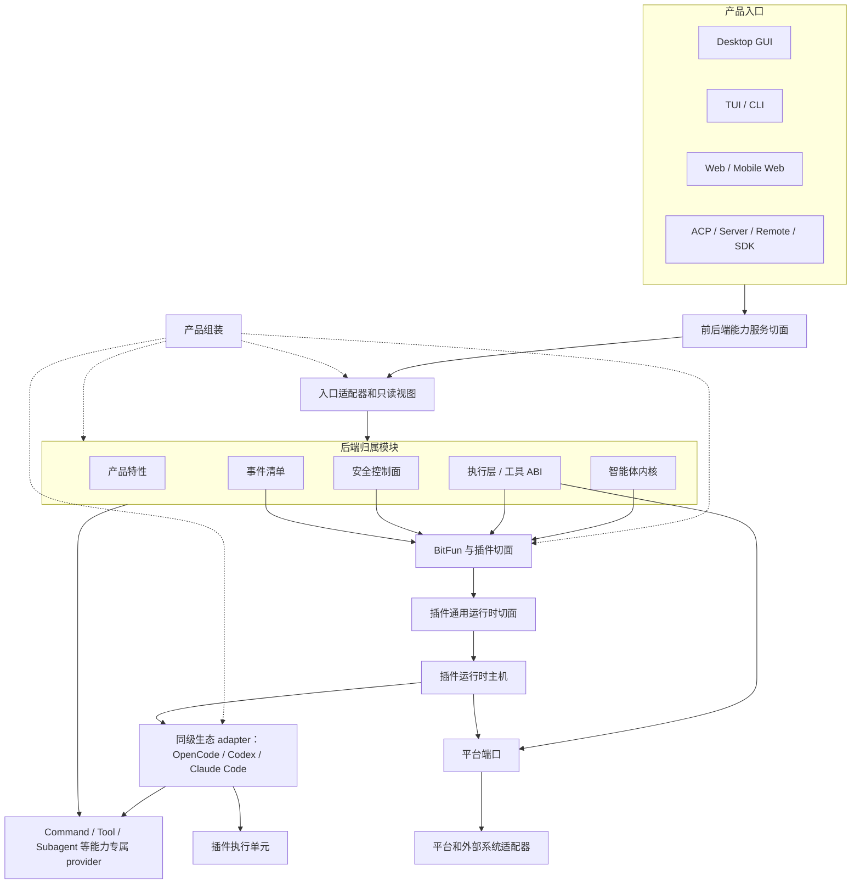

# BitFun 产品运行时架构

本文件定义 BitFun 产品运行时的稳定架构边界。详细执行计划见
[`../plans/core-decomposition-plan.md`](../plans/core-decomposition-plan.md)；智能体内核、运行时服务和 crate
约束见 [`agent-runtime-services-design.md`](agent-runtime-services-design.md)；插件运行时主机内部 ABI 和生态适配细节见
[`plugin-runtime-host-design.md`](extensions/plugin-runtime-host-design.md)；跨 GUI/TUI 的产品定制、布局选择和
内置扩展边界见 [`product-customization-blueprint.md`](product-customization-blueprint.md)；CLI 产品入口和配置
兼容见 [`cli-product-line-design.md`](cli-product-line-design.md)；HarmonyOS PC 原生 CLI/TUI 平台规约见
[`platform-portability-design.md`](platform-portability-design.md)。跨专题实施顺序见
[`../plans/product-architecture-evolution-plan.md`](../plans/product-architecture-evolution-plan.md)。外部 AI 工作内容体验、OpenCode 扩展总矩阵、配置资产、插件执行、
终端插件和外部集成适配分别见 [`external-ai-work-sources-design.md`](extensions/external-ai-work-sources-design.md)、
[`opencode-extension-compatibility.md`](extensions/opencode-extension-compatibility.md)、
[`opencode-config-assets-adapter-design.md`](extensions/opencode-config-assets-adapter-design.md)、
[`opencode-plugin-runtime-adapter-design.md`](extensions/opencode-plugin-runtime-adapter-design.md)、
[`opencode-tui-plugin-adapter-design.md`](extensions/opencode-tui-plugin-adapter-design.md) 和
[`opencode-external-integration-adapter-design.md`](extensions/opencode-external-integration-adapter-design.md)；BitFun 能力如何
可装配并双向接入 Claude Code、Codex、OpenCode、Trae 等宿主见
[`capability-runtime-integration-design.md`](extensions/capability-runtime-integration-design.md)。详细设计与本文件冲突时，以本文件为准。

本文件只约束稳定边界，不记录单次 PR 进度，也不把未来可能支持的生态能力提前声明为公开接口。

## 1. 架构目标

BitFun 同时面向桌面 GUI、TUI/CLI、Web、ACP、Server、Remote、SDK 和插件生态。架构目标是降低后端实现高频变更对稳定接口的影响，同时保持插件生态和 OpenCode-compatible 能力可以按受控路径扩展。

设计原则：

1. **接口少而稳定**：每个切面只有一个主入口；不能因为新增生态适配或实现重构而新增平行接口。
2. **实现不外溢**：运行时、平台服务、生态适配器、插件执行单元和传输实现只能通过稳定接口、只读视图或内部 ABI 被消费。
3. **外部语义可变换，最终提交有归属**：OpenCode Hook 可以按其稳定语义修改输入、输出和权限决定；BitFun
   归属模块负责顺序、结构、一致性和用户/组织策略校验并提交最终状态，不能把可写 Hook 一律降级成只读候选。
4. **OpenCode 是兼容目标，不是内部模型**：适配层尽量保持 OpenCode plugin、hook、custom tool、TUI plugin、
   Client、配置和加载顺序的外部可观察行为，但这些类型不能反向成为 BitFun 智能体、配置或界面的内部数据模型。
5. **公开接口有预算**：新增公开 DTO、trait、模块或门面必须同时具备归属模块、真实消费方、版本策略、验证方式和退场条件。
6. **入口形态受宿主约束**：TUI、GUI、Web 和 SDK 共享能力服务接口和只读视图，不共享渲染句柄、主题键、键位模型或界面状态；插件界面贡献必须先声明目标入口形态，再由对应宿主适配。
7. **产品定制先解析，运行时扩展后加载**：产品身份、能力上限和 GUI/TUI 布局选择在构建/组装期解析；用户配置和插件只能在该上限内扩展，不能反向改写产品事实。
8. **平台差异留在入口和具体能力实现**：target 只选择 ABI，feature 只控制确实可选的依赖；共享内核不按平台
   分叉业务语义，也不新增包含所有 OS 方法的总接口。新端口必须有当前调用方。
9. **发现无感，生效按风险分级**：外部用户/项目来源后台发现，不阻塞产品入口；无冲突的低风险声明式内容可自动应用并提供撤销；
   Command、Tool、Subagent 等可执行来源与产品本地能力或独立外部 provider 同名时必须由用户选择，且选择只在候选身份与内容版本不变时复用。现有 Skill 根继续按已发布顺序解析，并展示来源和默认覆盖项；带模式的管理界面展示应用模式开关后的实际采用项；
   可执行来源首次启用或能力扩大时形成非阻塞确认。激活后的本地 OpenCode 扩展默认按当前用户能力
   运行；经 BitFun 能力接口的调用可细分限制，脚本直接文件/网络/进程能力只在真实操作系统或容器边界存在时可
   粗粒度收紧，否则停用相应 target。策略降级必须与待确认、解析错误和插件故障分开显示。
10. **开放权限不降低可靠性**：第三方代码始终位于受监督的独立执行进程，具备期限、取消、背压、崩溃回收、
   错误去重和结构校验；业务等待不得被单个插件无限阻塞。缺少平台硬资源限制时，内存、CPU 或进程风暴仍是
   明确残余风险，不能用“独立进程”宣称完全隔离。
11. **来源发现与执行准入分离**：生态来源和加载顺序只决定候选输入，不自动授予执行权限。任何可执行来源在
    首次激活、启动或 import 前，以及来源身份/内容版本、target、执行域/用户、策略上限或凭据/环境可见范围
    变化时，由既有 owner 重新评估来源准入。经 BitFun owner/facade 的调用仍执行调用时权限判断；脚本运行时的
    直接文件、网络和进程副作用只能依靠真实 OS/容器边界限制。来源/target 的首次选择由产品来源体验保存，
    不因此新增对内部准备阶段的重复激活、通用 trusted-folder 模型或独立信任服务。
12. **一个能力核心，多种宿主适配**：Memory、Context、Workflow、Subagent、Tool 等能力只在已有 owner 中按真实
    第二实现增量开放 Provider/策略装配；对外通过窄能力门面和宿主 adapter 暴露。MCP、Plugin、Hook、SDK 或
    Server 入口不能反向替换状态 owner、权限上限、取消树、资源硬额度、事件身份或审计，也不能被描述为一个
    跨产品通用插件包。

调用路径长度只作为工程成本处理，不作为独立架构目标。允许保留承担兼容隔离、只读视图或能力选择职责的中间层；不允许为了兼容而长期暴露没有消费方的抽象接口。

## 2. 接口切面

BitFun 只保留四个稳定接口切面；工具、事件和权限作为归属子接口被复用，不在插件层重复定义。本文使用“接口”描述可被调用或依赖的能力面；只有描述跨进程消息封装、结构化 schema、序列化对象或强兼容约束时才使用“契约”；只读状态视图表示从权威状态派生出的查询结果。

| 切面 | 主要消费方 | 主入口 | 稳定内容 | 禁止暴露 |
|---|---|---|---|---|
| 前后端能力服务切面 | GUI、TUI/CLI、Web、ACP、Server、Remote、SDK 客户端 | 能力服务接口 | 命令请求、会话/工作区状态、权限提示、诊断、产物引用、能力状态、事件流、类型化错误、插件状态只读视图 | 内核状态机、执行层内部类型、`PluginRuntimeClient`、主机内部状态、生态原始载荷、Tauri/React/TUI 实现、具体服务提供方、未预算的界面贡献接口 |
| BitFun 与插件切面 | 插件运行时主机、安全控制面、产品组装、生态适配器 | 扩展贡献接口 | 插件来源、启用状态、能力与副作用、真实工具定义、钩子变换、权限要求、界面贡献、诊断和故障事实 | 最终权限结果、最终工具结果、审计写入、内核权威状态、前后端协议 DTO、界面实现代码 |
| 插件通用运行时切面 | 智能体内核、执行层、产品组装、插件运行时主机 | 主机内部 ABI | 类型化调用、请求身份、期限、取消、有界队列、健康状态、响应校验和诊断 | SDK 门面、前后端接口、生态适配器对象、worker/subprocess 句柄、产品入口状态 |
| 外部生态兼容适配切面 | 来源协调器、能力 owner、插件运行时主机和脚本执行进程内部 | 每生态独立兼容适配层 + 能力专属 provider 契约 | 各生态来源发现、优先级、格式/参数语义、诊断，以及到 Command/Tool/Subagent/Config 等 BitFun 模块的类型化映射 | 跨生态任意 payload、兄弟适配器依赖、生态原始类型泄漏到产品接口、把外部 CLI 作为默认前置依赖 |

这四项是能力必须归入的概念切面，不表示表中每项已有稳定 API。当前接口仍须满足 2.1 节的真实消费方、版本与验证准入。

归属子接口：

| 子接口 | 归属 | 用法 |
|---|---|---|
| 工具 ABI | `tool-contracts` / 执行层 | 具备真实执行实现的插件 custom tool、MCP 工具和内置工具进入同一可调用工具集合、权限和陈旧调用保护路径；只有声明或候选项的插件工具不能进入该集合。 |
| 事件清单 | `events` / 智能体内核事件 schema | 对固定生态版本维护各自事件清单；插件观察兼容事件，BitFun 内部私有字段在对应适配层转换或脱敏。 |
| 权限与副作用 | 安全控制面 / runtime ports | 来源/target 激活后，默认兼容策略允许 OpenCode `permission.ask` 和直接脚本能力按当前用户权限运行；经 BitFun 接口的调用可细分收紧，直接脚本能力只能由真实 OS/容器环境粗粒度限制，否则停用 target。 |

### 2.1 公开接口准入规则

新增或保留公开接口必须满足以下条件：

1. 属于上表一个明确接口切面，不能同时承担前后端协议、插件扩展、host ABI 和生态适配职责。
2. 有当前消费方；仅为了未来兼容、完整矩阵或概念完整性保留的代码接口不进入稳定面。该规则不阻止需求、
   风险、完整能力矩阵和阶段计划记录未来工作，也不能用来把官方稳定能力从兼容审计中删除。
3. 能映射到 OpenCode-compatible P0 关键场景，或属于 BitFun 已有关键路径的稳定子接口。
4. 不能由既有工具 ABI、事件清单、权限控制面或能力服务接口承接时，才允许新增。
5. PR 必须说明版本影响、验证命令和退场条件。

`scripts/core-boundaries/rules/source/public-api-rules.mjs` 当前是插件与运行时公开接口的增量 allowlist，不是全仓
`pub` 符号扫描器。已登记接口必须声明 `contractSlice` 供机器校验归属；未登记接口仍须满足上述准入条件，并由
PR 审查和最近的边界测试验证。边界脚本通过不能解释为全仓公开接口已经自动完成预算审计。

没有 OpenCode 对应能力、没有当前消费方、不能归入关键 BitFun 场景的接口，处理方式只有三种：删除、降级为主机内部实现，或返回类型化 `unsupported` / 诊断。

已批准后续工作所需的短期前置接口不等于占位实现。确需预留时，必须在相邻设计中写明首个消费方、稳定语义、
接入验证和未接入时的删除条件；在端到端调用链落地前保持内部可见或显式标为未接入，不能用空实现、测试替身或
公开 re-export 宣称产品支持。无法给出这些信息时，仍按无消费方接口处理。

“前后端能力服务切面”是概念边界，不对应一个必须存在的统一 API crate。单一宿主使用的命令投影、宿主协议 DTO 和
协议转换留在该宿主入口；只有多个当前生产宿主或独立版本化的外部消费者确实复用同一语义，并且版本与退场条件
明确时，才抽取共享 API 模块。仅返回合成 ID、空历史、固定健康状态，或绕过既有服务直接执行文件 I/O 的占位
handler，不构成生产消费闭环。

传输 adapter 是已接入宿主的交付实现，不是未来协议路线图。保留一个 transport adapter 必须同时存在生产构造点、
事件或请求消费方、宿主生命周期，以及错误、取消或背压语义的验证。独立存在的 Server 路由、前端 WebSocket
client 或未来 CLI/HarmonyOS 计划，不能证明同名 Rust transport adapter 已接入；未接入实现应删除，待端到端
调用链确定后再按宿主边界实现。

### 2.2 宿主通信契约与 Tauri 薄适配

前后端契约按能力语义归属，不按 Tauri command 名称归属。稳定的请求、响应、状态事实和类型化错误放在对应
`contracts/*`、Runtime SDK 或能力 owner；Tauri、HTTP/WebSocket、CLI/TUI 与未来平台宿主只负责把各自协议映射到
这些类型。该规则降低框架耦合，但不要求把每个 Desktop DTO 都搬进共享 crate。

| 层 | 允许 | 禁止 |
|---|---|---|
| 能力 owner / Runtime SDK | 类型化请求/响应、状态事实、权限/取消语义、与框架无关的用例方法 | `tauri::State`、`AppHandle`、窗口/菜单对象、command 宏、HTTP/WebSocket envelope |
| Desktop Tauri adapter | 解包宿主状态、构造稳定请求、调用 owner/SDK、把类型化错误映射为 Desktop 协议、投递桌面事件 | 复制业务校验、持有第二份权威状态、把 Tauri 类型传入下层 |
| Server / Remote adapter | 路由鉴权、协议 envelope、连接生命周期、背压与取消映射 | 为同一能力另建语义不同的 DTO 或 handler |
| GUI / TUI 消费方 | 依赖入口侧 API interface、稳定读模型或 Runtime SDK；各自保留渲染状态 | UI 组件直接持有平台句柄，或让 React/TUI 状态成为后端契约 |

Rust 与 TypeScript 的字段一致性以能力所有者的 DTO 为事实源，不以 Tauri command 参数为事实源。单宿主阶段由
前端基础设施层维护对应接口，并用序列化契约测试锁定字段命名、可选字段和错误形状；达到独立版本化门槛后，才使用
不依赖 Tauri 的 JSON Schema 或类型生成任务输出只读 TypeScript 类型。生成结果只同步数据形状，不承载权限、重试或
业务分支。本阶段不为此新增生成器或框架依赖。

抽取共享契约需要满足以下任一条件：至少两个当前生产宿主复用同一语义，或存在独立版本化的外部消费者。只有一个
Desktop command 使用的序列化对象继续留在 `src/apps/desktop`；即使它不含 Tauri 类型，也不因“未来可能复用”而
提升为公共 DTO。共享的框架中立用例 handler 也遵循同一门槛：它必须拥有真实的编排、权限、取消或错误语义，不能
只是通用转发层。

单条能力按垂直切片迁移：

1. 先确认权威 owner、当前生产消费方、远程/多产品形态语义和现有行为基线。
2. 把稳定事实与请求/响应放到能力所有者的契约模块，并以序列化、错误、取消和行为等价测试锁定。
3. 让非 Desktop 消费方或第二宿主先通过 Runtime SDK / owner 接口形成真实调用链。
4. 将 Tauri command 收敛为薄 adapter；前端基础设施层负责 `invoke` 映射，UI 组件不直接依赖 Tauri API。
5. 删除重复 DTO、旧 handler 或兼容方法；无法证明等价时保留已标注的兼容边界，不做批量迁移。

因此仓库不恢复一个通用 `api-layer` 作为默认中转层。只有达到上述复用门槛且现有 owner 无法合理承载时，才评审
窄范围共享 API 模块。HarmonyOS GUI/TUI 可复用稳定能力契约，但仍需各自的平台宿主、生命周期和交付验证；契约
抽取只是前置条件，不代表 HarmonyOS 已受支持。

### 2.3 入口形态接口规则

入口形态接口只描述宿主可消费的声明，不描述具体渲染实现。TUI 与 GUI 的能力边界不同，不能因为存在一个界面插件就自动扩展为全入口稳定接口。

| 目标入口形态 | 可进入稳定接口的内容 | 必须由宿主决定 | 禁止进入插件接口 |
|---|---|---|---|
| TUI / CLI | 斜杠命令、键位候选、状态行/通知候选、终端主题语义 token、只读状态视图 | 键位冲突处理、终端能力降级、ANSI/truecolor 映射、文本回退 | React/DOM/Tauri 句柄、CSS token、GUI 布局、可执行界面代码 |
| Desktop GUI / Web | 路由、面板、槽位、对话框、提示、GUI 主题语义 token、只读状态视图 | 组件装载位置、布局约束、焦点与可访问性、设计 token 映射 | 终端键位、ANSI 颜色、TUI 状态行键、宿主组件实例 |
| SDK / Server / Remote / ACP | 状态、诊断、能力清单、类型化 `unsupported` | 是否暴露只读状态或降级原因 | 任意界面贡献、主题键、渲染句柄 |

主题贡献只能声明语义角色和目标入口形态，例如 `accent`、`danger`、`surface`、`text`、`border`。TUI 宿主把语义角色映射为终端颜色、ANSI 或 truecolor；GUI 宿主把语义角色映射为设计 token 或 CSS 变量。若插件只提供 GUI 主题键而当前入口是 TUI，系统只能使用语义回退或返回类型化 `unsupported`，不得把 GUI 主题键直接传给 TUI。

## 3. 运行视图

关键规则：

- 产品入口只消费能力服务接口和只读视图，不直接调用插件主机。
- 插件只进入扩展贡献接口，不直接写内核状态、工具结果、权限结果或审计事实。
- 插件运行时主机只负责类型化调用、期限、取消、有界队列、逻辑 target 状态、响应校验和故障状态；
  物理进程健康、资源预算与进程树回收属于脚本执行服务。
- 每个生态适配层独立保留该生态的外部格式、来源顺序和调用语义，并映射到 BitFun 归属模块；它本身不成为新的
  业务归属模块，也不能依赖或修改兄弟生态 adapter。通用目录、生命周期协调器和能力 owner 只依赖开放生态 ID、
  来源限定身份与能力专属 provider 契约，不按 OpenCode、Codex 或 Claude Code 分支行为。
- 产品组装是组装根，只在组装期选择能力、服务实现、插件运行时绑定和降级策略。
- 对外能力门面只投影现有 owner 的窄用例、只读状态、事件和类型化错误；它不是第二个 Agent Runtime、通用服务
  定位器或插件 Host。外部产品扩展、外部 SDK 控制端和“使用外部 Runtime 组装新产品”是三种不同交付路径，
  覆盖上限和兼容结论分别维护。
- 依赖方向保持为产品入口 / interfaces → assembly → adapters / services / execution → contracts。assembly
  可以选择下层提供方，但不能依赖 app crate；需要同时被独立应用和嵌入式模式复用的实现必须下沉到可复用 owner，
  再由各 app 和 assembly 组合。

## 4. OpenCode-compatible 当前基线与目标

Plugin Runtime P0 只验证了 BitFun 专用插件目录中的来源校验、工作区审核、启停记录、CLI 诊断和 custom tool 名称预览。
它不执行 JS/TS，不注册真实工具，也不运行 OpenCode 钩子、Client 或终端插件。现有能力只能称为“静态预览”，
不能称为“OpenCode 插件运行时”。详细代码事实集中在
[`plugin-runtime-host-design.md#8-当前实现附录`](extensions/plugin-runtime-host-design.md#8-当前实现附录)。

与 Plugin Runtime 分离的四条纵向基线已经通过各自的能力专属 provider 契约接入：Prompt Command 可发现本地
用户/项目 OpenCode Command、处理跨来源冲突，并在 CLI/TUI 中执行受支持的 prompt-only 模板；standalone Tool
可把受支持的单文件 `.js` 经确认后接入现有 Tool Runtime；Subagent 可把全局/项目声明的安全子集经确认和同名冲突
选择后接入现有 Task/Subagent owner，并以 generation lease 固定 fresh single-run 调用；MCP 可把受支持的用户/项目
配置经确认和同名冲突选择后交给现有 MCP owner 运行。四类贡献对象互不复用，主体逻辑不按生态分支。当前仍不表示
package plugin、Hook、primary agent、外部 agent 续接、SSH Remote 工作区来源发现或完整
配置兼容已经可用。

目标路线不要求 OpenCode 插件作者维护 `bitfun.plugin.json` 或复制到 `.bitfun/plugins`。BitFun 直接发现用户和
项目的 OpenCode 配置、插件目录、工具目录和软件包来源；低风险内容按用户偏好自动应用或先询问，可执行来源在
首次启用或能力扩大时非阻塞确认。已准入候选自动记录当前执行版本，在自有脚本进程中真实加载插件，再通过兼容
适配层把工具、稳定钩子、Client 和 TUI target 接入现有归属模块。

稳定决策如下：

- 不启动完整 OpenCode Runtime，也不依赖用户安装 OpenCode CLI；BitFun 实现自己的监督、适配和 Rust 转发层。
  当前 standalone Tool 子集通过受监督的 Node.js worker 执行且不安装依赖；未来只有冻结的 package plugin 样例证明
  确有需要时，才单独裁决 Bun、依赖准备和版本兼容方案。
- 用户全局和项目来源自动发现；低风险内容默认无感应用并显示可撤销摘要，可执行来源首次启用或能力扩大时等待
  非阻塞确认。确认前不得 import module、启动 worker、读取凭据或产生直接脚本副作用。
- 激活后的本地 target 默认按 OpenCode 语义运行，允许当前用户通常拥有的文件、网络、进程和环境能力；用户、
  产品或组织可以按需收紧，差异必须明确显示为策略限制。
- 每个外部插件 target 使用独立可终止进程；期限、取消、有界队列、大小限制、崩溃恢复和终端恢复始终生效，
  不因默认权限开放而省略。
- 执行进程实际加载的工具、钩子和导出是权威结果；静态扫描只可用于快速预览，不能作为拒绝动态插件的依据。
- 插件工具只有具备真实定义和执行函数、接入现有 Tool Runtime 并经过调用时权限判断后，才能显示为可用工具。
- OpenCode 可写钩子按固定版本和原始顺序执行合法变换，最后由对应归属模块做结构和策略校验。
- 服务插件和终端插件独立加载、启停和恢复；一个 target 失败不使另一个 target 自动失效。
- 来源变化先生成候选代次；import 前执行包络扩大先确认，已批准包络内的隔离 import 后若发现新增动态贡献则在
  注册前确认。普通更新只有在来源身份/完整性和更新策略仍有效时才安全切换；候选失败可沿用仍合规的上一有效
  代次，明确删除、撤销、停用或策略失效必须撤下旧贡献，不能靠缓存继续运行。
- GUI、TUI、Web 和 Remote 只消费能力服务、稳定状态和操作接口，不直接依赖主机、worker 或 OpenCode 原始类型。

最明显的首期降级是 OpenCode TUI 的原始 `CliRenderer`、Solid/OpenTUI 组件树。BitFun CLI 使用 Ratatui，无法直接
执行这些组件；宿主操作和结构化贡献可以适配，原始组件必须返回明确降级且不能打开空白或无法退出的页面。
其他暂不承诺项、原因和风险统一在
[`opencode-extension-compatibility.md#6-明确限制与延期决策`](extensions/opencode-extension-compatibility.md#6-明确限制与延期决策)
维护，不能因为某一项降级就把整体状态写成“完整覆盖”。

产品内置扩展与用户插件可以复用主机可靠性和最终能力归属，但来源、升级、卸载和产品必要性不同。只有产品
身份、安全恢复或法律要求等少量明确保护项不可被覆盖；普通内置命令、工具和主题可经用户明确选择被外部扩展
替换或关闭，不能按注册或适配器顺序静默切换。具体规则见
[`product-customization-blueprint.md#8-产品内置扩展与用户插件`](product-customization-blueprint.md#8-产品内置扩展与用户插件)。

完整能力状态、设计细节和阶段顺序分别见
[`opencode-extension-compatibility.md`](extensions/opencode-extension-compatibility.md)、
[`opencode-plugin-runtime-adapter-design.md`](extensions/opencode-plugin-runtime-adapter-design.md) 和
[`../plans/opencode-extension-compatibility-plan.md`](../plans/opencode-extension-compatibility-plan.md)。

## 5. 产品形态与降级

产品定义、Delivery Profile、Runtime Configuration 和 Capability Availability 必须分离：

- 产品定义只在构建/组装期选择产品身份、品牌资源、产品能力上限、默认策略引用、内置扩展版本和发行事实；
  不承载用户配置、凭据或任意脚本。
- Delivery Profile 只表示 CLI、Desktop、ACP、SDK 等交付形态，不表示品牌或 SKU。
- 声明一个 Delivery Profile、生成测试计划或通过 crate 单测，不等于该产品形态已经接入生产。只有入口实际提交
  唯一 profile、消费组装结果和统一能力可用性，并通过入口级行为验证后，才能把该 profile 标为已接入。
- 产品入口向组装根提交唯一 Delivery Profile；组装根只校验并派生静态计划，不在内部再次选择交付形态。
- Runtime Configuration 承载用户、项目、工作区和本次运行的可变配置；不能启用产品定义
  未组装的能力，也不能放宽产品或组织策略。
- Capability Availability 是根据产品计划、服务健康和当前策略计算出的能力状态；所有入口读取同一状态，
  入口隐藏不等于能力已禁用。
- 构建期校验器读取产品定义、品牌资源和 GUI/TUI 布局选择，输出本次交付的产品组装结果；它不是常驻服务，
  也不执行产品定义中携带的任意脚本。
- Runtime Product Assembly 只消费产品组装结果和调用方唯一传入的 Delivery Profile；不读取原始品牌资源，
  不运行构建脚本，也不从产品定义再次选择 Delivery。
- GUI 与 TUI 布局由对应宿主独立校验，只共享产品身份、Capability ID、品牌资源索引和策略引用，不共享布局、
  组件、主题键、键位或渲染状态。
- 布局选择只能引用宿主已注册的稳定 ID；品牌生成和校验继续使用仓库现有构建流程，不新增通用脚本运行时。
- 产品内置扩展、BitFun 原生包和 OpenCode 标准来源不共享来源根、信任/启用记录、安装状态、更新通道或卸载
  生命周期；三者只复用适用的包校验、Host ABI、隔离和经 BitFun 能力接口的权限/审计路径。

产品定制和品牌资源的详细边界见
[`product-customization-blueprint.md`](product-customization-blueprint.md)；CLI/TUI 的消费方式和配置导入见
[`cli-product-line-design.md`](cli-product-line-design.md)。

产品形态由产品组装决定，不由插件配置、单个 Cargo feature 或生态适配器临时决定。

| 产品形态 | 当前扩展能力 | 入口行为 |
|---|---|---|
| Desktop / product-full | 生产入口仍依赖 `bitfun-core/product-full` 作为兼容组装层；Beta“外部 AI 应用”设置已消费 OpenCode Command、standalone Tool、Subagent 和 MCP 的统一来源快照、审批、冲突选择与诊断；MCP 原生清单优先展示，外部候选保持独立来源、作用域和覆盖状态；Skills 场景显示已发现 Skill 的生态来源、用户/项目作用域与覆盖结果 | 当前四条可执行纵向切片由事实所在 Host 执行；本机 Desktop 使用本机 Host，Peer 控制界面代理 Peer Host，不在控制端回退发现或执行。Skill 仍使用独立 Registry，不据来源展示宣称已并入外部来源协调器。受管 package plugin 仍只有静态预览，不能据设置页接入宣称完整 OpenCode 插件运行时 |
| CLI | 入口仍以 `bitfun-core/product-full` 作为执行兼容 owner；交互式 TUI 已可执行受支持的 Prompt Command，并在通用 `/tools` 与 `/agents` 入口按文字分组消费与 Desktop 相同的审批、冲突和刷新状态；`/agents` 同时承载主 Agent 切换、Subagent 管理和“外部 AI 应用”，不再注册 `/subagents` 或 `external-*` 平行命令。活动 turn 期间仍可查看和管理，只有主 Agent 切换被禁用。Skill 列表显示来源，模式配置按实际选择结果说明覆盖来源 | 已批准的 standalone Tool 进入现有 Tool Runtime；已批准的外部 Subagent 只支持 fresh single-run。CLI/TUI 不解析生态文件、不启动第二套 worker/Agent owner；非交互入口和 Remote 未接入时不得借本机 TUI 路径代执行。本地 Agent 与 Peer Host 路径选择 `DeliveryProfile::Cli` 并消费同一 Runtime Parts/SDK；主会话的恢复、转录、本地分支、用量报告生成/卡片持久化、模式更新与精确结算走 SDK，Peer Host 的基础会话创建/恢复/重命名/归档和 thread-goal 查询也走同一 SDK；远程分支明确不支持。TUI 模式切换异步持久化，期间保持输入和 resize 响应，只在成功后提交本地状态，失败保留原选择；用户可切换会话，退出有等待完成与再次强制退出两级路径。失效的主会话模式由 Core 恢复为可执行模式，TUI 显示迁移并阻止启动输入自动执行。本地工作区快照准备、会话文件清单、类型化统计和工作区文件回滚由 Desktop/Peer Host 共用的窄 owner port 调用现有 Core 实现；它不进入 SDK，不接受远程身份，Desktop 保留既有远程空结果，Peer Host 返回明确不支持错误，历史维护仍归宿主。账号同步、富历史及 Peer Host/ACP 其余持久化维护缺口仍由单一 Core 兼容门面转发。本切片不改变扩展执行边界 |
| HarmonyOS PC 原生 CLI/TUI | 未来平台目标，当前未实现 | 目标、问题和风险见平台规约；具体适配另立专题，HAP、手机 Remote App 与远端代执行均不替代 |
| HarmonyOS PC GUI | 完整 HarmonyOS PC 支持的另一目标形态，当前未实现 | 与 CLI/TUI 共享稳定能力和 Runtime 语义，但独立设计宿主、界面与发布验证；Web、Remote 或现有 Tauri Desktop 均不能替代 |
| HarmonyOS 手机 Remote App | `src/apps/mobile/harmonyos` 是 phone-only ArkTS 远程入口，不持有本地 Rust Agent Runtime | 保持当前能力并按移动端专题独立演进；本轮不提前设计移动 Runtime/TUI/GUI，也不能据此宣称 HarmonyOS PC 本地能力 |
| ACP | CLI 托管的服务端仍以 `bitfun-core/product-full` 作为兼容执行层 | 入口已选择 `DeliveryProfile::Acp` 并消费 Runtime Parts；组装层在入队前原子拒绝忙碌会话，不改变其他产品入口的排队行为；活动会话模型与模式写入走 SDK。`session/load` 先校验和建立临时 MCP，再恢复 Core，在历史回放成功后才发布活动状态；失败会卸载本次内存状态而不删除历史。同 ID 的重叠打开/关闭被明确拒绝。成功的 `session/close` 阻止新轮次、排空队列和后台子会话，再卸载临时 Core 状态并回收 MCP 与连接；失败保留会话所有权和历史，返回可重试阶段。持久化历史仍可重新加载。完整历史、模型/模式目录与配置读取仍留在现有 Core/ACP 归属，不据此宣称完整解耦 |
| Server / Remote | Server 可返回 Host 只读外部来源快照并对变更操作 fail closed；Peer Host 已代理外部来源快照、策略和既有四类操作；SSH Remote 工作区的外部来源发现与执行仍未实现 | 只读 Host 不伪装为可管理；控制端用 Host 身份与工作区共同隔离异步结果。Peer Host 只处理 Host 上的真实工作区，不在控制端替远端发现；SSH Remote 未接入时返回明确不支持且不回退本机来源 |
| Web / Mobile Web | 依赖现有后端入口，不持有插件执行单元 | 对应 profile 当前为空计划或未接入生产，不能据枚举值宣称独立产品能力 |
| SDK | 仅有 preview 门面、空 profile 计划和测试替身 | 不牵引 `product-full`、具体服务管理器或插件 host ABI；未满足独立嵌入验证前不宣称可发布 |

对外一级状态统一使用[外部 AI 工作内容设计](extensions/external-ai-work-sources-design.md#7-状态与提示规则)定义的
已发现、已应用、可用、需确认、更新中、沿用上一版本、部分受限、暂时过期、已移除/已停用和不可用，并附带
原因与恢复建议。Host 的准备完成、重启、暂停、不支持或失败只能作为详情映射，不能形成第二套并列产品状态。
现有代码中的过渡状态只能展示为“静态预览、未执行”，不能因为进入来源清单就误报为已应用或可用。

## 6. 完成判定

架构或实现 PR 必须满足：

- 未新增无消费方的公开接口、空注册表、泛描述符或多生态稳定接口。
- 没有把 OpenCode 类型或 CLI 可用性提升为 BitFun 内部数据模型；适配器仍应保持 OpenCode 配置、加载顺序和
  冲突的外部可观察语义。
- 插件可按 OpenCode Hook 语义提出并链式应用变换，最终结构、策略、审计和状态提交仍由对应模块完成。
- 只有名称或静态声明、没有真实执行实现的插件工具不能进入最终可调用工具集合。
- 前后端入口不能消费 `PluginRuntimeClient`、host 内部状态、生态原始载荷或插件执行单元句柄。
- 工具、事件、权限能力优先复用既有归属子接口，不在插件层重复建模。
- 可替换 Provider 只替换实现或策略，不替换 session/turn/run 身份、权威状态提交、最终权限、取消/资源硬上限、
  事件因果和审计；Slot 的 exclusive、ordered-chain、namespace-union、fallback 或 fan-out 语义必须由能力 owner 明确。
- TUI 与 GUI 不共享内部主题键、键位模型或界面状态；OpenCode TUI 原始键和组件只存在于适配层，转换后由
  TUI 宿主消费，不能用构建期布局选择冒充运行时插件兼容。
- 只有产品身份、安全恢复和法律要求等明确保护项不能被用户扩展覆盖；普通内置工具、命令和主题作为 BitFun
  来源候选保留，跨生态同名时由用户选择，不能按注册顺序静默决胜。冲突界面固定先展示 BitFun 候选，但展示顺序
  不等于自动选择。产品内置扩展不能复用用户来源批准或启用记录，产品签名也不能绕过运行时
  权限、审计和故障隔离。
- GUI/TUI 布局选择不复制主题 schema，不固化动态能力状态，也不携带可执行 UI 或任意构建脚本。
- 新 profile 只有在真实入口消费组装结果、能力可用性和类型化降级后才算接入；仅有枚举、空计划、re-export
  或单测不构成产品支持。
- assembly 不得依赖 app crate。relay 的 room/device 状态、account/sync 存储、asset store 与 HTTP/WebSocket router
  归属 `services/relay-service`，Cargo metadata 实际解析图检查阻止同类依赖回流。Desktop embedded relay 的 TCP bind、
  静态 fallback 和任务生命周期由 `src/apps/desktop` 通过窄 `EmbeddedRelayHost` 端口持有；assembly 只保留连接方式选择、
  启停顺序和失败回滚。这项宿主接入不构成 CLI、Server、ACP 或 HarmonyOS 本地产品支持。
- HarmonyOS PC 的完整目标同时包含本地 CLI/TUI 与 GUI，当前均不能标记可用；两种宿主分别验收，具体支持证据和禁止替代项以平台规约及各自专题为准。
- 文档、边界脚本和 focused 测试能说明本次变更保护了哪个稳定接口切面，或删除/降级了哪个过宽接口。
