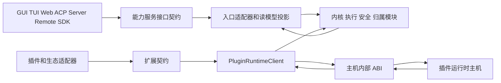
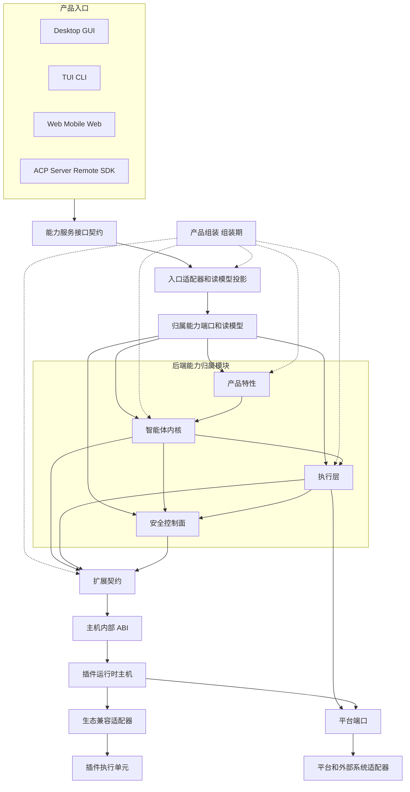
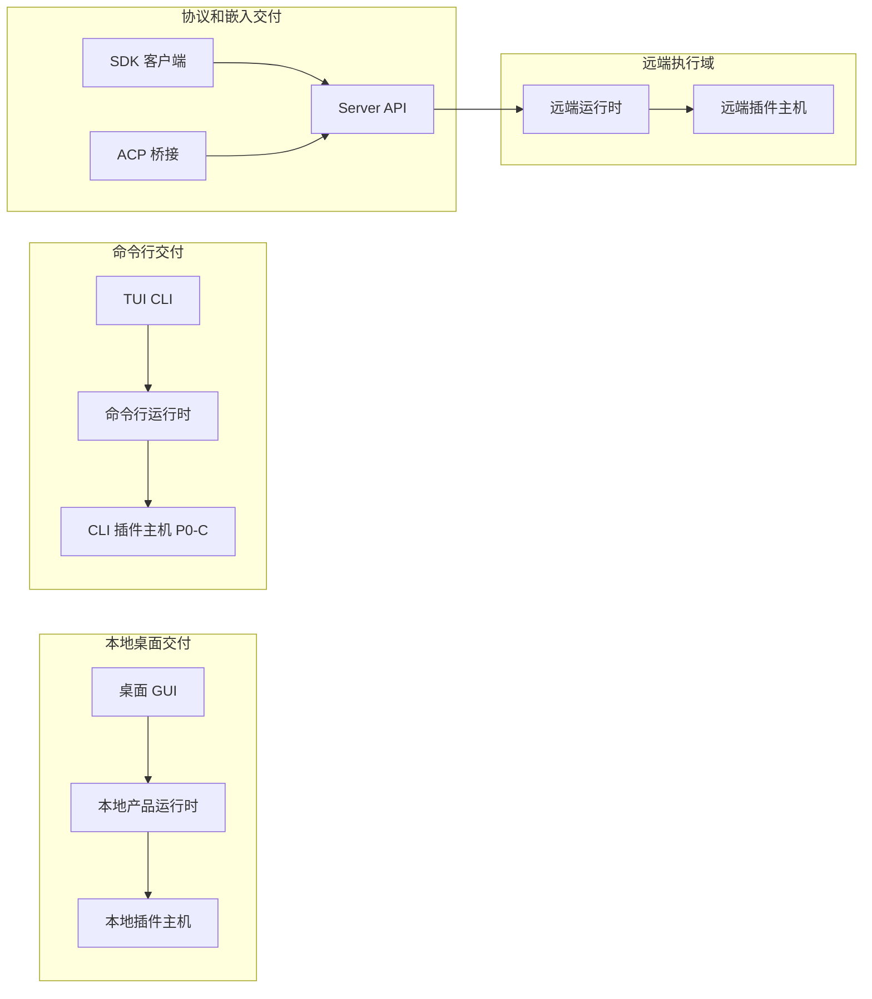
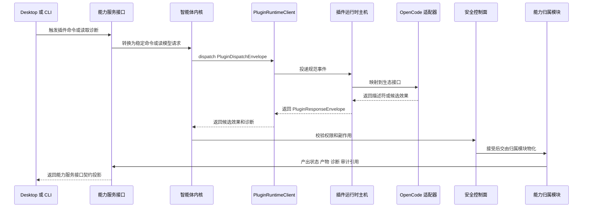

# BitFun 产品运行时架构

本文件定义 BitFun 产品运行时的架构基线。详细执行计划见
[`../plans/core-decomposition-plan.md`](../plans/core-decomposition-plan.md)；智能体内核、服务和
crate 约束见 [`agent-runtime-services-design.md`](agent-runtime-services-design.md)；插件运行时主机和生态适配见
[`plugin-runtime-host-design.md`](plugin-runtime-host-design.md)。当详细设计与本文件冲突时，以本文件为准。

本文件只约束稳定边界，不记录实现进度，也不展开 crate 内部结构。架构目标是让后端实现和插件生态可以持续演进，
同时让产品入口、插件调用方和核心运行时不被实现细节牵引。

## 1. 设计原则

BitFun 同时面向桌面 GUI、TUI/CLI、Web、ACP、Server、Remote、SDK 和插件生态。架构设计优先保护稳定接口：

1. **实现变化不得外溢**：高频变化的运行时、适配器、平台服务、远端能力和插件执行单元，只能通过稳定契约、端口、绑定或兼容门面被消费。
2. **插件生态优先交付**：扩展点、插件运行时主机、候选效果、安全校验、隔离和 OpenCode-compatible 垂直切片属于首要能力，不作为后置研究项。
3. **产品入口共享能力服务接口**：GUI、TUI/CLI、Web、ACP、Server、Remote 和 SDK 通过同一类后端能力服务契约访问任务、权限、状态、诊断、产物和事件。
4. **扩展能力先声明后物化**：插件、钩子、工具提供方、MCP 提供方和界面贡献只能先返回描述符或候选效果；最终权限、审计、工具结果和状态写入由归属模块完成。
5. **公开接口有预算**：新增公开 DTO、trait、模块或门面必须说明归属模块、真实消费方、版本策略、验证方式和退场条件。

调用路径长度只作为工程成本因素处理，不作为独立架构目标。为了降低实现变动对稳定接口的影响，可以保留承担反腐、投影、兼容或能力选择职责的中间层。

## 2. 外部契约边界

BitFun 有两个面向外部调用方的稳定契约，另有一个只在主进程与插件主机之间使用的内部 ABI。三者必须分开设计、分开测试、分开投影。

| 边界 | 消费方 | 稳定的接口和对象 | 允许扩展的能力 | 禁止暴露 |
|---|---|---|---|---|
| **能力服务接口契约** | GUI、TUI/CLI、Web、ACP、Server、Remote、SDK | 命令请求、会话/工作区状态、权限提示、诊断、产物引用、能力状态、界面贡献投影、事件信封、类型化错误、稳定状态词 | 新入口、新客户端、新传输、只读投影、版本化命令和读模型 | 内核状态机、执行层内部类型、插件运行时主机、生态原始载荷、Tauri/React/TUI 实现、具体服务提供方 |
| **扩展契约** | 插件、钩子、自定义工具/MCP 提供方、界面贡献、生态适配器 | 扩展点 id、来源/信任、能力/副作用声明、事件/钩子信封、描述符、候选效果、隔离和诊断事实 | 新插件生态、新扩展点、新候选效果、新声明式界面贡献、新钩子事件 | 前后端协议 DTO、最终权限结果、最终工具结果、审计写入、内核权威状态、界面实现代码 |
| **主机内部 ABI** | 智能体内核、执行层、产品组装与插件运行时主机 | `PluginRuntimeClient`、`PluginRuntimeBinding`、dispatch/read 信封、响应信封、状态快照、隔离、诊断、候选效果 | 主机实现、进程间通信、适配器注册表、隔离策略、幂等缓存 | GUI/TUI/Web/SDK DTO、产品入口状态、生态原始载荷、worker 或进程句柄 |

稳定状态词属于能力服务接口契约：`available`、`projection-only`、`status-only`、`artifact-only`、
`temporarily-unavailable`、`unsupported`、`policy-denied`、`quarantined`。主机和扩展侧可以拥有更细的内部状态，
但进入产品入口前必须投影为这些状态词或类型化错误。

能力服务接口契约的最小落地标准：

| 项 | 要求 |
|---|---|
| 归属 | `src/crates/interfaces` 拥有线缆 DTO、读模型、事件信封和类型化错误；后端归属模块只提供稳定端口、事实和命令实现 |
| DTO 分类 | 命令请求、会话/工作区状态、权限提示、诊断、产物引用、能力状态、插件状态投影、界面贡献投影、事件信封、类型化错误 |
| 状态映射 | 可执行能力投影为 `available`；只读能力投影为 `projection-only` 或 `status-only`；未构建、禁用或不支持形态投影为 `unsupported`；策略/信任拒绝投影为 `policy-denied`；主机失败、截止时间或远端不可用投影为 `temporarily-unavailable`；隔离投影为 `quarantined`；仅真实产物/结果消费者出现后使用 `artifact-only`，P0 不以它作为入口验收状态 |
| 插件投影字段 | 插件 id、来源、信任/配置状态、能力服务接口状态词、原因、诊断引用、审计/关联 id、隔离范围和清除条件；不得包含主机内部状态快照、适配器载荷、worker 句柄或恢复动作 |
| 版本策略 | 追加字段默认向后兼容；语义变更必须新增版本、迁移说明、客户端兼容计划和聚焦验证 |

设计含义：

- 产品入口只消费能力服务接口契约；即使展示插件状态，也只能展示投影后的状态、诊断、权限提示、产物和界面贡献。
- 插件只进入扩展契约；它可以声明能力、订阅事件、提供候选效果或描述符，但不能直接成为前后端协议。
- 主机内部 ABI 只保护主进程与插件运行时之间的隔离通信；它不是 SDK，也不是 GUI/TUI/Web 可见接口。

## 3. 竞品校准结论

竞品只用于校准已有消费方需要的边界模式，不引入 BitFun 暂无落地路径的抽象。

| 参考 | 可验证做法 | BitFun 约束 |
|---|---|---|
| [OpenCode Server](https://opencode.ai/docs/server/) / [SDK](https://opencode.ai/docs/sdk/) | TUI、Web、IDE 和 SDK 共享 server 协议与生成客户端 | BitFun 多入口共享能力服务接口契约；SDK 是类型化客户端或嵌入门面，不暴露 `product-full` 或主机 ABI |
| [Codex app-server](https://developers.openai.com/codex/app-server) | 富客户端通过 JSON-RPC/schema 与 app-server 通信，CLI 可连接远端 app-server | BitFun 能力服务接口契约约束命令、状态、权限、诊断、事件和错误对象；传输可以替换 |
| [OpenCode Plugins](https://opencode.ai/docs/plugins/) | 插件由宿主加载，可订阅事件并访问受控上下文 | BitFun 插件只能消费扩展契约；插件上下文和候选效果不得直接成为前后端协议 |
| VS Code / JetBrains / Eclipse | 通过声明式贡献点、扩展点 schema 和宿主激活控制扩展能力 | BitFun 扩展点必须声明 id、归属、输入输出、权限、副作用、回退和验证责任 |
| MCP / Claude Code / Zed | 能力先声明，再由宿主、协议或权限桥接裁决 | BitFun 插件、MCP、钩子和工具提供方都先产出能力事实或候选，再进入权限和归属模块裁决 |

## 4. 运行与部署视图

产品运行时由产品入口、能力服务接口、后端归属模块、扩展契约、插件主机和平台适配器组成。

部署形态按入口和执行域拆分，不按内部实现模块拆分：

关键规则：

- 产品组装是组装根，负责选择交付形态、能力计划、服务实现、扩展可用性和插件运行时绑定。
- 运行时请求不流经产品组装；产品组装只在组装期注入入口适配器、归属能力端口和插件运行时绑定。
- 智能体内核是会话、轮次、事件事实、权限协调和审计事实的权威源。
- 执行层是工具 ABI、工具运行时、沙箱、MCP 工具和工作流执行的归属模块。
- 插件运行时主机只治理插件运行、截止时间、幂等、诊断、隔离和适配器通信；不写内核权威状态。
- 平台适配器访问 OS、Git、文件系统、终端、远端、模型、MCP 和外部系统；上层只能通过端口和能力事实使用它。
- CLI 在 P0-B 只消费只读投影和诊断；P0-C 才可绑定本地插件主机完成 OpenCode-compatible 插件消费。

## 5. P0 插件垂直切片

P0 必须以 OpenCode-compatible 插件形成一条可验收闭环。ACP 外部智能体/工具桥接是 P0+ 互操作路径，不能替代 P0 验收。

关键产品场景：

1. 用户在 Desktop 设置或命令入口安装、启用或禁用来自 BitFun 插件包、随版本携带包、组织/项目插件源或受控外部包源的 OpenCode-compatible 插件。
2. Desktop 展示插件来源类型、位置、hash、签名/信任、配置校验、能力声明、诊断和隔离状态，并提供重新信任、禁用或查看诊断的入口。
3. 用户执行插件提供的自定义工具或提供方候选时，权限提示展示插件 id、来源、hash、请求能力/副作用、目标/产物、风险、归属模块和审计/事件 id；确认后由归属模块物化结果，拒绝或失败时不写成功状态。
4. CLI 读取同一个插件读模型，输出同一插件 id、来源、状态、配置、诊断、隔离和审计/事件关联信息。

来源边界：

- **BitFun 插件来源是主入口**：插件可以来自安装包、打版携带、项目/组织插件源、受控外部包源、签名包或后续 marketplace/registry。运行时以 BitFun 插件来源、manifest、hash、签名和信任状态作为权威输入。
- **OpenCode 配置是兼容导入源**：`opencode.json`、`.opencode/plugins/*.js|ts` 和 OpenCode 全局插件目录只能作为导入已有 OpenCode 项目的来源线索，导入后必须转换为 BitFun 插件来源与扩展契约对象。
- **OpenCode CLI 不是前置依赖**：用户本机是否安装 `opencode` 只影响外部 OpenCode/ACP 互操作或迁移辅助，不影响 BitFun 加载、诊断或执行 OpenCode-compatible 插件。
- **OpenCode-compatible 表示插件形态兼容**：它约束 JS/TS 插件模块、hook、自定义工具、permission hook 和 UI contribution 的映射方式，不表示复刻用户已有 OpenCode 运行时或配置系统。

插件接入方式：

| 接入方式 | 产品形态 | 稳定事实 |
|---|---|---|
| 动态安装 / 卸载 | 用户、项目或组织在 Desktop / CLI 中安装、启用、禁用、卸载插件 | BitFun 插件来源记录、manifest、版本、hash、签名、信任、启用状态、诊断和审计引用 |
| 随产品协同发布 / 完整打包 | 产品打版、白标包、企业发行包或离线包携带插件集合 | 发布配置、内置包版本、只读 manifest、hash、签名、默认启用策略和禁用 / 隔离覆盖 |
| 兼容导入 | 从 OpenCode、Claude Code、Codex 等生态读取已有配置、插件目录或技能目录 | 导入 provenance、原始生态、原始位置、转换后的 BitFun manifest、hash、诊断和信任状态 |

目录治理原则：

- BitFun 只把自身安装目录、用户数据目录、项目 `.bitfun` 配置、组织/企业 registry 和内容寻址缓存作为权威目录；具体 OS 路径由平台适配器解析，不进入稳定插件契约。
- OpenCode 的 `opencode.json` / `.opencode/plugins` / 全局插件目录、Claude Code 的 marketplace / `.claude-plugin` / `.claude` 配置、Codex 的 `~/.codex` / `.codex` 配置和 skill / plugin 目录都只能作为只读兼容输入。
- 兼容导入不得回写外部产品目录，不要求外部产品已安装，也不得把外部产品的加载顺序、启用状态或权限语义直接作为 BitFun 权威状态。

P0 插件体验按阶段交付：

| 阶段 | 交付边界 | 不交付 |
|---|---|---|
| P0-B | 主机内部 ABI、产品形态保护、只读状态/诊断/隔离投影、`HostRestarted` 清除条件、`restart(project_domain_id, workspace_id)` 内部清理路径 | Desktop/CLI 消费、来源发现、激活、副作用物化、用户可执行恢复动作 |
| P0-C | 从 BitFun 插件来源发现、启用和诊断 OpenCode-compatible 插件；可选导入 `opencode.json`、`.opencode/plugins/*.js|ts` 或 OpenCode 全局插件目录；桌面设置展示来源/信任/配置/状态；CLI 诊断展示同一插件；桌面命令调用自定义工具或提供方候选；候选效果进入权限/副作用门禁并由归属模块物化 | 要求用户已安装 OpenCode CLI、复刻 OpenCode 全量配置系统、ACP/Server/Remote/Web/Mobile Web/SDK 的完整插件运行时 |
| P0+ | ACP 外部智能体/工具桥接、Server/Remote 主机、Web/Mobile Web/SDK 受控投影或完整运行时 | 不替代 P0-C 的 Desktop/CLI OpenCode-compatible 插件垂直切片验收 |

权限提示和诊断的不可降级字段：插件 id、来源、hash、请求副作用、目标/产物、风险、归属模块、回滚、
拒绝后状态、审计/事件 id 和关联 id。

P0-B 不暴露用户可执行恢复动作；主机内部 `restart(project_domain_id, workspace_id)` 只用于兑现 `HostRestarted`
清除条件，清理对应执行域的隔离、诊断投影和幂等缓存。

## 6. 产品形态与能力装配

产品形态由组装期决定，不由任务运行时、插件配置或单个 Cargo feature 临时决定。

| 概念 | 含义 |
|---|---|
| `ProductProfile` | 产品包、SKU、白标或发布配置的输入选择 |
| `SurfaceContract` | GUI、TUI/CLI、Web、ACP、Server、Remote、SDK 的协议、权限和展示约束 |
| `DeliveryProfile` | 组装后的入口交付形态，例如 ProductFull、Desktop、CLI、ACP、Web、MobileWeb、Server、Remote、SDK |
| `CapabilityPack` | 内置能力声明单元，例如 CodeAgent、DeepReview、DeepResearch、MiniApp、Canvas |
| `CapabilityPlan` | 组装期准备注册的内置能力、命令、服务和扩展入口 |
| `CapabilityAvailabilitySet` | 运行时环境、策略、授权和服务健康状态下的可用、降级或不可用事实 |
| `OverridePoint` | 插件或能力包替换已声明扩展点时必须具备的显式合同 |

组装流程：

1. 产品入口声明入口类型和约束，发布配置选择目标 `DeliveryProfile`。
2. 产品组装校验内置能力包和扩展贡献的依赖、冲突、入口适用性、服务需求、权限/副作用和降级语义。
3. 产品组装生成 `CapabilityPlan`、`CapabilityAvailabilitySet`、扩展可用性、能力服务接口绑定和插件运行时绑定。
4. 内核、执行层、产品特性、插件运行时主机和平台适配器只消费注入后的稳定对象。

必须保持的规则：

- 内置能力通过产品组装加入或裁剪；插件不是裁剪内置功能的主要机制。
- 运行时策略、授权状态和服务健康状态只能让能力降级，不能启用构建包里不存在的内置能力。
- 插件可以追加贡献或返回候选效果；替换已声明行为必须走 `OverridePoint`。
- 能力事实不能散落在 Rust feature、前端路由、Tauri 命令、工具注册表和插件配置里各自维护。
- `bitfun-core/product-full` 可以作为兼容门面保留，但不能成为新能力的真实归属模块。

## 7. 安全、接口预算和完成判定

安全边界贯穿产品入口、运行时、扩展和平台适配：

- 内核维护可审计事实：会话、工作区、轮次、权限来源、执行域、事件序列、取消、恢复、检查点和诊断事实。
- 执行层在工具、MCP、skills、评审工作流执行前消费权限、沙箱和能力事实。
- 插件运行时主机声明来源、hash、能力、数据类别、副作用、执行域和界面贡献范围；未知或声明不完整的能力默认受限。
- OpenCode 配置导入不得绕过 BitFun 插件来源、manifest、hash、签名、信任和执行域校验；导入失败只能产生诊断或 `unsupported`，不能隐式启用插件能力。
- 平台适配器表达执行位置和降级原因，例如本地主机、远程 SSH、容器、ACP 客户端、MCP server 或插件执行域。

公开接口预算：

| 问题 | 处理规则 |
|---|---|
| 新增公开 DTO、trait 或 module | 写明唯一归属模块、当前消费方、版本策略、线缆契约影响、测试和退场条件 |
| 实现高频变化但外部消费稳定 | 通过稳定门面、契约或适配器吸收变化；实现变化不得外溢到产品入口或插件接口 |
| 同一语义出现多套 DTO | 选择一个归属模块；其他入口做投影或适配 |
| 原始生态载荷想进入公共接口 | 拒绝；跨边界必须转换为类型化信封、描述符或候选 |
| 无真实消费方的描述符、注册表或矩阵 | 不进入稳定接口；若已进入，必须标注实验性、归属模块、删除条件和聚焦验证 |

阶段验收标准：

- 扩展契约、插件运行时主机、候选效果、信任策略、类型化可用性和同一条 OpenCode-compatible 插件桌面命令/设置入口 + CLI 诊断垂直切片形成闭环。
- P0-C 验收以 BitFun 插件来源闭环为准；OpenCode 配置导入是兼容能力，不能替代插件安装、打包携带、信任和诊断主路径。
- 能力服务接口契约能同时服务桌面 GUI、TUI/CLI、Web、ACP、Remote、Server 和 SDK 客户端，且后端归属迁移不要求客户端大面积改协议。
- 插件、ACP 外部智能体/工具桥接、钩子、插件贡献的工具提供方和界面贡献都通过稳定描述符、信封和候选效果进入，不能直接写内核权威状态。
- ProductFull、Desktop、CLI 和 ACP 的非插件默认任务能力、权限、工具、事件、session、remote 和 release 形态默认保持等价；插件能力按产品形态矩阵显式降级。
- Web、Mobile Web、Server、Remote 和 SDK 不隐式继承完整产品或插件能力；P0 中只能表达 `projection-only`、`status-only`、`temporarily-unavailable`、`unsupported`、`policy-denied` 或 `quarantined`。
- 所有会影响默认能力、权限、工具、事件、会话、远端能力、插件副作用或发布形态的迁移，都有行为等价保护、接口稳定性验证、产品形态验证和必要的性能/构建影响说明。
