# BitFun 产品架构

本文件定义 BitFun 产品架构的稳定边界，并通过 4+1 视图分别描述逻辑职责、代码组织、运行协作、部署拓扑和关键场景。生产实现以已接线代码为事实基线；专题设计如需改变本文边界，必须同步更新本文件。提案、静态发现和未形成生产闭环的能力不得表述为已交付接口。

| 专题 | 详细设计 |
|---|---|
| Agent Runtime | [运行时服务](agent-runtime-services-design.md)、[部署模型](agent-runtime-deployment-design.md)、[App Server](app-server-architecture.md) |
| 扩展体系 | [Plugin Runtime](extensions/plugin-runtime-design.md)、[能力集成](extensions/capability-runtime-integration-design.md)、[外部来源](extensions/external-ai-work-sources-design.md)、[OpenCode 兼容](extensions/opencode-extension-compatibility.md) |
| 产品交付 | [产品定制](product-customization-blueprint.md)、[CLI 产品线](cli-product-line-design.md)、[Agent SDK](agent-sdk-product-architecture.md)、[平台可移植性](platform-portability-design.md) |
| 架构演进 | [Core 拆分](../plans/core-decomposition-plan.md)、[演进计划](../plans/product-architecture-evolution-plan.md)、[Rust 依赖边界](rust-build-dependency-boundaries.md) |

## 1. 架构目标

BitFun 面向 GUI、TUI/CLI、Web、ACP、Server、Remote、SDK 与扩展生态。架构以稳定 owner 为核心，通过受控适配支持多种产品入口和外部生态语义。

1. **稳定归属**：每项行为只有一个状态 owner 和主入口；适配、传输与重构不得建立平行业务路径。
2. **最小契约**：运行时、平台服务和扩展实现只通过必要的稳定接口或只读视图被消费；新增公开抽象必须有真实调用方、版本策略和验证方式。
3. **平台隔离**：产品逻辑保持平台无关，操作系统差异留在宿主入口和具体能力实现；target 选择 ABI，feature 只选择真实可选能力。
4. **语义转换**：OpenCode 等生态是兼容目标而非内部模型；adapter 保留外部可观察语义，再映射到 BitFun owner，由 owner 校验并提交最终状态。
5. **先装配后扩展**：产品身份、能力上限和入口布局在构建或组装期确定；用户配置、Hook 和 Plugin 只能在该上限内扩展。
6. **发现执行分离**：发现与加载顺序只产生候选输入，不授予执行许可；可执行来源在激活、身份或能力范围变化时重新授权，调用时仍执行权限判断。
7. **受监督执行**：第三方代码运行在受监督子进程并具备期限、取消、流控和故障回收；没有 OS 或容器硬边界时，不宣称完全隔离。
8. **单一 Runtime**：GUI、TUI、CLI、ACP、Server、Remote 与 SDK 通过各自 adapter 使用同一 Agent Runtime 行为；共享能力事实，不共享界面、传输或宿主状态。

调用路径长度是工程成本而非独立目标。兼容隔离、能力选择和只读视图可以保留必要中间层，但不得长期维持无消费方的抽象。

## 2. 4+1 架构视图

4+1 视图分别描述系统职责、代码组织、运行协作、部署边界和关键场景，避免把逻辑模块、crate、进程和调用链混在同一张图中。分类沿用 [Kruchten 4+1](https://www3.software.ibm.com/ibmdl/pub/software/rational/web/whitepapers/2003/Pbk4p1.pdf)，图的层级、动态协作和部署节点表达参考 [C4](https://c4model.com/diagrams) 以及 arc42 的 [Building Block](https://docs.arc42.org/section-5/)、[Runtime](https://docs.arc42.org/section-6/) 和 [Deployment](https://docs.arc42.org/section-7/) 视图；这些方法只提供视角和表达规则，不替代 BitFun 的真实 owner 与代码边界。

Level 0 展示系统级主要边界和依赖方向；Level 1 再按 Level 0 的模块或范围展开。每张图必须能独立说明范围和图例，关系使用明确方向或协议，逻辑模块、crate、运行任务和部署实例不要求一一对应。Agent Runtime 的 Embedded/Shared 逻辑、开发、进程、物理和场景视图集中在
[`agent-runtime-deployment-design.md`](agent-runtime-deployment-design.md)，本文件不重复其连接和性能细节。

### 2.1 Logical View · Level 0

Logical View 面向产品、领域和架构设计者，表达系统为用户提供能力所需要的稳定职责、职责分解及其主要依赖。
它不表达 crate、contract、接口签名、进程部署或运行步骤；这些信息分别属于 Development、Process 和 Physical View。
Level 0 只保留具有独立职责、生命周期或策略边界的模块；成熟度变化不改变模块的位置和依赖。

实线箭头表示区域级依赖，不表示模块调用链。状态：**绿色实框** = Complete；**黄色实框** = Partial；**灰色虚框** = Planned。

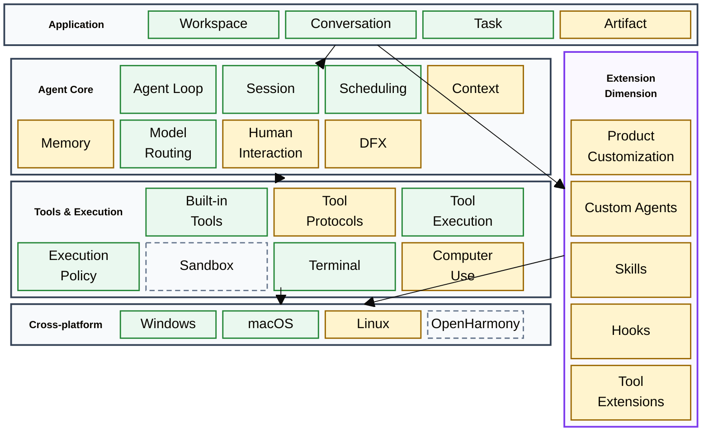
```mermaid
%%{init: {"theme":"base","block":{"padding":8}}}%%
block-beta
  columns 5

  block:Application:5
    columns 5
    ApplicationTitle["Application"] Workspace["Workspace"] Conversation["Conversation"] Task["Task"] Artifact["Artifact"]
  end

  block:MainColumn:4
    columns 1
    block:AgentCore
      columns 5
      AgentCoreTitle["Agent Core"] AgentLoop["Agent Loop"] Session["Session"] Scheduling["Scheduling"] Context["Context"]
      Memory["Memory"] ModelRouting["Model<br/>Routing"] HumanInteraction["Human<br/>Interaction"] DFX["DFX"] space
    end
    block:ToolExecution
      columns 4
      ToolExecutionTitle["Tools & Execution"] BuiltInTools["Built-in<br/>Tools"] ToolProtocols["Tool<br/>Protocols"] ToolExecutionRuntime["Tool<br/>Execution"]
      ExecutionPolicy["Execution<br/>Policy"] Sandbox["Sandbox"] Terminal["Terminal"] ComputerUse["Computer<br/>Use"]
    end
    block:CrossPlatform
      columns 5
      CrossPlatformTitle["Cross-platform"] Windows["Windows"] MacOS["macOS"] Linux["Linux"] OpenHarmony["OpenHarmony"]
    end
  end

  block:Extensions
    columns 1
    ExtensionsTitle["Extension<br/>Dimension"]
    ProductCustomization["Product<br/>Customization"]
    CustomAgents["Custom Agents"]
    Skills["Skills"]
    Hooks["Hooks"]
    ToolExtensions["Tool<br/>Extensions"]
  end

  Application --> AgentCore
  Application --> Extensions
  AgentCore --> ToolExecution
  ToolExecution --> CrossPlatform
  Extensions --> CrossPlatform

  classDef complete fill:#eaf8ef,stroke:#238636,stroke-width:1.5px,color:#123a1c
  classDef partial fill:#fff4ce,stroke:#9a6700,stroke-width:1.5px,color:#4d3500
  classDef planned fill:#f8fafc,stroke:#64748b,stroke-width:1.5px,stroke-dasharray:6 4,color:#334155
  classDef sectionTitle fill:transparent,stroke:transparent,color:#171717,font-size:12px,font-weight:600

  class Workspace,Conversation,Task,AgentLoop,Session,Scheduling,ModelRouting,BuiltInTools,ToolExecutionRuntime,ExecutionPolicy,Terminal,Windows,MacOS complete
  class Artifact,Context,Memory,HumanInteraction,DFX,ToolProtocols,ComputerUse,Linux,ProductCustomization,CustomAgents,Skills,Hooks,ToolExtensions partial
  class Sandbox,OpenHarmony planned
  class ApplicationTitle,AgentCoreTitle,ToolExecutionTitle,CrossPlatformTitle,ExtensionsTitle sectionTitle

  style Application fill:#f8fafc,stroke:#334155,stroke-width:2px
  style AgentCore fill:#f8fafc,stroke:#334155,stroke-width:2px
  style ToolExecution fill:#f8fafc,stroke:#334155,stroke-width:2px
  style CrossPlatform fill:#f8fafc,stroke:#334155,stroke-width:2px
  style Extensions fill:#faf8ff,stroke:#7c3aed,stroke-width:2px
  style MainColumn fill:transparent,stroke:transparent
```

| Area | Elements | Responsibility |
|---|---|---|
| Application | Workspace、Conversation、Task、Artifact | 用户工作范围、交互历史、工作意图与交付结果 |
| Agent Core | Agent Loop、Session、Scheduling、Context、Memory、Model Routing、Human Interaction、DFX | 推理循环、运行状态、任务编排、模型决策、人机协同与可观测事实 |
| Tools & Execution | Built-in Tools、Tool Protocols、Tool Execution、Execution Policy、Sandbox、Terminal、Computer Use | 工具接入、策略决策和受控执行 |
| Cross-platform | Windows、macOS、Linux、OpenHarmony | 隔离操作系统差异，提供上层所需的平台能力 |
| Extension Dimension | Product Customization、Custom Agents、Skills、Hooks、Tool Extensions | 作为正交维度扩展 Application、Agent Core 和 Tools & Execution，不改变原业务 owner |

Application → Extension Dimension 表示产品入口消费受控扩展；Extension Dimension → Cross-platform 表示扩展的发现与执行受平台能力约束。两项依赖均不改变 Agent Core → Tools & Execution → Cross-platform 的主分层关系。

Application 表达产品领域对象；Conversation 与 Task 分别区别于运行时的 Session 与 Scheduling。Code Agent、Deep Review、Deep Research 属于由多个逻辑职责组合而成的场景；Mini Apps 与 Canvas 是 Artifact 的呈现机制；Desktop、CLI、Web、Mobile 是产品交付形态。`Agent Runtime`、contract、port、adapter 和外部系统不构成 Level 0 逻辑模块。DFX 在本视图中表示诊断、Tracing、指标、审计和运行质量反馈，不包含测试工程或开发流程。

当前生产代码与验证证据支持以下成熟度判定：

| Area | Complete | Partial | Planned |
|---|---|---|---|
| Application | Workspace、Conversation、Task | Artifact | — |
| Agent Core | Agent Loop、Session、Scheduling、Model Routing | Context、Memory、Human Interaction、DFX | — |
| Tools & Execution | Built-in Tools、Tool Execution、Execution Policy、Terminal | Tool Protocols、Computer Use | Sandbox |
| Cross-platform | Windows、macOS | Linux | OpenHarmony |
| Extension Dimension | — | Product Customization、Custom Agents、Skills、Hooks、Tool Extensions | — |

Complete 要求职责在生产入口形成完整闭环；Partial 表示已进入生产路径但仍有关键缺口；Planned 表示职责已确定但尚未形成生产闭环。BitFun 的判定依据是生产 owner、实际入口和已知限制，具体证据见 [Agent Runtime 服务边界](agent-runtime-services-design.md)、[Agent Runtime 部署边界](agent-runtime-deployment-design.md)、[Agent Hooks](../features/agent-hooks.zh-CN.md)、[Plugin Runtime](extensions/plugin-runtime-design.md)、[产品定制边界](product-customization-blueprint.md)、[平台可移植性](platform-portability-design.md) 与 [OpenCode 兼容边界](extensions/opencode-extension-compatibility.md)。[Codex Sandbox](https://github.com/openai/codex/blob/main/codex-rs/README.md#experimenting-with-the-codex-sandbox)、[Claude Code Sandboxing](https://code.claude.com/docs/en/sandboxing)、[Claude Code Monitoring](https://code.claude.com/docs/en/monitoring-usage) 和 [OpenCode Plugins](https://opencode.ai/v2/docs/build/plugins) 仅用于能力边界对照，不作为 BitFun 的交付证据；设计、静态发现、空 port 或单入口演示不提升成熟度。

### 2.2 Development View · Level 0

Development View 展示仓库的静态代码组织。层间依赖只允许向下，可跨过中间层，但不能反向依赖上层。图中子项表示代码家族，当前 workspace 的完整模块库存见下表。Contract 与 port 是支撑多个逻辑职责的静态代码边界，仅在 Development View 中表达。

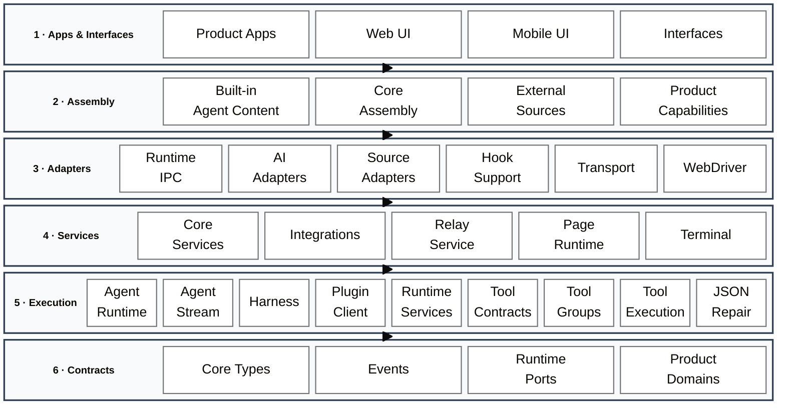
```mermaid
%%{init: {"theme":"base","block":{"padding":8}}}%%
block-beta
  columns 1

  block:AppsLayer
    columns 5
    AppsTitle["1 · Apps & Interfaces"] ProductApps["Product Apps"] WebUI["Web UI"] MobileUI["Mobile UI"] Interfaces["Interfaces"]
  end

  block:AssemblyLayer
    columns 5
    AssemblyTitle["2 · Assembly"] AgentContent["Built-in<br/>Agent Content"] CoreAssembly["Core<br/>Assembly"] ExternalSources["External<br/>Sources"] ProductCaps["Product<br/>Capabilities"]
  end

  block:AdaptersLayer
    columns 7
    AdaptersTitle["3 · Adapters"] RuntimeIPC["Runtime<br/>IPC"] AIAdapters["AI<br/>Adapters"] SourceAdapters["Source<br/>Adapters"] HookSupport["Hook<br/>Support"] Transport["Transport"] WebDriver["WebDriver"]
  end

  block:ServicesLayer
    columns 6
    ServicesTitle["4 · Services"] CoreServices["Core<br/>Services"] Integrations["Integrations"] RelayService["Relay<br/>Service"] PageRuntime["Page<br/>Runtime"] Terminal["Terminal"]
  end

  block:ExecutionLayer
    columns 10
    ExecutionTitle["5 · Execution"] AgentRuntime["Agent<br/>Runtime"] AgentStream["Agent<br/>Stream"] Harness["Harness"] PluginClient["Plugin<br/>Client"] RuntimeServices["Runtime<br/>Services"] ToolContracts["Tool<br/>Contracts"] ToolGroups["Tool<br/>Groups"] ToolExecution["Tool<br/>Execution"] JSONRepair["JSON<br/>Repair"]
  end

  block:ContractsLayer
    columns 5
    ContractsTitle["6 · Contracts"] CoreTypes["Core Types"] Events["Events"] RuntimePorts["Runtime<br/>Ports"] ProductDomains["Product<br/>Domains"]
  end

  AppsLayer --> AssemblyLayer
  AssemblyLayer --> AdaptersLayer
  AdaptersLayer --> ServicesLayer
  ServicesLayer --> ExecutionLayer
  ExecutionLayer --> ContractsLayer

  classDef module fill:#ffffff,stroke:#737373,stroke-width:1.3px,color:#171717
  classDef sectionTitle fill:transparent,stroke:transparent,color:#171717,font-size:12px,font-weight:600
  class ProductApps,WebUI,MobileUI,Interfaces,AgentContent,CoreAssembly,ExternalSources,ProductCaps,RuntimeIPC,AIAdapters,SourceAdapters,HookSupport,Transport,WebDriver,CoreServices,Integrations,RelayService,PageRuntime,Terminal,AgentRuntime,AgentStream,Harness,PluginClient,RuntimeServices,ToolContracts,ToolGroups,ToolExecution,JSONRepair,CoreTypes,Events,RuntimePorts,ProductDomains module
  class AppsTitle,AssemblyTitle,AdaptersTitle,ServicesTitle,ExecutionTitle,ContractsTitle sectionTitle

  style AppsLayer fill:#f8fafc,stroke:#334155,stroke-width:2px
  style AssemblyLayer fill:#f8fafc,stroke:#334155,stroke-width:2px
  style AdaptersLayer fill:#f8fafc,stroke:#334155,stroke-width:2px
  style ServicesLayer fill:#f8fafc,stroke:#334155,stroke-width:2px
  style ExecutionLayer fill:#f8fafc,stroke:#334155,stroke-width:2px
  style ContractsLayer fill:#f8fafc,stroke:#334155,stroke-width:2px
```

箭头表示允许的依赖方向；实际 crate 可以直接依赖任意更低层。当前 Cargo metadata、pnpm workspace 与非 Rust 产品入口核验后的完整库存如下：

| Development area | Repository scope | Current modules |
|---|---|---|
| Apps | `src/apps/*` | `desktop`、`cli`、`server`、`relay-server`、`sdk-host`、`miniapp-market-server`、`skin-market-server` |
| Web and delivery | product roots | `src/web-ui`、`src/mobile-web`、`src/miniapp-market-web`、`src/skin-market-web`、`src/apps/mobile`、`BitFun-Installer`、`tests/e2e` |
| SDK | `sdk/*` | `typescript` |
| Shared frontend | `src/shared` | `shared` |
| Interfaces | `src/crates/interfaces/*` | `acp`、`app-server`、`app-server-client`、`app-server-protocol`、`sdk-host` |
| Assembly | `src/crates/assembly/*` | `agent-content`、`core`、`external-sources`、`product-capabilities` |
| Adapters | `src/crates/adapters/*` | `agent-runtime-ipc`、`ai-adapters`、`claude-code-adapter`、`codex-adapter`、`dsh-adapter`、`opencode-adapter`、`static-hook-support`、`transport`、`webdriver` |
| Services | `src/crates/services/*` | `services-core`、`services-integrations`、`miniapp-market-service`、`skin-market-service`、`relay-service`、`page-function-runtime`、`terminal` |
| Execution | `src/crates/execution/*` | `agent-runtime`、`agent-stream`、`harness`、`plugin-runtime-client`、`runtime-services`、`tool-contracts`、`tool-provider-groups`、`tool-execution`、`tool-call-jsonrepair` |
| Contracts | `src/crates/contracts/*` | `core-types`、`events`、`runtime-ports`、`product-domains` |

Installer、E2E 以及 MiniApp/Skin market server 和对应 service 在 Level 0 图中分别归入交付入口、测试范围或 Services 家族，不作为独立架构模块。
Logical 与 Development 的主要映射如下，映射是多对多关系：

| Development area | Logical coverage |
|---|---|
| Apps & Interfaces | Application、Cross-platform 的宿主入口，Extensions 的用户控制面，以及 Desktop Computer Use 的平台实现 |
| Assembly | Application、Agent Core、Tools & Execution 和 Extensions 的能力选择、产品编排与装配 |
| Adapters | Tool Protocols 和外部生态接入所需的协议转换；adapter 本身不是逻辑层 |
| Services | Tools & Execution 的具体执行支持，以及 Cross-platform 的操作系统能力实现 |
| Execution | Agent Core、Tools & Execution 的可移植原语与 Computer Use 契约，以及 Custom Agents、Tool Extensions、Hooks 的运行支持 |
| Contracts | 为多个逻辑职责提供稳定事实与 port；不构成独立逻辑模块 |

Assembly 是唯一组装根，只选择下层能力和实现，不能反向依赖 app。每个生态 adapter 独立保留外部格式和顺序语义，再映射到 BitFun owner；生态 adapter 之间不能形成兄弟依赖。

`assembly/agent-content` 只持有随产品发布的不可变内置 Agent prompt 字节和兼容 key；选择、渲染、模式策略、
Memory/Insights 工作流与运行时状态仍由 Core 的既有 owner 持有。该 crate 不是通用 prompt registry，也不加载
用户、项目、产品定制或插件内容。

### 2.3 Process View · Level 0

Process View 展示当前 Agent Runtime 内的异步任务、流和取消传播；Embedded 与 Shared 复用同一任务结构。本视图不描述具体部署环境，也不把一次用户场景误作进程结构。

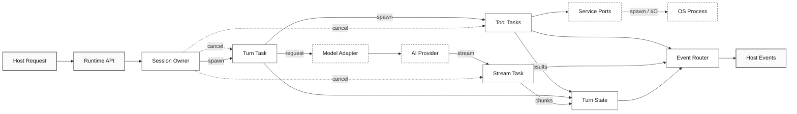
```mermaid
flowchart LR
  HostRequest["Host Request"]
  RuntimeAPI["Runtime API"]
  SessionOwner["Session Owner"]
  TurnTask["Turn Task"]
  ModelAdapter["Model Adapter"]
  AIProvider["AI Provider"]
  StreamTask["Stream Task"]
  ToolTasks["Tool Tasks"]
  ServicePorts["Service Ports"]
  OSProcess["OS Process"]
  TurnState["Turn State"]
  EventRouter["Event Router"]
  HostEvents["Host Events"]

  HostRequest --> RuntimeAPI --> SessionOwner
  SessionOwner -->|spawn| TurnTask
  SessionOwner -.->|cancel| TurnTask
  SessionOwner -.->|cancel| StreamTask
  SessionOwner -.->|cancel| ToolTasks
  TurnTask -->|request| ModelAdapter --> AIProvider
  AIProvider -->|stream| StreamTask -->|chunks| TurnState
  TurnTask -->|spawn| ToolTasks --> ServicePorts -->|spawn / I/O| OSProcess
  TurnTask --> TurnState
  ToolTasks -->|results| TurnState
  TurnState --> EventRouter
  StreamTask --> EventRouter
  ToolTasks --> EventRouter
  EventRouter --> HostEvents

  classDef host fill:#fafafa,stroke:#404040,stroke-width:1.5px,color:#171717;
  classDef task fill:#ffffff,stroke:#737373,stroke-width:1.3px,color:#171717;
  classDef boundary fill:#ffffff,stroke:#737373,stroke-width:1.3px,stroke-dasharray:4 3,color:#171717;
  class HostRequest,RuntimeAPI,HostEvents host;
  class SessionOwner,TurnTask,StreamTask,ToolTasks,TurnState,EventRouter task;
  class ModelAdapter,AIProvider,ServicePorts,OSProcess boundary;
```

实线表示调用、数据或事件流，虚线表示取消传播。Session Owner 持有会话与活动 turn 的生命周期；Turn、Stream 和 Tool 任务可异步重叠，但只能通过事件和类型化结果提交状态。产品入口只经过 Runtime API，不能直接调用 Tool Tasks 或具体平台进程。

### 2.4 Physical View · Level 0

Physical View 展示当前生产环境中可执行单元到设备、主机和存储的映射。Desktop、CLI、ACP 和 SDK Host 使用 Embedded Runtime；
Embedded 交互式 TUI 当前在同一 CLI 进程内通过 direct Runtime composition 使用 Runtime；交互式 TUI 也可以显式连接当前 Shared Runtime IPC。
Desktop GUI 当前仍使用 Tauri adapter；独立 direct Runtime 迁移尚未实施。当前 loopback Web Server 已承载 Embedded Runtime 和 WebSocket App Server；Relay Server
不承载 Agent Runtime。

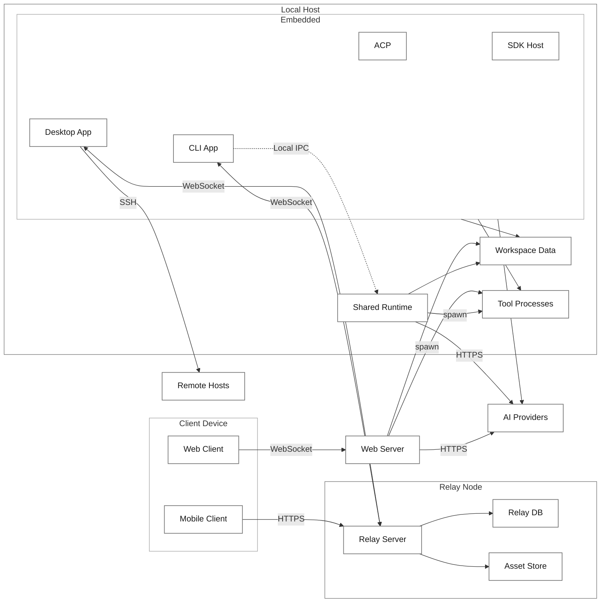
```mermaid
flowchart LR
  subgraph LocalHost["Local Host"]
    direction TB
    subgraph EmbeddedNodes["Embedded"]
      direction LR
      DesktopApp["Desktop App"] ~~~ CLIApp["CLI App"] ~~~ ACPApp["ACP"] ~~~ SDKHost["SDK Host"]
    end
    SharedRuntime["Shared Runtime"]
    WorkspaceData["Workspace Data"]
    ToolProcesses["Tool Processes"]
  end

  subgraph UserDevice["Client Device"]
    direction TB
    WebClient["Web Client"]
    MobileClient["Mobile Client"]
  end

  WebServer["Web Server"]

  subgraph RelayHost["Relay Node"]
    direction TB
    RelayServer["Relay Server"]
    RelayDB["Relay DB"]
    AssetStore["Asset Store"]
  end

  AIProviders["AI Providers"]
  RemoteHosts["Remote Hosts"]

  WebClient -->|WebSocket| WebServer
  MobileClient -->|HTTPS| RelayServer
  DesktopApp <-->|WebSocket| RelayServer
  CLIApp <-->|WebSocket| RelayServer
  CLIApp -.->|Local IPC| SharedRuntime
  WebServer --> WorkspaceData
  WebServer -->|spawn| ToolProcesses
  WebServer -->|HTTPS| AIProviders
  RelayServer --> RelayDB
  RelayServer --> AssetStore
  EmbeddedNodes --> WorkspaceData
  SharedRuntime --> WorkspaceData
  EmbeddedNodes -->|spawn| ToolProcesses
  SharedRuntime -->|spawn| ToolProcesses
  EmbeddedNodes -->|HTTPS| AIProviders
  SharedRuntime -->|HTTPS| AIProviders
  DesktopApp -->|SSH| RemoteHosts

  classDef unit fill:#ffffff,stroke:#737373,stroke-width:1.3px,color:#171717;
  class DesktopApp,CLIApp,ACPApp,SDKHost,SharedRuntime,WorkspaceData,ToolProcesses,WebClient,MobileClient,WebServer,RelayServer,RelayDB,AssetStore,AIProviders,RemoteHosts unit;
  style LocalHost fill:#ffffff,stroke:#737373;
  style EmbeddedNodes fill:#ffffff,stroke:#a3a3a3;
  style UserDevice fill:#ffffff,stroke:#a3a3a3;
  style RelayHost fill:#ffffff,stroke:#737373;
```

实线表示主要协议、存储访问或进程创建，虚线表示显式启用的 Shared TUI 本机连接。Relay DB 只在账户模式启用，Asset Store 的具体实现由部署配置选择。完整 package plugin 尚未形成生产闭环，因此不把规划中的 Plugin Host 画成当前部署实例。

| Deployment unit | Main contents |
|---|---|
| Desktop App | Web UI、Tauri Host、embedded Agent Runtime；当前 Desktop 产品请求使用现有 Tauri adapter |
| CLI App | 交互式 TUI controller 直接依赖 `CliAgentRuntimeClient`，并直接调用对应 owner/service API；Headless、Peer 保留独立 adapter；可显式使用 Shared TUI |
| Shared Runtime | 私有本机 IPC；当前只有交互式 TUI consumer；是否迁入 Shared App Server transport 仍待评审与等价证据 |
| ACP | Embedded Agent Runtime、ACP 协议生命周期 |
| SDK Host | 私有跨进程 adapter；公开 SDK 产品尚未交付 |
| Web Server | Embedded Agent Runtime、WebSocket App Server、Health/Info；当前只允许 loopback 单用户模式 |
| Relay Server | WebSocket/HTTP bridge、账户与同步；不包含 Agent Runtime |

### 2.5 Scenarios (+1) · Level 0

Scenarios 选择少量具有架构意义的当前路径来校验前四个视图，不穷举产品功能，也不重复 Process View 的任务调度细节。

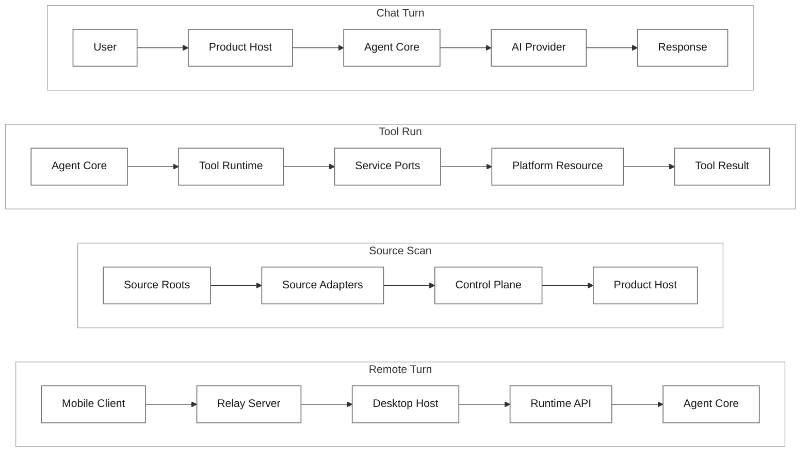
```mermaid
flowchart TB
  subgraph InteractiveTurn["Chat Turn"]
    direction LR
    TurnUser["User"] --> TurnHost["Product Host"] --> TurnCore["Agent Core"] --> TurnProvider["AI Provider"] --> TurnResponse["Response"]
  end

  subgraph ToolExecution["Tool Run"]
    direction LR
    ToolCore["Agent Core"] --> ToolRuntime["Tool Runtime"] --> ToolPorts["Service Ports"] --> PlatformResource["Platform Resource"] --> ToolResult["Tool Result"]
  end

  subgraph SourceDiscovery["Source Scan"]
    direction LR
    SourceRoots["Source Roots"] --> SourceAdapters["Source Adapters"] --> ControlPlane["Control Plane"] --> SourceHost["Product Host"]
  end

  subgraph RemoteControl["Remote Turn"]
    direction LR
    RemoteClient["Mobile Client"] --> RemoteRelay["Relay Server"] --> RemoteDesktop["Desktop Host"] --> RemoteAPI["Runtime API"] --> RemoteCore["Agent Core"]
  end

  InteractiveTurn ~~~ ToolExecution ~~~ SourceDiscovery ~~~ RemoteControl

  classDef step fill:#ffffff,stroke:#737373,stroke-width:1.3px,color:#171717;
  class TurnUser,TurnHost,TurnCore,TurnProvider,TurnResponse,ToolCore,ToolRuntime,ToolPorts,PlatformResource,ToolResult,SourceRoots,SourceAdapters,ControlPlane,SourceHost,RemoteClient,RemoteRelay,RemoteDesktop,RemoteAPI,RemoteCore step;
  style InteractiveTurn fill:#ffffff,stroke:#a3a3a3;
  style ToolExecution fill:#ffffff,stroke:#a3a3a3;
  style SourceDiscovery fill:#ffffff,stroke:#a3a3a3;
  style RemoteControl fill:#ffffff,stroke:#a3a3a3;
```

四条路径分别覆盖核心对话、内置工具、运行时无关的外部来源发现，以及经 Relay 回到 Desktop owner 的远程控制。Source Scan 的 provider-neutral 调度、generation fencing 和故障隔离由 `ExternalSourceControlPlane` 持有；产品级控制事实、偏好与运行装配仍由 `WorkspaceExternalSourceService` 组合，adapter 不成为第二个业务 owner。完整 package plugin、公开 SDK 产品和 HarmonyOS 不在当前生产闭环中，因此不作为 Level 0 场景。

## 3. 接口边界

BitFun 只保留四个稳定业务接口边界；工具、事件和权限作为归属子接口被复用，不在插件层重复定义。App Server
是 Agent Runtime API 和其他 owner 接口面向当前 Web，以及未来确实需要连接边界的 Rich Client 的版本化 wire adapter，不新增第五个
业务 owner 或能力分类。Embedded TUI 已使用 direct Runtime adapter；Shared 是否使用 App Server 由 4.3 节所述评审决定。本文使用
“接口”描述可被调用或依赖的能力面；只有描述跨进程消息封装、结构化 schema、序列化对象或强兼容约束时才使用
“契约”；只读状态视图表示从权威状态派生出的查询结果。

Phase 5 已由 Embedded/Shared TUI 共用的 `CliAgentRuntimeClient` 收敛，Runtime 行为范围按 Shared IPC v17
实际承载的 Session、Turn、Permission/UserInput、Workspace、lineage、usage/settlement、
model/mode 更新、agent mode catalog 和事件订阅确定。Model/Skill/Subagent/MCP、Account、
Settings Sync、Worktree、External Source 和 Hook 等管理面不组成统一的 TUI management 模块，
也不因为存在 TUI 用例就进入 Shared Runtime wire；Startup 和 Chat controller 直接调用
owner-owned 的稳定 service/API，不建立 domain service 接口或 owner adapter。允许保留必要的
TUI DTO、权限/上下文转换或终端投影辅助函数，但不得建立新的业务层或统一服务。

| 接口边界 | 谁使用 | 提供 | 不包含 |
|---|---|---|---|
| Agent Runtime API | App Server、Headless CLI、ACP、Server、Remote、SDK 等 adapter | Query、Session、Tool/MCP、Permission、Hook、Event、Usage | UI、Rich Client wire、协议和具体服务实现 |
| BitFun 与插件接口 | `PluginRuntimeClient`、安全模块、产品组装、生态适配器 | 来源、能力、Hook 变换、界面贡献、诊断 | 最终权限、工具结果、审计和内核状态 |
| 插件运行时接口 | Runtime、执行层、产品组装、`PluginRuntimeClient` | 请求身份、期限、响应校验和诊断 | SDK/UI 对象、生态原始对象和进程句柄 |
| 外部生态兼容接口 | 来源管理、能力模块、`PluginRuntimeClient`、Plugin Host | 发现、顺序、参数、诊断和明确映射 | 跨生态任意数据、兄弟适配器依赖和外部 CLI 前置依赖 |

这四项是能力必须归入的接口分类，不表示表中每项已有稳定 API。当前接口仍须满足 3.1 节的真实消费方、版本与验证条件。

归属子接口：

| 子接口 | 归属 | 用法 |
|---|---|---|
| 工具 ABI | `tool-contracts` / 执行层 | 具备真实执行实现的插件 custom tool、MCP 工具和内置工具进入同一可调用工具集合、权限和陈旧调用保护路径；只有声明或候选项的插件工具不能进入该集合。 |
| 事件清单 | `events` / 智能体内核事件 schema | 对固定生态版本维护各自事件清单；插件观察兼容事件，BitFun 内部私有字段在对应适配层转换或脱敏。 |
| 权限与副作用 | 安全模块 / runtime ports | 插件启用后，默认兼容策略允许 OpenCode `permission.ask` 和直接脚本能力按当前用户权限运行；经 BitFun 接口的调用可细分收紧，直接脚本能力只能由真实 OS/容器环境粗粒度限制，否则停用插件。 |

### 3.1 公开接口进入条件

新增或保留公开接口必须满足以下条件：

1. 属于上表一个明确接口边界，不能同时承担前后端协议、插件扩展、host ABI 和生态适配职责。
2. 有当前消费方；仅为了未来兼容、完整矩阵或概念完整性保留的代码接口不进入稳定面。该规则不阻止需求、
   风险、完整能力矩阵和阶段计划记录未来工作，也不能用来把官方稳定能力从兼容审计中删除。
3. 能映射到 OpenCode-compatible P0 关键场景，或属于 BitFun 已有关键路径的稳定子接口。
4. 不能由既有工具 ABI、事件清单、权限模块或能力服务接口承接时，才允许新增。
5. PR 必须说明版本影响、验证命令和删除条件。

`scripts/core-boundaries/rules/source/public-api-rules.mjs` 当前是插件与运行时公开接口的增量 allowlist，不是全仓
`pub` 符号扫描器。已登记接口必须声明 `contractSlice` 供机器校验归属；未登记接口仍须满足上述进入条件，并由
PR 审查和最近的边界测试验证。边界脚本通过不能解释为全仓公开接口已经自动完成预算审计。

没有 OpenCode 对应能力、没有当前消费方、不能归入关键 BitFun 场景的接口，处理方式只有三种：删除、降级为主机内部实现，或返回类型化 `unsupported` / 诊断。

已批准后续工作所需的短期前置接口不等于占位实现。确需预留时，必须在相邻设计中写明首个消费方、稳定语义、
接入验证和未接入时的删除条件；在端到端调用链落地前保持内部可见或显式标为未接入，不能用空实现、测试替身或
公开 re-export 宣称产品支持。无法给出这些信息时，仍按无消费方接口处理。

“前后端能力接口”是概念边界，不对应一个必须存在的统一 API crate。单一宿主使用的命令转换、宿主协议 DTO 和
协议转换留在该宿主入口；只有多个当前生产宿主或独立版本化的外部消费者确实复用同一语义，并且版本与删除条件
明确时，才抽取共享 API 模块。仅返回合成 ID、空历史、固定健康状态，或绕过既有服务直接执行文件 I/O 的占位
handler，不构成生产消费完整流程。

传输 adapter 是已接入宿主的交付实现，不是未来协议路线图。保留一个 transport adapter 必须同时存在生产构造点、
事件或请求消费方、宿主生命周期，以及错误、取消或流量控制语义的验证。独立存在的 Server 路由、前端 WebSocket
client 或未来 CLI/HarmonyOS 计划，不能证明同名 Rust transport adapter 已接入；未接入实现应删除，待端到端
调用链确定后再按宿主边界实现。

多个已接入载体重复使用的协议无关机械能力是例外：有界 JSON 编码与消息大小校验、消息级背压和 JSON-RPC request
correlation 可以由 `adapters/transport` 统一持有。仅 private Runtime IPC 使用的 length-prefix framing 仍留在该协议 owner，
待第二个当前消费者共享相同语义后再评估抽取。该基础层只接受 bytes/message 与调用方提供的
限额，不得知道 App Server、private Runtime IPC、SDK Host 的 method/DTO，也不得决定认证、controller/lease、重连、
自动重试或业务生命周期。stdio、Named Pipe/UDS、WebSocket 仍由各 Host 选择具体 framing 和安全策略；复用机械层
不能被解释成这些入口共享同一 wire 或同一 Runtime 进程。

### 3.2 宿主通信契约与 Tauri 薄适配

前后端契约按能力语义归属，不按 Tauri command 名称归属。稳定的请求、响应、状态事实和类型化错误放在对应
`contracts/*`、Agent Runtime API 或能力归属模块。当前 Desktop GUI 仍使用 Tauri adapter，Web UI 使用 loopback WebSocket
App Server，Embedded/Shared TUI 由 `CliAgentRuntimeClient` 分别映射 direct Runtime 与 private Runtime IPC v17。目标是让
Embedded GUI/TUI 通过 Host-owned direct adapter 调用 Runtime typed API，需要连接边界的 Web/Shared Rich Client 使用 App Server；
Tauri 和各 Rich Client Host 负责 adapter、transport、平台能力及生命周期。ACP、Headless CLI、Peer Host 与公开 SDK 继续由各自
adapter 映射到稳定 owner 接口，不因该目标复用 App Server wire。该规则降低框架耦合，但不要求把 controller-local Desktop DTO
搬进共享 crate。

| 层 | 允许 | 禁止 |
|---|---|---|
| 能力归属模块 / Agent Runtime API | 字段明确的请求和响应、状态事实、权限/取消规则、与框架无关的用例方法 | `tauri::State`、`AppHandle`、窗口/菜单对象、command 宏、HTTP/WebSocket/ACP/SDK Host 消息结构 |
| Desktop Tauri / product Host adapter | 当前组装 Tauri adapter；目标按部署组装 direct Runtime adapter 或 App Server transport、注入真实 capability 与平台 provider、管理窗口和桌面生命周期、投递 typed Runtime/App Server notification 或桌面专属事件 | 复制业务校验、持有第二份权威状态、在目标迁移完成后为同一能力保留第二条 Runtime 旁路、把 Tauri 类型传入下层 |
| Server / Remote adapter | 路由鉴权、协议消息、连接生命周期、流量控制与取消转换 | 为同一能力另建业务含义不同的 DTO 或 handler |
| GUI / Web / TUI frontend | 当前依赖各自 infrastructure；Embedded/Shared TUI controller 直接组合 `CliAgentRuntimeClient` 与所需的 owner/service API，Web 或其他确需连接边界的 surface 才组合 App Server client；各自保留渲染状态 | 在 UI component/view 中直接依赖 Runtime 实现或私有 Shared IPC、公开 Python/TypeScript SDK、Tauri 业务 command；创建 catch-all TUI client、surface service、owner adapter、统一 TUI management 模块，或让 CLI 在 `bitfun server` 之外依赖 App Server implementation/client（唯一经评审的例外是 `src/apps/cli/src/server_host.rs` 中的独立 stdio Server Host 装配点：它选择 `DeliveryProfile::Cli` 复用已评审的 CLI Agent 内核装配，再以 Host 注入的 allowlist/scope 收敛能力；TUI/controller/Headless CLI 仍禁止依赖 App Server） |

本文其他章节和历史设计中出现的“Runtime SDK”，如果指 `agent-runtime::sdk`，统一称为
**Rust Runtime SDK（当前 preview）**；它是共享 **Agent Runtime API** 的当前 Rust 入口。只有
[`agent-sdk-product-architecture.md`](agent-sdk-product-architecture.md) 定义的 Python/TypeScript package 才称为公开
**BitFun Agent SDK**，其跨进程适配器称为 **SDK Host**。该术语区分不要求机械重命名现有 crate/module，但禁止用
Rust preview 的存在证明公开 SDK 已交付。

第一方多实例目标称为 **Shared Agent Runtime deployment**。承载它的 Rust 进程与 SDK Host、Plugin Host、Server/Relay 和 Remote
execution Host 都是不同职责；其部署与进程生命周期以
[`agent-runtime-deployment-design.md`](agent-runtime-deployment-design.md) 为准。

Rust 与 TypeScript 的字段一致性以能力所有者的 DTO 为事实源，不以 Tauri command 参数为事实源。单宿主阶段由
前端基础设施层维护对应接口，并用序列化契约测试锁定字段命名、可选字段和错误形状；达到独立版本化门槛后，才使用
不依赖 Tauri 的 JSON Schema 或类型生成任务输出只读 TypeScript 类型。生成结果只同步数据形状，不承载权限、重试或
业务分支。本阶段不为此新增生成器或框架依赖。

抽取共享契约需要满足以下任一条件：至少两个当前生产宿主复用同一语义，或存在独立版本化的外部消费者。只有一个
Desktop command 使用的序列化对象继续留在 `src/apps/desktop`；即使它不含 Tauri 类型，也不因“未来可能复用”而
提升为公共 DTO。共享的框架中立用例 handler 也遵循同一门槛：它必须拥有真实的编排、权限、取消或错误语义，不能
只是通用转发层。

单条能力按垂直切片迁移：

1. 先确认权威 owner、当前生产消费方、远程/多产品形态语义和现有行为基线。
2. 把稳定事实与请求/响应放到能力所有者的契约模块，并以序列化、错误、取消和行为等价测试锁定。
3. 让非 Desktop 消费方或第二宿主先通过 Agent Runtime API / owner 接口形成真实调用链。
4. 将 Tauri command 简化为薄 adapter；前端基础设施层负责 `invoke` 映射，UI 组件不直接依赖 Tauri API。
5. 删除重复 DTO、旧 handler 或兼容方法；无法证明等价时保留已标注的兼容边界，不做批量迁移。

因此仓库不恢复一个通用 `api-layer` 作为默认中转层。只有达到上述复用门槛且现有 owner 无法合理承载时，才评审
窄范围共享 API 模块。HarmonyOS GUI/TUI 可复用稳定能力契约，但仍需各自的平台宿主、生命周期和交付验证；契约
抽取只是前置条件，不代表 HarmonyOS 已受支持。

### 3.3 入口形态接口规则

入口形态接口只描述宿主可消费的声明，不描述具体渲染实现。TUI 与 GUI 的能力边界不同，不能因为存在一个界面插件就自动扩展为全入口稳定接口。

| 目标入口形态 | 可进入稳定接口的内容 | 必须由宿主决定 | 禁止进入插件接口 |
|---|---|---|---|
| TUI / CLI | 斜杠命令、键位候选、状态行/通知候选、终端主题语义 token、只读状态视图 | 键位冲突处理、终端能力降级、ANSI/truecolor 映射、文本回退 | React/DOM/Tauri 句柄、CSS token、GUI 布局、可执行界面代码 |
| Desktop GUI / Web | 路由、面板、槽位、对话框、提示、GUI 主题语义 token、只读状态视图 | 组件装载位置、布局约束、焦点与可访问性、设计 token 映射 | 终端键位、ANSI 颜色、TUI 状态行键、宿主组件实例 |
| SDK / Server / Remote / ACP | 状态、诊断、能力清单、类型化 `unsupported` | 是否暴露只读状态或降级原因 | 任意界面贡献、主题键、渲染句柄 |

主题贡献只能声明语义角色和目标入口形态，例如 `accent`、`danger`、`surface`、`text`、`border`。TUI 宿主把语义角色映射为终端颜色、ANSI 或 truecolor；GUI 宿主把语义角色映射为设计 token 或 CSS 变量。若插件只提供 GUI 主题键而当前入口是 TUI，系统只能使用语义回退或返回类型化 `unsupported`，不得把 GUI 主题键直接传给 TUI。

## 4. 运行协作细节

本节在 Process View Level 0 之下展开产品入口、插件调用和平台能力。Current 图只描述当前已接线请求路径；Delivered Embedded composition
和 Optional Shared proposal 分别描述已交付的 Embedded direct-runtime，以及仍待评审的 Shared App Server。三者都只描述组件协作，
不构成新的 4+1 视图。

### 4.1 Current product entry paths

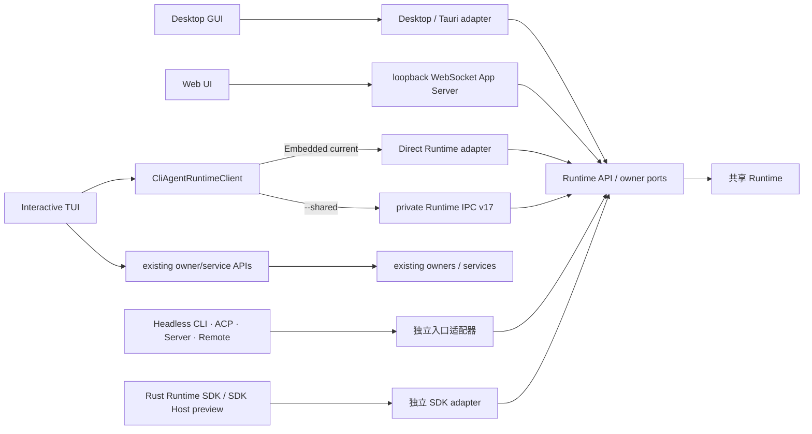
```mermaid
flowchart LR
  Desktop["Desktop GUI"] --> Tauri["Desktop / Tauri adapter"]
  Web["Web UI"] --> WebHost["loopback WebSocket App Server"]
  TUI["Interactive TUI"] --> RuntimeClient["CliAgentRuntimeClient"]
  RuntimeClient -->|"Embedded current"| Direct["Direct Runtime adapter"]
  RuntimeClient -->|"--shared"| SharedIPC["private Runtime IPC v17"]
  TUI --> OwnerApis["existing owner/service APIs"]
  OwnerApis --> Owners["existing owners / services"]
  Other["Headless CLI · ACP · Server · Remote"] --> Adapter["独立入口适配器"]
  SDK["Rust Runtime SDK / SDK Host preview"] --> SDKAdapter["独立 SDK adapter"]
  Tauri --> API["Runtime API / owner ports"]
  WebHost --> API
  Direct --> API
  SharedIPC --> API
  Adapter --> API
  SDKAdapter --> API
  API --> Runtime["共享 Runtime"]
```

当前 Embedded TUI 核心路径经过 direct Runtime adapter，Shared TUI 通过 private Runtime IPC v17；Web UI 通过 loopback WebSocket App Server，
Desktop GUI 通过 Tauri adapter。Headless CLI/CI、ACP、Peer Host 和 SDK Host 保留独立 adapter。所有路径最终消费同一 Runtime API 或 owner
port，部署选择不能进入业务 owner。目标路径不在本图中展开。

Server bootstrap 和产品组装只创建对象并注入依赖，不是客户端请求的第二条旁路：

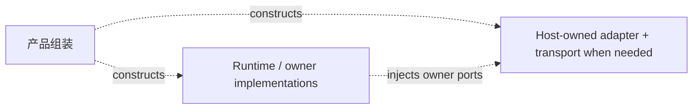
```mermaid
flowchart LR
  Assembly["产品组装"] -. "constructs" .-> Host["Host-owned adapter + transport when needed"]
  Assembly -. "constructs" .-> Runtime["Runtime / owner implementations"]
  Runtime -. "injects owner ports" .-> Host
```

图中的虚线全部表示启动期 composition；业务请求仍只沿前一张 Current 图中的实线进入 Runtime API 或 owner port。

### 4.2 Delivered Embedded composition

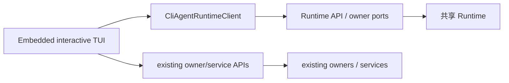
```mermaid
flowchart LR
  TUI["Embedded interactive TUI"] --> RuntimeClient["CliAgentRuntimeClient"]
  RuntimeClient --> API["Runtime API / owner ports"]
  TUI --> OwnerApis["existing owner/service APIs"]
  OwnerApis --> Owners["existing owners / services"]
  API --> Runtime["共享 Runtime"]
```

这是已交付的 Embedded direct-runtime Phase 5 路径。Embedded TUI 不再使用 Current 图中的 App Server；controller
直接调用 owner/service API，并在使用 controller-local owner 前检查 workspace scope。这里没有 catch-all TUI client、
surface service、owner adapter 或统一 TUI management 模块。旧 Embedded App Server 仅作为历史行为基线，不保留回滚路径。

### 4.3 Optional Shared App Server proposal

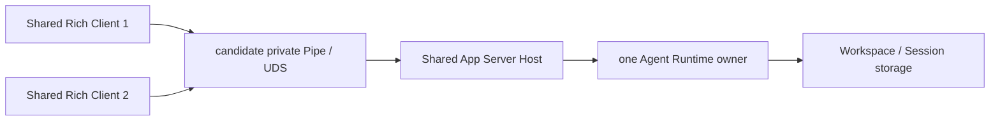
```mermaid
flowchart LR
  C1["Shared Rich Client 1"] --> Transport["candidate private Pipe / UDS"]
  C2["Shared Rich Client 2"] --> Transport
  Transport --> Host["Shared App Server Host"]
  Host --> Runtime["one Agent Runtime owner"]
  Runtime --> Storage["Workspace / Session storage"]
```

这是 Phase 6 的待评审提案，不是当前 Shared TUI 的必经链路，也不改变 Current 图中的 private Runtime IPC v17。只有完成鉴权、实例身份、
controller/lease、事件恢复、取消、限制、性能和回滚门槛后，才可评审是否替换 v17；评审也可以决定长期保留 v17。Web UI 不经过 TUI
composition，而是继续通过自己的 loopback WebSocket App Server 入口。

### 4.4 插件调用

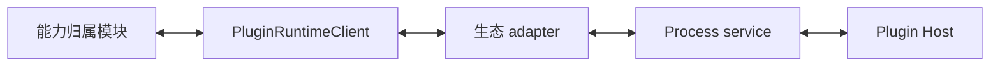
```mermaid
flowchart LR
  Owner["能力归属模块"] <--> Client["PluginRuntimeClient"]
  Client <--> Adapter["生态 adapter"]
  Adapter <--> Service["Process service"]
  Service <--> Host["Plugin Host"]
```

插件贡献走独立的提交链，不绕过能力归属模块：

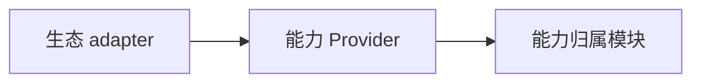
```mermaid
flowchart LR
  Adapter["生态 adapter"] --> Provider["能力 Provider"] --> Owner["能力归属模块"]
```

### 4.5 平台能力

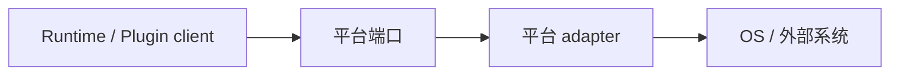
```mermaid
flowchart LR
  Runtime["Runtime / Plugin client"] --> Port["平台端口"]
  Port --> Adapter["平台 adapter"]
  Adapter --> System["OS / 外部系统"]
```

关键规则：

- Current 产品请求遵循 4.1 节；Embedded interactive TUI 已采用 4.2 节的 direct 路径，Desktop 的独立 direct 迁移和 Shared App Server 分支仍需各自验证/评审。
  其他产品入口先经过自己的 adapter，再消费 Agent Runtime API、owner port 和只读视图；公开 SDK 只多一层 SDK Host 跨进程适配。
  Agent Runtime API 是一组小而明确的用例接口，不是必须实例化的总入口；adapter 可以调用对应归属模块的少量接口，
  但不能访问内部状态、绕过既有编排或复制业务规则。任何入口都不直接调用 Plugin Host。
- 插件只进入扩展贡献接口，不直接写内核状态、工具结果、权限结果或审计事实。
- Rust 主应用内只有 `PluginRuntimeClient` 及 services 层现有脚本执行实现：前者当前负责类型化调用、期限、同一插件实例
  串行化、重复请求结果、响应校验和故障诊断；取消结果失效、有界队列和旧连接结果拒绝只有在端口具备相应身份后
  才能作为目标能力加入。后者沿 `ScriptToolRuntime` 边界负责 Plugin Host 的物理健康、资源预算与进程树回收。Host 仅指运行
  Node/Bun 和第三方 JS/TS 的子进程；插件启停与贡献生命周期仍由既有来源和能力归属模块管理。
- 外部来源的 Command、Tool、Subagent、MCP 仍保留能力专属 DTO 和 owner，但它们的发现调度统一由
  `ExternalSourceControlPlane` 持有；当前 Desktop/TUI/Peer 的控制事实只通过版本化的 product-domain 只读视图共享，
  不复制生态 payload、界面状态机或远端专用 DTO。App Server 已注册 external-source schema、handler 和 client translation；Embedded Host
  注入 management owner 后可以调用。通用 Server `/ws` 当前没有绑定可信工作区的 management owner，因此返回类型化 `unsupported`；只有注入 Host 持有的作用域化 owner 并通过 WebSocket round-trip 后，Server 才交付该共享边界。
- 每个生态适配层独立保留该生态的外部格式、来源顺序和调用语义，并映射到 BitFun 归属模块；它本身不成为新的
  业务归属模块，也不能依赖或修改兄弟生态 adapter。通用目录、`ExternalSourceControlPlane` 和能力归属模块只依赖开放生态 ID、
  来源限定身份与能力专属 provider 契约，不按 OpenCode、Codex 或 Claude Code 分支行为。
- 产品组装是组装根，只在组装期选择能力、服务实现、插件运行时绑定和降级策略。
- 对外能力接口只提供现有归属模块的窄用例、只读状态、事件和明确错误；它不是第二个 Agent Runtime、通用服务
  定位器或插件 Host。外部产品扩展、外部 SDK 控制端和“使用外部 Runtime 组装新产品”是三种不同交付路径，
  覆盖上限和兼容结论分别维护。
- 依赖方向保持为产品入口 / interfaces → assembly → adapters / services / execution → contracts。assembly
  可以选择下层提供方，但不能依赖 app crate；需要同时被独立应用和嵌入式模式复用的实现必须下沉到可复用 owner，
  再由各 app 和 assembly 组合。

### 4.6 产品请求表面与操作归属

Desktop、Web、Peer 和其他 Rich Surface 的产品请求遵循以下稳定边界。它们是
前端基础设施和 Host adapter 的合同，不是新的业务 owner：

| Client | 负责 | 不负责 |
|---|---|---|
| `ProductBackendClient` | 以领域方法提供跨 Desktop/Web/Peer 复用的 Agent、Session、Workspace、Config 和其他产品用例 | Tauri command 名称、transport 选择、UI 状态或权限上限 |
| `DesktopHostClient` | controller-local 的窗口、托盘、选择器、剪贴板、通知、更新器和其他 Desktop-native effect | Peer target 的 workspace、Runtime 或产品状态 |
| `ControlPlaneClient` | Account、Peer attach、Remote Connect、Detached Dispatch 和 Relay 等 controller-owned 控制面 | 把 target Host 当作 controller 的 Runtime 或文件系统代理 |

`ProductBackendClient`、`DesktopHostClient` 和 `ControlPlaneClient` 的实现留在各
surface 的 infrastructure/adapter；UI component 和 feature 不直接调用 Tauri、
WebSocket 或 Peer transport。一个操作的稳定身份、request/response、typed error、
capability、execution scope、事件/取消/恢复和 mutation 的幂等合同由对应的
Runtime API、能力 contract 或既有 domain/service owner 持有。它们不得被汇总到新的
`desktop-api-contracts`、Service Locator 或动态通用 RPC crate。

Host route 是 Host 根据装配事实提供的只读路由投影，包含当前 capability、controller
或 target authority、Remote workspace 模式、transport limits、retry budget 和兼容
alias。它可以增加 Host-specific 限制，但不复制 owner 的业务规则、权限状态或持久化。
`Operation catalog` 只是把 owner operation descriptor 与 Host route 在组装期连接
后的只读结果；它不保存 handler、业务状态，也不成为全局授权 owner。

所有连接型或跨设备 ingress 都遵循两阶段顺序：先校验有界 envelope、operation id、
已认证 caller/Host role 和静态 capability/allowlist；typed request 解码后、任何
副作用前，再由现有 Host/owner policy 结合 AuthContext 和 request-derived
workspace、resource、execution-target 或 config scope 做请求级授权。静态 catalog
命中不能替代第二阶段授权，失败必须区分 unsupported、transport failure 和 product
authorization failure。Embedded direct adapter 省略 wire，但仍传递同一 Host/request
context 并执行同一请求级检查。

Config 是该规则的反例边界：通用 `get_config` / `get_configs` 接受任意 path 并返回
`serde_json::Value`，空 path 还可能覆盖包含 surface preference 和模型凭据的
`GlobalConfig`。在现有 Config owner 提供窄的 path allowlist、无敏感字段的 typed
projection、脱敏规则和 typed error 之前，它们不是稳定跨 Host operation。首个试点应
使用已有 owner 清晰、无敏感字段的 Agent profile projection，并从该规则验证后再
扩展到其他 Config read。

I18n 的 locale contract、资源和各 surface 的加载边界由
[`i18n.md`](i18n.md) 持有；当前窗口语言和菜单/托盘刷新仍是
`DesktopHostClient` 的 surface-local effect，不能路由到 Peer target。

### 4.7 名词与定义归属

全仓人工维护文档、AGENTS、README 和代码注释遵守以下规则：

- `Host` 首次出现或跨文档引用时必须带限定词，并表示实际承载执行或协议的进程/产品，例如 Plugin Host、SDK Host、Peer Host；
  同一小节已明确指代后可简称 Host，Rust 插件调用可靠性实现不得称为 Host。
- 插件侧只保留插件实例、能力贡献、`PluginRuntimeClient` 和 Plugin Host 四个跨文档名词；进程监督、脚本执行、
  来源发现和能力提交直接使用已有归属模块的职责描述，不再增加平行的 Manager/Controller/Coordinator 名称。
- 不建立额外的插件运行对象、注册表或状态机。插件实例由现有来源模块标识，贡献由对应能力模块管理；Plugin Host
  只是可以承载多个插件实例的物理进程组。
- workspace 只在具体归属模块确有独立配置、状态、版本或并发单例时作为该状态的限定键；它不是通用
  runtime、Plugin Host 或 session 的别名。
- `Product Assembly` 是唯一组装名称。当前 Rust 内部入口称为
  Rust Runtime SDK（preview），只有公开 Python/TypeScript 产品称为 BitFun Agent SDK。
- 生态 adapter 必须按方向说明是来源导入还是外部宿主输出。插件兼容接口、组合规则、脚本执行后端和当前能力版本都是
  已有归属模块的具体职责，不建立同义的第二层架构名词。

专项术语只在唯一归属文档定义；其他位置链接或使用，不复制状态机、生命周期和同义职责表。历史计划保留完成
事实时也使用当前规范名词，第三方、生成内容和固定兼容 fixture 不机械改写。

## 5. OpenCode-compatible 当前基线与目标

Plugin Runtime P0 只验证了 BitFun 专用插件目录中的来源校验、工作区审核、启停记录、CLI 诊断和 custom tool 名称预览。
它不执行 JS/TS，不注册真实工具，也不运行 OpenCode 钩子、Client 或终端插件。现有能力只能称为“静态预览”，
不能称为“OpenCode 插件运行时”。详细代码事实集中在
[`plugin-runtime-design.md#7-当前实现`](extensions/plugin-runtime-design.md#7-当前实现)。

与 Plugin Runtime 分离的四条纵向基线已经通过各自的能力专属 provider 契约接入：Prompt Command 可发现本地
用户/项目 OpenCode Command、处理跨来源冲突，并在 CLI/TUI 中执行受支持的 prompt-only 模板；standalone Tool
可把受支持的单文件 `.js` 经确认后接入现有 Tool Runtime；Subagent 可把全局/项目声明的安全子集经确认和同名冲突
选择后接入现有 Task/Subagent 归属模块；fresh single-run 调用持续使用启动时选定的版本。MCP 可把受支持的用户/项目
配置经确认和同名冲突选择后交给现有 MCP owner 运行。四类贡献对象互不复用，主体逻辑不按生态分支。当前仍不表示
package plugin、OpenCode/通用动态 Hook Runtime、primary agent、外部 agent 续接、SSH Remote 工作区来源发现或完整
配置兼容已经可用。独立目录可以发现并脱敏展示 OpenCode、Claude Code 与 Codex 的本地 Hook 声明；其中只有明确审阅的
Claude Code/Codex 命令子集可复制为既有 `AgentHookEngine` 的原生层，OpenCode 和其余声明仍不加载 handler 或授予权限。

目标路线不要求 OpenCode 插件作者维护 `bitfun.plugin.json` 或复制到 `.bitfun/plugins`。BitFun 直接发现用户和
项目的 OpenCode 配置、插件目录、工具目录和软件包来源；低风险内容按用户偏好自动应用或先询问，可执行来源在
首次启用或能力扩大时非阻塞确认。用户允许执行的候选自动记录当前版本，在自有脚本进程中真实加载插件，再通过兼容
适配层把工具、稳定钩子、Client 和 TUI 插件入口接入现有归属模块。

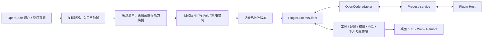
```mermaid
flowchart LR
  Source["OpenCode 用户 / 项目来源"] --> Discover["发现配置、入口与依赖"]
  Discover --> Catalog["来源清单、使用范围与能力摘要"]
  Catalog --> Policy["自动应用 / 待确认 / 策略限制"]
  Policy --> Prepare["记录已批准版本"]
  Prepare --> Client["PluginRuntimeClient"]
  Client <--> Adapter["OpenCode adapter"]
  Adapter <--> Service["Process service"]
  Service <--> Host["Plugin Host"]
  Client <--> Owners["工具 / 配置 / 权限 / 会话 / TUI 归属模块"]
  Owners --> Surface["桌面 / CLI / Web / Remote"]
```

稳定决策如下：

- 不启动完整 OpenCode Runtime，也不依赖用户安装 OpenCode CLI；BitFun 实现自己的监督、适配和 Rust 转发层。
  当前 standalone Tool 子集通过受监督的 Node.js worker 执行且不安装依赖；未来只有固定的 package plugin 样例证明
  确有需要时，才单独裁决 Bun、依赖准备和版本兼容方案。OpenCode v2 当前同时维护 Bun 编译产物与 Node SEA 并行
  产物，因此 BitFun 不把外部项目尚未稳定的运行时选择提升为插件内部 ABI 或核心架构约束。
- 用户全局和项目来源自动发现；低风险内容默认无感应用并显示可撤销摘要，可执行来源首次启用或能力扩大时等待
  非阻塞确认。确认前不得 import module、启动 worker、读取凭据或产生直接脚本副作用。
- 激活后的本地插件默认按 OpenCode 语义运行，允许当前用户通常拥有的文件、网络、进程和环境能力；用户、
  产品或组织可以按需收紧，差异必须明确显示为策略限制。
- 同一实际承载 Agent Runtime/`RuntimeServices` 的 Rust 进程内，位于相同实际执行机器、使用相同 OS 用户和兼容脚本后端，且沙箱、网络、环境变量和凭据条件可合并的插件默认
  共享 Plugin Host。workspace、session 和 plugin 都不是默认进程键；只有执行主机、后端/原生依赖或
  进程级环境、凭据、沙箱事实不兼容时才拆分进程。
- Plugin Host 用于隔离 Rust 主应用与第三方 JS/TS，不承诺隔离同一 Host 内的插件。普通异常按调用/插件实例
  归因；进程崩溃时同组插件实例、在途调用和贡献同时失效，由 services 层执行实现按一次进程级预算恢复。
- 初始化和有序 Hook 保持生态顺序；独立调用可以在有界队列内并发，但不承诺自动识别 CPU 调用或透明迁移到
  worker pool。并发容量来自实际队列和资源测量，不按 workspace 数量推导。
- 首次可执行插件激活/import 时启动或复用 Host，通用 Host 首期不做空闲回收；更新先完成不执行插件代码的
  静态检查，再停止并确认旧进程树退出，最后加载新 Host。退出时停止新调用、有限等待、dispose 并回收完整进程树。
- 执行进程实际加载的工具、钩子和导出是权威结果；静态扫描只可用于快速预览，不能作为拒绝动态插件的依据。
- 插件工具只有具备真实定义和执行函数、接入现有 Tool Runtime 并经过调用时权限判断后，才能显示为可用工具。
- OpenCode 可写钩子按固定版本和原始顺序执行合法变换，最后由对应归属模块做结构和策略校验。
- 服务入口和终端入口独立启停、注册贡献并归因普通错误；若共享的 Plugin Host 失效，两者会共同失效。
- 来源变化先检查新版本；import 前可见的运行条件扩大时先确认。新代码只在旧进程树停止后加载；若 import 后发现
  新增动态贡献需要确认，则停止新 Host 并显示差异。静态准备失败时仍合规的旧进程可以继续；旧进程停止后失败只能从
  内容完整、校验通过的旧版本文件重新启动。明确删除、撤销、停用或策略失效必须停止旧 Host 并撤下贡献。
- GUI、TUI、Web 和 Remote 只消费能力服务、稳定状态和操作接口，不直接依赖 `PluginRuntimeClient`、Plugin Host
  进程或 OpenCode 原始类型。

最明显的首期降级是 OpenCode TUI 的原始 `CliRenderer`、Solid/OpenTUI 组件树。BitFun CLI 使用 Ratatui，无法直接
执行这些组件；宿主操作和结构化贡献可以适配，原始组件必须返回明确降级且不能打开空白或无法退出的页面。
其他暂不承诺项、原因和风险统一在
[`opencode-extension-compatibility.md#6-明确限制与延期决策`](extensions/opencode-extension-compatibility.md#6-明确限制与延期决策)
维护，不能因为某一项降级就把整体状态写成“完整覆盖”。

产品内置扩展与用户插件可以复用主机可靠性和最终能力归属，但来源、升级、卸载和产品必要性不同。只有产品
身份、安全恢复或法律要求等少量明确保护项不可被覆盖；普通内置命令、工具和主题可经用户明确选择被外部扩展
替换或关闭，不能按注册或适配器顺序静默切换。具体规则见
[`product-customization-blueprint.md#8-产品内置扩展与用户插件`](product-customization-blueprint.md#8-产品内置扩展与用户插件)。

完整能力状态、设计细节和阶段顺序分别见
[`opencode-extension-compatibility.md`](extensions/opencode-extension-compatibility.md)、
[`opencode-plugin-runtime-adapter-design.md`](extensions/opencode-plugin-runtime-adapter-design.md) 和
[`../plans/opencode-extension-compatibility-plan.md`](../plans/opencode-extension-compatibility-plan.md)。

## 6. 产品形态与降级

产品定义、Delivery Profile、Runtime Configuration 和 Capability Availability 必须分离：

- 产品定义只在构建/组装期选择产品身份、品牌资源、产品能力上限、默认策略引用、内置扩展版本和发行事实；
  不承载用户配置、凭据或任意脚本。
- Delivery Profile 只表示 CLI、Desktop、ACP、SDK 等交付形态，不表示品牌或 SKU。
- 声明一个 Delivery Profile、生成测试计划或通过 crate 单测，不等于该产品形态已经接入生产。只有入口实际提交
  唯一 profile、消费组装结果和统一能力可用性，并通过入口级行为验证后，才能把该 profile 标为已接入。
- 产品入口向组装根提交唯一 Delivery Profile；组装根只校验并派生静态计划，不在内部再次选择交付形态。
- 入口必须在任何配置规范化或全局工具 registry 首次读取之前提交 Delivery Profile，避免进程级 registry 被兼容默认值提前锁定。Desktop 提交 `Desktop`；当前 loopback Server Host 仍承载完整兼容能力，因此提交 `ProductFull`，空的 `Server` profile 仍表示尚未交付的独立 Server 产品形态。
- Agent Runtime 的最小工具计划不是 Delivery Profile。Product Assembly 单独生成 `ProductToolPlan`，显式列出工具 owner；基线只选择 `Basic` 与 `AgentControl`，完整交付计划由已提交的 Delivery Profile 派生。
- Runtime Configuration 承载用户、项目、工作区和本次运行的可变配置；不能启用产品定义
  未组装的能力，也不能放宽产品或组织策略。
- Capability Availability 是根据产品计划、服务健康和当前策略计算出的能力状态；所有入口读取同一状态，
  入口隐藏不等于能力已禁用。
- 构建期校验器读取产品定义、品牌资源和 GUI/TUI 布局选择，输出本次交付的产品组装结果；它不是常驻服务，
  也不执行产品定义中携带的任意脚本。
- Product Assembly 只消费产品组装结果和调用方唯一传入的 Delivery Profile；不读取原始品牌资源，
  不运行构建脚本，也不从产品定义再次选择 Delivery。
- GUI 与 TUI 布局由对应宿主独立校验，只共享产品身份、Capability ID、品牌资源索引和策略引用，不共享布局、
  组件、主题键、键位或渲染状态。
- 布局选择只能引用宿主已注册的稳定 ID；品牌生成和校验继续使用仓库现有构建流程，不新增通用脚本运行时。
- 产品内置扩展、BitFun 原生包和 OpenCode 标准来源不共享来源根、信任/启用记录、安装状态、更新通道或卸载
  生命周期；三者只复用适用的包校验、插件内部 ABI、Plugin Host 进程边界和经 BitFun 能力接口的权限/审计路径。

产品定制和品牌资源的详细边界见
[`product-customization-blueprint.md`](product-customization-blueprint.md)；CLI/TUI 的消费方式和配置导入见
[`cli-product-line-design.md`](cli-product-line-design.md)。

产品形态由产品组装决定，不由插件配置、单个 Cargo feature 或生态适配器临时决定。

当前本机入口组装：

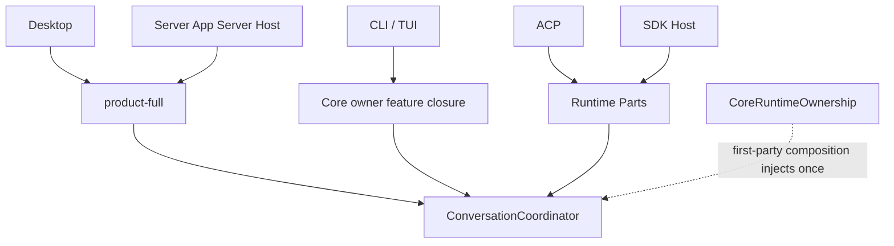
```mermaid
flowchart TB
  Desktop["Desktop"] --> Full["product-full"]
  CLI["CLI / TUI"] --> CliClosure["Core owner feature closure"]
  ACP["ACP"] --> Parts["Runtime Parts"]
  SDKHost["SDK Host"] --> Parts
  ServerBootstrap["Server App Server Host"] --> Full

  Full --> Coordinator["ConversationCoordinator"]
  CliClosure --> Coordinator
  Parts --> Coordinator
  Ownership["CoreRuntimeOwnership"] -. "first-party composition injects once" .-> Coordinator
```

当前 HTTP Server 调用 agent bootstrap，创建 Embedded Runtime 和 workspace ownership，并把 `/ws` 连接交给
`BitfunAppServer::serve`。它固定绑定 loopback，只有 Origin allowlist，没有每连接认证和 user/workspace/execution-domain
绑定；因此只能视为本机单用户 App Server Host，不能据此宣称远程、多用户或公开 Server Agent API 已交付。

当前 Peer 运行连接：

```mermaid
flowchart LR
  Peer["Peer UI"] --> Host["Peer Host"]
```

尚未交付的公开 SDK 路径：

```mermaid
flowchart LR
  SDK["Public SDK"] -.-> Host["SDK Host"]
```

| 当前入口 | 已有能力 | 明确边界 |
|---|---|---|
| Desktop | 使用 `product-full`；Settings 从现有来源目录和 integration policy 生成简短应用概览，具体审批与冲突仍进入 Tool、Agent、MCP 或 Hook owner | 可执行能力在事实所在 Host 运行；Safe Mode 只阻止新调用，不改来源、不取消正在运行的调用 |
| CLI / TUI | 使用显式 Core owner closure：`agent-runtime` 基线、实际 service owner（包括 Remote Connect、DeepResearch、LSP、external/plugin source 与 SSH）以及九组 `tools-*`；`/extensions` 只提供状态、启停和刷新，`/hooks`、`/tools`、`/agent` 和 `/mcp` 处理各自能力 | `agent-runtime` 不再隐式携带完整 MCP/Remote/Browser/Web/Git/LSP/模型目录闭包；非交互不等待权限输入，生态解析仍在适配器，远程能力未接入时不回退本机 |
| ACP | 使用 `DeliveryProfile::Acp`、Runtime Parts、`agent-runtime` 基线、所需 service owner 与九组 `tools-*`，但不选择 CLI 的 plugin runtime 和 Remote Connect owner | load 成功后才发布活动状态；close 排空后再卸载；完整历史、Canvas 工具物化、兼容指令来源和配置仍由 Core/ACP 管理；未选择的能力不得借 Cargo feature union 偶然出现 |
| SDK Host（preview） | 使用 `DeliveryProfile::Sdk`、Runtime Parts 和与当前本机协议能力一致的显式 Core owner closure；TLS provider 由 Host 进程入口安装 | 当前协议不暴露远程 workspace/SSH 执行，因此不选择 Remote Connect、SSH 或 Function Agent owner；未来远程 SDK 必须复用 Server/Remote 的认证和执行域，不能回退到本机执行 |
| Peer / Server | Peer Host 执行真实工作区操作；通用 HTTP Server 未绑定可信 workspace owner 时明确返回不支持 | 控制端不替远端发现或执行；loopback 单用户边界不扩展到远程/多用户；SSH Remote 未接入时返回不支持 |
| Web / Mobile Web | 依赖现有后端入口 | 不持有插件执行单元，也不能据空 profile 宣称独立能力 |
| HarmonyOS 手机 Remote | phone-only ArkTS 远程入口 | 不等于 HarmonyOS PC 本地 Runtime、CLI/TUI 或 GUI |

| 目标形态 | 当前状态 | 设计边界 |
|---|---|---|
| HarmonyOS PC CLI/TUI | 未实现 | HAP、手机 Remote App 和远端代执行均不能替代 |
| HarmonyOS PC GUI | 未实现 | 与 CLI/TUI 共享 Runtime 语义，但独立验证宿主、界面和发布 |
| Public Agent SDK | Python/TypeScript 尚未交付；Rust Runtime SDK 是内部 preview | 一个 `AgentClient`、多个语言绑定；SDK Host 不依赖或冒充 CLI |

Shared Agent Runtime 是第一方多实例的目标部署，不是上表新增的当前产品形态。当前文档中表示“事实实际所在位置”的泛称 Host
可能仍指 Desktop 进程、Peer、Server 或 Remote execution host，不能据此推断 Shared deployment、多 Client Session 单写或
跨进程重连已经交付；完成条件以
[`agent-runtime-deployment-design.md`](agent-runtime-deployment-design.md) 为准。

底层来源与能力继续使用[外部 AI 工作内容设计](extensions/external-ai-work-sources-design.md#7-状态与提示规则)定义的
已发现、已应用、可用、需确认、更新中、沿用上一版本、部分受限、暂时过期、已移除/已停用和不可用，并附带
原因与恢复建议。Settings 首页和 TUI 可以把这些事实压缩为简短应用/来源概览，但不能建立第二套连接、审批或任务结果状态机，也不能因为进入来源清单就误报为已应用或可用。

## 7. 完成判定

架构或实现 PR 必须满足：

- 未新增无消费方的公开接口、空注册表、泛描述符或多生态稳定接口。
- 没有把 OpenCode 类型或 CLI 可用性提升为 BitFun 内部数据模型；适配器仍应保持 OpenCode 配置、加载顺序和
  冲突的外部可观察语义。
- 插件可按 OpenCode Hook 语义提出并链式应用变换，最终结构、策略、审计和状态提交仍由对应模块完成。
- 只有名称或静态声明、没有真实执行实现的插件工具不能进入最终可调用工具集合。
- 前后端入口不能消费 `PluginRuntimeClient`、host 内部状态、生态原始载荷或插件执行单元句柄。
- 工具、事件、权限能力优先复用既有归属子接口，不在插件层重复建模。
- 可替换 Provider 只替换实现或策略，不替换 session/turn/run 身份、权威状态提交、最终权限、取消/资源硬上限、
  事件因果和审计；单选、顺序执行、名称并存、失败回退或结果汇总规则必须由能力归属模块明确。
- TUI 与 GUI 不共享内部主题键、键位模型或界面状态；OpenCode TUI 原始键和组件只存在于适配层，转换后由
  TUI 宿主消费，不能用构建期布局选择冒充运行时插件兼容。
- 只有产品身份、安全恢复和法律要求等明确保护项不能被用户扩展覆盖；普通内置工具、命令和主题作为 BitFun
  来源候选保留，跨生态同名时由用户选择，不能按注册顺序静默决胜。冲突界面固定先展示 BitFun 候选，但展示顺序
  不等于自动选择。产品内置扩展不能复用用户来源批准或启用记录，产品签名也不能绕过运行时
  权限、审计和故障隔离。
- GUI/TUI 布局选择不复制主题 schema，不固化动态能力状态，也不携带可执行 UI 或任意构建脚本。
- 新 profile 只有在真实入口消费组装结果、能力可用性和类型化降级后才算接入；仅有枚举、空计划、re-export
  或单测不构成产品支持。
- assembly 不得依赖 app crate。relay 的 room/device 状态、account/sync 存储、asset store 与 HTTP/WebSocket router
  归属 `services/relay-service`，Cargo metadata 实际解析图检查阻止同类依赖回流。Desktop embedded relay 的 TCP bind、
  静态 fallback 和任务生命周期由 `src/apps/desktop` 通过窄 `EmbeddedRelayHost` 端口持有；assembly 只保留连接方式选择、
  启停顺序和失败回滚。这项宿主接入不构成 CLI、Server、ACP 或 HarmonyOS 本地产品支持。
- HarmonyOS PC 的完整目标同时包含本地 CLI/TUI 与 GUI，当前均不能标记可用；两种宿主分别验收，具体支持证据和禁止替代项以平台规约及各自专题为准。
- 文档、边界脚本和 focused 测试能说明本次变更保护了哪个稳定接口边界，或删除/降级了哪个过宽接口。
