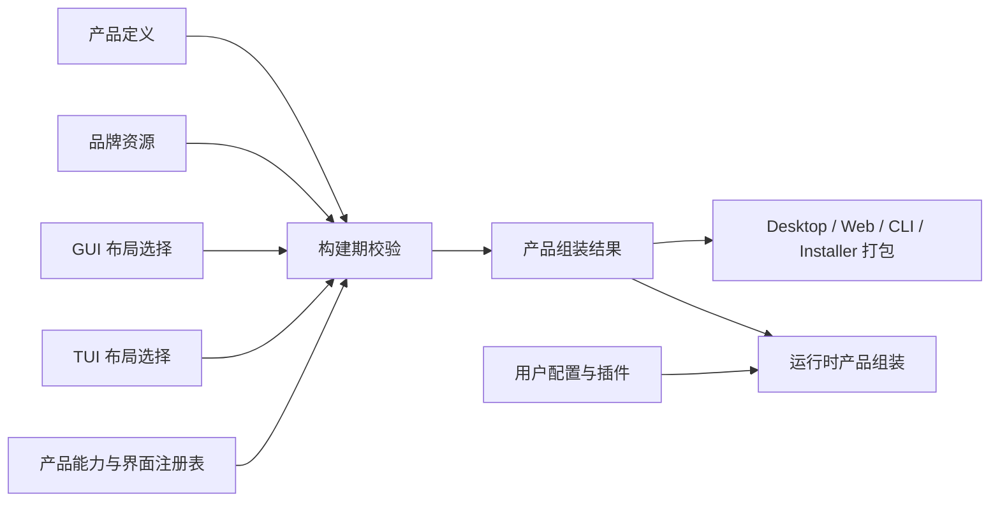

# 产品定制与跨界面组装设计

本文定义 BitFun 如何从同一源码构建不同产品，以及产品内置扩展与用户插件如何共存。仓库级边界以
[产品架构](product-architecture.md)为准；主题规则见[主题设计](theme-token-optimization.md)；运行时扩展见
[OpenCode 扩展兼容总览](extensions/opencode-extension-compatibility.md)和
[插件运行时主机](extensions/plugin-runtime-host-design.md)。

本文是目标设计，不表示相关构建任务或配置格式已实现。设计只保留已有或近期有明确消费方的概念，不建立通用
白标平台、构建脚本运行时或跨 GUI/TUI 的组件协议。

## 1. 设计结论

产品定制只需要四类对象：

| 对象 | 内容 | 使用阶段 |
|---|---|---|
| 产品定义 | 稳定产品 ID、显示信息、数据目录、能力上限、默认设置、发行与更新信息、内置扩展引用 | 构建和组装 |
| 品牌资源 | Logo、图标、文案、链接、法律资源及其平台变体 | 构建和打包 |
| GUI/TUI 布局选择 | 对应宿主已注册的布局、场景、面板、命令、主题等 ID | 构建和组装 |
| 产品组装结果 | 本次交付形态真正使用的产品字段、能力、界面引用、资源摘要和内置扩展版本 | 打包、签名和启动 |

不再引入以下概念：

- 不要求一个通用的产品定制包格式；仓库目录如何组织由构建系统决定。
- 不建立可执行任意脚本的通用构建任务平台；品牌资源生成和校验继续使用仓库现有构建脚本。
- 不把产品组装做成常驻运行时服务；它是构建/启动组装根中的确定性步骤。
- 不设计跨 GUI/TUI 的通用界面描述语言、组件树、主题 schema 或事件协议。

## 2. 构建期与运行期必须分开

| 维度 | 产品构建与组装 | 用户运行时扩展 |
|---|---|---|
| 操作者 | 产品作者、发行工程师 | 最终用户、项目或组织管理员 |
| 输入 | 产品定义、品牌资源、GUI/TUI 布局选择、内置扩展版本 | Runtime Configuration、OpenCode 配置和用户/项目插件 |
| 决定 | 产品身份、能力上限、默认值、发行渠道、随包内容 | 在产品上限内改变模型、工具、主题、插件和用户偏好 |
| 更新 | 随产品发布、升级和回滚 | 独立启用、停用、更新和卸载 |
| 信任 | 产品构建、签名和发布链 | 当前用户、执行域和组织策略 |

运行时配置或插件不能改变产品 ID、数据命名空间、签名根、更新渠道或未编译进产品的能力。产品签名也不能替代
经 BitFun 能力接口的权限/审计、插件主机故障隔离或脚本执行域的真实操作系统边界。

## 3. 逻辑视图



构建期校验按以下顺序执行：

1. 校验产品 ID、数据目录、发行信息和资源路径；资源路径不得逃逸品牌资源目录。
2. 校验本次交付形态，例如 Desktop、Web、CLI、Server 或 ACP。
3. 计算实际包含的产品能力，验证依赖、互斥项和平台要求。
4. GUI 或 TUI 交付只解析自己对应的布局选择；无界面交付不接收界面配置。
5. 解析内置扩展的固定版本、内容摘要、必要性和不可用时的产品行为。
6. 输出产品组装结果，供打包、签名和运行时启动使用。

交付形态与目标平台保持正交。HarmonyOS PC 原生 TUI 仍是 `CLI` 交付，不把 HAP 或手机 Remote App 写入 CLI
组装结果；具体平台适配、PC GUI 和移动端均另立专题。

相同输入必须产生相同的产品组装结果。未知必需字段、未注册 ID、缺失资源、能力冲突和摘要不匹配直接使构建
失败；不能静默回退到“完整产品”或另一套品牌默认值。

## 4. 产品定义与组装结果

产品定义至少包含：

| 类别 | 必需内容 |
|---|---|
| 产品身份 | product ID、显示名、binary/bundle ID、data namespace |
| 能力 | 允许组装的能力集合、默认策略引用、交付形态约束 |
| 品牌 | 品牌资源根、GUI/TUI/Installer 使用的资源引用 |
| 发行 | publisher、更新渠道、签名公钥引用、帮助/隐私/法律链接 |
| 内置扩展 | id、固定版本、内容摘要、必需/可选、保护项标记 |
| 默认设置 | 默认 Agent、模型、主题、起始场景等允许用户覆盖的值 |

产品组装结果只保留启动和复核真正需要的字段：

| 类别 | 输出内容 |
|---|---|
| 身份与交付 | product ID、data namespace、delivery、目标平台 |
| 实际能力 | 已组装能力、禁用原因、所需服务 |
| 界面 | GUI 或 TUI 宿主 ID、布局/主题引用；无界面交付为空 |
| 资源 | 最终资源路径与内容摘要 |
| 扩展 | 内置扩展实际 id/version/hash、加载必要性和冲突保护项 |
| 发行 | 更新渠道、签名公钥引用和回滚兼容信息 |

产品组装结果是一个构建产物，不是新的产品数据库。主应用、CLI、安装器和 updater 各自读取所需字段；不得通过
发布脚本再次改写源配置来制造彼此不一致的产品身份。

### 4.1 术语收敛

`Product Profile`、`Brand Pack`、`GUI/TUI Surface Blueprint` 和 `Resolved Product Manifest` 是早期设计术语，
当前仓库没有对应生产对象或双格式迁移链路。后续实现直接使用本文的“产品定义、品牌资源、GUI/TUI 布局选择、
产品组装结果”，不得为了兼容文档术语先创建一套旧格式。

首个实现切片只选择一个真实交付入口，生成最小产品组装结果并让入口消费。第二个产品或第二个入口复用同一
校验器后，才能把字段提升为跨产品稳定事实；未被打包、启动或 updater 实际读取的字段不进入结果。

## 5. 开发视图

| 部分 | 负责 | 不负责 |
|---|---|---|
| 构建期校验器 | 读取产品定义和资源，校验能力、界面 ID、扩展版本并输出组装结果 | 启动 Agent、加载用户插件、保存用户设置 |
| 产品能力注册表 | 声明当前源码真正可组装的能力及依赖 | 保存运行时健康状态或用户权限 |
| GUI 宿主 | 注册 GUI 布局、场景、面板、主题和可访问性约束 | 解释 TUI 布局或 OpenCode TUI 组件 |
| CLI/TUI 宿主 | 注册终端布局、命令、状态、键位和主题 | 读取 GUI 组件或 CSS 变量 |
| 运行时产品组装 | 使用组装结果选择已编译服务和默认值，再加载用户配置与插件 | 执行构建脚本或重新解析品牌资源 |
| 插件运行时主机 | 执行产品内置扩展和用户插件，提供隔离、期限与恢复 | 决定产品身份或能力上限 |

品牌资源生成、locale 校验和图标转换继续由现有构建脚本完成。脚本输出进入品牌资源目录后，再由构建期校验器
统一检查。若未来确有多个产品复用同一种生成任务，应先复用普通构建工具；没有真实需求前不发布通用脚本 API。

## 6. 运行视图

实际可用能力是以下条件的交集：

```text
已编译且已注册的能力
  ∩ 产品定义允许的能力
  ∩ 本次交付形态
  ∩ 当前服务与平台可用性
  ∩ 用户、产品和组织策略
```

产品定义只决定能力上限和默认值，不记录动态服务健康或插件故障。运行时一级状态统一使用
[外部 AI 工作内容设计](extensions/external-ai-work-sources-design.md#7-状态与提示规则)定义的集合；准备、重启、暂停、
策略限制、不支持或失败作为详情和原因。隐藏导航或面板不表示后端能力已禁用；需要安全裁剪时必须同时约束
后端注册、入口配置和插件贡献。

Remote 场景使用远端实际声明的能力与两端策略重新计算结果。插件、命令或文件操作必须在远端工作区执行；能力
缺失时明确降级，不静默回本机执行。本地品牌资源、用户插件启用记录和凭据授权不自动复制到远端。

## 7. GUI、TUI 与主题

GUI 和 TUI 只共享产品身份、能力 ID、品牌资源索引和默认策略，不共享布局、组件、主题键、键位或焦点状态。

| 界面 | 可以由产品定义选择 | 不能放入产品定义 |
|---|---|---|
| GUI | 已注册 shell/layout、导航、scene、panel、slot、theme ID | React/DOM/Tauri 对象、组件路径、自由 CSS、任意脚本 |
| TUI | 已注册 layout、panel、command group、status、keymap、theme ID | renderer、终端句柄、widget 实例、GUI 主题键 |

GUI 主题由 Web/TS 主题模块定义，TUI 主题由 CLI/TUI 宿主定义，Installer 使用自身主题模块。产品定义只引用已注册
主题，不复制 schema。OpenCode TUI 插件的运行时 Route、Slot、Dialog、主题和键位由 OpenCode TUI 适配层处理，
不能写入构建期布局选择来冒充兼容。

界面宿主负责焦点、键盘导航、屏幕阅读器、窄终端、ANSI/truecolor、无鼠标和无 Unicode 等降级。无合法组合时
构建失败；运行时插件贡献无法渲染时使用可退出的降级界面。

## 8. 产品内置扩展与用户插件

产品内置扩展只表示“随产品交付”，不表示更高运行权限，也不表示同名用户插件必须被拒绝。三类来源的生命周期
必须分开：

| 维度 | 产品内置扩展 | BitFun 原生包 | OpenCode 标准来源 |
|---|---|---|---|
| 版本 | 由产品组装结果固定版本和内容摘要 | 按现有 BitFun 包记录管理 | 按配置、目录、npm/file spec 和执行版本记录管理 |
| 启用 | 由产品定义选择 | 保留现有来源确认和激活 | 标准来源自动发现；可执行 target 首次按来源/执行域/能力摘要确认，同一摘要下不逐层重复审批 |
| 更新 | 随产品升级和回滚 | 用户或组织独立更新、停用和卸载 | 来源身份/完整性和更新策略允许时自动准备普通候选；软件包版本/完整性未获更新策略覆盖或能力扩大时等待确认；失败时只保留仍合规的健康旧进程，精确旧物化目录可校验时才重建 |
| 权限 | 使用同一有效策略；直接脚本副作用受真实 OS/容器边界限制 | 同左 | 同左 |
| 执行 | 与其他插件走同一进程隔离、期限、取消和恢复路径 | 同左 | 同左 |
| 冲突 | 作为 BitFun 候选保留并在选择界面优先展示；少量产品保护项除外 | 与其他 BitFun 候选一并优先展示 | 生态内按 OpenCode 顺序；跨生态同名时由用户选择，不静默覆盖 |

管理、停用和更新使用包含生态、来源类型、规范化来源地址和 target 的来源限定运行实例身份；声明 `id` 只参与
生态识别和贡献覆盖，不能单独作为管理键。因此同名产品内置、BitFun 原生和 OpenCode 来源可以共存，且状态与
更新互不串用。

保护项必须少且具体，只用于产品身份、数据隔离、权限入口、故障恢复、升级/卸载完整性或法律要求。普通工具、
命令、主题和 Agent 不能仅因“随产品携带”成为保护项。发生保护冲突时，状态页必须显示被保护项、插件来源、
最终结果和替代入口，不能静默丢弃插件贡献。

用户明确选择插件覆盖普通内置贡献时，只改变当前运行时的名称解析结果，不修改产品组装结果、已签名字节或内置扩展摘要。
状态页必须同时保留所有候选、选择结果和恢复动作；候选集合或行为版本变化后重新选择，不静默切换。保护清单只能
包含上段列出的具体系统项，不能用“产品已签名”把所有内置工具、命令、主题或 Agent 变成不可覆盖项。

必需内置扩展缺失或摘要不匹配时构建失败；运行时不可用时明确报告产品无法启动或功能降级。可选扩展失败不
阻止产品启动。产品内置扩展仍受用户或组织的有效策略约束，产品签名不能绕过经 BitFun 能力接口的权限/审计、
插件主机故障隔离或脚本执行域的真实操作系统边界。

## 9. 存储、发行与错误

- product ID、bundle identifier 和 data namespace 在同一升级链内保持稳定；改变它们默认视为新产品。
- 用户配置、data/cache/log、凭据引用、浏览器 profile、插件状态和更新状态按 data namespace 隔离。
- `.bitfun` 中可跨产品共享的项目事实必须明确列出，不能携带用户授权或插件信任。
- 签名私钥不进入产品定义、品牌资源、组装结果或运行时环境。
- 品牌路径规范化后不得逃逸资源根；符号链接、Windows reparse point、控制字符和未声明文件必须被检查。

最低错误分类为：无效产品定义、未知界面 ID、能力冲突、不支持的交付形态、资源越界、内容摘要不匹配、扩展
冲突。诊断包含对象、来源、目标交付形态、原因和修复建议；不再设计构建任务专用错误或无法落地的复现协议。

## 10. 交付与验证

| 阶段 | 交付内容 | 退出条件 |
|---|---|---|
| C0 产品身份 | 产品定义、品牌资源、单一交付形态和产品组装结果 | 两个产品从同一源码构建，身份、资源和数据目录互不串用 |
| C1 跨界面组装 | GUI/TUI 已注册布局选择、预览和诊断 | GUI/TUI 独立校验，无界面交付不接收界面配置 |
| C2 内置扩展与发行 | 固定内置扩展版本、保护项、签名/更新/回滚字段 | 内置/用户扩展走同一执行路径，来源和更新生命周期保持独立 |

验证至少覆盖：

1. 产品定义字段、未知字段、资源边界、能力依赖、冲突和交付形态。
2. 相同输入得到相同组装结果；任一资源、界面引用或扩展版本变化都能被识别。
3. GUI/TUI 只消费各自布局和主题字段，一端字段不会进入另一端。
4. 主应用、CLI、安装器和 updater 使用一致的产品身份、更新渠道和签名公钥引用。
5. 两个产品的配置、日志、凭据引用、插件状态和更新状态保持隔离。
6. 同名候选先展示 BitFun、再稳定展示其他生态；跨生态选择、保护冲突、停用、失败和恢复均可解释。
7. 用户配置和插件不能提高产品能力上限、改变产品身份或继承产品签名信任。
