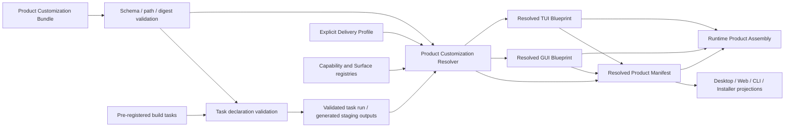

# 产品定制与跨 Surface Blueprint 设计

本文定义 BitFun 在同一源码基础上生成不同产品时的稳定定制边界，覆盖 Desktop/Web GUI 与 CLI/TUI。
仓库级稳定接口以 [`product-architecture.md`](product-architecture.md) 为准；产品组装目标结构见
[`agent-runtime-services-design.md`](agent-runtime-services-design.md)；主题契约见
[`theme-token-optimization.md`](theme-token-optimization.md)；用户插件的来源、信任与执行见
[`plugin-runtime-host-design.md`](plugin-runtime-host-design.md)。

本文是目标设计，不表示相关 schema、构建任务或 Blueprint 解析器已经实现。字段只有在存在真实消费方、
版本策略和验证路径后才能成为稳定接口。

## 1. 目标与非目标

### 1.1 目标

产品定制能力应允许产品团队通过配置、静态资源、预注册构建任务和随包扩展形成新的 BitFun 产品，而不为
每个品牌 Fork 一套 Runtime、React 或 TUI 实现：

1. 定制产品名称、稳定 ID、Logo、图标、主题、文案、链接、数据命名空间和发行渠道。
2. 选择产品能力上限、默认策略和随包内置扩展，并保证后端注册、入口投影和诊断一致。
3. 为同一产品分别声明 GUI Blueprint 与 TUI Blueprint；共享产品事实，不共享界面实现。
4. 生成可复核的 Resolved Product Manifest，使构建、签名、升级、回滚和问题定位可追溯。
5. 允许最终用户在产品能力上限内继续使用配置、外部配置导入和运行时插件扩展产品。

### 1.2 参与者

| 角色 | 负责 | 不负责 |
|---|---|---|
| 产品作者/发行工程师 | Product Customization Bundle、品牌资源、能力上限、内置扩展、构建和发行输入 | 最终用户配置、用户插件信任、运行时授权 |
| Product Customization Resolver | 在构建/打包期校验 authoring 输入、解析能力闭包和 Surface Blueprint、生成 Resolved Product Manifest | 创建运行时服务、实现 GUI/TUI、保存用户设置 |
| Runtime Product Assembly | 接收已校验 Manifest 投影、`SurfaceContractRef` 和唯一 Delivery Profile，构建 Runtime Parts | 读取 authoring Bundle、运行构建任务、解析品牌/Installer 资源 |
| GUI/TUI Surface Owner | 注册可引用的布局、场景、面板、命令、主题和降级规则 | 决定产品身份、发行渠道或用户插件信任 |
| 最终用户/管理员 | 运行时配置、允许范围内的界面偏好、用户/项目插件和外部配置导入 | 提高产品能力上限、改写产品身份或签名/更新事实 |
| 插件作者 | 声明扩展能力、副作用和宿主贡献 | 直接修改 Product Profile、Blueprint、权限结果或内核状态 |

### 1.3 非目标

- 不设计跨 GUI/TUI 的通用 UI DSL、组件树或共享布局 schema。
- 不允许 Blueprint 携带 React/DOM/Tauri 代码、TUI renderer、终端句柄、任意 CSS/ANSI key 或 shell helper。
- 不把 Runtime Configuration、外部生态配置或用户插件当作产品定制输入。
- 不通过源码文本替换、运行时品牌分支或补丁最终二进制实现白标。
- 不因界面隐藏宣称能力已被安全禁用，也不因运行时禁用宣称代码已从产物物理移除。
- 不在本设计中冻结完整 YAML/JSON schema、公开 Rust API、具体 crate 或任意脚本执行器。

## 2. 两个控制平面必须分开

| 维度 | Product Customization Plane | Runtime Extension Plane |
|---|---|---|
| 操作者 | 产品作者、发行工程师 | 最终用户、工作区或组织管理员 |
| 生命周期 | authoring、构建、组装、签名和产品发布 | 安装后的用户/项目/会话运行期 |
| 输入 | Product Profile、Brand Pack、Surface Blueprint、内置扩展锁、受控构建任务 | Runtime Configuration、外部配置导入、用户/工作区插件 |
| 输出 | Resolved Product Manifest 和各入口产物投影 | 配置有效快照、插件来源/激活状态和运行时可用性 |
| 权限上限 | 决定产品 capability ceiling 和不可变发行事实 | 只能在 ceiling 与托管策略内选择或扩展 |
| 来源凭据 | 产品源码、发布流程、签名和内容摘要 | 用户/工作区来源审核与独立激活授权 |
| 更新 | 随产品版本升级、回滚和撤销 | 用户/组织独立安装、启用、更新、禁用和卸载 |

两者可以复用内容摘要、包清单校验、Plugin Runtime Host ABI、隔离执行、权限和审计机制，但不能共享
来源根、信任记录、安装状态、优先级、更新通道或卸载生命周期。Runtime Configuration、外部配置和用户插件
不得修改产品 ID、数据命名空间、能力上限、签名根、更新渠道或强制内置扩展。

## 3. 定制对象与解析流程

### 3.1 最小概念模型

| 对象 | 生命周期 | 内容 | 权威归属 |
|---|---|---|---|
| Product Customization Bundle | authoring/build | 下列对象的引用与版本，不是运行时配置文件 | 产品作者/构建流程 |
| Product Profile | build/assembly | 产品身份、capability ceiling、默认策略引用和发行事实 | Product Customization Resolver |
| Brand Pack | build | GUI/TUI/安装器所需静态品牌资源和本地化/法律资源 | 产品作者；各 Surface 校验 |
| GUI Blueprint | build/assembly | GUI 宿主已注册 shell、导航、scene、slot、theme 等 ID 的选择与组合 | GUI Surface Owner |
| TUI Blueprint | build/assembly | TUI 宿主已注册 layout、panel、command、status、keymap、theme 等 ID 的选择与组合 | TUI Surface Owner |
| Bundled Product Extension Set | build/release | 随产品锁定的扩展 id、version、hash、签名和必要性 | 产品发布/组装 |
| Controlled Build Task | build only | 预注册生成任务及其声明式输入、输出和工具链事实 | 构建系统 |
| Runtime Configuration | install/runtime | 用户、项目、工作区和本次运行的可变配置 | 配置服务 |
| Runtime Plugin | install/runtime | 用户/项目来源、审核、激活、执行、更新和撤销状态 | 插件来源与 Host |

Product Customization Bundle 是 authoring 容器，不是运行时真相。其目标形态可以表达以下引用，但本文不冻结
具体文件名或序列化格式：

```yaml
schema_version: 1
product_profile: product.yaml
brand_pack: brand/
surfaces:
  gui: blueprints/gui.yaml
  tui: blueprints/tui.yaml
bundled_extensions: extensions.lock
build_tasks: tasks.yaml
```

一个 Bundle 可以只携带 GUI、只携带 TUI，或同时携带两者。具体 Delivery Profile 是构建/入口调用的独立、
唯一输入，不由 Product Profile 再次选择。Resolver 只解析该 Delivery 对应的 Surface。GUI/TUI 这类有 UI
宿主的目标必须显式引用 Blueprint 或显式选择 `host-default`，缺失时不得静默退回 full 产品布局；Server、
Remote、ACP、SDK 等无 UI Delivery 不要求 Surface Blueprint，也不接收 GUI/TUI 投影。

### 3.2 解析流程



解析顺序固定为：

1. 校验 Bundle、Product Profile、资源路径、内容摘要和 schema 兼容性。
2. 在隔离 staging 中运行允许的受控构建任务，并校验声明输出。
3. 根据调用方显式传入的唯一 Delivery Profile，解析 capability ceiling、依赖闭包、冲突、服务需求和
   eligibility；Resolver 不从 Profile 内再次选择 Delivery。
4. 使用对应 Surface registry 分别解析 GUI/TUI Blueprint；不把一端字段传给另一端。
5. 锁定内置扩展、产品身份、数据命名空间、发行/更新事实和所有输入/输出摘要。
6. Resolver 生成不可变 Resolved Product Manifest；Runtime Product Assembly 只消费必要投影，不读取
   authoring Bundle 或执行构建任务。

Resolved GUI/TUI Blueprint 是构建期解析产物，不是新的公开 UI API。它锁定 Blueprint 摘要和宿主已注册
ID，并为现有运行时产品组装输入选择对应 `SurfaceContractRef`；完整布局数据仍留在 Surface Host，不进入
Agent Runtime。Product Customization Resolver 是构建/打包阶段的逻辑 owner，本文不要求新增运行时服务、
公开接口或具体 crate。

Resolved Product Manifest 必须绑定每个 Surface 投影的内容摘要、目标 Delivery、Surface ID、Blueprint schema
版本和 host registry/version。Runtime Product Assembly 在构建 Runtime Parts 前逐项核对 Manifest、
`SurfaceContractRef` 与 Resolved Blueprint；任一不匹配都按 `digest-mismatch` 或 `unsupported-surface` 失败，
不得接受替换投影或回退到 host-default。

同一输入重复解析必须产生相同 Manifest digest。未知对象、未知字段、未注册 ID、缺失依赖和未声明输出必须
明确失败或返回类型化 `unsupported`，不得静默忽略或回退到更宽的产品配置。

## 4. 能力上限、默认值与运行时覆盖

实际可用能力由以下交集形成：

```text
已编译/已注册能力
  ∩ Product capability ceiling
  ∩ Delivery Profile eligibility
  ∩ 运行环境与服务健康
  ∩ 组织/运行时策略
```

Blueprint 只投影当前产品允许展示的能力，不固化服务健康、remote availability、插件 quarantine 或运行时
策略。所有入口继续消费同一个版本化 Capability Availability 读模型。

| 类别 | 示例 | 用户/插件能否覆盖 |
|---|---|---|
| 产品不可变事实 | product ID、binary/bundle ID、data namespace、capability ceiling、签名根、更新渠道、强制内置扩展 | 不能 |
| 产品默认值 | 默认 Agent、模型/权限策略引用、默认 theme、起始 scene/mode、可选面板 | 仅在 Profile 明确允许的范围内 |
| 托管约束 | 来源 allowlist、权限上限、数据范围、网络/遥测策略 | 低层配置不能放宽 |
| Runtime Configuration | 用户主题、模型选择、快捷键、入口行为、项目设置 | 受前述上限和 schema 约束 |
| Runtime Plugin Contribution | 受控命令、工具、面板/状态候选 | 只能进入 Product/Surface 允许的扩展点 |

隐藏导航、命令或面板不代表后端能力已禁用。安全裁剪必须同时约束后端注册、入口投影、插件贡献和诊断；
物理二进制裁剪仍需独立的 capability-to-feature/dependency 映射和依赖/符号验证。

## 5. GUI Blueprint

GUI Blueprint 面向共享 GUI Host。完整 GUI 主题、设计 token、运行时 CSS 变量和 component contract 仍由
`src/web-ui` 的 TypeScript owner 管理；Desktop/Tauri 只承担宿主和必要首屏投影。

首期只允许引用宿主已注册的稳定 ID：

| 定制面 | 允许 | 禁止 |
|---|---|---|
| Shell/Layout | shell/layout preset ID、受控 density/placement 选项 | 任意 React tree、DOM selector、源码组件路径 |
| Navigation | capability/scene ID 分组、顺序、默认入口和允许隐藏项 | 指向未组装能力、绕过路由/权限保护 |
| Scene/Panel/Slot | 已注册 scene、panel、slot 及宿主声明的组合约束 | 组件实例、Tauri handle、任意 iframe/脚本注入 |
| Theme | 已注册 GUI theme/Brand Pack 引用及 Surface owner 注册、版本化的语义投影 ID/input schema | 复制完整 `ThemeConfig`、自由 CSS var/CSS 文本 |
| Copy/Assets | 已校验 locale、Logo、图标、帮助/法律资源引用 | 运行时远程脚本、未摘要资源、凭据 |
| Desktop shell | 产品标题、窗口/托盘/菜单资源和已注册宿主策略引用 | 任意平台 API 调用、未评审窗口生命周期代码 |

Blueprint 不能删除安全提示、权限入口、必需诊断、更新/法律要求或可访问性语义。焦点顺序、键盘导航、
屏幕阅读器标签、窗口约束和 responsive fallback 由 GUI Host 校验；无合法组合时构建失败，而不是运行时拼接。

## 6. TUI Blueprint

TUI Blueprint 由 `src/apps/cli` 的终端宿主解析。终端 theme preset、ANSI/truecolor/monochrome 降级、键位
冲突和窄终端回退继续归 CLI/TUI owner。

首期只允许引用宿主已注册的稳定 ID：

| 定制面 | 允许 | 禁止 |
|---|---|---|
| Layout | layout preset、panel region 和响应式折叠策略 ID | 任意 renderer、终端缓冲区或 widget 实例 |
| Commands | capability-backed command group、顺序、默认展开和帮助分组 | shell helper、绕过 dispatcher 的命令 |
| Status/Notice | 已注册 status segment、通知候选和只读视图 | 直接订阅内核内部事件或写运行时状态 |
| Keymap | 已注册 keymap preset 和允许的用户覆盖范围 | GUI shortcut schema、未处理冲突的自由绑定 |
| Theme/Brand | TUI theme preset、语义色投影、ASCII/text Logo 和文本资源 | GUI theme key、自由 ANSI 转义、终端句柄 |
| Startup | 默认 mode、landing panel 和 host-default fallback 的显式选择 | 在入口复制 Agent/Tool/权限逻辑 |

Blueprint 只能改变展示与默认组合；slash command、palette action 和 root command 仍映射到同一稳定能力请求。
终端不支持颜色、Unicode、鼠标或宽布局时，由 TUI Host 使用确定性回退并给出诊断。

## 7. Brand Pack、存储与发行投影

Brand Pack 可以按 Surface、平台、尺寸或明暗模式提供静态变体，但每个资源必须有类型、大小、用途和内容
摘要。路径 canonicalize 后不得逃逸资源根；符号链接、Windows reparse point、控制字符、未声明文件和远程
运行时下载默认失败。

产品身份投影至少覆盖：

- 显示名、稳定 product ID、binary name、Tauri/bundle identifier 和包/产物前缀。
- GUI Logo、窗口/托盘图标、安装器/卸载器图标、TUI compact/text Logo 和必要平台图标矩阵。
- Publisher、快捷方式/注册项显示名、帮助/隐私/法律链接和本地化资源。
- 更新渠道、manifest endpoint、签名公钥引用和回滚兼容事实；签名私钥不进入 Bundle、Profile 或任务环境。
- 主应用、安装器和 updater 消费的同源 Resolved Product Manifest 投影，不通过脚本修改配置源文件。

product ID、bundle identifier 和 data namespace 在同一升级链内必须稳定。变化默认表示新产品；需要继承数据时
必须提供显式、可回滚的迁移，而不是按显示名猜测。

| 数据类别 | 隔离规则 |
|---|---|
| 产品私有状态 | 用户配置、data/cache/log、凭据引用、浏览器 profile、插件信任、更新状态按 product namespace 隔离 |
| 项目便携事实 | `.bitfun` schema 是否跨产品兼容必须显式声明；项目事实不能携带用户或执行信任 |
| Remote/Server 状态 | 由执行域和远端身份决定；本地路径、品牌资源和信任记录不复制到远端 |
| 历史数据 | 迁移声明来源产品、目标产品、schema/version、冲突和回滚；不得自动共享 |

## 8. 产品内置扩展与用户插件

| 维度 | Bundled Product Extension | Runtime Plugin |
|---|---|---|
| 来源 | 产品只读包和来源根目录 | 用户数据目录或项目 `.bitfun/plugins` |
| 锁定 | Resolved Manifest 固定 id/version/hash/signer | 运行时来源标识和用户/工作区审核状态 |
| 来源凭据 | 产品发布与签名链确认来源；不读取 `SourceApproved` | 来源审核与首次激活的独立授权；不新增额外的主机信任持久化状态 |
| 生命周期 | 随产品安装、升级、回滚和撤销 | 独立安装、启用、更新、禁用和卸载 |
| 冲突 | 用户/工作区同 ID 包不能覆盖；冲突明确失败 | 用户/工作区优先级只在 Runtime Plugin 范围内生效 |
| 必要性 | required/optional 只描述缺失或隔离时的产品失败语义，不表示用户安装权 | 用户或组织可按策略管理 |
| 执行 | 仍经过 Host ABI、隔离、资源预算、权限、审计和 quarantine | 同一安全执行路径 |

产品来源凭据不等于副作用授权。内置扩展执行文件、网络、shell、MCP、browser/desktop 或 remote 动作时仍必须
声明能力与副作用，并经过安全控制面。产品签名不能成为绕过权限、审计或 quarantine 的依据。

required 内置扩展缺失或摘要不匹配时产品组装失败；运行期被策略拒绝或 quarantine 时必须显式报告产品降级/
不可用。optional 缺失或 quarantine 时产品可以继续并进入类型化 Availability。required/optional 都随产品
安装并由 Manifest 锁定，不能被用户独立卸载、更新或替换；是否允许用户切换激活状态必须由另一个显式产品
策略声明，且不得复用 Runtime Plugin 的安装状态、`SourceApproved` 或激活授权。

Blueprint 只有在对应 Surface Host 已注册真实消费方、扩展锁已解析且 capability ceiling 允许时，才能引用
内置扩展贡献的稳定 ID。未预算的 GUI/TUI contribution 返回 `unsupported`；不能因为包随产品携带就提前发布
通用 UI ABI。

## 9. Controlled Build Task

产品作者可以用脚本、配置或其他工具生成 authoring 输入，但稳定契约是经过校验的 Bundle、资源和任务输出，
不是任意脚本 API。BitFun 管理的构建任务不得在 Product Profile 内接受命令字符串。

首版只允许预注册任务 ID，例如品牌资源投影、locale 校验、GUI/TUI theme 生成投影、产物 metadata 生成；
每个任务固定实现和版本，并声明：

- 输入文件/目录、输出文件/目录、目标平台和工具链版本。
- 环境变量 allowlist、超时和资源预算；首版固定无网络、无凭据、源码只读。
- 输出只能写 staging/generated 根；未声明输出、源码或 dependency lockfile 变化立即失败。
- 任务、实现、输入、输出和工具链摘要写入 Resolved Product Manifest；签名发生在任务完成和复核之后。
- 禁止读取签名私钥、用户配置、凭据、插件信任或工作区私有状态。

在可靠隔离和跨平台复现验证完成前，不承诺执行 Bundle 自带的通用脚本。未来若支持内容摘要固定的脚本，仍需
声明 runner、参数、输入/输出和环境，并满足同一输入产生同一输出摘要；网络输入只有在来源、内容摘要、签名
和缓存/失效规则全部锁定并写入 Manifest 后才能评审启用。否则脚本只能存在于产品团队自有发布流水线，其输出
必须重新进入 Bundle 校验和 Manifest 锁定流程。

构建任务不进入最终用户运行时，不注册 Hook，不修改已签名产物，也不能替代源码级功能开发。需要新增宿主
组件、Runtime 能力或平台 API 时，仍通过正常源码 PR 和对应 owner 审查完成。

## 10. Remote、错误与兼容性

- Surface Blueprint 只由对应入口宿主解析；原始 Bundle、构建任务和本地品牌资源不传播到 Remote/Server。
- 远端实际能力是本地 product ceiling、远端声明能力和两端策略的交集；缺失能力进入版本化 Availability，
  不得静默回本机执行。
- 插件来源审核、激活授权、数据根和执行授权以执行域为准；本地状态不推导为远端状态。
- schema version 只表示结构兼容性，内容摘要标识具体输入；不能用版本号代替内容锁定。
- 新版本 resolver 必须拒绝无法安全解释的未知必需字段。兼容迁移输出差异、来源、目标和回滚动作。

最低错误分类：`invalid-schema`、`unknown-id`、`capability-conflict`、`unsupported-surface`、
`asset-boundary-violation`、`digest-mismatch`、`extension-conflict`、`task-output-violation`、
`non-reproducible-output`。诊断必须包含对象、来源、目标 Surface、原因和修复建议；不得退回 full 产品后继续构建。

## 11. 交付顺序与验证

建议按真实消费方逐步交付，不先实现通用 DSL：

1. **Customization-C0**：Product Profile、Brand Pack、GUI/TUI Blueprint 引用和 Resolved Product Manifest；
   仅支持 host-default 与少量已注册 preset。
2. **Customization-C1**：GUI/TUI 注册项、预览/诊断、产品身份向主应用/安装器/updater 的同源投影。
3. **Customization-C2**：产品内置扩展锁、预注册构建任务、签名/更新/回滚和组织级产品模板。

Customization-C0/C1/C2 只表示产品定制交付顺序，与 CLI-P0/P1/P2、插件 P0-C.1/P0-C.2/P0+ 相互独立。
C2 出现内置扩展锁不表示插件激活、隔离执行或分发链路已经交付。

| 范围 | 必须验证 |
|---|---|
| Bundle/Profile | schema、未知字段、capability ceiling、依赖闭包、冲突、Delivery 兼容和默认/不可变字段 |
| Manifest | 同一输入相同 digest；Profile、Brand、Blueprint、extension、task、源码和工具链摘要完整 |
| GUI Blueprint | 注册 ID、scene/route/slot 约束、host-default、焦点/键盘/屏幕阅读器和 responsive fallback |
| TUI Blueprint | layout/panel/command/status/keymap 注册、终端降级、窄宽度、纯文本和可访问性 |
| Theme | GUI 使用 Web/TS owner，TUI 使用 CLI owner；无平行 schema、自由 key 或审计 baseline 放宽 |
| Brand/Distribution | 主应用、CLI、安装器、updater 身份一致；图标矩阵、链接、签名公钥、更新和回滚事实 |
| Storage | 两个产品的用户状态、日志、凭据引用、插件信任和更新状态隔离；项目事实与 remote 规则明确 |
| Extensions | 内置/用户来源根、信任、冲突、更新、禁用/卸载、权限和 quarantine 分离 |
| Build Tasks | 只读源码、staging 输出、无凭据、默认无网络、超时、摘要和签名前复核 |
| Cross-surface | 同一 Product Profile 分别生成合法 GUI/TUI 投影；一端字段不会进入另一端 |

完成标准：至少两个 Product Customization Bundle 能从同一源码生成不同产品身份和相互隔离的数据/更新事实；
验证集至少覆盖一个 GUI 和一个 TUI 目标，并证明同一多 Surface Bundle 可分别解析两种投影、单 Surface Bundle
不会被要求提供无关 Blueprint、无 UI Delivery 不接收界面投影；用户配置和 Runtime Plugin 不能突破
capability ceiling、改写产品身份或继承内置扩展信任；所有输入和生成结果可由 Resolved Product Manifest 复核。

## 12. 已收敛的架构决策

1. 产品定制与用户运行时扩展是两个控制平面，只共享底层安全执行原语。
2. 一个 Bundle 可以携带 GUI 与 TUI Blueprint，但二者独立解析、校验和生成。
3. Blueprint 只引用宿主已注册稳定 ID，不成为通用 UI DSL 或可执行代码容器。
4. Product Profile 决定 capability ceiling；Blueprint 只决定入口投影，Runtime Configuration 只覆盖允许的默认值。
5. 产品内置扩展随产品锁定和升级，用户插件不能 shadow、卸载或继承其信任。
6. GUI/TUI/Installer 主题继续由现有 Surface owner 管理，Brand Pack 和 Blueprint 只引用受控投影。
7. 首版只支持预注册 Controlled Build Task；任意脚本、源码替换和运行时代码注入不进入稳定能力。
8. Resolved Product Manifest 是构建、签名、升级、回滚和诊断的唯一可复核产品事实。
