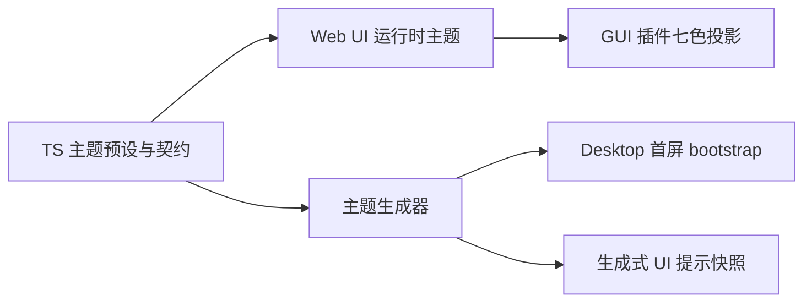

# 主题与颜色 Token 治理

本文定义 BitFun 各界面的主题所有权、Token 分层、生成边界和防回退规则。它只保留长期有效的架构约束，
不记录审计数量、迁移批次或阶段历史。当前事实以以下可执行契约及其输出为准：

- `scripts/theme-color-governance-baseline*.json`
- `scripts/theme-color-near-pair-decisions.json`
- `scripts/theme-css-var-contract.mjs`
- `scripts/theme-visual-governance-contract.json`
- `scripts/audit-theme-colors.mjs` 与 `scripts/audit-cli-theme-colors.mjs`

文档与可执行契约冲突时，先核对代码和审计脚本；不得通过修改文档掩盖实际回退。

## 范围

本治理覆盖：

- `src/web-ui` 的主题预设、`ThemeConfig`、CSS 变量、组件样式和专用渲染色板。
- `src/mobile-web` 的移动端主题与运行时变量。
- `BitFun-Installer/src` 的安装器主题、首屏静态变量和流程组件。
- `src/apps/cli` 的 TUI preset、终端颜色映射和降级行为。
- Desktop 首屏 bootstrap、生成式 UI 主题提示等由主题源生成的只读产物。
- BitFun GUI 插件的语义色投影，以及 OpenCode TUI 主题的独立兼容边界。

本治理不要求不同产品形态共享完整主题 schema，也不把 Monaco、终端 ANSI、Mermaid、语法高亮、diff、
语言标识或数据可视化色板强行合并为普通应用 Token。

## 所有权与依赖方向

| 范围 | 权威 owner | 消费或产物路径 | 约束 |
|---|---|---|---|
| Web UI 完整主题 | `src/web-ui/src/infrastructure/theme` 与组件库 Token | 运行时 CSS 变量与组件样式 | 拥有 `ThemeConfig`、预设、校验和导入导出；Rust 不复制 |
| Desktop 首屏 | Web UI theme presets 与 `scripts/generate-startup-theme-bootstrap.mjs` | `src/apps/desktop/src/generated/startup_theme_bootstrap.json` | 只保存 JS 加载前必要字段；生成产物不能反向定义主题 |
| 生成式 UI 提示 | Web UI theme presets 与 `scripts/generate-startup-theme-bootstrap.mjs` | `src/crates/assembly/core/src/agentic/tools/implementations/generated/theme_prompt_snapshots.json` | 只读生成产物；Rust 不手写第二套内置 palette |
| Mobile Web | `src/mobile-web/src/theme` | Mobile 运行时变量与组件 | 不从 Desktop 或 Web UI 运行时偷读内部变量 |
| Installer | `BitFun-Installer/src/theme` | `BitFun-Installer/src/styles/variables.css` 与流程组件 | Rust 壳不复制完整 palette |
| CLI/TUI | `src/apps/cli/themes/presets` 与 `src/apps/cli/src/ui/theme.rs` | 终端样式 | 拥有 preset、ANSI/monochrome 降级；不实现 Web `ThemeConfig` |
| BitFun GUI 插件 | Web UI theme owner | `src/web-ui/src/infrastructure/theme/pluginThemeProjection.ts` | 只投影七个语义色，不暴露全部 CSS 变量 |
| OpenCode TUI 主题 | CLI/TUI 兼容适配器 | OpenCode 主题来源与终端投影 | 保留来源顺序、稳定字段、引用和 light/dark 变体；不由 GUI 七色投影替代 |
| 专用渲染域 | 对应 editor、terminal、syntax、diff、Mermaid 等模块 | 各自 namespace | 不得泄漏为普通组件随手可用的色板 |

依赖方向固定为：



生成产物、Rust bootstrap、插件投影和消费组件均不能反向定义主题。Desktop 只持久化并解析
`themes.current`；历史 `theme.id` 只允许在配置加载或导入边界归一化，不得成为新的主题扩展入口。

## Token 分层

Token 只按职责分四层：

1. **Primitive**：颜色原料和必要 alpha ramp，不表达业务含义。
2. **Semantic**：背景、文本、边框、交互、状态和产品意图，是普通组件的默认消费层。
3. **Component**：仅在稳定组件契约无法由 semantic token 清楚表达时增加。
4. **Exception domain**：editor、terminal、syntax、diff、Mermaid、语言标识和其他专用色板。

兼容别名不是第五层。它只服务已确认的迁移调用方，必须声明 canonical 目标、owner 和移除条件；新代码不得继续
读取历史别名。

新增颜色按以下顺序判断：

1. 语义相同：复用现有 Token。
2. 色值近似且相邻状态不会失去区分：合并并更新审计决策。
3. 存在独立、稳定且可说明的用户语义：在最窄 owner 中新增 semantic 或 component token。
4. 属于专用渲染域：进入对应 exception namespace，不扩张普通应用色板。

不得仅因数值接近就合并颜色。相邻背景/边框、文本层级、成功/警告/错误、diff、语法和数据系列必须结合实际
同时出现的状态复核。反过来，也不能用“可能有视觉差异”作为每个组件新增近似色的理由。

## CSS 变量与运行时边界

- 普通组件优先消费运行时 CSS 变量；不得用 SCSS 编译期颜色复制动态主题语义。
- `tokens.scss` 可以保留尺寸、字体、动效、root Token 和少量兼容 mixin，不应成为第二套产品颜色源。
- 动态 CSS 变量族必须在 `theme-css-var-contract.mjs` 登记 owner、前缀和消费范围。
- fallback 只允许存在于明确的启动、第三方或兼容边界；普通组件不得用 fallback 隐藏缺失 Token。
- 未解析变量、未登记 key、跨 root 借用和运行时/静态定义漂移必须由审计失败暴露。
- iframe、MiniApp 或生成式 UI 只接收显式 allowlist 的主题 payload，不接收 Web UI 内部变量全集。
- custom theme 由 Web UI 加载和校验。Rust 首屏无法解析时使用系统或默认回退，JS 启动后再应用完整主题。

## 防回退契约

主题 baseline 是 no-growth ratchet，不是普通快照。审计失败时，默认修复方式是复用 Token、删除游离 key、收敛
近似色、修复 owner 或补最小契约，不能直接提高 baseline、扩充 allowlist、放宽测试或关闭检查。

baseline 只允许两类变更：

- 实际债务下降时同步下调。
- 确有新的用户语义且无法复用时，在独立治理变更中说明 owner、消费方、相邻状态、无障碍影响、回退方式和复审结论。

治理不预设脱离代码检查的固定 Token 数量。预算由审计维度、现有 baseline 和真实消费关系共同约束；没有 checker
保护的任意数字会快速失真，不应成为架构承诺。

以下做法视为治理回退：

- 为通过 CI 上调 baseline 或 fixture 期望。
- 把普通组件路径加入专用域 allowlist。
- 新增与现有 Token 等价的字面量或 fallback。
- 在 Rust、CLI 或安装器中复制 Web UI 的完整主题模型。
- 用生成文件或产品定制配置绕过主题 owner。

## 产品定制与扩展

产品定制只引用宿主已注册的 theme/preset ID，或对应边界明确允许的少量语义色；不得携带任意 CSS 变量、完整
`ThemeConfig`、renderer、动态代码或源码替换。详细边界见
[`product-customization-blueprint.md`](product-customization-blueprint.md)。

GUI、Mobile、Installer 和 CLI/TUI 可以选择不同主题集合，但共享规则而不是共享全部数据结构：

- 身份与品牌配置选择已注册 ID。
- 每个 surface 的 owner 校验该 ID 和能力范围。
- 未支持的组合在构建期或入口启动时失败，不静默回默认造成品牌错配。
- OpenCode TUI 主题保持独立格式；BitFun GUI 插件七色投影不构成 OpenCode 兼容承诺。

## 变更流程

1. 确认变更所属 surface、主题 owner、用户语义和相邻视觉状态。
2. 优先复用现有 semantic token；新增 Token 时选择最窄层级和 namespace。
3. 更新 TS 主题源、校验器、运行时注入和真实消费方。
4. 仅在 JS 加载前确有需要时重新生成 Desktop bootstrap；生成式 UI 提示按同一主题源更新。
5. 涉及动态变量、别名、专用域或跨 root 时，同步更新对应可执行 contract。
6. 运行自动检查，并对受影响 surface、light/dark/system、交互状态和无障碍对比做 focused review。

主题变更至少运行：

```bash
pnpm run theme:color-audit:all
pnpm run theme:color-audit:test
pnpm run theme:visual-contract
node --test scripts/generate-startup-theme-bootstrap.test.mjs
```

若主题源影响生成产物，先运行 `pnpm run generate-startup-theme-bootstrap`，再确认只有预期的只读产物发生变化。
跨 surface 视觉变化还应按 `theme-visual-governance-contract.json` 的覆盖项完成 focused review；自动审计不等于视觉
或对比度已经通过。

## 当前判定

普通应用组件的 raw color、等价字面量、fallback 和近似色债务由审计脚本与 baseline 持续守护；本文不复制某次
扫描数量。专用渲染 palette、兼容别名和各产品形态的独立主题仍然存在，它们只有在缺少 owner、越过作用域或
重新进入普通组件时才构成债务。

主题治理完成的判据不是“色值最少”，而是：

- 每个普通组件颜色都能追溯到稳定语义 Token。
- 每个专用色板都有清楚 owner 和边界。
- 完整主题只有一个权威源，生成物不反向定义契约。
- 新主题和产品定制不需要复制 Rust/React/TUI 实现。
- 审计 baseline 默认只下降；确需合理增长时，必须经独立评审且有真实消费方。
