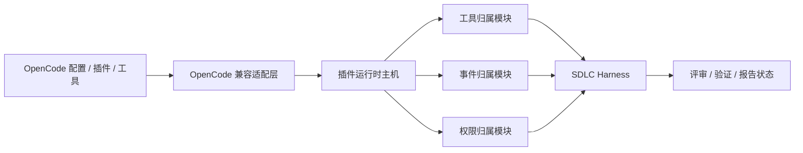

# SDLC Harness 使用 OpenCode 扩展的设计

> 上游文档：[SDLC Harness 总体设计](../design.md)、
> [产品架构](../../architecture/product-architecture.md)、
> [OpenCode 扩展兼容总览](../../architecture/extensions/opencode-extension-compatibility.md)、
> [插件运行时主机](../../architecture/extensions/plugin-runtime-host-design.md)

本文只说明 SDLC Harness 如何消费 BitFun 的 OpenCode 扩展能力，不另建一套插件格式、运行时或权限体系。
OpenCode 配置、工具、服务插件、Hook 和终端插件的完整范围、可实现性与降级项，以扩展兼容总览及其细分设计为准。

本文描述对应 OC-R 阶段完成后的目标消费方式。当前 P0 只能消费来源事实和静态诊断，不能消费真实 OpenCode
插件工具、Hook、Client、终端贡献或运行状态；以下能力只有在其 owner 形成生产闭环后才对 Harness 可用。

## 1. 边界

SDLC Harness 可以消费：

- 已由工具归属模块注册的 OpenCode custom tool 和插件工具；
- 已由事件归属模块转换的公开事件；
- 适用于评审、测试、验证和报告流程的稳定 Hook 结果；
- 插件来源、版本、启停、策略限制、故障和降级诊断；
- 符合当前有效策略的 OpenCode 配置来源和声明式资产。

SDLC Harness 不负责：

- 发现、安装、加载或更新 OpenCode 插件；
- 解释 OpenCode 原始配置、工具 schema、TUI 组件或 Client 方法；
- 为插件单独决定文件、网络、进程、凭据或工具权限；
- 直接保存插件产生的会话、审计、权限、证据或门禁状态；
- 把插件异常等同于评审任务失败。

这意味着 Harness 只依赖 BitFun 的稳定工具、事件、权限和诊断接口，不读取 JS 进程句柄、OpenCode 原始载荷或
插件运行时内部状态。

## 2. 能力接入

| OpenCode 能力 | Harness 如何使用 | 最终状态由谁提交 |
|---|---|---|
| custom tool / 插件 `tool` | 与内置工具、MCP 工具一样进入工具选择与执行流程 | Tool Runtime 与调用时权限路径 |
| `tool.execute.before` | 在固定插件顺序中变换本次工具参数，随后重新校验 schema 和权限 | 工具归属模块 |
| `tool.execute.after` | 在固定插件顺序中变换 title、output 和 metadata | 工具归属模块 |
| `tool.definition` | 变换模型可见的 JSON Schema；执行仍由插件进程中的原始 Zod 校验 | 工具归属模块 |
| `permission.ask` | 保留 OpenCode 的 allow/deny/ask 语义；用户或组织策略可进一步限制 | 权限归属模块 |
| `event` | 订阅已转换、版本化的公开事件 | 产生该事件的业务模块 |
| chat / command / config Hook | 按 OpenCode 顺序变换输入；每一步失败只影响本次调用 | 对应配置、会话或命令模块 |
| TUI 插件贡献 | 仅由 CLI/TUI 宿主消费，Harness 不解释组件或键位 | CLI/TUI 宿主 |

OpenCode Hook 是可变换接口，不应统一降级为“建议”或“只读候选”。适配器负责顺序和参数转换，对应 BitFun
模块负责结构校验、策略上限与最终提交。插件不能绕过这些模块直接写 Harness 的任务、证据或门禁记录。

## 3. 运行视图

每个外部插件 target 在独立进程中执行。Harness 发起的调用仍使用同一期限、取消、有界队列、大小限制、
响应校验和崩溃回收路径；Harness 不为插件增加第二层进程管理。

远程工作区中，配置发现、依赖准备、插件进程和工具执行都必须发生在远端执行域。远端不支持时返回明确的
不支持或能力降级，不得静默回本机执行。

## 4. 配置与产品体验

- OpenCode 标准配置和全局/项目插件按兼容适配层的来源顺序自动发现，Harness 不要求用户再次导入或激活。
- 用户可以显式导入支持的配置字段到 BitFun；导入前显示直接使用、需要转换和会降级的项目。
- 插件或配置变化先在后台准备候选版本；来源仍启用、健康旧进程仍符合当前策略时，代码或依赖更新准备失败可
  继续使用旧进程。旧进程丢失后只有精确旧物化目录仍可校验时才能重建；否则明确“上一版本不可恢复”。停用、
  删除、来源撤销、权限收紧或安全策略失效必须撤下旧贡献，不能为不中断评审而回退。
- 新增或删除工具、Hook、权限或依赖时，在任务启动前显示简短差异；不在每次工具调用中重复弹窗。
- Harness 报告只记录实际使用的插件来源、执行版本和降级结果，不复制整份插件配置。

## 5. 安全与可靠性

本地默认兼容策略允许插件使用当前用户通常可用的文件、网络、进程和环境能力。经 BitFun 能力接口的调用可以
细分收紧；脚本直接能力只能由真实 OS/容器边界粗粒度限制，无法落实时停用相应 target。策略限制必须与插件
代码错误分开显示。

无论权限是否开放，下列可靠性保护始终生效：

- 单插件进程隔离和可终止调用；
- 初始化、Hook、工具和清理期限；
- 取消传播、有界队列、输入/输出大小限制；
- 无效响应丢弃、迟到响应不再提交；
- 有限次数恢复和重复错误聚合；更新失败只保留仍健康且合规的旧进程，或从摘要匹配的精确旧物化目录重建；
- 凭据和敏感环境变量不进入普通日志或报告。

未知配置字段保留并诊断，不阻断其他有效字段；未知事件按服务 v1/TUI v2 的冻结规则局部降级。未知 Client 读接口
返回稳定的不支持错误；未知写入、变换 API 或无法验证的 Hook 参数只终止对应调用，不执行也不伪造成功。任何
不兼容项都不能触发无限重试、日志风暴、主界面等待或 Agent 循环卡死。

## 6. 完成判定

本模块只有在以下条件同时满足时才算接入完成：

1. Harness 使用的每个 OpenCode 能力都能回到扩展兼容矩阵中的稳定版本和适配方式。
2. 插件工具与内置/MCP 工具走同一注册、权限、取消、结果和陈旧调用保护路径。
3. Hook 的顺序、变换、异常和最终提交由冻结 OpenCode 样例验证。
4. 插件故障、策略限制和 Harness 业务失败在状态与日志中可以区分。
5. 远程执行域、停用、更新、健康旧进程保留、精确旧代次重建和重启都有端到端测试。
6. 未支持能力返回明确降级，且不影响无关插件、评审任务、主界面或会话。
